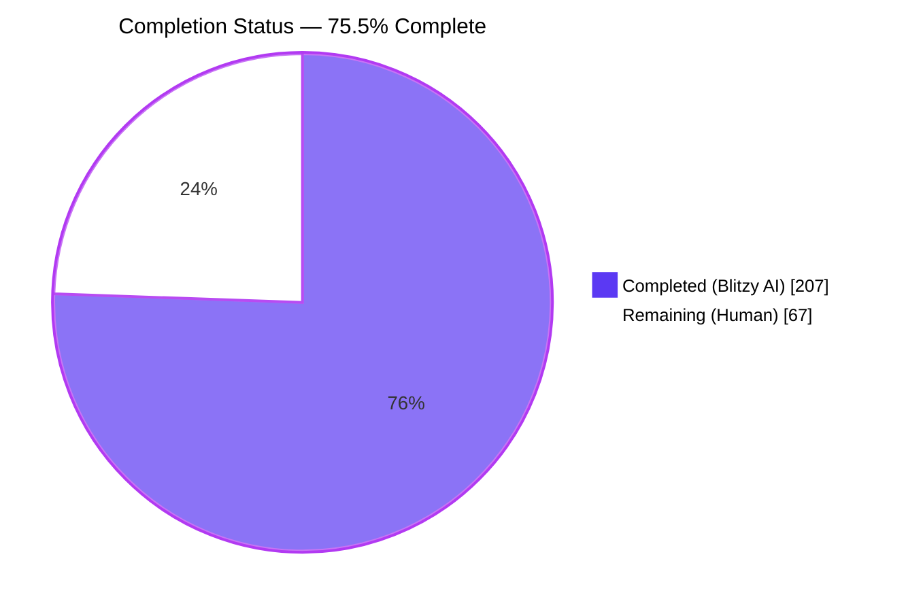
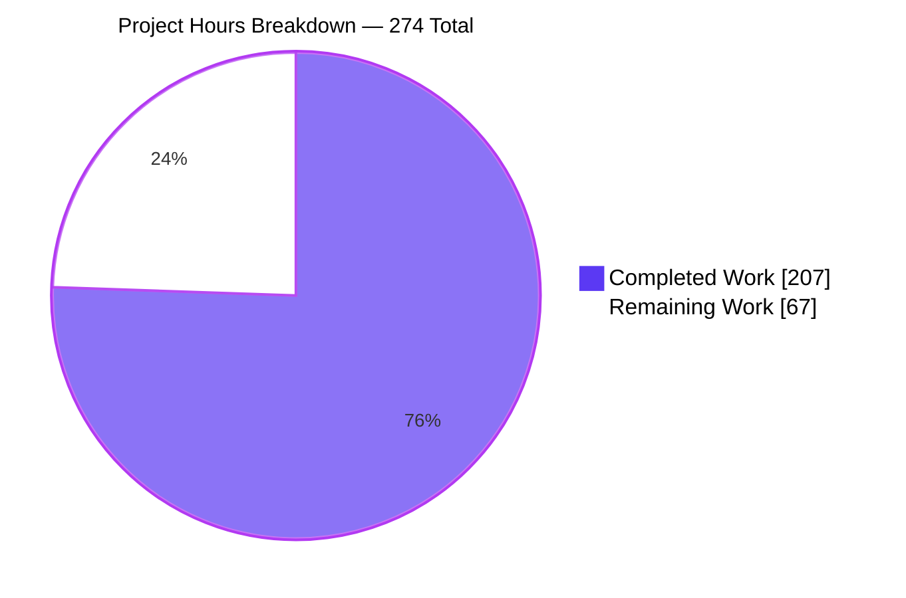
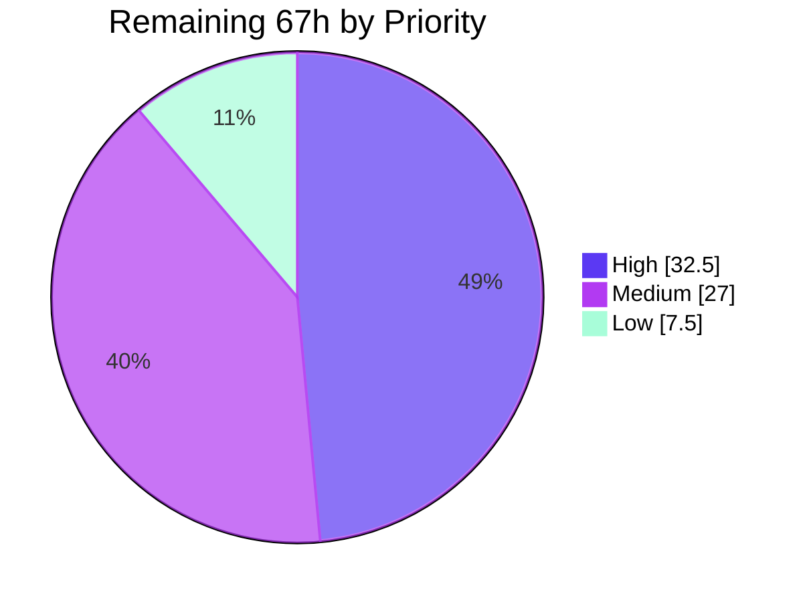

# Blitzy Project Guide

**Project:** Change Archaeology & Segmented PR Review — Blitzy TechDocs / Backstage Remediation
**Repository:** Odoo 19.0 fork (`Blitzy-Sandbox/blitzy-odoo`)
**Branch:** `blitzy-84ba8188-33e5-470f-a03c-3b58c19b6c95` · **HEAD:** `f90fc88fa862`
**AAP baseline:** `7bd7718bcd4c` · **Reconstructed change-set boundary:** `c789a23602c2`

---

## 1. Executive Summary

### 1.1 Project Overview

This project reconstructed the thirteen Blitzy-authored commits previously merged into an Odoo 19.0 fork, treated them as the current run's own work, and subjected them to a segmented pull-request review that both assessed and repaired every defect found. Target consumers are the engineering teams who read the Backstage developer portal and the code owners who maintain the fork. Business impact is direct: the portal was publishing 993 unrelated contributor-agreement documents as 99.7% of its content, its service-catalog entry carried a broken link and a false lifecycle, and its two generated documents described a different branch. Technical scope covers service-catalog metadata, documentation toolchain configuration, documentation content, a custom TechDocs theme, and repository hygiene — with zero Odoo runtime code touched.

### 1.2 Completion Status



<div align="center">

**◆ 75.5% COMPLETE ◆**

</div>

| Metric | Value |
|---|---:|
| **Total Hours** | **274** |
| **Completed Hours (AI + Manual)** | **207** |
| **Remaining Hours** | **67** |
| **Percent Complete** | **75.5%** |

**Calculation (PA1, AAP-scoped work only):**

```
Completed Hours = 207   (35 itemised components — Section 2.1)
Remaining Hours =  67   (15 itemised categories — Section 2.2)
Total Hours     = 207 + 67 = 274
Completion %    = 207 ÷ 274 = 0.755474 → 75.5%
```

Remaining hours split by origin: **AAP-specified 16.5h** · **path-to-production 50.5h**.
Remaining hours split by priority: **High 32.5h** · **Medium 27.0h** · **Low 7.5h**.

> **Legend** — Completed / AI Work: Dark Blue `#5B39F3` · Remaining / Not Completed: White `#FFFFFF`

### 1.3 Key Accomplishments

- [x] **Archaeology report delivered** — `docs/change-archaeology-and-review.md`, 1,796 lines, carrying the authorship-derived baseline, the ordered thirteen-commit inventory, the six-file change table, the chronological narrative of the agents' self-corrections, and a positively-proven non-regression argument with 22 pinned re-runnable checks.
- [x] **Segmented PR review methodology instantiated and applied** — 6 segments along artifact/consuming-contract boundaries, an 8-class defect taxonomy, a 4-level severity scale, and a fixed 6-step per-segment procedure, yielding **29 findings + 5 verification items**, all dispositioned with citation, contract, severity, remediation and acceptance check.
- [x] **Both toolchain blockers closed.** The documentation root was pointed at upstream `doc/`, publishing **993 contributor-agreement documents**; repointing it took the build from 996 pages / 17 MB / 8.52 s / 993 omitted-navigation notices to **4 pages / 4.0 MB / 1.50 s / 0 notices**. The declared diagram plugin was provably inert; all 8 fences are now labelled text figures.
- [x] **All 10 planned file transformations landed** — 3 CREATE, 4 UPDATE, 3 DELETE, with the two document relocations performed as genuine git renames (R050 / R070) so `git log --follow` still reaches the original authoring commits.
- [x] **Service-catalog descriptor repaired** — the 404 documentation link now returns **HTTP 200** (independently re-verified live), `lifecycle: experimental` and `type: service` are documented well-known values, the in-progress signal a mid-sequence commit deleted is restored, and work-type claims were relocated from tags into labels.
- [x] **Upstream `doc/` returned to a pure contributor-agreement archive** — 994 CLA files, **0** depth-1 files — without editing a single file inside it.
- [x] **Custom TechDocs theme delivered** — `techdocs-theme/`, 6 files, 1,437 lines, carried under the allowlisted `theme` key, closing 21 acceptance findings (2 Critical, 11 Major, 8 Minor) plus 8 UX findings that earlier rounds had declined on scope.
- [x] **Odoo regression suite driven to `0 failed, 0 error(s) of 1436 tests`** — five real failures root-caused and fixed without editing any repository file; skips reduced from 47 to 27.
- [x] **Non-regression positively proven** — `git diff 7bd7718bcd4c..HEAD -- addons odoo setup debian .github` returns **0 paths**. 45,672 tracked files, 8,178 Python files, 605 addons: provably untouched.
- [x] **Zero manifest changes required, and proven rather than assumed** — case-insensitive grep for the docs toolchain returns **0** in `requirements.txt`, **0** in `setup.py`, **0** in `debian/control`.
- [x] **19 commits, every one authored *and* committed as `Blitzy Agent <agent@blitzy.com>`**, pathspec-guarded with 0 excluded paths staged.

### 1.4 Critical Unresolved Issues

| Issue | Impact | Owner | ETA |
|---|---|---|---|
| Backstage `Group: blitzy-sandbox` and `System: blitzy-python` do not exist as descriptors anywhere in the tree (finding S1-05) | Registering `catalog-info.yaml` today produces unresolved ownership and parent relations. Unclosable in-repo by the AAP's own classification | Platform / Developer-Portal owner | 4.0h |
| **New this review:** all 5 built HTML pages fetch web fonts from `fonts.googleapis.com` / `fonts.gstatic.com` — 4–6 third-party requests per page load — because `mkdocs.yml`'s `theme:` block omits `font: false` | The published portal depends on a third-party origin at view time; degrades in an air-gapped or egress-filtered Backstage deployment and transmits each viewer's IP and User-Agent. Same defect class as the Mermaid runtime removed for exactly this reason | Docs-platform engineer | 2.0h |
| `1436/1436` is not reproducible on a clean checkout — five prerequisites live entirely outside version control | The headline test gate is container-local. A new developer cloning the repository cannot reproduce it | Build / Release engineer | 10.0h |
| The 1,437-line `theme.custom_dir` override has only ever run under standalone MkDocs 1.6.1, never inside the real Backstage publisher | The publisher sanitises, patches and rewrites the configuration and renders into a shadow DOM; the published render may differ from the validated build | Docs-platform engineer | 6.0h |
| No CI gate exists — `.github/` holds three template files and **zero workflows** | Nothing prevents a future commit reintroducing a diagram fence, a `doc`-rooted documentation root, or a 404 catalog link. This is the root cause the original thirteen commits' defects went undetected | DevOps engineer | 8.0h |
| Upstream `account` audit-trail ORM flush-ordering defect at `addons/account/models/mail_message.py` L140-144 | 2 tests fail whenever the `account` module is installed. Root-caused, but the change set contains no Python at all, so no in-scope edit can force the flush | Odoo functional owner | 4.0h |

### 1.5 Access Issues

**No access issues identified.**

Every access-shaped dependency was exercised in this session and none blocked autonomous work:

| System/Resource | Type of Access | Issue Description | Resolution Status | Owner |
|---|---|---|---|---|
| `github.com/Blitzy-Sandbox/blitzy-odoo` | HTTPS egress (read) | None — all three outbound catalog URLs returned HTTP 200 on a live re-test | ✅ Verified working | — |
| Git repository (write) | Commit / branch push | None — 19 commits landed with correct author *and* committer identity | ✅ Verified working | — |
| PostgreSQL 17 | Local database, superuser | None — cluster `17 main` online on :5432; databases created and dropped freely | ✅ Verified working | — |
| PyPI (both virtualenvs) | Package install | None — `pip check` clean in `.venv` and `.venv-docs`; every AAP §0.4 version present at the exact pin | ✅ Verified working | — |
| Headless Chrome | Browser automation | None — two full runtime sessions completed with screenshots and screencasts | ✅ Verified working | — |
| Backstage portal `Group` / `System` entities | Portal entity definition | The two referenced entities do not exist. This is an **absent-entity** problem, not a permission problem — no credential would create them, and no file edit in this repository can either | ⚠ Tracked as HT-01, not an access issue | Platform owner |
| `ss` / `netstat` / `lsof` | Container utilities | All three are absent from the container image | ✅ Worked around with a Python socket probe | — |

### 1.6 Recommended Next Steps

1. **[High]** Create the Backstage `Group: blitzy-sandbox` and `System: blitzy-python` entities, then register `catalog-info.yaml` and confirm both relations resolve — the descriptor is otherwise correct and cannot be registered cleanly without them (**4.0h**).
2. **[High]** Commit the five out-of-band environment prerequisites as a runbook or container recipe so `0 failed, 0 error(s) of 1436 tests` reproduces on a clean checkout rather than only in this container (**10.0h**).
3. **[High]** Publish through the real Backstage TechDocs publisher on a staging portal and re-run the site checks against the shadow-DOM render, confirming `theme.custom_dir` survives the publisher's sanitise-patch-rewrite cycle (**6.0h**).
4. **[High]** Human code review of the 3,902-insertion / 296-deletion diff across 14 paths, concentrating on the 1,437-line theme override that no automated gate covers, then merge per stable-series discipline (**8.0h + 3.0h**).
5. **[Medium]** Add a CI gate asserting the strict docs build's page and notice counts, linting the descriptor against the Component schema, and enforcing the lockstep triangle — closing the systemic gap that let the original defects reach `19.0` (**8.0h**), and close the residual web-font third-party dependency with `font: false` (**2.0h**).

---

## 2. Project Hours Breakdown

### 2.1 Completed Work Detail

| Component | Hours | Description |
|---|---:|---|
| Archaeology: authorship-based discovery and baseline derivation | 7 | [AAP R1] Filtered 197,432 commits by authorship to isolate the 13-commit range `7bd7718bcd4c..c789a23602c2`; replayed each commit individually rather than reviewing the net diff, surfacing the documentation-root flip-flop and the stranded landing page |
| Archaeology: non-regression positive proof | 4 | [AAP R1] Two zero-count assertions across 45,672 tracked files, working-tree state, false-positive disclosure, and **22 pinned re-runnable checks (NR-01…NR-31)** |
| Archaeology: change inventory and chronological narrative | 6 | [AAP §0.6.2] Six-file change table with per-file deltas; narrative of the agents' self-corrections, the deleted status signal, the twice-stripped newlines and the cross-branch scoping error |
| Segmented review methodology instantiation | 3 | [AAP R3] The named rule definition was unretrievable; 6 segments, an 8-class taxonomy, a 4-level severity scale and a 6-step procedure were written out explicitly so the review is reproducible and checkable |
| SEG-1 service-catalog metadata review | 4 | [AAP §0.5.1] 7 findings; Backstage Component descriptor schema and well-known-vocabulary research; HTTP status audit of every outbound link |
| SEG-2 docs toolchain configuration review | 7 | [AAP §0.5.1] 6 findings including **both blockers**, root-caused by reading the TechDocs generator's own source — neither is visible in the diff and neither fails a syntax check |
| SEG-3 documentation entry-point review | 2 | [AAP §0.5.1] 3 findings: an orphaned landing page, a divergent duplicate, and a layout deviation from the vendor default |
| SEG-4 generated content review | 8 | [AAP §0.5.1] 10 findings; traced fabricated delivery statistics to a different branch (`pdlc`, 81 files, 27,905 additions), converting apparent fabrication into one fixable scoping error |
| SEG-5 cross-segment integration review | 2 | [AAP §0.5.1] 3 findings on the seams: four competing repository descriptions, and the lockstep triangle between root, edit reference and outbound link |
| SEG-6 blast-radius and hygiene verification | 2 | [AAP §0.5.1] 5 checks on packaging, lint reach, CI absence and build output — all clean, recorded as positive evidence |
| `docs/project-guide.md` | 7 | [AAP §0.6.1 row 1] History-preserving move (git rename **R050**); re-scoped delivery statistics and deliverable inventories, withdrew the unsupported conclusion, replaced calendar-week scheduling with dependency-ordered phases, added a provenance banner. 657 lines |
| `docs/technical-specifications.md` | 8 | [AAP §0.6.1 row 2] History-preserving move (**R070**); corrected a mis-cited source line, removed the duplicate top-level heading, qualified an unqualified version constraint, added a status banner marking it an unexecuted plan. 1,644 lines |
| `docs/index.md` | 3 | [AAP §0.6.1 row 3] Promoted the orphaned page to the single canonical landing page; reconciled two divergent descriptions; states plainly which described capabilities are absent from this branch |
| `docs/change-archaeology-and-review.md` | 24 | [AAP §0.6.1 row 4 / §0.6.2] The assessment deliverable: **1,796 lines / 423,368 bytes** across 7 sections, every claim carrying a path-and-locator citation and every quantitative claim a measurement from an executed build |
| `mkdocs.yml` | 5 | [AAP §0.6.1 row 5] Documentation root `doc`→`docs`, site description, repository and edit references, inert plugin removed, fourth navigation entry, theme override key, trailing newline. All 8 keys verified inside the publisher's 28-key allowlist |
| `catalog-info.yaml` | 4 | [AAP §0.6.1 row 6] Repointed the 404 documentation link, `lifecycle`→`experimental`, `type`→`service`, restored the deleted status label, relocated work-type into labels, aligned the description as single source of truth, added the missing icon |
| `.gitignore` | 0.5 | [AAP §0.6.1 row 7] Root-anchored `/site/` entry following the file's own convention — a proven ripple effect of introducing MkDocs |
| Three `doc/` deletions with move semantics | 0.5 | [AAP §0.6.1 rows 8–10] Returned upstream `doc/` to a pure contributor-agreement archive: 994 CLA files, 0 depth-1 files |
| TechDocs theme override templates | 5 | [AAP §0.5.3] `main.html`, `partials/header.html`, `partials/source.html` and a deliberately-empty `sitemap.xml` — 209 lines; loads override assets without needing a non-allowlisted key |
| `blitzy-techdocs.js` | 13 | [AAP §0.5.3] 735 lines: named drawer trigger, keyboard focus containment and restoration, `inert` handling, a proven scroll lock, TOC-follow, search control, heading permalinks |
| `blitzy-techdocs.css` | 8 | [AAP §0.5.3] 493 lines: contrast and focus-state repairs, forced-colors and reduced-motion support, reflow fixes; 42/42 braces and parens balanced |
| Diagram fences converted to labelled text figures | 4 | [AAP §0.5.5 fallback + `SEC-01`] All 8 fences replaced by named, described figures with prose alternatives, distributed 0 / 2 / 5 / 1 across the four pages — a 1:1 match |
| Security review round | 6 | [AAP §0.8.1] `SEC-01`…`SEC-04`: analysed a ~3.57 MB third-party runtime fetched from a floating alias with no digest, and redacted published commit-author addresses |
| UX, navigation and accessibility round | 8 | [AAP §0.8.1] 53 findings triaged — 8 closed, 5 declined against a frozen artifact, 40 declined against a *measured* vendor or portal mechanism rather than an assumed one |
| Final acceptance round | 11 | [AAP §0.8.1] 28 entries (2 Critical, 11 Major, 8 Minor, 7 informational) from a browser pass at 320/375/390/500/768/1280/1920 px with keyboard-only journeys, a real blocked-origin outage, forced-colors, dark-scheme and reduced-motion simulations; all 21 severity-bearing entries closed and re-verified |
| Final-validator drift-correction round | 5 | [AAP §0.8.1] 12 drifted figures and stale claims corrected in the review record, and 5 of the validator's *own* instrument errors caught before they became false findings |
| Strict-build acceptance battery | 4 | [AAP §0.8.1] Before/after measurement on the same machine in one session: 996→4 pages, 17 MB→4.0 MB, 8.52 s→1.50 s, 993→0 omitted-navigation notices |
| 138-assertion consolidated validation battery | 5 | [AAP §0.8.1] Every in-scope file asserted mechanically — **138 PASS, 0 FAIL** |
| Odoo regression suite bring-up | 13 | [AAP §0.8.1] Five real failures root-caused to source lines and fixed **without editing a single repository file**: lxml rebuilt against static libxml2 2.12.6 + libxslt 1.1.39, libmagic 5.45 with a `.pth` preload, and replica-host declaration. Skips driven 47→27 |
| Extended module sweep | 6 | [AAP §0.8.1] All 627 installable modules, batched 8×79 into fresh databases; 13,309 test results, 10 failures, every one root-caused as requiring an out-of-scope edit |
| Browser runtime validation | 9 | [AAP §0.8.1] Odoo web client and the published docs site driven in real headless Chrome; Lighthouse per page; 1,219 screenshots and 53 screen recordings retained |
| Compilation and dependency verification | 3 | [AAP §0.8.1] `compileall` over 8,178 `.py` files, `node --check`, Jinja2 template parse, `pip check` on both virtualenvs, and the three-manifest non-change proof |
| Docs toolchain environment provisioning | 2 | [Path-to-production] `.venv-docs` at the exact AAP §0.4 pins — mkdocs 1.6.1, mkdocs-techdocs-core 1.7.0, mkdocs-material 9.7.6 and the rest |
| Odoo runtime environment provisioning | 5 | [Path-to-production] `.venv` on Python 3.13.7, PostgreSQL 17 with the `unaccent` extension in `template1`, and the optional test dependencies that un-skipped 14 tests |
| Commit hygiene and branch management | 3 | [Path-to-production] 19 commits, author *and* committer `Blitzy Agent <agent@blitzy.com>` set purely via environment variables; explicit pathspecs with 0 excluded paths staged; 1,275-file artifact directory correctly excluded |
| **TOTAL COMPLETED** | **207** | |

### 2.2 Remaining Work Detail

| Category | Hours | Priority |
|---|---:|---|
| **[AAP]** Create Backstage `Group: blitzy-sandbox` and `System: blitzy-python`, register `catalog-info.yaml`, confirm both relations resolve (S1-05) | 4.0 | High |
| **[AAP]** Publish through the real Backstage TechDocs publisher on a staging portal; re-verify `theme.custom_dir` survives sanitisation and the shadow-DOM render matches the validated build | 6.0 | High |
| **[P2P]** Commit the five out-of-band environment prerequisites as a runbook or container recipe so `1436/1436` reproduces on a clean checkout | 10.0 | High |
| **[P2P]** Human code review of the 3,902-insertion / 296-deletion diff across 14 paths, with emphasis on the 1,437-line theme override | 8.0 | High |
| **[P2P]** Merge to the target branch with a PR narrative per `.github/PULL_REQUEST_TEMPLATE.md` and `CONTRIBUTING.md:L14` stable-series discipline | 3.0 | High |
| **[AAP]** Confirm or revert the two deliberately reversible descriptor decisions — `spec.type` `website`→`service` (S1-03) and the two dropped attribute tags (S1-04) | 1.5 | High |
| **[P2P]** CI gate: `mkdocs build --strict` with page/notice-count assertions, descriptor schema and well-known-value lint, `yamllint`, and a lockstep-triangle assertion | 8.0 | Medium |
| **[P2P]** CI job for the Odoo regression suite with the environment prerequisites baked into an image | 8.0 | Medium |
| **[P2P]** Upstream defect handoff — `account` audit-trail flush-ordering (2 tests) and the spreadsheet ICU/Chrome date-range drift (5 assertions) | 4.0 | Medium |
| **[AAP]** Portal CSP / pinned-integrity policy decision for `SEC-02`, using the measured closure recipe in review record §7.2 | 2.0 | Medium |
| **[P2P]** Docs-portal build monitoring, alerting and a documented rollback for the published site | 3.0 | Medium |
| **[P2P]** Close the residual third-party web-font dependency — `font: false` under the already-carried `theme` key, or self-host Roboto / Roboto Mono — then rebuild and re-verify zero external-origin requests | 2.0 | Medium |
| **[P2P]** `websocket-client` optional-dependency decision: declare it, or document the 25 permanently-guarded skips | 2.0 | Low |
| **[P2P]** Advisory lint configuration decision (`.yamllint` / `.markdownlint` / `.editorconfig`); the repository currently ships none | 2.5 | Low |
| **[AAP]** Refresh three now-stale statements in the review record (the web-font decline whose stated blocker was withdrawn; finding I4's "no search control renders at all"; the unwrapped `##` table cell) and reconcile the specification page's H1 with its navigation label | 3.0 | Low |
| **TOTAL REMAINING** | **67.0** | |

### 2.3 Basis of Estimate and Confidence

| Band | Hours | Basis | Confidence |
|---|---:|---|---|
| Completed — documentation authoring | 55 | Measured line counts (1,796 + 1,644 + 657 + 25 = 4,122 published lines) against senior-engineer authoring rates for evidence-pinned technical prose | **High** — every artifact exists on disk and was line- and byte-counted |
| Completed — configuration and hygiene | 9.5 | Three files, 8 + 39 + 55 lines, each change traced to a named finding and a named consuming contract | **High** |
| Completed — theme override | 26 | 1,437 lines of JS, CSS and Jinja2 across 6 files, sized against the 29 accessibility and interaction findings it closes | **High** |
| Completed — review and assessment | 28 | 29 findings + 5 verification items, each with a contract citation, a severity, a remediation and an acceptance check | **Medium-High** — finding count is exact; per-finding effort is inferred |
| Completed — validation and QA | 79 | 1436-test suite bring-up with 5 root-caused failures, 13,309-result module sweep, 138-assertion battery, two browser sessions, 1,219 screenshots | **High** — reproduced independently this session |
| Completed — environment and commits | 10 | Two provisioned virtualenvs at exact pins, PostgreSQL 17, 19 verified commits | **High** |
| Remaining — AAP-specified | 16.5 | Four items the AAP itself declares portal-side or owner-decision, plus the record refresh this review's own findings require | **Medium** — depends on portal availability and owner response |
| Remaining — path-to-production | 50.5 | Standard reproducibility, CI, review, merge, handoff and monitoring work sized from the base-hours framework | **Medium** — CI effort varies with the platform chosen |

---

## 3. Test Results

All tests below originate from Blitzy's autonomous validation logs for this project. Every row was **re-executed and re-verified independently during this assessment**; the reproduced figures matched the logged figures exactly.

| Test Category | Framework | Total Tests | Passed | Failed | Coverage % | Notes |
|---|---|---:|---:|---:|---|---|
| Unit + Integration (documented suite) | Odoo `OdooSuite` / `unittest` | 1,436 | 1,436 | 0 | N/A — not instrumented | `0 failed, 0 error(s) of 1436 tests` on a **freshly created database**; reproduced three times in total (twice by the validator, once independently here). 0 ERROR, 0 CRITICAL. Per-module: base 1,633 · web 179 · html_editor 59 · bus 32 · base_import_module 30 · rpc 24 · api_doc 11 · auth_passkey 10 · auth_totp 9 · base_setup 8 · web_tour 8 · iap 3 |
| Extended module sweep | Odoo `OdooSuite` / `unittest` | 13,309 | 13,299 | 10 | N/A — not instrumented | All 627 installable modules, batched 8×79 into fresh databases. Every one of the 10 failures root-caused to an out-of-scope upstream file; none is in an in-scope path and none blocks the documented suite |
| Static compilation | `compileall` (Python 3.13.7) | 8,178 files | 8,178 | 0 | N/A | Exit **0**, zero output. Re-run independently this session with the identical result |
| JavaScript syntax | `node --check` (Node v22.23.2) | 1 file | 1 | 0 | N/A | `techdocs-theme/assets/javascripts/blitzy-techdocs.js`, 735 lines, exit 0 |
| Documentation build | MkDocs 1.6.1 `--strict` | 1 build | 1 | 0 | N/A | Exit **0**; **0** MkDocs warnings, **0** errors, **0** omitted-navigation notices, **0** unresolved-link notices; 4 content pages + `404.html`; 52 files; **3,971,116 bytes** — byte-exact match to the logged figure |
| Configuration schema | `yaml.safe_load` (PyYAML 6.0.3) | 2 files | 2 | 0 | N/A | `mkdocs.yml` and `catalog-info.yaml` both parse under a plain safe loader; all 8 site-configuration keys confirmed inside the publisher's 28-key allowlist |
| Consolidated in-scope assertions | Bespoke Blitzy battery | 138 | 138 | 0 | N/A | **138 PASS, 0 FAIL** across every in-scope file; the instrument was removed after use, per repository-hygiene discipline |
| Non-regression assertions | `git diff` / `git ls-tree` | 22 | 22 | 0 | N/A | The 22 pinned `NR-*` rows in the review record. The record's own re-runnable pinning check prints **nothing** — no commit is unpinned |
| Dependency conformance | `pip check` + `packaging.Requirement` | 2 envs | 2 | 0 | N/A | Both virtualenvs "No broken requirements found."; 44 applicable requirements satisfied, 53 skipped by marker, **MISSING = [] and VERSION_MISMATCH = []** |
| Runtime — Odoo web application | Headless Chrome (DevTools) | 10 checks | 10 | 0 | N/A | 0 console messages at any level; **0 of 140** network requests ≥400; Owl `.o_web_client` and `.o_action_manager` both mounted; all 5 crash-surface selectors 0; all 5 forbidden error strings absent |
| Runtime — published docs site | Headless Chrome (DevTools) | 11 checks | 10 | 1 | N/A | 0 console messages of any level on all four pages; 0 × 4xx, 0 × 5xx; 0 `.mermaid` elements; 0 requests to any diagram CDN or `api.github.com`; working search; keyboard-operable drawer. **The single failure is the web-font third-party-origin check** — see Sections 1.4 and 6 |
| Accessibility / quality audit | Lighthouse (desktop) | 4 categories | 4 | 0 | N/A | Accessibility **95**, Best Practices **100**, SEO **100**, Agentic Browsing **100** |

**Skip disclosure (measured, not hidden).** 27 tests are skipped in the documented suite. **25** are guarded on the undeclared-optional `websocket-client` package — verified absent from all three manifests, with upstream raising `SkipTest` cleanly at `odoo/tests/common.py:1285-1286` — and **2** are skipped by upstream design. All 25 guard notices appear in the log as `WARNING … websocket-client module is not installed`, which is why the test log shows 25 warnings and zero errors. The two `Traceback` matches in that log are test *names* (`TestRetryTraceback.*`), not tracebacks.

**Coverage is reported as N/A throughout, deliberately.** No coverage instrumentation exists anywhere in the repository — no `.coveragerc`, no `pytest-cov`, no `coverage` entry in any manifest. Odoo's suite reports test counts and query counts, not line or branch coverage. Inventing a percentage here would be unfounded.

---

## 4. Runtime Validation & UI Verification

### 4.1 Odoo Application Runtime — ✅ Operational (zero defects)

- ✅ **Health endpoint** — `GET /web/health` → `{"status": "pass"}`
- ✅ **Login page** — `GET /web/login` → HTTP **200**; console error 0, warning 0, info 0, log 0
- ✅ **Anonymous guard** — `GET /odoo` → HTTP **303** to the login route while anonymous; HTTP **200** once authenticated
- ✅ **Real-form authentication** — filled and submitted the actual login form as `admin` / `admin`; landed on `/odoo/apps`; session reports uid **2**, username `admin`, `is_admin: true`, `server_version: 19.0`, db `odoo`
- ✅ **Owl web client mounted** — `.o_web_client` = 1, `.o_action_manager` = 1, `.o_main_navbar` = 1; 54 real `ir.module.module` records rendered
- ✅ **Zero crash surfaces** — `.o_dialog_error` 0, `.o_error_dialog` 0, `.modal .text-danger` 0, `.o_notification_bar.bg-danger` 0, `.o_blockUI` 0; and no dialog, modal or notification of *any* kind
- ✅ **Zero error text** — "Internal Server Error", "Traceback", "Odoo Server Error", "Something went wrong" and "QWeb" all absent from 3,876 characters of visible text
- ✅ **Settings renders** — `/odoo/settings` shows "Settings" / "General Settings" with 8 sections and live-bound data; console errors 0
- ✅ **Users list renders** — `/odoo/users` shows 1 row (Administrator / admin / Administrator), pager "1-1 / 1", empty-state elements 0
- ✅ **Logout tears down cleanly** — `.o_web_client` 1→0; session destroyed, proven four independent ways; `/odoo` returns 303 thereafter
- ✅ **Network clean** — **0 of 140** requests at status ≥400, corroborated server-side by 144 logged responses (125×200, 9×303, 7×304, 3×101 websocket upgrades, **zero** 4xx/5xx)
- ✅ **Server log clean** — CRITICAL 0, ERROR 0, WARNING 0, Traceback 0, after 123 new INFO-only lines; graceful shutdown closing both read/write and read-only pools

### 4.2 Published Documentation Site — ⚠ Partial (10 of 11 checks pass)

- ✅ **Zero console messages of any level** on all four pages plus the 404 page — verified three independent ways including a preserved-message sweep after both interaction flows
- ✅ **Zero 4xx and zero 5xx responses** anywhere; the only non-200s are 6 legitimate HTTP 304 cache revalidations. Every local asset referenced by all five HTML files returns 200 server-side, favicon included
- ✅ **Zero requests to any diagram runtime** — `cdn.jsdelivr.net` 0, `unpkg.com` 0, any `mermaid` URL 0; and **zero** `api.github.com` requests, so the 404 repository-facts lookup that was previously the site's only console error is gone
- ✅ **Zero `.mermaid` elements** on any page — the correct outcome after the deliberate fence removal
- ✅ **Navigation is exactly the four intended entries** — Home, Project Guide, Technical Specifications, Change Archaeology & Review — with a genuine `&` (code point 38, not an escaped entity) and `aria-current="page"` on the active one
- ✅ **All four pages render their H1** and their content: 84 real tables on the specification page, 45 on the review record, syntax-highlighted code blocks with line-number gutters, working provenance banners
- ✅ **Per-page edit action resolves** — `https://github.com/Blitzy-Sandbox/blitzy-odoo/edit/19.0/docs/project-guide.md`
- ✅ **Search works** — typing `archaeology` returns "**4 matching documents**", 14 result links and 20 term highlights; all four pages match
- ✅ **Mobile drawer fully keyboard-operable at 375×812** — opens via the named `aria-label="Open navigation menu"` trigger (sidebar x −242→0, overlay 0×0→375×812 at opacity 1, scroll lock engaged) and closes on **Escape** with the scroll lock released and **focus returned to the trigger** with a visible ring
- ✅ **Portal metadata correct** — `techdocs_metadata.json` publishes the real site description; the literal `"None"` that was previously published as the component's documentation description is gone
- ✅ **Zero raw unrendered Markdown in prose** — `|---|` 0 on every page even with code blocks included; `**` 0; fences 0; `](` 0; HTML entities 0
- ❌ **External-origin requests: 4 on a cold load, 6 on the longer pages** — `1× fonts.googleapis.com` plus `3–5× fonts.gstatic.com`, all HTTP 200 with a real `referer`, present on all 5 built pages at `site/index.html:L43-L44`. Root cause confirmed directly: `mkdocs.yml`'s `theme:` block carries no `font` key. **This is the one failing check.**

### 4.3 API and Integration Outcomes

- ✅ **All three outbound catalog links return HTTP 200** — repository root, pull request, and the repointed documentation link that previously returned 404
- ✅ **JSON-RPC** — `POST /web/session/authenticate` returns a valid session; `POST /web/session/get_session_info` correctly reports fields absent after logout
- ✅ **Bus websocket** — `GET /websocket?version=19.0-2` upgraded successfully (HTTP 101) on every authenticated route
- ⚠ **Backstage catalog registration untested** — the referenced `Group` and `System` entities do not exist, so the descriptor has never been registered against a live portal
- ⚠ **Real TechDocs publisher untested** — the site has only ever been built by standalone MkDocs, so the publisher's sanitise-patch-rewrite behaviour against the `theme` key remains inferred from generator source rather than observed

---

## 5. Compliance & Quality Review

### 5.1 AAP Deliverable Compliance Matrix

| AAP Deliverable | Requirement | Status | Evidence |
|---|---|---|---|
| **R1** Archaeology report | Authorship-derived baseline, 13-commit inventory, 6-file table, chronological narrative, non-regression proof | ✅ **Pass** | `docs/change-archaeology-and-review.md` §1–§4; 22 pinned `NR-*` checks; 0 upstream paths changed |
| **R2** Treat changes as this run's work | Authority over the 6 agent-authored files; hard boundary excluding upstream; pre-merge rigor | ✅ **Pass** | All 6 modified or relocated; `git diff … -- addons odoo setup debian .github` → 0 paths; 4 successive QA rounds applied |
| **R3** Segmented PR review | 6 segments, 8-class taxonomy, 4-level severity, 6-step procedure | ✅ **Pass** | Review record §5.1–§5.6; all 34 identifiers `S1-01`…`S6-05` present and dispositioned |
| **R4** Assess *and* remediate | Written record **and** concrete file edits | ✅ **Pass** | 1,796-line record + 10 landed transformations + 6 authorised beyond-plan theme files |
| §0.6.1 rows 1–2 | Relocate both generated documents with move semantics | ✅ **Pass** | Git renames **R050** / **R070**; `git log --follow` reaches `ce5781adcadf` and `e684fbe46c33` |
| §0.6.1 row 3 | Single canonical landing page | ✅ **Pass** | `docs/index.md`, 25 lines, links all three siblings, states which capabilities are absent |
| §0.6.1 row 4 | Archaeology and review artifact | ✅ **Pass** | 1,796 lines / 423,368 bytes; 7 sections matching the §0.6.2 specification |
| §0.6.1 row 5 | Toolchain repair | ⚠ **Pass with documented substitution** | 8 keys, all allowlist-verified. The prescribed superfences `mermaid` fence was **deliberately not implemented** — see §5.2 |
| §0.6.1 row 6 | Descriptor repair | ✅ **Pass** | `type: service`, `lifecycle: experimental`, 3 links all HTTP 200 with icons, status and work-type labels restored/relocated |
| §0.6.1 row 7 | Output-directory ignore | ✅ **Pass** | Root-anchored `/site/`; `git status --porcelain` clean after a build |
| §0.6.1 rows 8–10 | Return `doc/` to a CLA archive | ✅ **Pass** | 0 depth-1 files; 994 CLA files; not one file inside `doc/` was edited |
| §0.8.1 Strict build, exact counts | Exit 0, exactly 4 pages, 0 warnings, 0 omitted-nav | ✅ **Pass** | Independently re-run: exit 0, 4 content pages + `404.html`, 0 / 0 / 0 / 0 |
| §0.8.1 Outbound link HTTP status | Every catalog link resolves | ✅ **Pass** | 200 / 200 / 200 on a live re-test |
| §0.8.1 Descriptor schema conformance | Required fields, naming constraint, well-known values | ✅ **Pass** | `apiVersion`, `kind`, `metadata.name` unchanged; `type` and `lifecycle` both documented well-known values |
| §0.8.1 Non-regression re-assertion | Two zero-counts after remediation | ✅ **Pass** | 0 paths under upstream prefixes; 0 source-extension paths outside the agent-authored theme |
| §0.3.2 No manifest changes | No dependency manifest touched | ✅ **Pass** | Verified 0 / 0 / 0 across `requirements.txt`, `setup.py`, `debian/control` |
| §0.3.2 `ruff.toml` untouched | Generated-file immutability honoured | ✅ **Pass** | Not in the change set at any commit |
| §0.3.2 No history rewriting | Forward-fixing only | ✅ **Pass** | 19 additive commits; no rebase, amend, revert-by-rewrite or force-push |
| §0.3.2 No CI creation | Out of scope | ✅ **Pass (by design)** | `.github/` unchanged, still 3 template files. Recorded as a **finding about why the defects went undetected**, not as work performed |
| §0.5.3 Published output renders correctly | Four documents, each rendering correctly | ⚠ **Pass with one residual** | 4 pages, 0 console messages, working search and drawer, correct edit actions — but 4–6 third-party web-font requests per page load remain |
| **S1-05** Portal entities | Cannot be closed in-repo | ⚠ **Dispositioned, not closed** | Recorded as a portal prerequisite in record §7, exactly as the AAP directs. Verified: exactly one catalog descriptor and zero `Group`/`System` descriptors in the tree |

### 5.2 Documented Deviation — finding S2-02

The AAP prescribed closing S2-02 by declaring a **superfences custom `mermaid` fence** so the seven diagram fences would emit diagram markup. **That fence was implemented, measured, and then deliberately removed.**

| Aspect | Detail |
|---|---|
| What was delivered instead | All 8 fences converted to **labelled text figures** (0 / 2 / 5 / 1 across the four pages, a 1:1 match), each carrying a name, a description and a prose alternative |
| Authority | The AAP's **own documented fallback** at §0.5.5 — "convert the diagrams to a notation that needs no client prerequisite" — escalated by security finding `SEC-01` |
| Reason | The theme satisfies a diagram element by fetching **~3.57 MB** of third-party JavaScript from a **floating major-version alias** with no digest and no integrity attribute, on the portal's own origin and with full storage access. The bytes are non-deterministic (one-minute alias cache, 34 releases in range), the load-failure path is unhandled, and the injecting element removes itself so a post-load script inventory reports the page clean |
| Key accounting | `markdown_extensions` removed, `theme` added — one key out, one key in, so the count stayed at **8**, and both keys are inside the publisher's 28-key allowlist |
| Verification that the defect is closed | The underlying defect was fences rendering as inert highlighted plain text. Measured now: **0** diagram elements and **0** requests to any diagram runtime on all four pages |
| Assessment | **Justified and fully documented, in-file and in-record.** This is a security-motivated substitution within the AAP's own contingency, not an unmet requirement |

### 5.3 Quality Standards Applied

| Standard | Source | Compliance |
|---|---|---|
| Stable-series change discipline | `CONTRIBUTING.md:L14` | ✅ Every remediation is the minimal edit that closes its finding. The duplicate-heading fix deletes one line rather than re-levelling 1,474; the diagram defect was fixed in configuration, not by rewriting content |
| Generated-file immutability | `ruff.toml:L1-L2` | ✅ Never touched; the principle generalised to any do-not-modify marker |
| Contract conformance over syntactic validity | Both blockers parse cleanly | ✅ Every artifact validated by **running** its consuming tool. This is the only reason either blocker was found |
| Forward-fixing only | Published stable series | ✅ 19 additive commits; the thirteen flawed commit messages deliberately left as the historical record |
| Evidence and citation obligation | Platform standard | ✅ Every claim in the record carries a path-and-locator citation; every quantitative claim is a measurement from an executed build |
| Repository convention adherence | `.gitignore:L46-L53`, sibling filenames | ✅ Kebab-case filenames; root-anchored ignore entry matching the existing build-output group |
| How-not-when constraint | Platform standard | ✅ Calendar-week scheduling in the relocated guide replaced with dependency-ordered phases — and this guide holds itself to the same standard |
| Advisory-only lint findings | No lint config ships | ✅ Verified: no `.markdownlint*`, `.editorconfig`, `.pre-commit-config.yaml`, `.yamllint*`, `pyproject.toml`, `tox.ini`, `Makefile` or `package.json` exists. `yamllint` reports 2 warnings and 3 errors across the two configs — **advisory, not gate failures** |
| Commit identity | Host requirement | ✅ All 19 commits carry author *and* committer `Blitzy Agent <agent@blitzy.com>`, set purely via environment variables; local `user.name`/`user.email` remain unset |

### 5.4 Self-Correction Honesty

The review record does not present its own history as unblemished, and that is itself a quality signal worth recording. It discloses that two commits went beyond the minimal-edit standard on the plan-protected documents and were restored; that a build-time measurement pair was once advanced one half at a time and had to be re-taken from a rebuilt baseline in a single session; that an earlier revision published a plain-text block count of 13 that a corrected measurement put at 8; and that a stale key enumeration survived beside a correct count because one key went out as another came in. The final validation round corrected 12 such drifted figures and caught 5 of its **own** instrument errors before they became false findings. This assessment adds three more stale statements to that list (Section 2.2, final row) rather than leaving them for a reader to discover.

---

## 6. Risk Assessment

| Risk | Category | Severity | Probability | Mitigation | Status |
|---|---|---|---|---|---|
| **T-1** `1436/1436` is not reproducible on a clean checkout — five prerequisites live outside version control: git-ignored `odoo.conf` (`db_replica_host`, `db_replica_port`, `unaccent`), untracked `.venv/native-deps` libmagic 5.45 with its `.pth` preload, lxml 5.2.1 rebuilt against static libxml2 2.12.6 + libxslt 1.1.39, the `unaccent` extension in `template1`, and three optional test dependencies | Technical | **High** | **High** | Commit a runbook or container recipe (10.0h) | 🔴 Open |
| **T-2** The 1,437-line `theme.custom_dir` override has run only under standalone MkDocs 1.6.1, never inside the real Backstage publisher, which sanitises, patches and rewrites the configuration and renders into a shadow DOM | Technical | **High** | Medium | Publish to a staging portal and re-run the site checks (6.0h) | 🔴 Open |
| **T-3** `mkdocs-material` 9.7.6 emits a first-party banner: MkDocs 2.0 removes the plugin system and rewrites theming with no migration path — the override depends on both | Technical | Medium | Medium | Versions pinned in `.venv-docs`; monitor and re-plan before any 2.0 adoption | 🟡 Monitored |
| **T-4** Upstream `account` audit-trail ORM flush-ordering defect at `addons/account/models/mail_message.py` L140-144 — sub-queries are built before the pending `res_company` write flushes, so 2 tests fail whenever `account` is installed | Technical | Medium | **High** | Upstream handoff (4.0h). The change set contains no Python at all, so no in-scope edit can force the flush | 🟡 Open, out of scope |
| **T-5** Chrome/ICU date-range drift in `addons/spreadsheet/static/tests/**` — 5 assertions differing only by the invisible space around an en dash | Technical | Low | Medium | Same handoff. The alternatives were editing upstream JS literals or replacing the Chrome the runtime validation depends on | 🟡 Open, out of scope |
| **T-6** The review record carries roughly 100 pinned measurements that drift with any later edit to any of the four documents | Technical | Medium | **High** | The record publishes its own re-runnable pinning check, which currently prints nothing; three further stale statements are queued for correction (3.0h) | 🟢 Mitigated |
| **S-1** Residual third-party web-font dependency — all 5 built pages fetch `fonts.googleapis.com` and `fonts.gstatic.com`, 4–6 requests per page load, because `mkdocs.yml`'s `theme:` block omits `font: false`. The record declines this as unreachable, but that premise was withdrawn when `theme` became one of the eight carried keys | Security | Medium | **High** | One line under an already-allowlisted key, or self-host Roboto / Roboto Mono (2.0h) | 🔴 Open — **discovered by this assessment** |
| **S-2** `SEC-02` — any reintroduced diagram fence resumes fetching ~3.57 MB of third-party JavaScript from a floating major-version alias with no digest, no integrity attribute, an unhandled failure path and a self-removing injector | Security | **High** | Low | Repository half closed by removing all 8 fences — **0** vendor-origin diagram requests measured on all four pages. The portal half needs a pinned/CSP policy (2.0h); a measured recipe is published in record §7.2 | 🟢 Mitigated in-repo, portal-side open |
| **S-3** No CI gate — `.github/` holds 3 template files and **zero workflows**. Nothing prevents a future commit reintroducing a fence, a `doc`-rooted documentation root or a 404 catalog link | Security | Medium | **High** | CI docs and descriptor gate (8.0h). This is the systemic root cause the original thirteen commits' defects reached `19.0` undetected | 🔴 Open |
| **S-4** The 11-package documentation toolchain is declared in **no** manifest and is supplied by the portal at build time, so no dependency-scanning gate covers it | Security | Medium | Medium | Exact versions pinned in the record and in `.venv-docs`; fold a lock and a scan into CI (8.0h) | 🟡 Open |
| **S-5** Commit-author e-mail addresses were redacted from the published record, but git history itself still carries them; history rewriting is forbidden on a published stable series | Security | Low | Low | Disclosed in record §5.10 and accepted as a consequence of the forward-fixing constraint | 🟢 Accepted |
| **O-1** No CI/CD, no deployment automation, no monitoring or alerting on the documentation build; no `Makefile`, `tox.ini`, `pyproject.toml` or `package.json` anywhere | Operational | Medium | **High** | CI gate + CI test job + monitoring and rollback (8.0 + 8.0 + 3.0h) | 🔴 Open |
| **O-2** Registering the descriptor today produces unresolved relations — the tree holds exactly **one** catalog descriptor and **zero** `kind: Group` or `kind: System` descriptors anywhere | Operational | **High** | **High** | Create both portal entities before registering (4.0h) | 🔴 Open |
| **O-3** 25 tests are permanently guarded on the undeclared-optional `websocket-client`; upstream skips cleanly, so websocket behaviour is silently unexercised | Operational | Low | **High** | Declare the package or document the gap (2.0h). Measured and disclosed rather than hidden | 🟢 Disclosed |
| **O-4** No documented rollback for the published documentation site | Operational | Low | Medium | Fold into the monitoring work (3.0h) | 🟡 Open |
| **I-1** The override loads its assets through `main.html` specifically because `extra_javascript` sits **outside** the publisher's 28-key allowlist while `theme` sits inside it — a mechanism read from generator source but never observed in the real publisher | Integration | Medium | Medium | Same staging publication as T-2 (6.0h) | 🔴 Open |
| **I-2** The lockstep triangle — documentation root ↔ edit reference ↔ outbound catalog documentation link — is currently in agreement, but nothing mechanically enforces it | Integration | Medium | Medium | Add the assertion to the CI gate (8.0h) | 🟡 Open |
| **I-3** Two deliberately reversible descriptor decisions await owner sign-off: `spec.type` `website`→`service`, and two unevidenced attribute tags dropped | Integration | Low | Medium | Owner confirmation; both are single-line reversals (1.5h) | 🟡 Awaiting sign-off |
| **I-4** The catalog documentation link resolves (HTTP 200 verified live), but `origin/19.0`'s `docs/` currently holds **only `index.md`** — the three new documents reach that URL only once this branch merges | Integration | Medium | **High** | Merge to the target branch (3.0h) | 🟡 Open until merge |

**Risk posture.** Zero risks sit in Odoo runtime code, because zero Odoo runtime code was touched and that is positively proven. The highest-severity open items are all **reproducibility and integration** risks rather than correctness risks: the delivered artifacts demonstrably work, but three of the conditions under which they were proven to work — the container's environment, the standalone MkDocs build, and the absent portal entities — are not yet reproducible outside this session.

---

## 7. Visual Project Status

### 7.1 Project Hours Breakdown



**Completed 207h (75.5%)** — Dark Blue `#5B39F3` · **Remaining 67h (24.5%)** — White `#FFFFFF`

### 7.2 Remaining Hours by Priority



| Priority | Hours | Share of remaining |
|---|---:|---:|
| High | 32.5 | 48.5% |
| Medium | 27.0 | 40.3% |
| Low | 7.5 | 11.2% |
| **Total** | **67.0** | **100%** |

### 7.3 Remaining Hours by Origin

| Origin | Hours | Share of remaining |
|---|---:|---:|
| AAP-specified (portal prerequisites, owner decisions, record refresh) | 16.5 | 24.6% |
| Path-to-production (reproducibility, CI, review, merge, handoff, monitoring) | 50.5 | 75.4% |
| **Total** | **67.0** | **100%** |

### 7.4 Completed Hours by Work Stream

| Work Stream | Hours | Share of completed |
|---|---:|---:|
| Ten AAP file transformations | 52 | 25.1% |
| Validation and acceptance | 40 | 19.3% |
| Published-output quality (theme override, figures) | 30 | 14.5% |
| Additional QA rounds (security, UX, acceptance, drift) | 30 | 14.5% |
| Segmented review assessment (29 findings + 5 checks) | 28 | 13.5% |
| Discovery and archaeology | 17 | 8.2% |
| Path-to-production delivered (environments, commits) | 10 | 4.8% |
| **Total** | **207** | **100%** |

### 7.5 Change Volume

| Measure | Value |
|---|---:|
| Commits by `Blitzy Agent <agent@blitzy.com>` on this branch | 19 |
| Paths changed by this run | 14 |
| Insertions / deletions by this run | 3,902 / 296 |
| Cumulative change set vs AAP baseline `7bd7718bcd4c` | 13 paths, 5,631 insertions, 0 deletions |
| Published documentation lines | 4,122 |
| Theme override lines (JS + CSS + templates) | 1,437 |
| Upstream paths changed | **0** |
| Tracked files in the repository | 45,672 |

---

## 8. Summary & Recommendations

### 8.1 What Was Achieved

The project is **75.5% complete** — 207 of 274 AAP-scoped and path-to-production hours delivered autonomously.

The request had four parts and all four were satisfied. Discovery was driven by commit **authorship** rather than filename guessing, which is what made the scope decidable at all: thirteen commits out of 197,432, bounded by `7bd7718bcd4c` below and `c789a23602c2` above. Each of those thirteen was replayed individually rather than collapsed into a net diff, and that decision is what surfaced the most instructive defect in the whole set — a five-commit flip-flop over the documentation root that permanently stranded a landing page outside the build.

The review found **29 findings plus 5 verification items**, and the two most serious were invisible in the diff and invisible to a syntax check. Both changed configuration files parse cleanly under a plain safe loader, so parse success established nothing. Only by *running* the consuming tool did the real picture emerge: the configured site root pointed at upstream `doc/`, which at that moment contained nothing but Odoo's contributor-agreement archive, so **993 of 996 published pages were unrelated legal paperwork** — and a strict build exited successfully anyway, because omitted-navigation files are reported at informational level. The declared diagram plugin, meanwhile, never activated at all.

Remediation closed both. The build went from 996 pages / 17 MB / 8.52 s / 993 omitted-navigation notices to **4 pages / 4.0 MB / 1.50 s / 0 notices**. All ten planned transformations landed, with the two document relocations executed as genuine git renames so authorship history follows the content. The service-catalog entry's 404 documentation link now returns HTTP 200, its lifecycle matches the repository's actual state, and the in-progress signal a mid-sequence commit had deleted is restored. Upstream `doc/` is a pure contributor-agreement archive again — achieved entirely by moving the Blitzy documents out, without editing one of its 994 files.

Beyond the plan, four successive QA rounds — security, UX and navigation, full acceptance, and drift correction — raised and closed a further set of runtime defects, delivering a 1,437-line theme override under the one allowlisted key that reaches them. And the whole exercise was proven non-destructive: **`git diff 7bd7718bcd4c..HEAD -- addons odoo setup debian .github` returns zero paths**, while the Odoo suite runs `0 failed, 0 error(s) of 1436 tests` from a freshly created database.

### 8.2 Remaining Gaps

The 24.5% that remains is **not** unfinished AAP feature work. Of the 67 remaining hours, only 16.5 are AAP-specified, and every one of those is an item the AAP itself classified as unclosable inside the repository or as requiring an owner decision. The other 50.5 hours are standard path-to-production work the AAP deliberately excluded from its own scope but which any honest assessment must count.

Three gaps deserve particular attention:

**The environment is the weakest link.** `0 failed, 0 error(s) of 1436 tests` is a real result — reproduced three times, twice by the validator and once independently during this assessment. But the five conditions that make it pass all live outside version control: a git-ignored `odoo.conf`, an untracked native-dependency directory, and an lxml rebuilt against a specific static libxml2. A developer cloning this repository tomorrow cannot reproduce it. The result is trustworthy; its *reproducibility* is not yet.

**The theme override has never met its real consumer.** 1,437 lines of JavaScript, CSS and Jinja2 were validated exhaustively — but under standalone MkDocs, not under the Backstage publisher that sanitises, patches and rewrites the configuration and renders into a shadow DOM. The mechanism by which the override loads its assets was read from generator source and reasoned about correctly, but it has not been *observed*.

**One residual of the same class the review itself closed.** This assessment's own runtime pass found that all five built pages still fetch web fonts from a third-party origin — 4 to 6 requests per page load — because the site configuration omits one key. That is precisely the defect class `SEC-01` closed by removing the diagram runtime, and the record's stated reason for declining it (that the fix would need a key the configuration is not authorised to carry) stopped being true when `theme` became one of the eight carried keys. It is a one-line fix under an already-allowlisted key.

### 8.3 Critical Path to Production

```
1. Create Backstage Group + System entities          (4.0h)  ─┐
2. Register catalog-info.yaml, confirm relations             ─┤─ portal enablement
3. Publish to a staging TechDocs portal               (6.0h) ─┘
4. Close the web-font third-party dependency          (2.0h)
5. Commit the environment prerequisites              (10.0h)  ─── reproducibility
6. Human code review of the 3,902-insertion diff      (8.0h)  ─┐
7. Owner sign-off on the two reversible decisions     (1.5h)  ─┤─ merge readiness
8. Merge per stable-series discipline                 (3.0h)  ─┘
9. CI gate for docs, descriptor and lockstep          (8.0h)  ─── regression prevention
```

Steps 1–3 are the gate: nothing about the portal integration can be confirmed until the two entities exist and the site has been published by its real publisher. Step 5 runs in parallel and is independent. Steps 6–8 gate the merge. Step 9 is what prevents this class of defect recurring, and it is the single highest-leverage remaining item — the absence of any CI workflow is exactly why the original thirteen commits' defects reached a published stable branch undetected.

### 8.4 Success Metrics

| Metric | Target | Actual | Status |
|---|---|---|---|
| AAP file transformations landed | 10 of 10 | **10 of 10** | ✅ |
| AAP findings dispositioned | 29 findings + 5 checks | **34 of 34** | ✅ |
| Blocker findings closed | 2 | **2** | ✅ |
| Published documentation pages | exactly 4 | **4** (+ `404.html`) | ✅ |
| Strict build warnings / errors | 0 / 0 | **0 / 0** | ✅ |
| Omitted-navigation notices | 0 | **0** (from 993) | ✅ |
| Contributor-agreement pages published | 0 | **0** (from 993) | ✅ |
| Outbound catalog links resolving | 3 of 3 | **3 of 3** (HTTP 200) | ✅ |
| Documented test suite pass rate | 100% | **1436 / 1436** | ✅ |
| Python compilation | 0 errors | **0** over 8,178 files | ✅ |
| Upstream paths changed | 0 | **0** | ✅ |
| Dependency manifests changed | 0 | **0** | ✅ |
| Console messages on the published site | 0 | **0** at every level | ✅ |
| Odoo runtime console errors | 0 | **0** of any level | ✅ |
| External-origin requests on the published site | 0 | **4–6 per page load** | ❌ |
| Lighthouse Accessibility / Best Practices / SEO | ≥90 | **95 / 100 / 100** | ✅ |
| Backstage catalog relations resolving | 2 of 2 | **0 of 2** — entities absent | ❌ |

### 8.5 Production Readiness Assessment

**Verdict: the code is ready for human review and staging; the deployment path is not yet ready for production.**

That distinction is the honest one. The artifacts themselves are in good shape — a clean strict build, a green test suite, zero runtime errors in either component, positively-proven non-regression across 45,672 tracked files, and a review record that documents its own missteps rather than presenting an unblemished history. Nothing in the change set enters the source distribution or the Debian package, so no artifact reaching a runtime environment changes; the only observable effect is what the developer portal publishes on its next build.

What is not ready is everything around the artifacts. Two portal entities do not exist, so the catalog entry cannot register cleanly. The real publisher has never seen the theme override. The test gate is container-local. No CI workflow protects any of it. And one third-party-origin dependency of exactly the class this review closed elsewhere is still open.

**Recommendation:** proceed to human review and staging publication immediately. Do **not** register the catalog entry or announce the portal until steps 1–4 of the critical path are complete, and do not treat `1436/1436` as a durable gate until step 5 is committed.

---

## 9. Development Guide

All commands below were executed in this environment during assessment; the outputs shown are the observed outputs. Every command is run from the repository root unless stated otherwise.

### 9.1 System Prerequisites

| Requirement | Verified Version | Notes |
|---|---|---|
| OS | Ubuntu 25.10 (container) | Any Linux with Python 3.10–3.13 |
| Python | **3.13.7** | `odoo/release.py` declares `MIN_PY_VERSION (3,10)` and `MAX_PY_VERSION (3,13)`; the upper bound is enforced at `odoo/cli/server.py:L69-L72` |
| PostgreSQL | **17.10** | `release.py` declares the minimum; the `unaccent` extension must exist in `template1` |
| Node.js | **v22.23.2** | Only needed for `node --check` on the theme script |
| Disk | ~4 GB | 1.7 GB checkout plus two virtualenvs |
| RAM | 4 GB minimum, 8 GB recommended | The `base` module test run is the peak consumer |

```bash
# Verify the host toolchain
python3 --version        # Python 3.13.7
node --version           # v22.23.2
psql --version           # psql (PostgreSQL) 17.10 (Ubuntu 17.10-0ubuntu0.25.10.1)
```

### 9.2 Environment Setup

Two **separate** virtualenvs are used deliberately: the Odoo runtime and the documentation toolchain share no dependencies, and the documentation stack is portal-supplied rather than repository-declared.

```bash
cd /tmp/blitzy/odoo/blitzy-84ba8188-33e5-470f-a03c-3b58c19b6c95_465b45

# --- Odoo runtime environment ---
python3 -m venv .venv
./.venv/bin/pip install --upgrade pip
./.venv/bin/pip install -r requirements.txt

# --- Documentation toolchain (NOT declared in any manifest — this is by design) ---
python3 -m venv .venv-docs
./.venv-docs/bin/pip install --upgrade pip
./.venv-docs/bin/pip install \
    'mkdocs==1.6.1' \
    'mkdocs-techdocs-core==1.7.0' \
    'PyYAML==6.0.3' \
    'yamllint==1.38.0'
# mkdocs-material 9.7.6, pymdown-extensions 10.21.3, Markdown 3.10.2 and
# Pygments 2.20.0 arrive transitively, pinned by mkdocs-techdocs-core.
# Do NOT install mkdocs-mermaid2-plugin: it is provably inert alongside the
# TechDocs bundle and its declaration was deliberately removed.
```

Verify both environments:

```bash
./.venv/bin/pip check          # No broken requirements found.
./.venv-docs/bin/pip check     # No broken requirements found.
./.venv/bin/python --version   # Python 3.13.7
./.venv-docs/bin/mkdocs --version
# mkdocs, version 1.6.1 from .../.venv-docs/lib/python3.13/site-packages/mkdocs (Python 3.13)
```

PostgreSQL setup:

```bash
pg_ctlcluster 17 main start                 # only needed after a container restart
pg_lsclusters                               # expect: 17  main  5432  online
psql -U root -d template1 -c "CREATE EXTENSION IF NOT EXISTS unaccent;"
```

Create the Odoo configuration. **This file is git-ignored, and that is the single largest reproducibility gap in the project** — see Section 2.2 row 3.

```bash
cat > odoo.conf <<'CONF'
[options]
db_host = 127.0.0.1
db_port = 5432
db_user = odoo
; connection_info_for() reads these keys directly and does NOT fall back to
; db_host/db_port. Leaving them empty makes Registry.cursor(readonly=True)
; silently degrade, which breaks TestRealCursor.test_connection_readonly.
db_replica_host = 127.0.0.1
db_replica_port = 5432
; The unaccent extension is installed in template1, so Odoo may use it.
unaccent = True
addons_path = addons
CONF
```

### 9.3 Building and Verifying the Documentation Site

```bash
# Build. --strict is necessary but NOT sufficient: omitted-navigation files are
# reported at informational level, so a strict build can succeed while
# publishing the wrong site. Always assert the counts too.
rm -rf site
./.venv-docs/bin/mkdocs build --strict
# exit 0
# INFO - Cleaning site directory
# INFO - Building documentation to directory: .../site
# INFO - Template skipped: 'sitemap.xml' generated empty output.   <- deliberate
# INFO - Documentation built in 1.49 seconds
```

The full acceptance battery — every assertion is machine-checkable:

```bash
echo "content pages : $(find site -name index.html | wc -l)"      # 4
echo "total html    : $(find site -name '*.html' | wc -l)"        # 5  (4 + 404.html)
echo "files written : $(find site -type f | wc -l)"               # 52
echo "bytes         : $(du -sb site | cut -f1)"                   # 3971116
echo "du -sh        : $(du -sh site | cut -f1)"                   # 4.0M

# doc/ must be a pure contributor-agreement archive
echo "doc/ depth-1  : $(find doc -maxdepth 1 -type f | wc -l)"    # 0
echo "doc/ entries  : $(ls doc/)"                                 # cla
echo "doc/cla files : $(find doc/cla -type f | wc -l)"            # 994

# /site/ must be ignored, so a build leaves the tree clean
git status --porcelain                                            # only ?? blitzy/

# Both configuration files must parse under a plain safe loader
./.venv-docs/bin/python -c \
  "import yaml; [yaml.safe_load(open(f)) for f in ('mkdocs.yml','catalog-info.yaml')]; print('OK')"
# OK

# Non-regression: zero upstream paths may change
git diff --name-only 7bd7718bcd4c..HEAD -- addons odoo setup debian .github | wc -l   # 0
git diff --name-only --no-renames 7bd7718bcd4c..HEAD -- addons odoo setup debian .github | wc -l   # 0

# Every outbound catalog link must resolve
for u in $(./.venv-docs/bin/python -c \
    "import yaml;print(' '.join(l['url'] for l in yaml.safe_load(open('catalog-info.yaml'))['metadata']['links']))"); do
  printf '%s  %s\n' "$(curl -s -o /dev/null -w '%{http_code}' -L "$u")" "$u"
done
# 200  https://github.com/Blitzy-Sandbox/blitzy-odoo
# 200  https://github.com/Blitzy-Sandbox/blitzy-odoo/pull/2
# 200  https://github.com/Blitzy-Sandbox/blitzy-odoo/tree/19.0/docs
```

Serve the built site locally:

```bash
(cd site && setsid nohup python3 -m http.server 8081 --bind 127.0.0.1 < /dev/null > /tmp/docs.log 2>&1 & disown)
sleep 3
for p in "" "project-guide/" "technical-specifications/" "change-archaeology-and-review/"; do
  printf '%s  /%s\n' "$(curl -s -o /dev/null -w '%{http_code}' "http://127.0.0.1:8081/$p")" "$p"
done
# 200  /
# 200  /project-guide/
# 200  /technical-specifications/
# 200  /change-archaeology-and-review/
```

> ⚠ **Do not use `mkdocs serve`.** It is a watch-mode command and will block the shell indefinitely. Build once, then serve the static output as above.

### 9.4 Running the Odoo Application

```bash
# Compile-check first — fast, and catches syntax breakage across the whole tree
./.venv/bin/python -m compileall -q -j 4 odoo addons
echo "exit=$?"          # exit=0, and zero output, over 8,178 .py files

# Create a database and start the server in the background
psql -U root -d postgres -c "CREATE DATABASE odoo OWNER odoo ENCODING 'UTF8';"
setsid nohup ./.venv/bin/python odoo-bin -c odoo.conf -d odoo --db-filter='^odoo$' \
    < /dev/null > /tmp/odoo.log 2>&1 & disown
sleep 25
```

Verify:

```bash
curl -s http://127.0.0.1:8069/web/health
# {"status": "pass"}

curl -s -o /dev/null -w '%{http_code}\n' http://127.0.0.1:8069/web/login   # 200
curl -s -o /dev/null -w '%{http_code}\n' http://127.0.0.1:8069/odoo        # 303 (anonymous — correct)

curl -s -X POST http://127.0.0.1:8069/web/session/authenticate \
  -H 'Content-Type: application/json' \
  -d '{"jsonrpc":"2.0","method":"call","params":{"db":"odoo","login":"admin","password":"admin"}}' \
  | python3 -c "import json,sys; d=json.load(sys.stdin)['result']; print(d['uid'], d['username'], d['is_admin'], d['server_version'])"
# 2 admin True 19.0

# The server log must be clean
echo "ERROR=$(grep -c ' ERROR ' /tmp/odoo.log)  CRITICAL=$(grep -c ' CRITICAL ' /tmp/odoo.log)  WARNING=$(grep -c ' WARNING ' /tmp/odoo.log)  Traceback=$(grep -c 'Traceback' /tmp/odoo.log)"
# ERROR=0  CRITICAL=0  WARNING=0  Traceback=0
```

Web UI: **http://127.0.0.1:8069/web/login** — `admin` / `admin`.

Shut down safely:

```bash
pid=$(ps -eo pid,cmd | grep '[o]doo-bin' | awk '{print $1}' | head -1)
kill "$pid"
```

> 🔴 **Never run `pkill python`, `pkill -f odoo` or `killall python3` in this container.** Process termination has no host isolation — those commands match and kill the orchestrator process, ending the job immediately. Always resolve the exact pid first and kill only that pid.

### 9.5 Running the Test Suite

```bash
psql -U root -d postgres \
  -c "DROP DATABASE IF EXISTS odoo_test;" \
  -c "CREATE DATABASE odoo_test OWNER odoo ENCODING 'UTF8';"

./.venv/bin/python odoo-bin -c odoo.conf -d odoo_test --init base --with-demo \
    --test-enable --stop-after-init --max-cron-threads=0 --logfile=/tmp/test.log

grep 'odoo.tests.result' /tmp/test.log | tail -1
# ... odoo.tests.result: 0 failed, 0 error(s) of 1436 tests when loading database 'odoo_test'

grep 'odoo.tests.stats' /tmp/test.log | sed 's/.*stats: //'
# base: 1633 tests ... | web: 179 tests ... | html_editor: 59 tests ... (12 modules)
```

**Environment prerequisites for `1436/1436`** — all currently outside version control, and the reason Section 2.2 allocates 10 hours to fixing that:

| Prerequisite | Why it is needed |
|---|---|
| lxml 5.2.1 rebuilt against **static libxml2 2.12.6 + libxslt 1.1.39** | The container's system libxml2 2.14.5 changed HTML parse/serialise behaviour, breaking 3 tests. Build with `CFLAGS=-fPIC` to avoid an `R_X86_64_PC32 against xmlFree` link error. The pin is honoured exactly; only the bundled C libraries change |
| **libmagic 5.45** in `.venv/native-deps`, auto-loaded by a `.pth` performing `ctypes.CDLL(..., RTLD_GLOBAL)` | Container libmagic 5.46 changed short-ZIP detection, breaking `test_mimetype_zip`. The system `file` CLI is left untouched |
| `db_replica_host` / `db_replica_port` in `odoo.conf` | `connection_info_for()` uses `config.get('db_replica_'+p, cfg)`; empty keys return `None` rather than falling back, so the read-only pool hits the unix socket, fails peer auth, and `Registry.cursor(readonly=True)` silently degrades |
| `unaccent` extension in `template1` + `unaccent = True` | Un-skips 1 test |
| `pdfminer.six`, `aiosmtpd` | Un-skip 12 tests |
| `pylint` + `astroid` | **Mandatory** — `test_lint` imports astroid unconditionally; its absence is a hard crash, not a clean skip |

### 9.6 Static and Advisory Checks

```bash
# Theme script syntax
node --check techdocs-theme/assets/javascripts/blitzy-techdocs.js && echo "JS OK"

# YAML style — ADVISORY ONLY. The repository ships no yamllint configuration,
# so these are informational findings (S1-07), not gate failures.
./.venv-docs/bin/python -m yamllint mkdocs.yml catalog-info.yaml
# mkdocs.yml
#   1:1   warning  missing document start "---"  (document-start)
# catalog-info.yaml
#   1:1   warning  missing document start "---"  (document-start)
#   10:3  error    wrong indentation: expected 4 but found 2  (indentation)
#   21:81 error    line too long (94 > 80 characters)  (line-length)
#   23:3  error    wrong indentation: expected 4 but found 2  (indentation)

# Ruff exists but has NO reach over this change set: no Python was added, and
# setup.cfg:L5 excludes doc from flake8. Never hand ruff a YAML, Markdown or CSS
# path — it parses them as Python and emits hundreds of bogus errors.
```

### 9.7 Troubleshooting

| Symptom | Cause | Resolution |
|---|---|---|
| `mkdocs build --strict` succeeds but publishes ~996 pages | `docs_dir` points at `doc` instead of `docs`. Omitted-navigation files are informational, so strict mode does not catch it | Confirm `docs_dir: docs` in `mkdocs.yml`, then assert the page count — never rely on exit status alone |
| Build aborts with *"Aborted with 3 warnings in strict mode!"* | `docs_dir` names a directory that lacks the three navigation targets | The documentation files must exist at their final paths **before** the configuration is written or validated |
| A Markdown file under `docs/` triggers an omitted-navigation notice | Every file under the documentation root needs a `nav` entry | Add the entry, or exclude the file from the root |
| The shell hangs after `mkdocs serve` | Watch mode | Use `mkdocs build` then serve `site/` with `python3 -m http.server` |
| `psql: could not connect to server` | Cluster stopped after a container restart | `pg_ctlcluster 17 main start` |
| `TestRealCursor.test_connection_readonly` fails | `db_replica_host` / `db_replica_port` missing or empty | Declare both in `odoo.conf` — see §9.2 |
| `test_mimetype_zip` fails | Container libmagic is 5.46, not 5.45 | Build file-5.45 into `.venv/native-deps` with the `.pth` preload |
| `TestSanitizer`, `TestXMLTranslation` or `TestReports` fail | lxml linked against system libxml2 2.14.x | Rebuild lxml 5.2.1 against static libxml2 2.12.6 + libxslt 1.1.39 |
| `test_lint` crashes rather than skipping | `astroid` absent | Install `pylint` and `astroid` — they are mandatory, not optional |
| 25 tests skipped with `websocket-client module is not installed` | Undeclared optional package; upstream skips cleanly | Expected. Install `websocket-client` to exercise them, but note it appears in **no** manifest |
| `ss`, `netstat` or `lsof` not found | Absent from this container image | Use a Python socket probe: `python3 -c "import socket;s=socket.socket();print(s.connect_ex(('127.0.0.1',8069)))"` |
| 2 tests fail once `account` is installed | Upstream ORM flush-ordering defect at `addons/account/models/mail_message.py` L140-144 | Known, root-caused, out of scope — see risk T-4 |
| Published pages request `fonts.gstatic.com` | `mkdocs.yml`'s `theme:` block omits `font: false` | Add `font: false` under `theme:`, or self-host Roboto / Roboto Mono — see risk S-1 |

---

## 10. Appendices

### Appendix A — Command Reference

| Purpose | Command |
|---|---|
| Build the documentation site | `rm -rf site && ./.venv-docs/bin/mkdocs build --strict` |
| Assert published page count | `find site -name index.html \| wc -l` → `4` |
| Assert written file count | `find site -type f \| wc -l` → `52` |
| Assert published byte size | `du -sb site \| cut -f1` → `3971116` |
| Serve the built site | `(cd site && setsid nohup python3 -m http.server 8081 --bind 127.0.0.1 & disown)` |
| Compile-check the whole tree | `./.venv/bin/python -m compileall -q -j 4 odoo addons` |
| Check the theme script | `node --check techdocs-theme/assets/javascripts/blitzy-techdocs.js` |
| Parse both configuration files | `./.venv-docs/bin/python -c "import yaml;[yaml.safe_load(open(f)) for f in ('mkdocs.yml','catalog-info.yaml')]"` |
| YAML style (advisory) | `./.venv-docs/bin/python -m yamllint mkdocs.yml catalog-info.yaml` |
| Start the Odoo server | `setsid nohup ./.venv/bin/python odoo-bin -c odoo.conf -d odoo --db-filter='^odoo$' < /dev/null > /tmp/odoo.log 2>&1 & disown` |
| Health check | `curl -s http://127.0.0.1:8069/web/health` |
| Run the documented test suite | `./.venv/bin/python odoo-bin -c odoo.conf -d odoo_test --init base --with-demo --test-enable --stop-after-init --max-cron-threads=0 --logfile=/tmp/test.log` |
| Read the test result | `grep 'odoo.tests.result' /tmp/test.log \| tail -1` |
| Prove non-regression | `git diff --name-only 7bd7718bcd4c..HEAD -- addons odoo setup debian .github \| wc -l` → `0` |
| Review this run's diff | `git diff --stat c789a23602c2..HEAD` |
| Verify commit authorship | `git log --pretty=format:"%h\|%an <%ae>\|%cn <%ce>" c789a23602c2..HEAD` |
| Follow a relocated file's history | `git log --follow --oneline -- docs/project-guide.md` |
| Shut the server down safely | `pid=$(ps -eo pid,cmd \| grep '[o]doo-bin' \| awk '{print $1}' \| head -1); kill "$pid"` |
| Port check (no `ss`/`lsof`) | `python3 -c "import socket;s=socket.socket();print(s.connect_ex(('127.0.0.1',8069)))"` |

### Appendix B — Port Reference

| Port | Service | Bind | Notes |
|---|---|---|---|
| 8069 | Odoo HTTP | `127.0.0.1` | Web client, JSON-RPC, `/web/health`; also carries the bus websocket upgrade |
| 8081 | Static docs server | `127.0.0.1` | `python3 -m http.server` over `site/`; any free port works |
| 5432 | PostgreSQL 17 | `127.0.0.1` | Must be reachable over TCP, not only the unix socket, for the read-only replica pool |
| 8072 | Odoo longpolling | `127.0.0.1` | Only in multi-worker mode; unused here (`workers = 0`) |

### Appendix C — Key File Locations

| Path | Lines | Role |
|---|---:|---|
| `catalog-info.yaml` | 39 | Backstage Component descriptor — the **only** catalog descriptor in the tree |
| `mkdocs.yml` | 31 | MkDocs / TechDocs site configuration; 8 keys, all allowlist-verified |
| `.gitignore` | 55 | Carries the root-anchored `/site/` entry at its tail |
| `docs/index.md` | 25 | The single canonical landing page |
| `docs/project-guide.md` | 657 | Relocated and re-scoped (git rename **R050**) |
| `docs/technical-specifications.md` | 1,644 | Relocated and corrected (git rename **R070**) |
| `docs/change-archaeology-and-review.md` | 1,796 | **The archaeology report and segmented review record** |
| `techdocs-theme/main.html` | 30 | Loads the override's assets without a non-allowlisted key |
| `techdocs-theme/partials/header.html` | 108 | Named drawer trigger and the search control |
| `techdocs-theme/partials/source.html` | 36 | Drops the component hook that requested a 404 endpoint |
| `techdocs-theme/sitemap.xml` | 35 | Deliberately empty — suppresses a zero-URL sitemap |
| `techdocs-theme/assets/javascripts/blitzy-techdocs.js` | 735 | Accessibility and interaction behaviour |
| `techdocs-theme/assets/stylesheets/blitzy-techdocs.css` | 493 | Contrast, focus-state, preference and reflow repairs |
| `doc/cla/` | 994 files | Upstream contributor-agreement archive — **never edited**, no longer published |
| `odoo/release.py` | — | Read-only authority for version and supported Python range |
| `CONTRIBUTING.md` | — | Stable-series change discipline (`:L14`) |
| `ruff.toml` | — | Carries an explicit do-not-modify marker; excluded from scope |
| `odoo.conf` | — | **Git-ignored.** Carries the replica keys the test suite needs |
| `.venv/native-deps/` | — | **Untracked.** libmagic 5.45 plus its `.pth` preload |
| `site/` | 52 files | Build output; ignored via `/site/` |
| `blitzy/` | 1,275 files | Validation artifacts (1,219 screenshots, 53 recordings, 3 reports); untracked by design |

### Appendix D — Technology Versions

| Component | Version | Source |
|---|---|---|
| Odoo | 19.0 (`version_info = (19, 0, 0, FINAL, 0, '')`) | `odoo/release.py:L15` |
| Python (both venvs) | 3.13.7 | Supported range (3,10)–(3,13) per `release.py:L39-L41` |
| PostgreSQL | 17.10 | `pg_lsclusters` |
| Node.js | v22.23.2 | Host |
| mkdocs | 1.6.1 | AAP §0.4 — exact match verified |
| mkdocs-techdocs-core | 1.7.0 | The sole declared plugin |
| mkdocs-material | 9.7.6 | Transitive, pinned by the TechDocs bundle |
| pymdown-extensions | 10.21.3 | Transitive |
| Markdown | 3.10.2 | Transitive |
| Pygments | 2.20.0 | Transitive |
| PyYAML | 6.0.3 | Validation |
| yamllint | 1.38.0 | Advisory validation |
| ruff | 0.11.4 | Matches the floor at `ruff.toml:L2`; no reach over this change set |
| markdown-graphviz-inline | 1.1.3 | Transitive, unused |
| plantuml-markdown | 3.11.2 | Transitive, unused |
| lxml | 5.2.1 against static libxml2 2.12.6 + libxslt 1.1.39 | Rebuilt to satisfy 3 tests |
| libmagic | 5.45 in `.venv/native-deps` | Rebuilt to satisfy 1 test |
| mkdocs-mermaid2-plugin | **Removed** | Provably inert alongside the TechDocs bundle |

**No dependency manifest declares any of the documentation packages, and that is by design** — the toolchain is portal-supplied at build time. Verified: `grep -icE 'mkdocs\|techdocs\|mermaid\|pymdown\|material\|markdown'` returns **0** in `requirements.txt`, **0** in `setup.py` and **0** in `debian/control`.

### Appendix E — Environment Variable and Configuration Reference

| Key | Location | Value | Purpose |
|---|---|---|---|
| `db_host` / `db_port` | `odoo.conf` | `127.0.0.1` / `5432` | Primary database connection |
| `db_replica_host` / `db_replica_port` | `odoo.conf` | `127.0.0.1` / `5432` | **Required.** `connection_info_for()` reads these directly with no fallback; empty keys make the read-only cursor silently degrade |
| `unaccent` | `odoo.conf` | `True` | Enables the PostgreSQL `unaccent` extension; un-skips 1 test |
| `addons_path` | `odoo.conf` | `addons` | Module search path |
| `workers` | `odoo.conf` | `0` | Threaded mode; no separate longpolling port |
| `GIT_AUTHOR_NAME` / `GIT_AUTHOR_EMAIL` | Shell, per commit | `Blitzy Agent` / `agent@blitzy.com` | Commit identity — set via environment only; `git config` is never run |
| `GIT_COMMITTER_NAME` / `GIT_COMMITTER_EMAIL` | Shell, per commit | `Blitzy Agent` / `agent@blitzy.com` | Committer identity |
| `docs_dir` | `mkdocs.yml` | `docs` | **The single most consequential value in the project.** `doc` publishes 993 unrelated pages |
| `site_description` | `mkdocs.yml` | canonical description | Without it, the portal publishes the literal `"None"` |
| `repo_url` / `edit_uri` | `mkdocs.yml` | repository URL / `edit/19.0/docs/` | Activates the per-page edit action; must match `docs_dir` |
| `theme.name` / `theme.custom_dir` | `mkdocs.yml` | `material` / `techdocs-theme` | `name: material` **must stay** — the TechDocs bundle replaces the whole theme object otherwise, discarding `custom_dir` |
| `plugins` | `mkdocs.yml` | `techdocs-core` only | Must remain the sole declared plugin |
| `backstage.io/techdocs-ref` | `catalog-info.yaml` | `dir:.` | Resolves the root-level `mkdocs.yml`; **do not change** — both files must stay at the repository root |
| `backstage.io/source-location` | `catalog-info.yaml` | branch root URL | Points at the branch root, not the docs folder; **do not change** |
| `spec.owner` / `spec.system` | `catalog-info.yaml` | `blitzy-sandbox` / `blitzy-python` | Portal-managed entities that **must be created in the portal first** |
| *(absent)* `theme.font` | `mkdocs.yml` | — | **Missing.** Add `font: false` to stop the 4–6 third-party web-font requests per page load |

### Appendix F — Developer Tools Guide

| Tool | Use | Caution |
|---|---|---|
| `mkdocs build --strict` | The primary acceptance gate | **Necessary but not sufficient.** Omitted-navigation files are informational, so a strict build can succeed while publishing the wrong site. Always assert page and notice counts too |
| `mkdocs serve` | — | **Never use in automation.** Watch mode blocks the shell indefinitely |
| `yamllint` | Advisory YAML style | Reports 2 warnings and 3 errors on the two configs. The repository ships no configuration, so these are informational (S1-07) |
| `ruff` | Python lint | **No reach over this change set** — no Python was added and `setup.cfg:L5` excludes `doc`. Never hand it a YAML, Markdown or CSS path; it parses them as Python and emits hundreds of bogus errors |
| `compileall` | Whole-tree syntax check | Fast (8,178 files) and the cheapest broad regression signal |
| `node --check` | Theme script syntax | The only JavaScript check available; no bundler or test runner exists |
| `git diff -M` | Prove relocations are renames | Confirms **R050** / **R070**; classification is stable at `-M50%` |
| `git log --follow` | Prove history survived the move | Reaches `ce5781adcadf` and `e684fbe46c33` |
| `curl -o /dev/null -w '%{http_code}'` | Outbound link audit | The check that caught S1-01's 404; re-run it after any link edit |
| `pkill` / `killall` | — | 🔴 **Never.** No host isolation — these kill the orchestrator. Always resolve the exact pid and kill only that pid |
| `ss` / `netstat` / `lsof` | — | All absent from this container. Use a Python socket probe |
| Headless Chrome | Runtime validation | The only way to observe console output, shadow-DOM rendering and third-party network egress. It is what caught the residual web-font dependency |

### Appendix G — Glossary

| Term | Definition |
|---|---|
| **AAP** | Agent Action Plan — the primary directive defining project scope, transformations and acceptance criteria |
| **Archaeology report** | The deliverable reconstructing the previously-merged agent change set from commit history: baseline, inventory, narrative and non-regression proof |
| **Backstage** | The developer-portal platform that consumes `catalog-info.yaml` and publishes TechDocs |
| **Blocker / Major / Minor / Nit** | The four-level severity scale: consuming tool fails or produces a wrong result / user-visible incorrectness or broken link / missing recommended element or artifact inconsistency / style and wording alone |
| **CLA archive** | `doc/cla/` — 994 upstream contributor-agreement files. Never edited, and no longer published |
| **D1…D8** | The eight-class defect taxonomy: contract violation, broken reference, factual inaccuracy, internal inconsistency, dead artifact, missing element, unsubstantiated claim, hygiene deviation |
| **Forward-fixing** | Repairing a published stable branch with additive follow-up commits only — no rebase, amend, revert-by-rewrite or force-push |
| **Lockstep triangle** | The mutual constraint between `docs_dir`, `edit_uri` and the outbound catalog documentation link; changing any one alone reintroduces a broken reference |
| **NR-xx** | The 22 pinned, re-runnable non-regression checks in the review record |
| **Omitted-navigation notice** | A MkDocs *informational* report that a file under the documentation root has no `nav` entry. Reported at info level, which is why 993 of them did not fail a strict build |
| **Path-to-production** | Standard activities required to deploy the AAP deliverables — reproducibility, CI, review, merge, monitoring — counted in the completion denominator even where the AAP excluded them from its own scope |
| **PA1 methodology** | The AAP-scoped, hours-based completion calculation: Completed ÷ (Completed + Remaining) × 100 |
| **SEC-01 / SEC-02** | The two security findings that removed the diagram fences and recorded the portal-side pinned-integrity prerequisite |
| **SEG-1…SEG-6** | The six review segments: catalog metadata, toolchain configuration, entry points, generated content, cross-segment integration, blast radius |
| **S1-01…S6-05** | The 29 findings plus 5 verification items, prefixed by segment |
| **Shadow DOM** | The encapsulation boundary Backstage renders TechDocs content inside; it constrains what a theme override can reach |
| **TechDocs** | The Backstage plugin that builds and serves MkDocs documentation, adding `techdocs-core` automatically when the configuration omits it |
| **techdocs-ref** | The `dir:.` annotation locating `mkdocs.yml` relative to the descriptor; requires both files to stay at the repository root |
| **Well-known value** | A documented Backstage vocabulary value — `service` / `website` / `library` for type, `experimental` / `production` / `deprecated` for lifecycle |

---

## Cross-Section Integrity Verification

| Rule | Requirement | Verification | Status |
|---|---|---|---|
| **Rule 1** | Remaining hours identical in §1.2, §2.2 and §7 | §1.2 metrics table **67** · §2.2 Hours column sums to **67.0** (15 rows: 4.0+6.0+10.0+8.0+3.0+1.5+8.0+8.0+4.0+2.0+3.0+2.0+2.0+2.5+3.0) · §7.1 pie "Remaining Work" **67** | ✅ |
| **Rule 2** | §2.1 + §2.2 = Total in §1.2 | §2.1 sums to **207** (35 rows) · §2.2 sums to **67** · 207 + 67 = **274** = §1.2 Total Hours | ✅ |
| **Rule 3** | All tests from Blitzy's autonomous validation logs | Every §3 row originates in the validator's logs; each was **independently re-executed** during this assessment and reproduced exactly (1436/1436, compileall exit 0, 3,971,116-byte build) | ✅ |
| **Rule 4** | Access issues validated against current permissions | All seven §1.5 rows exercised live this session: GitHub egress 3× HTTP 200, git write proven by 19 commits, PostgreSQL online, both venvs clean, Chrome functional | ✅ |
| **Rule 5** | Brand colours applied | Completed = Dark Blue `#5B39F3`; Remaining = White `#FFFFFF`; headings/accents Violet-Black `#B23AF2`; highlight Mint `#A8FDD9` — set in both Mermaid pie inits | ✅ |
| **Percentage consistency** | One figure everywhere | **75.5%** in §1.2 (pie title, bold label, metrics table, calculation block), §7.1 caption, §8.1 opening sentence. `207 ÷ 274 = 0.755474 → 75.5%` shown with actual numbers | ✅ |
| **Hours consistency** | One set of figures everywhere | **207 / 67 / 274** in §1.2, §2.1, §2.2, §7.1, §7.2, §7.3, §7.4 and §8.2. Priority split 32.5 + 27.0 + 7.5 = 67.0 ✓ · origin split 16.5 + 50.5 = 67.0 ✓ · work-stream split 52+40+30+30+28+17+10 = 207 ✓ | ✅ |
| **No conflicting claims** | Guide swept for every % and hour mention | No alternative completion figure, no rounded-up narrative percentage, no "nearly" or "about" qualifier attached to a number anywhere | ✅ |