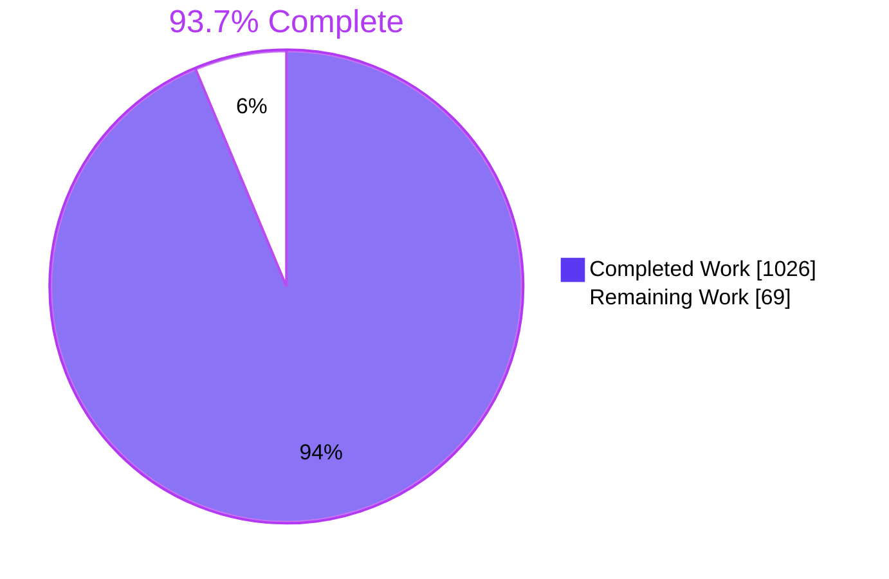
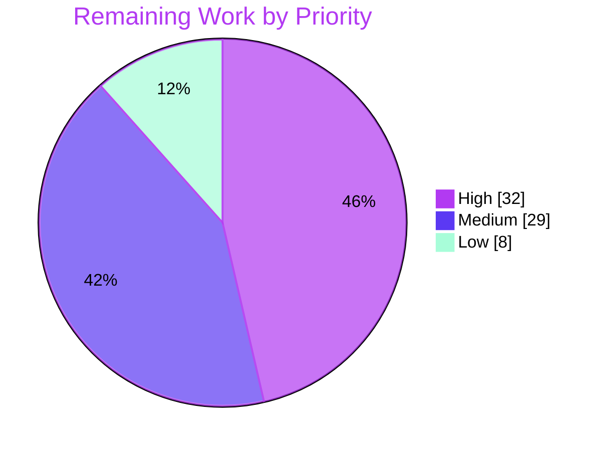

# 1. Executive Summary

## 1.1 Project Overview

This project makes the Odoo 19.5 `crm` addon usable offline on a phone. A field salesperson can browse a one-stage pipeline, open leads visited online, edit, move, create and win leads, and log and complete activities. Writes queue and replay on reconnect through the existing `web` offline framework, in order, with each create delivered once and no later save overwritten. Controls that cannot work offline are closed in the DOM and at their execution boundary. Two PWA shortcuts are added. All 34 changed source and test files sit under `addons/crm/`.

## 1.2 Completion Status


```mermaid
%%{init: {'theme':'base','themeVariables':{'pie1':'#5B39F3','pie2':'#FFFFFF','pieStrokeColor':'#B23AF2','pieOuterStrokeColor':'#B23AF2','pieSectionTextColor':'#000000','pieTitleTextColor':'#B23AF2','pieLegendTextColor':'#000000'}}}%%
pie showData title 93.7% Complete
    "Completed Work" : 1026
    "Remaining Work" : 69
```

| Metric | Value |
|---|---|
| Total Hours | 1,095 |
| Completed Hours (AI + Manual) | 1,026 (AI 1,026, Manual 0) |
| Remaining Hours | 69 |
| Percent Complete | 93.7% |

**Calculation:** 1,026 ÷ (1,026 + 69) = 1,026 ÷ 1,095 = **93.7% complete**. Remaining: one coverage refresh, in-scope follow-ups and path-to-production work.

## 1.3 Key Accomplishments

- ✅ 150 offline entry points classified (23 QUEUE, 5 SKIP, 122 DISABLE) in `offline_inventory.md`
- ✅ Offline edits, creates, moves, deletes, Won and activities queue and replay in order
- ✅ The later save wins: writes made during a replay wait behind the lead's queued writes
- ✅ One lead and one `mail.activity` per create, whatever response is lost
- ✅ Consistent offline chatter, stage lists, avatars, navbar, palette, guarded links and Delete
- ✅ Mobile pipeline, lead card, quick create, activity sheet and two PWA shortcuts
- ✅ Exercised under Android, iOS and WebKit device profiles and with 14 `crm`-dependent addons
- ✅ 177 Python, 282 desktop and 437 mobile CRM tests, and both full Hoot lanes, pass

## 1.4 Critical Unresolved Issues

0 of the 14 requested follow-up items (4 races, 8 UI items, 2 unexercised paths) remain open. 39 of 40 AAP requirements are verified; gate row 14's statement ledger awaits recomputation. **18 items remain open**, none blocking staging:

| Issue | Impact | Owner | ETA |
|---|---|---|---|
| Gate row 14 statement ledger not recomputed for the grown mobile JS (1) | ≥80% per file is plausible but unmeasured | QA / JS developer | 6 h |
| `test_main_flows` mobile tour still drives the desktop kanban quick create (`odoo/addons/test_main_flows/static/tests/tours/main_flow.js:564-660`) (1) | Fails at step 132 of 323 once its unrelated base failure at step 90 is fixed | `test_main_flows` maintainer | 3 h |
| In-scope offline follow-ups (6): desktop kanban drag offline on HTTP origins has no CRM guard; queued CRM calls are bound to the user but not the database; a replay reload keeps a server-deleted stage as an empty group; root reloads (column delete, fold-all, pager) during a held write bypass the load gate; disabled guarded links keep `href="#"`; column totals stay stale after a replayed stage move | Framework toast, rare replay into another database after a cookie switch, or cosmetic | JS developer | 8 h |
| Desktop-preset Hoot timing under 3× CPU throttling (1): the forecast test takes 27.0 s of its 30 s limit | Possible CI flake | QA | 2 h |
| Accepted residuals (8): multi-row list edit cannot be confirmed offline; an internal user without Sales rights can tell a live activity key from a fresh one; a malformed lead key is treated as a plain create; `__crm_offline__` rows grow without cleanup; an in-memory page-close supersession is lost if the page unloads mid-replay with a lost answer; prettier drift in `crm_offline.test.js`; a ~3 s window after page load before start-up replay; later edits cannot reach a child created by an already-sent queued save | Fail-closed or cosmetic, except two narrow replay edges where a later edit may not reach the server | Product owner | 4 h (key-row lifecycle) |
| Never exercised (1): real iOS Safari and Android Chrome hardware | Unknown keyboard, PWA-install and radio-loss behaviour | QA | 12 h |

## 1.5 Access Issues

| System/Resource | Type of Access | Issue Description | Resolution Status | Owner |
|---|---|---|---|---|
| Physical iOS and Android devices or a device farm | Hardware / test infrastructure | None is attached to the build environment, so device behaviour was exercised through Chrome device emulation and a WebKit iPhone profile | Open | QA |

No other access issue: the feature needs no external credential or API.

## 1.6 Recommended Next Steps

1. [High] Validate offline use on real iOS Safari and Android Chrome over HTTPS.
2. [High] Review and sign off the framework patches, replay holds and delivery keys (Section 5.2).
3. [Medium] Recompute the gate row 14 ledger and close the six in-scope follow-ups.
4. [Medium] Update the `test_main_flows` mobile tour; upgrade a staging copy from 1.9 to 1.10.
5. [Low] Decide the lifecycle of `__crm_offline__` key rows.

# 2. Project Hours Breakdown

## 2.1 Completed Work Detail

| Component | Hours | Description |
|---|---|---|
| Offline surface inventory (PART 1) | 16 | Grep and arch sweep of `addons/crm/`; one class and justification per row, count table, generated DISABLE action/menu sets; now 150 rows (`static/src/mobile/offline_inventory.md`) |
| Shared offline hooks and execution guards (PART 2, PART 4.4) | 120 | `useCrmOffline()` predicates, queue projection and helpers; CRM-scoped guards on view buttons, action/menu/view services, view mount, Action menu, kanban cards, tag colours, partner autocomplete, wizards and settings (`static/src/mobile/crm_offline_hooks.js`) |
| PART 2 offline defects (the eight AAP-listed behaviours) | 56 | Rainbowman skip, force-save proof, Sales Teams dashboard and team-form probe, lead generation, recurring revenue, scoring tooltip, activity menu, chatter/composer/followers, share-target guards |
| Lead form offline workflows (PART 3a/3b) | 96 | `CrmFormController`: queued mark-won with local won state, delete and archive presentation, reconciliation after replay or discard, mobile activity load variant, attributed statusbar field, systray status badges (`static/src/views/crm_form/crm_form.js`) |
| Kanban model and forecast exclusion | 20 | Offline non-root load suppression, local card removal, server-value snapshot, desktop-variant fallback; forecast kanban/list never marked available offline |
| Mobile pipeline view (PART 4.1) | 88 | One-stage pipeline renderer and controller, header count/revenue arithmetic, navigation and swipe, offline helpers, reversible load variants, deep link, framework template extensions (`static/src/mobile/crm_mobile_pipeline/`) |
| Mobile lead card and activity sheet (PART 4.2, 3b) | 56 | Card with projected values, pending/failed badges and provisional cards; bottom-sheet activity list with log a call, follow-up and mark done (`static/src/mobile/crm_mobile_lead_card/`) |
| Mobile quick create (PART 4.3) | 16 | Six-field bottom-sheet form with validation and offline queueing (`static/src/mobile/crm_mobile_quick_create/`) |
| Server and view wiring (PART 3b, 4.5, 5) | 10 | `mail.activity.create` resolves `res_model_id`; `_get_shortcuts` PWA override; `js_class` and Call-type options on both lead kanban arches and the form; Won attribute; manifest `1.10` |
| Server-side replay integrity | 24 | Replays refused in another user's session (`CrmOfflineOriginError`); keyed quick-create `web_save` (`models/crm_lead.py`, `crm_stage.py`, `crm_team.py`, `mail_activity.py`) |
| Python tests and offline tour (AAP 0.9.2 test Lanes 1 and 3) | 32 | `TestCrmOffline` manifest, replay-equivalence, identity and idempotency cases, and the `crm_mobile_offline` tour at 375x667 |
| Hoot offline suite (AAP 0.9.2 test Lane 2) | 100 | `static/tests/crm_offline.test.js`: SKIP, DISABLE, QUEUE, queue semantics, chatter and partner field, under both presets |
| Hoot mobile suite (AAP 0.9.5) | 100 | `static/tests/crm_mobile_pipeline.test.js`: every mobile component mounted through `js_class`, plus desktop parity checks |
| Validation and QA | 60 | Whole-package gates, runtime checks on phone and desktop layouts, accessibility and contrast, security and performance comparison with the base, statement ledger for gate row 14 |
| Replay ordering: later save wins, card writes follow queued form saves | 56 | Lead form, card, mobile stage select and lead-list multi-edit saves made during a replay are held or queued behind the lead's pending writes (`crmLeadWriteTurn`, `crm_offline_hooks.js:845`; `CrmListModel`, `views/crm_list/crm_list_view.js:233`); holds span replay restarts and are bound to user and database |
| Page-close and dropped-connection save paths | 14 | A page-close save is never held and supersedes the lead's unsent queued save of the same fields (`crmSupersedeQueuedLeadSaves`, `crm_offline_hooks.js:2247`); a held save whose connection drops ends in the queue and keeps the offline UI |
| Delivery keys: one lead and one activity per create | 24 | `crm_offline_create_key` on every new-lead save over a secure origin and on every CRM-scheduled activity; create-once `web_save` (`crm_lead.py:1055`) and `mail.activity.create` (`mail_activity.py:24`) with access checks on a repeated delivery |
| Offline UI guards for chatter, stages, avatar, navbar, palette, links and Delete | 36 | Chatter loads retried on reconnect; server-deleted stages dropped after a discard reload (`crm.lead.web_search_read`, `crm_lead.py:1028`); avatar card guard on leads; navbar `aria-disabled`; dimmed, inert palette results; `pointer-events: none` on guarded links (`crm_mobile_pipeline.scss:290`); non-secure Delete and stage select disabled |
| Regression tests for every race and UI item | 48 | 14 new `TestCrmOffline` tests (38 in total) and new Hoot tests in both CRM suites, each reproducing its item with controlled timing |
| Mobile Hoot timing under 3× CPU throttling | 6 | `@crm` mobile suite timed and shortened under throttling; two tests carry a documented 30 s timeout |
| Regression with `crm`-dependent addons | 16 | 14 dependent addons plus `test_discuss_full` installed with the CRM patches; Python, tour and Hoot results compared with the base; phone More toggle kept with a dependent statusbar button (`CrmFormCompiler`) |
| Device-profile exercise | 12 | Full offline salesperson cycle under Chrome 150 Android and iOS profiles and WebKit 26.6 iPhone, verified in the database |
| Validation, integration and inventory upkeep | 20 | Whole-package gates on each integrated tree, inventory rows and counts kept equal to the code (150 rows) |
| **Total** | **1,026** | |

## 2.2 Remaining Work Detail

| Category | Hours | Priority |
|---|---|---|
| Real-device PWA validation on iOS Safari and Android Chrome over HTTPS (install, shortcuts, on-screen keyboard, touch swipe, scroll anchoring, radio loss, replay) | 12 | High |
| Code review and sign-off of 41 framework patches, 22 template inherits, replay holds and queued-save rewrites, delivery keys and server overrides (Section 5.2) | 20 | High |
| In-scope offline follow-ups: guard desktop kanban drag on HTTP origins; decide database binding on queued CRM calls; drop server-deleted stages on replay reload; gate root reloads during held writes; drop `href="#"` from disabled guarded links; refresh column totals after a replayed move | 8 | Medium |
| Update the `test_main_flows` mobile tour CRM steps (`main_flow.js:564-660`) to the mobile pipeline markup | 3 | Medium |
| Production deployment: HTTPS secure context, RPC cache secret, service worker, `-u crm` upgrade 1.9→1.10 on a staging copy | 8 | Medium |
| Performance check with large offline queues and pipelines on real mobile hardware | 4 | Medium |
| Recompute the gate row 14 statement ledger for the final mobile JS and confirm it with browser precise coverage | 6 | Medium |
| Lifecycle of `__crm_offline__` delivery-key rows in `ir_model_data` (cleanup and uninstall behaviour) | 4 | Low |
| Desktop-preset Hoot timing margin under CPU throttling and CI flake watch | 2 | Low |
| Export `crm.pot` for the new user-facing strings | 2 | Low |
| **Total** | **69** | |

# 3. Test Results

All figures below come from runs executed for this assessment on the final tree (commit `8df902f327db`), with the pinned Chrome 150 browser, on fresh databases.

| Area / Category | Framework | Tests | Passed | Failed | Coverage | What This Proves |
|---|---|---|---|---|---|---|
| CRM Python suite and tours (`--test-tags /crm`, fresh install) | Odoo `TransactionCase` / `HttpCase`, web tours | 177 | 177 | 0 | Not measured | Existing CRM behaviour is intact and all 6 CRM tours succeed, including `crm_mobile_offline` |
| Offline server contracts (`/crm:TestCrmOffline`) | `HttpCase` | 38 | 38 | 0 | Not measured | Queued writes replay like their online equivalents; a repeated lead or activity delivery creates one record; held writes from another user or database are refused; stage choices return with the lead list |
| CRM offline and desktop behaviour (`@crm`, desktop preset) | Hoot | 282 | 282 | 0 | Ledger not re-measured (Section 5.1) | Every SKIP, DISABLE and QUEUE path behaves as classified; replay keeps the later save and orders card writes after queued form saves; desktop DOM and requests match `crm_kanban` when no replay runs |
| CRM mobile UI (`@crm`, mobile preset 375x667) | Hoot | 437 | 437 | 0 | Ledger not re-measured (Section 5.1) | Pipeline, lead card, quick create, activity sheet and phone form work online, offline and through replay, including the non-secure-origin states |
| Desktop Hoot lane with CRM patches loaded (`@web` 6,305 + `@crm` 282) | Hoot | 6587 | 6587 | 0 | Not measured | The CRM guards change nothing in the web framework's own desktop behaviour |
| Mobile Hoot lane with CRM patches loaded (`@web` 3,842 + `@crm` 437) | Hoot | 4279 | 4279 | 0 | Not measured | The same holds on the mobile preset |
| Unit-test bundle guard (`HootSuite.test_check_suite`) | Odoo `HttpCase` | 1 | 1 | 0 | n/a | No `only()` or `debug()` in any test file |
| Static gates | eslint, ruff, git checks | 10 | 10 | 0 | n/a | ESLint reports 0 issues on changed JS; ruff findings equal the base; no change outside `addons/crm/` beyond this guide, no new file, no requirements, security or dependency change, no IndexedDB/locks/cache API, only `tests/__init__.py` modified among existing tests, no `console.debug`, manifest `1.10` |

Every run logged zero WARNING or ERROR lines; the CRM Hoot suites ran 6,875 desktop and 9,668 mobile assertions. Each requested race and UI item has at least one test that reproduces it with controlled timing, for example `test_offline_form_create_replayed_then_saved_online_creates_once` and `test_offline_activity_create_replay_concurrent_delivery` (`addons/crm/tests/test_crm_offline.py`) and the hold, palette, navbar and non-secure Delete cases in `addons/crm/static/tests/crm_offline.test.js` (256 declarations) and `crm_mobile_pipeline.test.js` (250).

**Not Covered** (delivered but not exercised by any test; test before release):

- Real iOS Safari and Android Chrome hardware: on-screen keyboard, device PWA installation, radio loss and flapping. The activity sheet's Safari scroll-anchoring branch runs only in Hoot, and a touch swipe was not exercised on WebKit.
- A production HTTPS origin; every run used `127.0.0.1`/`localhost` or a LAN HTTP address.
- A real two-tab cookie switch between databases during a replay (covered by unit and JSON-RPC tests only), and the window between replay start and lock grant.
- The fallback to a separate stage read when a lead-list response lacks `crm_stage_choices`, and held-save presentation after a reload inside the model mutex on mobile.
- Statement coverage of the final mobile JavaScript (gate row 14 ledger, Section 5.1).
- The CRM steps of the `test_main_flows` mobile tour, which stops at an unrelated base failure before reaching them.
- A successful online module install from the lead-generation menu (its page reload), multi-currency stage revenue formatting, a stage with more than 80 leads at runtime, and more than eight cached activity types.

# 4. Runtime Validation & UI Verification

Runtime flows were driven in Chrome against live demo and test databases served from `127.0.0.1` (a secure context) and from a LAN HTTP address, at 375x667 touch and 1366x768, with every server-side outcome checked in the database. Online runs logged no console error beyond the expected offline pings, no HTTP response of 400 or above, and no server ERROR or WARNING line.

- ✅ **Start-up, health and PWA manifest** — `-i crm --with-demo` exits 0 in about 19 s with no warning; `/web/health` returns `{"status": "pass"}`; `/web/service-worker.js` returns 200; anonymous `/web/manifest.webmanifest` has no shortcuts, and after login it lists "My Pipeline" (`/odoo?menu_id=148`) and "New Lead" (`…&crm_quick_create=1`).
- ✅ **Mobile pipeline and offline quick create** — the header reads New, 2, $ 80,000; offline, the six-field sheet creates a provisional "Pending sync" card while nothing reaches the server; on reconnect exactly one `web_save` (200) replays with the queued `crm_offline_create_key`, and the database holds exactly one new opportunity.
- ✅ **Replay ordering** — saves made on the lead form, a card, the mobile stage select and the lead list during a replay reach the server after the lead's queued writes, so the later value is kept; a page-close save during a replay and a held save whose connection drops both end with the user's last values.
- ✅ **Exactly-once creates** — with the response dropped through DevTools after the server committed, the desktop form, the phone form, the kanban quick create and the activity sheet each leave one record; 8 parallel deliveries of one key leave one lead or one activity.
- ✅ **Offline UI states** — a chatter skipped offline loads once on reconnect; a server-deleted stage disappears after a discard reload; leads open no avatar card; blocked navbar entries carry `aria-disabled`; blocked palette results are dimmed and inert; guarded links compute `pointer-events: none`.
- ✅ **Device profiles** — Android Chrome (Pixel 8) and iOS Safari profiles in Chrome 150 and an iPhone profile on WebKit 26.6 each complete the offline salesperson cycle with five ordered writes replayed (200) and verified in the database.
- ✅ **`crm`-dependent addons** — `sale_crm`, `website_crm`, `crm_livechat` and the other eleven dependents run with the CRM patches loaded; their results equal the base commit's, and the phone lead form keeps Won reachable beside dependent statusbar buttons.
- ✅ **Desktop parity and shared-browser identity** — the desktop pipeline renders the standard kanban (2, 3, 4 and 1 cards per stage) with no mobile element; another user's or database's held write is refused and parked.
- ⚠ **Non-secure (HTTP) origin** — queue-dependent controls, the card-menu Delete and the mobile card stage select are disabled and inert offline, and guarded buttons re-enable online after a failed offline restore; a desktop kanban drag offline has no CRM guard and was not exercised.
- ⚠ **Never exercised at runtime** — real iOS/Android hardware, an HTTPS production origin, a cookie switch to another database during a replay, and a full page reload while offline (the page renders blank because the framework service worker does not cache the asset bundles).

# 5. Compliance & Quality Review

## 5.1 Compliance Matrix

| AAP Deliverable / Gate | Benchmark | Status | Progress |
|---|---|---|---|
| PART 1 inventory (gate row 1) | One class per row, justification, counts equal row count | ✅ Pass — 150 rows = 23 QUEUE + 5 SKIP + 122 DISABLE | 100% |
| Scope boundaries (gate rows 2, 3, 4) | Only `addons/crm/`; no `requirements.txt` or security change; no IndexedDB, locks or cache API use | ✅ Pass — row 2 lists only `blitzy/documentation/Project Guide.md` (this guide); rows 3 and 4 print nothing; no file added | 100% |
| Manifest version (gate row 5) | One minor increment | ✅ Pass — `'version': '1.10'`, asserted by `test_offline_wiring` | 100% |
| Offline write-and-replay cycle (gate row 6) | Edit, create, activity schedule and Won reach the server | ✅ Pass — `crm_mobile_offline` tour | 100% |
| DISABLE, SKIP and uncached-lead behaviour (gate rows 7, 9) | Inert offline by click, keyboard, hotkey and direct call; offline helper for an uncached lead | ✅ Pass — category tests in `crm_offline.test.js` | 100% |
| Queue semantics (gate row 8) | Ordered replay, last write wins, parking in the systray, no conflict dialog | ✅ Pass — the user's later action wins; holds and the page-close rewrite are listed in 5.2 | 100% |
| Desktop unchanged (gate row 10) | Same DOM and request specifications as `crm_kanban` and the current form | ✅ Pass — no added wait or request when no replay runs; keyed new-lead creates on secure origins (Sanctioned, 5.2) | 100% |
| Tests (gate rows 11, 12, 13) | Only `tests/__init__.py` modified among existing tests; new JS tests pass under both presets; no `only(`/`debug(` | ✅ Pass — 282 desktop, 437 mobile, guard green | 100% |
| Coverage of new mobile JS (gate row 14) | ≥80% statements per file by the AAP's manual ledger; every component mounted through `js_class` | ⚠ Partial — ledger stands at hooks ≥88.96%, pipeline ≥96.95%, lead card 95.65%, quick create 98.89% for the code before the race and UI changes; not recomputed for the final files | Refresh pending (6 h) |
| Requested races and UI items (4 + 8) | Each done-state met and reproduced by a test | ✅ Pass — 12 of 12, all suites green | 100% |
| Requested unexercised paths (2) | Real devices; `crm`-dependent addons with the patches loaded | ⚠ Dependent addons ✅; devices exercised through emulation and WebKit only | Hardware pending (12 h) |
| File scope and minimal change (AAP 0.8.1, 0.1.2, 0.6.1) | 15 listed modified files; nine template inherits; minimal change | ⚠ Partial — 4 unlisted files, 22 template inherits, 41 framework patches (5.2) | Sign-off pending |

## 5.2 AAP & Rule Divergences and Gaps

No user rules were provided, so every item below departs from the AAP. Items marked Sanctioned follow the follow-up request: "Address the 4 races and 8 UI issues … Attempt to exercise the two paths not exercised … Same scope, keep changes to addons/crm/."

| What the AAP/Rule Required | What Was Delivered Instead | Why It Diverged | Impact | Remediation |
|---|---|---|---|---|
| 0.8.1: modify exactly 15 listed files; `crm_lead.py` not among them | `crm_lead.py`, `crm_stage.py`, `crm_team.py` and `views/crm_list/crm_list_view.js` modified; `mail_activity.py` gains origin, key and access checks; new `crm.lead.web_search_read` override | Server-side replay integrity; Sanctioned for any existing `addons/crm/` file; `web_search_read` is a design choice | Larger server API surface | Review the overrides |
| 0.4.5: queued kwargs are `{context, specification: {}}` | Context also carries `crm_offline_uid`, `crm_offline_create_key`, `crm_offline_create_write`; held writes add `crm_offline_db` | Carriers for the user check and create-once delivery (Sanctioned) | Model, method, args unchanged; queued calls not bound to a database | Decide database binding |
| 0.1.2/0.3.3: replay verbatim, last write wins | Lead and card writes during a replay held or routed into the queue; a page-close save rewrites the lead's unsent queued `web_save` | Holds Sanctioned; the rewrite is a design decision, since a page-close save cannot wait | Queue entries not always verbatim | Review the rewrite path |
| 0.1.2, gate row 10: no desktop behaviour change | Online new-lead creates on secure origins send a delivery key and register a row | Sanctioned: one lead per create needs the key before the first request | One `ir_model_data` row per new lead | Key-row lifecycle (4 h) |
| 0.6.1: nine template inherits; minimal change | 22 template inherits, 41 framework patches | AAP 0.4.7 closes every DISABLE path in the DOM; UI additions Sanctioned | Upgrade fragility | Owner review (20 h) |
| 0.4.7/0.7.2.3/0.7.2.8 mechanisms | In-memory action index; root reload in the mutex; stage list load; four fallback attempts; deep link on any layout | The AAP's own fail-closed, no-request, keep-edits and no-desktop-change rules | Same outcomes | Accept in review |
| 0.4.6: usable controls carry `data-available-offline`; card Delete and stage select queue | On HTTP origins offline: queue-dependent controls, card Delete and mobile stage select disabled; desktop drag unguarded | Framework queue refuses non-secure calls; Delete Sanctioned; stage select a design decision | Controls unavailable on HTTP offline | Serve HTTPS; guard the drag |
| Request: "Attempt to exercise" real iOS Safari / Android Chrome devices | Chrome Android and iOS profiles, WebKit 26.6 iPhone profile | No physical device or device farm available; Sanctioned by "attempt" | Hardware behaviour unverified | Device validation (12 h) |

**File scope.** AAP 0.8.1 names fifteen files to modify and excludes `crm_lead.py`. The checks that keep replays honest live in the models: `_check_offline_queue_origin` (`addons/crm/models/crm_lead.py:1193`) refuses a foreign replay, the keyed `web_save` (`crm_lead.py:1055`) creates a lead once, and `mail.activity.create` (`models/mail_activity.py:24`) does the same for activities, with create and read checks on a repeat. Lead-list multi-edit holds sit in `static/src/views/crm_list/crm_list_view.js:233`. `crm.lead.web_search_read` (`crm_lead.py:1028`) returns stage choices with the lead list, so a discard reload drops deleted stages in one request; the AAP does not name it. Review these server overrides as public API.

**Queued call shape.** AAP 0.4.5 fixes queued kwargs at `{context, specification: {}}`. CRM calls queued through the patched `OfflinePlugin.scheduleORM` (`crm_offline_hooks.js:2339`) also carry `crm_offline_uid`. New-lead saves and CRM-scheduled activities carry a 128-bit `crm_offline_create_key`, and a later save of the same new lead adds `crm_offline_create_write`, so the server applies it as a write. Held writes add `crm_offline_db`. Model, method and arguments are unchanged. The request to make each create happen once sanctions the keys. Queued calls still carry no database, which only the client knows (`extras.crmOrigin`); decide whether to bind them (Section 2.2).

**Replay holds and rewrites.** AAP 0.1.2 and 0.3.3 replay every queued call verbatim, last write wins. To keep the later save, a lead save made while the client still reports offline is routed into the queue behind the lead's older entries. Online card, colour, delete, stage-select and list writes during a replay wait for their turn (`crmLeadWriteTurn`, `crm_offline_hooks.js:845`) outside the model mutex, so unrelated leads are sent at once. The request to address the races sanctions holding and routing. A page-close save cannot wait, so it rewrites the lead's unsent queued `web_save` of the same fields (`crmSupersedeQueuedLeadSaves`, line 2247), restored on refusal. Confirm that rewrite in review.

**Desktop behaviour.** AAP 0.1.2 and gate row 10 require desktop behaviour to stay unchanged. An offline-created lead saved online during its own replay is created once only if its key exists before the first request. Every non-urgent new-lead save on a secure origin, online desktop creates included, therefore sends `crm_offline_create_key`, and the server registers one `__crm_offline__` row per lead (`crm_lead.py:1055`). No wait or extra request is added when no replay runs, and the desktop suites pass. The rule gives way to the request that each lead be created once. Decide the rows' retention (Section 2.2).

**Framework patch surface.** AAP 0.6.1 lists nine template inherits and about a dozen touchpoints under a minimal-change rule. Counted by `t-inherit` attributes and `patch(` call sites, the code holds 22 inherits (21 in `crm_mobile_pipeline.xml`, 1 in `crm_mobile_lead_card.xml`) and 41 framework patches: 31 in `crm_offline_hooks.js`, including `OfflinePlugin`, `ViewButton`, `NavBar`, `CommandPalette` and `Avatar`, and 10 in `crm_form.js`, including `Record`, `StatusBarButtons`, `Chatter` and the follower components. Each closes an offline path AAP 0.4.7 requires closed, is scoped to CRM data and defers to the original online. The navbar, palette, avatar, Delete and `pointer-events` additions were requested. Name an owner to re-validate them on each framework update.

**Mechanism substitutions.** The AAP names mechanisms that would break its own higher rules, so the code reaches the same outcomes another way. Disabled actions are identified from an in-memory index of actions the client has loaded (`resolveKnownAction`, `crm_offline_hooks.js:3892`), because a disk-cache lookup always attempts a request. Reconciliation reloads the root record inside the model mutex (`crmRefresh`, `crm_form.js:1552`) to keep unsaved edits. A never-loaded stage loads through its own list rather than `group.toggle()`, which would change desktop folding. The fallback makes at most four attempts (`crm_kanban_model.js:847`), and the deep link is consumed on any layout. Confirm these in review.

**Non-secure origins.** AAP 0.4.6 keeps usable controls enabled with `data-available-offline` and lists card Delete and the stage select as queued writes. On an HTTP origin the framework queue throws `NonSecureContextError`. Offline, the quick-create Save, colour swatches, statusbar, Won, activity Save, the card-menu Delete and the mobile card stage select are therefore disabled and inert (`isCrmOfflineQueueBlocked`, `crm_offline_hooks.js:350`). The Delete behaviour was requested; the stage select follows the same rule as a design decision. A desktop kanban drag offline on HTTP has no CRM guard (`crm_kanban_model.js`, `moveRecord`) and falls to the framework's error. Serve production over HTTPS and guard the drag (Section 2.2).

**Device substitutes.** The follow-up request asked to attempt real iOS Safari and Android Chrome devices. No physical device or device farm is attached to the build environment. The offline salesperson cycle therefore ran under Chrome 150 with Android (Pixel 8) and iOS Safari profiles and under WebKit 26.6 with an iPhone profile, each replay verified in the database. The activity sheet's Safari scroll-anchoring branch is covered only by a Hoot test, because both engines re-snap. Real hardware, the on-screen keyboard, device PWA install, real Apple Safari and radio loss remain unverified. The request's "attempt" sanctions the substitute; schedule device validation (12 h).

# 6. Risk Assessment

| Risk | Category | Severity | Probability | Mitigation | Status |
|---|---|---|---|---|---|
| 41 patches and 22 template inherits on framework internals of a 19.5 alpha series (`crm_offline_hooks.js`, `crm_form.js`, `crm_mobile_pipeline.xml`) break silently when `web` or `mail` change upstream | Technical | High | High | Name an owner; re-run the full desktop and mobile Hoot lanes and the `crm_mobile_offline` tour on every framework update | Open |
| Replay holds and queued-save rewrites meet untested timings on real networks: a page-close save during an in-flight replay whose answer is lost, the ~3 s before start-up replay, or a save delivered by another tab | Technical | Medium | Low | Keep the hold and supersession tests in CI; monitor parked "Sync failed" entries after rollout | Mitigated by tests |
| Queued CRM calls are bound to the user but not the database, so a replay that spans a cookie switch to another database with the same user id applies there; held writes are bound to both | Security | Medium | Low | Add `crm_offline_db` to queued calls (a change to the AAP 0.4.5 shape), or give shared devices separate browser profiles | Open (in 8 h follow-ups) |
| `ir_model_data` gains one `__crm_offline__` row per keyed lead (every new lead on HTTPS) and activity, with no cleanup, and rows remain after uninstall; an internal user without Sales rights can tell a live activity key from a fresh one | Operational | Low | High | Add retention or a periodic cleanup and test uninstall; keys are random 128-bit values | Open (4 h) |
| Real devices behave differently from emulation: iOS PWA install, on-screen keyboard, WebKit service-worker session, radio loss | Integration | Medium | Medium | Device validation over HTTPS on current iOS and Android | Open (12 h) |
| Other addons' tours that drive the CRM pipeline on a phone expect the desktop kanban quick create (`test_main_flows` mobile tour) | Integration | Medium | Medium | Update `main_flow.js:564-660` to the mobile pipeline markup | Open (3 h) |
| Offline use needs HTTPS, a prior online visit and an open page; a full offline reload renders blank, and a desktop kanban drag offline on HTTP falls to the framework's error | Operational | Medium | Medium | Enforce HTTPS; tell users to open leads online first; guard the drag; track framework service-worker caching | Partly open |
| Loaded CI may time out Hoot tests: the desktop-preset forecast test needs 27.0 s of its 30 s limit under 3× CPU throttling | Technical | Low | Medium | Shorten or re-time the desktop-preset outliers; monitor the flake rate | Open (2 h) |

# 7. Visual Project Status


```mermaid
%%{init: {'theme':'base','themeVariables':{'pie1':'#5B39F3','pie2':'#FFFFFF','pieStrokeColor':'#B23AF2','pieOuterStrokeColor':'#B23AF2','pieSectionTextColor':'#000000','pieTitleTextColor':'#B23AF2','pieLegendTextColor':'#000000'}}}%%
pie showData title Project Hours Breakdown
    "Completed Work" : 1026
    "Remaining Work" : 69
```

**Remaining hours by priority (69 h)**


```mermaid
%%{init: {'theme':'base','themeVariables':{'pie1':'#B23AF2','pie2':'#5B39F3','pie3':'#A8FDD9','pieStrokeColor':'#B23AF2','pieSectionTextColor':'#000000','pieTitleTextColor':'#B23AF2','pieLegendTextColor':'#000000'}}}%%
pie showData title Remaining Work by Priority
    "High" : 32
    "Medium" : 29
    "Low" : 8
```

| Remaining category (Section 2.2) | Hours | Priority |
|---|---|---|
| Real-device PWA validation | 12 | High |
| Code review and sign-off | 20 | High |
| In-scope offline follow-ups | 8 | Medium |
| `test_main_flows` mobile tour update | 3 | Medium |
| Production deployment and staging upgrade | 8 | Medium |
| Performance check on real hardware | 4 | Medium |
| Gate row 14 ledger refresh | 6 | Medium |
| Delivery-key row lifecycle | 4 | Low |
| Desktop-preset timing margin | 2 | Low |
| `crm.pot` export | 2 | Low |
| **Total** | **69** | |

# 8. Summary & Recommendations

The project is **93.7% complete** (1,026 of 1,095 hours). The offline and mobile CRM feature is delivered on the final tree: the 150-row offline inventory, correct offline behaviour for the eight AAP-listed defects, DISABLE enforcement in the DOM and at the execution boundary, the QUEUE paths with framework replay, the mobile pipeline, lead card, quick create and activity sheet, the PWA shortcuts and all three AAP test lanes. All 14 requested follow-up items are delivered. Replays keep the user's later save, card writes follow the lead's queued form save, and each lead and activity is created once whatever response is lost. The eight offline UI items behave as specified, and each race and UI item has a reproducing test.

Every run on the final tree is green. The CRM Python suite passes 177 of 177 tests, including all six tours, and `TestCrmOffline` passes 38 of 38. The `@crm` Hoot suites pass 282 desktop and 437 mobile tests, and the full lanes pass 6,587 desktop and 4,279 mobile tests with the CRM patches loaded. Every scope gate is clean. A live browser run confirmed the desktop kanban, the mobile pipeline and an offline quick create replayed exactly once. The feature was also exercised under Android, iOS and WebKit device profiles and with all 14 `crm`-dependent addons installed, whose results equal the base commit's.

The remaining 69 hours are path-to-production work and one coverage refresh, not missing features. The critical path has two High items (32 h). First, validate on real iOS Safari and Android Chrome hardware over HTTPS, since no physical device was available. Second, have an Odoo framework owner review the 41 framework patches, 22 template inherits, replay holds, queued-save rewrites and delivery keys that extend the AAP's design (Section 5.2). The gate row 14 statement ledger also needs recomputing for the final mobile JavaScript.

The main structural risk is maintainability. The feature reaches deep into `web` and `mail` internals of an alpha series, so any upstream change to the offline plugin, action service, view buttons or chatter can disable a guard without a visible error. The regression lanes are the safety net and belong in CI on every framework bump, together with an update of the `test_main_flows` mobile tour, which still expects the desktop kanban quick create on a phone.

Production readiness: suitable for a staging deployment now. It is ready for production once device validation passes, the review signs off, HTTPS is enforced and a staging copy upgrades cleanly from version 1.9 to 1.10. Success metrics for the rollout are zero duplicate leads or activities after replay, zero parked "Sync failed" entries caused by CRM code, unchanged desktop request volumes when no replay runs, and no new errors in dependent apps.

# 9. Development Guide

Run every command from the repository root. The commands below were executed for this assessment unless marked otherwise.

**System prerequisites**

- Linux x86_64 with 4+ CPU cores and 8 GB RAM; the CRM install with its tests takes about 7 minutes, and the full desktop and mobile Hoot lanes take about 11 and 9 minutes.
- Python 3.12–3.14 (`odoo/release.py` bounds; verified on 3.14.0) with the pins in `requirements.txt`, plus `websocket-client` for browser tests.
- PostgreSQL 16 or later (verified on 16.15) with a role that can create databases.
- Google Chrome **150.0.7871.114** for browser and Hoot tests. Chrome 154 fails an existing `@web` timing test, so point `ODOO_BROWSER_BIN` at a 150 build.
- Node.js 20 with ESLint 8 (lint only; nothing is built with Node).
- Offline features need a secure context: HTTPS, or `localhost`/`127.0.0.1` during development.

**Environment setup**

```bash
# Python environment (outside the checkout; never committed). Provisioning step, not re-run here.
uv venv --python 3.14 "$HOME/.venvs/odoo-crm"
uv pip install --python "$HOME/.venvs/odoo-crm/bin/python" -r requirements.txt websocket-client

# Per-shell variables; adjust the Chrome path to your 150 build
export PATH="$HOME/.venvs/odoo-crm/bin:$PATH"
export ODOO_BROWSER_BIN="<path-to-chrome-150>/chrome"
export DB=crm_dev PORT=8069 ODOO_DATA="$HOME/.local/share/Odoo-crm-dev"
export PGOPTS="--db_host=localhost --db_port=5432 --db_user=odoo --db_password=odoo"
```

Expected checks: `python --version` prints `Python 3.14.x`, `psql --version` prints `16.x`, and `"$ODOO_BROWSER_BIN" --version` prints `Google Chrome 150.0.7871.114`.

**Install the module and start the server**

```bash
# Create the database with demo data; demo data is off by default in 19.5
python odoo-bin $PGOPTS -d "$DB" -i crm --with-demo --stop-after-init --data-dir="$ODOO_DATA"

# Start the server in the background
nohup setsid python odoo-bin $PGOPTS -d "$DB" --db-filter="^${DB}\$" --http-port="$PORT" \
  --data-dir="$ODOO_DATA" --email-from=odoo@example.com > odoo-dev.log 2>&1 < /dev/null &
```

The install exits 0 in about 19 s with no WARNING line. "Running as user 'root' is a security risk" is expected when running as root.

**Verify the running instance**

```bash
curl -s "http://localhost:$PORT/web/health"                                        # {"status": "pass"}
curl -s "http://localhost:$PORT/web/manifest.webmanifest" | python3 -c "import sys,json; print(json.load(sys.stdin)['shortcuts'])"   # [] when anonymous
curl -s -o /dev/null -w "%{http_code}\n" "http://localhost:$PORT/web/service-worker.js"   # 200

# Authenticated manifest: CRM, "My Pipeline" and "New Lead" shortcuts
curl -s -c cj.txt -H 'Content-Type: application/json' \
  -d "{\"jsonrpc\":\"2.0\",\"method\":\"call\",\"params\":{\"db\":\"$DB\",\"login\":\"admin\",\"password\":\"admin\"}}" \
  "http://localhost:$PORT/web/session/authenticate" > /dev/null
curl -s -b cj.txt "http://localhost:$PORT/web/manifest.webmanifest" | python3 -c "import sys,json; [print(s['name'], s['url']) for s in json.load(sys.stdin)['shortcuts']]"
rm -f cj.txt
```

Expected output of the last command (menu ids vary per database): `Discuss /odoo?menu_id=…`, `CRM /odoo?menu_id=…`, `My Pipeline /odoo?menu_id=148`, `New Lead /odoo?menu_id=148&crm_quick_create=1`.

**Example usage**

- Log in at `http://127.0.0.1:$PORT/web/login` as `admin` / `admin`.
- In Chrome DevTools, switch to a 375x667 touch device and open **CRM → My Pipeline**. One stage fills the screen (header "New", 2 leads, $ 80,000); use the chevrons or swipe to change stage, and tap **New** for the six-field quick create.
- Open a lead online, then set DevTools Network to **Offline**. Edit it, log a call from the activities button, mark it Won, and create a lead from the pipeline. Each change shows "Pending sync".
- Set Network back to **No throttling**. The queue replays within a second, the badges disappear, the systray clears, and each created lead exists once on the server.
- Widen the window to desktop size: the standard kanban returns unchanged.

**Run the tests**

```bash
# CRM Python tests and tours on a fresh database; expect "0 failed, 0 error(s) of 177 tests"
python odoo-bin $PGOPTS -d crm_test -i crm --test-enable --test-tags /crm --stop-after-init \
  --log-level=test --http-port=8070 --data-dir="$ODOO_DATA-test"

# Offline test class only; expect "0 failed, 0 error(s) of 38 tests"
python odoo-bin $PGOPTS -d crm_test -u crm --test-enable --test-tags /crm:TestCrmOffline \
  --stop-after-init --log-level=test --http-port=8070 --data-dir="$ODOO_DATA-test"

# Desktop Hoot suites plus the bundle guard, run WITHOUT -u/-i; expect "Passed 6587 tests"
python odoo-bin $PGOPTS -d crm_test --test-enable \
  --test-tags /web:WebSuite.test_unit_desktop,/crm:WebSuite.test_unit_desktop,/web:HootSuite.test_check_suite \
  --stop-after-init --log-level=test --http-port=8070 --data-dir="$ODOO_DATA-test"

# Mobile Hoot suites, run WITHOUT -u/-i; expect "Passed 4279 tests"
python odoo-bin $PGOPTS -d crm_test --test-enable \
  --test-tags /web:MobileWebSuite.test_unit_mobile,/crm:MobileWebSuite.test_unit_mobile \
  --stop-after-init --log-level=test --http-port=8070 --data-dir="$ODOO_DATA-test"

# Lint the changed JavaScript (prints nothing), then the scope gates
git diff --name-only e8f1c15d1211..HEAD -- '*.js' | xargs eslint --no-ignore --no-eslintrc -c odoo/addons/test_lint/tests/eslintrc
git diff --name-only e8f1c15d1211..HEAD | grep -v '^addons/crm/'     # only "blitzy/documentation/Project Guide.md"
git diff --name-only e8f1c15d1211..HEAD | grep -E 'requirements.txt|security/'   # nothing
grep -rn "indexedDB\|new IndexedDB\|navigator.locks\|caches.open" addons/crm/      # nothing
git diff --name-only --diff-filter=MDR e8f1c15d1211..HEAD -- addons/crm/tests addons/crm/static/tests   # only addons/crm/tests/__init__.py
git diff --name-only e8f1c15d1211..HEAD -- '*.test.js' | xargs -r grep -n -e '\.only(' -e '\.debug('   # nothing
```

On a fresh install the `/crm` run alone reports `@crm` Hoot "Passed 282 tests" (desktop) and "Passed 437 tests" (mobile). To run a single Hoot file, add a filter: `--test-tags '/crm:WebSuite.test_unit_desktop[@crm/crm_offline]'`.

**Stop the server and clean up**

```bash
# Stop the process that owns $PORT; lsof and ss may not be installed
INODE=$(awk -v p=":$(printf '%04X' "$PORT")" '$2 ~ p"$" && $4=="0A" {print $10}' /proc/net/tcp | head -1)
for p in /proc/[0-9]*; do ls -l "$p/fd" 2>/dev/null | grep -q "socket:\[$INODE\]" && kill "$(basename "$p")"; done
PGPASSWORD=odoo dropdb -w -h localhost -U odoo --if-exists "$DB" < /dev/null
PGPASSWORD=odoo dropdb -w -h localhost -U odoo --if-exists crm_test < /dev/null
```

**Troubleshooting**

- *A run reports "0 failed, 0 error(s) of 0 tests".* With `-u` or `-i`, tests are collected only from the updated module, so `/web:` tags are dropped. Refresh with `-u crm --stop-after-init` first, then run the Hoot suites without `-u`.
- *Quick-create Save, colour swatches, the statusbar, Won, card Delete or the card stage select are greyed out offline.* The page is served over plain HTTP. The framework queue refuses calls outside a secure context ("Offline features not available in a non-secure context"), so CRM disables those controls instead. Serve over HTTPS, or use `127.0.0.1`/`localhost` in development.
- *A save or card move made just after reconnecting waits a moment.* Writes to a lead with queued changes are sent after them, so the later value wins; they go out as soon as the replay ends.
- *A lead or stage shows the offline helper.* Only data visited online is cached; open the pipeline and the lead online once before disconnecting.
- *A blank page after reloading while offline.* The framework service worker does not cache the asset bundles; keep the tab open, or reload once online.
- *`@web/core/utils/timing/throttleForAnimationScrollEvent` fails.* The browser is not Chrome 150; set `ODOO_BROWSER_BIN`.
- *A Hoot test times out on a busy machine.* Rerun only that file with a `[@crm/<file>]` sub-filter before treating it as a failure.
- *`createdb`/`dropdb` hang.* Pass `PGPASSWORD=odoo` with `-w` so no password prompt is opened.
- *Stale behaviour after pulling changes.* Asset bundles live in the database; run `-u crm --stop-after-init` before asset-dependent runs.

# 10. Appendices

## A. Command Reference

| Purpose | Command (from the repository root) |
|---|---|
| Install CRM with demo data | `python odoo-bin -d <db> -i crm --with-demo --stop-after-init --data-dir=<dir>` |
| Start the server | `python odoo-bin -d <db> --db-filter="^<db>$" --http-port=<port> --data-dir=<dir>` |
| Upgrade CRM (refresh assets, apply 1.10) | `python odoo-bin -d <db> -u crm --stop-after-init --data-dir=<dir>` |
| CRM Python tests and tours (177) | `python odoo-bin -d <db> -i crm --test-enable --test-tags /crm --stop-after-init --log-level=test` |
| Offline test class (38) | `python odoo-bin -d <db> -u crm --test-enable --test-tags /crm:TestCrmOffline --stop-after-init --log-level=test` |
| Desktop Hoot suites (6,587) | `--test-enable --test-tags /web:WebSuite.test_unit_desktop,/crm:WebSuite.test_unit_desktop,/web:HootSuite.test_check_suite` (no `-u`) |
| Mobile Hoot suites (4,279) | `--test-enable --test-tags /web:MobileWebSuite.test_unit_mobile,/crm:MobileWebSuite.test_unit_mobile` (no `-u`) |
| One Hoot file | `--test-tags '/crm:WebSuite.test_unit_desktop[@crm/crm_offline]'` |
| Lint JavaScript | `eslint --no-ignore --no-eslintrc -c odoo/addons/test_lint/tests/eslintrc <files>` |
| Lint Python | `ruff check --no-fix <files>` (findings must equal the base file's) |
| Scope gate | `git diff --name-only e8f1c15d1211..HEAD \| grep -v '^addons/crm/'` (prints only `blitzy/documentation/Project Guide.md`) |
| Health check | `curl -s http://localhost:<port>/web/health` → `{"status": "pass"}` |

## B. Port Reference

| Port | Use |
|---|---|
| 8069 | Default Odoo HTTP port (web client, JSON-RPC, `/web/manifest.webmanifest`, `/web/service-worker.js`) |
| 8070 (or any free port) | Separate HTTP port for test runs, so tours do not collide with a running server |
| 8072 | Default gevent/longpolling port, used only with `--workers` |
| 5432 | PostgreSQL |
| Automatic | Chrome DevTools port for tours and Hoot, chosen by the test runner |

## C. Key File Locations

| Path | Contents |
|---|---|
| `addons/crm/static/src/mobile/crm_offline_hooks.js` | `useCrmOffline()`, the queue-usability signal, replay holds (`crmLeadWriteTurn`), page-close supersession, delivery keys and the framework execution guards for DISABLE paths |
| `addons/crm/static/src/mobile/offline_inventory.md` | 150-row offline call inventory (QUEUE 23, SKIP 5, DISABLE 122) |
| `addons/crm/static/src/mobile/crm_mobile_pipeline/` | Single-stage mobile pipeline view, renderer, header, template extensions and the guarded-link `pointer-events` rule |
| `addons/crm/static/src/mobile/crm_mobile_lead_card/` | Mobile lead card, pending-sync badge, stage select and activity bottom sheet |
| `addons/crm/static/src/mobile/crm_mobile_quick_create/` | Six-field bottom-sheet quick create |
| `addons/crm/static/src/views/crm_form/crm_form.js` | Lead form offline save and replay routing, Won, statusbar, chatter and composer guards |
| `addons/crm/static/src/views/crm_kanban/crm_kanban_model.js` | Kanban move, held card writes, rainbowman skip and offline group-load fallback |
| `addons/crm/static/src/views/crm_list/crm_list_view.js` | Lead-list multi-edit held behind queued lead writes |
| `addons/crm/controllers/webmanifest.py` | "My Pipeline" and "New Lead" PWA shortcuts |
| `addons/crm/models/crm_lead.py` | Queued-call user and database checks, keyed create-once `web_save`, stage choices in `web_search_read` |
| `addons/crm/models/mail_activity.py` | `res_model_id` resolution, origin check and keyed create-once activity creates |
| `addons/crm/views/crm_lead_views.xml`, `crm_team_views.xml` | `js_class="crm_mobile_pipeline"`, Won/statusbar offline attributes, team Configuration link |
| `addons/crm/tests/test_crm_offline.py` | `TestCrmOffline` (38 tests) |
| `addons/crm/static/tests/crm_offline.test.js`, `crm_mobile_pipeline.test.js` | Hoot suites (desktop and mobile presets) |
| `addons/crm/static/tests/tours/crm_mobile_offline.js` | `crm_mobile_offline` tour |

## D. Technology Versions

| Component | Version |
|---|---|
| Odoo | 19.5a1 (master); `crm` module 1.10 (installed as `19.5.1.10`) |
| Python | 3.14.0 (supported 3.12–3.14) |
| PostgreSQL | 16.15 |
| Google Chrome (tests) | 150.0.7871.114 |
| Node.js / ESLint / Prettier | 20.20.2 / 8.57.1 / 2.8.8 |
| ruff | 0.15.22 |
| uv | 0.12.23 |
| wkhtmltopdf | 0.12.6.1 (patched qt) |

## E. Environment Variable Reference

| Variable | Required | Purpose |
|---|---|---|
| `ODOO_BROWSER_BIN` | For tours and Hoot | Path to the Chrome 150 binary the test runner launches |
| `PATH` | Yes | Must put the Python environment's `bin` (and Node 20 for lint) first |
| `NODE_PATH` | For lint | Lets ESLint resolve `eslint-config-prettier` and `eslint-plugin-prettier` |
| `PGPASSWORD` | For `psql`/`createdb`/`dropdb` over TCP | Avoids an interactive password prompt (use with `-w`) |

The CRM changes add no environment variable, configuration option or system parameter. Database connection settings come from `odoo-bin` flags or the Odoo configuration file (`db_host`, `db_port`, `db_user`, `db_password`).

## F. Developer Tools Guide

- **Offline emulation:** Chrome DevTools → Network → *Offline*. The systray shows "Working offline" within a few seconds; switch back to *No throttling* to replay.
- **Mobile layout:** DevTools device toolbar at 375x667 with touch. The mobile pipeline appears only at small screen size; widening the window restores the desktop kanban.
- **Queued calls:** the offline systray menu lists every pending call by model, with a status badge and a "Discard offline changes" control. A call the server rejected on replay stays listed in red with its error. Clicking the systray button checks the connection and syncs.
- **Hoot runner:** open `/web/tests` in a logged-in session and filter on `@crm` to run the CRM suites interactively.
- **Server log:** run with `--log-level=test` for test totals, and search for `WARNING` or `ERROR`; the verified runs log none.

## G. Glossary

| Term | Meaning |
|---|---|
| QUEUE | A write that is stored offline and replayed in timestamp order on reconnect |
| SKIP | A decorative read that is not issued offline and runs again online (rainbowman lookup after a form save or kanban move, recurring-revenue group probe, team-leader avatar card) |
| DISABLE | A control that is closed offline in the DOM and at the execution boundary |
| `data-available-offline` | Attribute that keeps a control enabled while the framework disables the rest of the page offline |
| `o_disabled_offline` | Framework class applied to controls that are unavailable offline |
| OfflinePlugin | The framework offline engine (IndexedDB queue, replay, parked calls). CRM adds no engine of its own; it wraps the plugin's scheduling and replay to tag CRM calls with their user, attach delivery keys and hold lead writes behind queued ones (Section 5.2) |
| `useCrmOffline()` | The shared CRM hook every mobile component uses to read the offline and queue state |
| Provisional card | A lead created offline, shown with a dashed border and "Pending sync" until replay |
| Parked call | A queued call the server rejected on replay, kept in the systray with its error until the user discards it |
| Delivery key | `crm_offline_create_key` in a create's context; the server registers it once, so a repeated delivery returns the same lead or activity |
| Replay hold | A lead write made during a replay that waits until the lead's older queued writes are sent, so the later value wins |
| Secure context | HTTPS, `localhost` or `127.0.0.1`; required for the offline queue |
| Hoot | Odoo's JavaScript test framework, run in desktop and mobile presets |
| LWW | Last write wins: later replayed writes overwrite earlier ones, with no conflict dialog |
