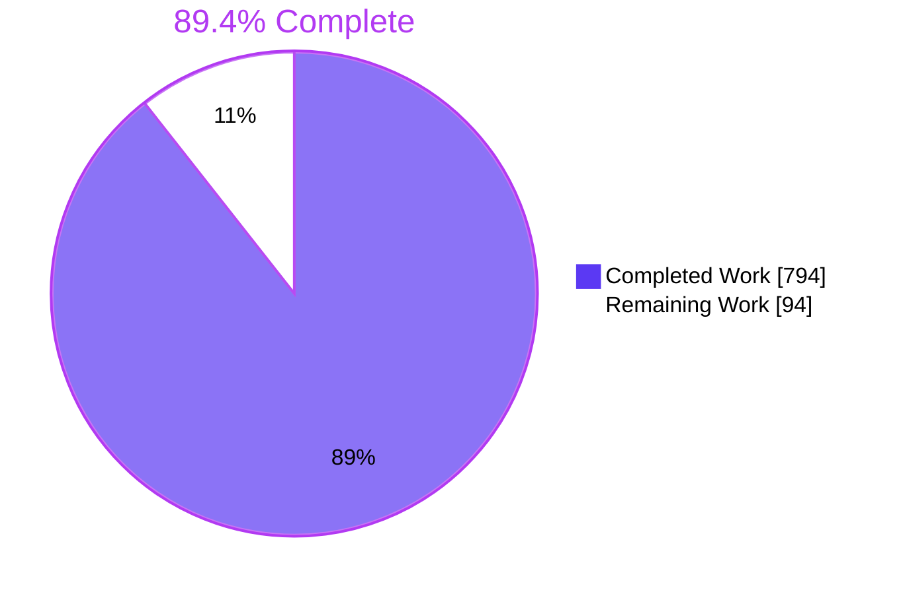
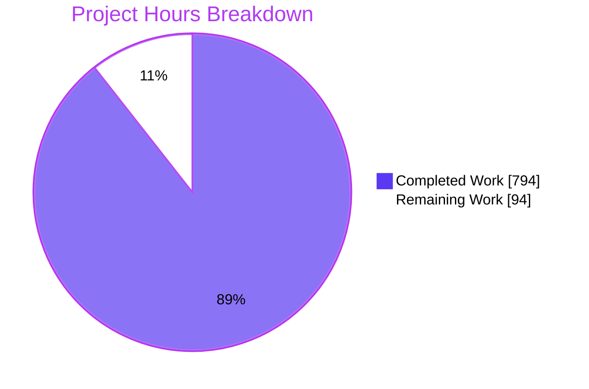
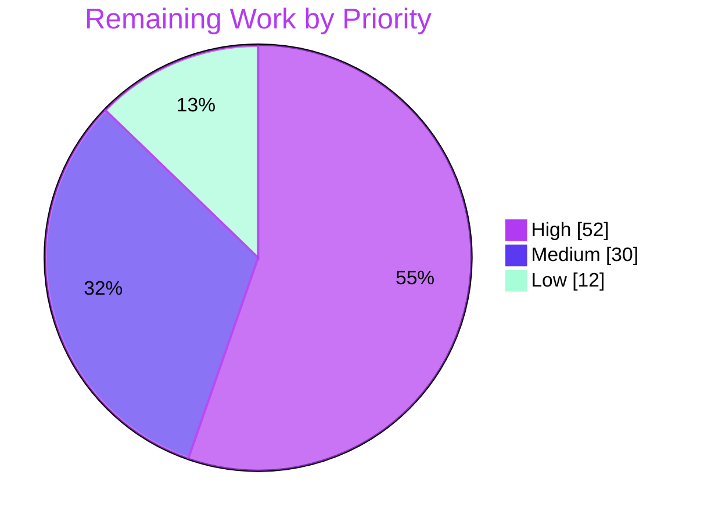

# 1. Executive Summary

## 1.1 Project Overview

This project makes the Odoo 19.5 `crm` addon usable offline on a phone. A field salesperson can browse a one-stage-at-a-time pipeline, open leads visited online, edit, move, create and win leads, log and complete activities, and search cached contacts. Writes queue and replay on reconnect through the existing `web` offline framework; controls that cannot work offline are closed in the DOM and at their execution boundary. Two PWA shortcuts ("My Pipeline", "New Lead") are added. All 33 changed files sit under `addons/crm/`, and desktop behaviour is unchanged.

## 1.2 Completion Status


```mermaid
%%{init: {'theme':'base','themeVariables':{'pie1':'#5B39F3','pie2':'#FFFFFF','pieStrokeColor':'#B23AF2','pieOuterStrokeColor':'#B23AF2','pieSectionTextColor':'#000000','pieTitleTextColor':'#B23AF2','pieLegendTextColor':'#000000'}}}%%
pie showData title 89.4% Complete
    "Completed Work" : 794
    "Remaining Work" : 94
```

| Metric | Value |
|---|---|
| Total Hours | 888 |
| Completed Hours (AI + Manual) | 794 (AI 794, Manual 0) |
| Remaining Hours | 94 |
| Percent Complete | 89.4% |

**Calculation:** 794 ÷ (794 + 94) = 794 ÷ 888 = **89.4% complete**. Every AAP requirement is delivered; the remaining hours are path-to-production work and accepted residual behaviours.

## 1.3 Key Accomplishments

- ✅ 145 offline entry points classified (22 QUEUE, 4 SKIP, 119 DISABLE) in `addons/crm/static/src/mobile/offline_inventory.md`
- ✅ The eight AAP-listed offline defects behave correctly; DISABLE controls are inert by click, keyboard, hotkey and direct call
- ✅ Offline lead edit, create, move, delete, archive, colour and Won queue and replay in order, last write wins
- ✅ Mobile pipeline, 44 px lead card with "Pending sync" badge, six-field quick create and activity sheet on small screens
- ✅ Log a call, follow-up and mark done queue from the card and the phone lead form
- ✅ PWA shortcuts "My Pipeline" and "New Lead"; service worker and colours untouched
- ✅ Replays bound server-side to the queuing user; quick creates delivered exactly once
- ✅ 24 new Python tests and 484 new Hoot runs pass; the full `@web` + `@crm` suites (10,669 tests) pass

## 1.4 Critical Unresolved Issues

0 of 40 AAP requirements are unmet. **14 items remain open**: 4 MEDIUM replay races, 8 LOW residual behaviours and 2 integrations never exercised. None blocks staging; close the races before production.

| Issue | Impact | Owner | ETA |
|---|---|---|---|
| Replay races under flapping connectivity (4): a stale queued save replays over a save made while the client still believes it is offline; an offline-created lead saved online during its own replay is created twice; an online pipeline-card write during a replay is sent ahead of the queued form save; a `mail.activity` create whose response is lost can be duplicated | Rare overwrite or duplicate record on reconnect | Backend/JS developer | 20 h |
| LOW offline residuals (8): chatter first opened offline stays "loading" after reconnect; a deleted stage stays listed after a discard reload; `Avatar`→`AvatarCard` read on `crm.lead` unguarded offline; desktop navbar report entries lack `aria-disabled`; command palette shows blocked CRM menus undimmed (they stay inert); framework CSS keeps pointer events on guarded view-button links (inert via guard); on a non-secure origin a card-menu Delete opened online stays clickable offline (toast, nothing removed); one older mobile test exceeds Hoot's 5 s default under 3× CPU throttling | Cosmetic or console-only; no data loss | Frontend developer | 13 h |
| Never exercised (2): real iOS Safari / Android Chrome devices; addons that depend on `crm` (`sale_crm`, `website_crm`, `crm_livechat`) with the global patches loaded | Unknown behaviour on real hardware and in dependent apps | QA | 24 h |

## 1.5 Access Issues

No access issues identified. Every build, test and runtime check ran on the local toolchain (Python 3.14, PostgreSQL 16.15, Chrome 150); the feature needs no external credential or API.

## 1.6 Recommended Next Steps

1. [High] Close the four replay races, each with a regression test.
2. [High] Review and sign off the framework patch surface and server-side replay guards (Section 5.2).
3. [High] Validate offline use and replay on real iOS Safari and Android Chrome over HTTPS.
4. [Medium] Run the `crm`-dependent addon suites and a staging upgrade from 1.9 to 1.10.
5. [Low] Decide the lifecycle of quick-create delivery-key rows in `ir_model_data`.

# 2. Project Hours Breakdown

## 2.1 Completed Work Detail

| Component | Hours | Description |
|---|---|---|
| Offline surface inventory (PART 1) | 16 | Grep and arch sweep of `addons/crm/`; 145 rows with class and justification, count table, generated DISABLE action/menu sets (`static/src/mobile/offline_inventory.md`) |
| Shared offline hooks and execution guards (PART 2, PART 4.4) | 120 | `useCrmOffline()` predicates, queue projection and helpers; CRM-scoped guards on view buttons, action/menu/view services, view mount, Action menu, kanban cards, tag colours, partner autocomplete, wizards and settings (`static/src/mobile/crm_offline_hooks.js`) |
| PART 2 offline defects (the eight AAP-listed behaviours) | 56 | Rainbowman skip, force-save proof, Sales Teams dashboard and team-form probe, lead generation, recurring revenue, scoring tooltip, activity menu, chatter/composer/followers, share-target guards |
| Lead form offline workflows (PART 3a/3b) | 96 | `CrmFormController`: queued mark-won with local won state, delete and archive presentation, reconciliation after replay or discard, mobile activity load variant, attributed statusbar field, systray status badges (`static/src/views/crm_form/crm_form.js`) |
| Kanban model and forecast exclusion | 20 | Offline non-root load suppression, local card removal, server-value snapshot, desktop-variant fallback; forecast kanban/list never marked available offline |
| Mobile pipeline view (PART 4.1) | 88 | One-stage pipeline renderer and controller, header count/revenue arithmetic, navigation and swipe, offline helpers, reversible load variants, deep link, framework template extensions (`static/src/mobile/crm_mobile_pipeline/`) |
| Mobile lead card and activity sheet (PART 4.2, 3b) | 56 | Card with projected values, pending/failed badges and provisional cards; bottom-sheet activity list with log a call, follow-up and mark done (`static/src/mobile/crm_mobile_lead_card/`) |
| Mobile quick create (PART 4.3) | 16 | Six-field bottom-sheet form with validation and offline queueing (`static/src/mobile/crm_mobile_quick_create/`) |
| Server and view wiring (PART 3b, 4.5, 5) | 10 | `mail.activity.create` resolves `res_model_id`; `_get_shortcuts` PWA override; `js_class` and Call-type options on both lead kanban arches and the form; Won attribute; manifest `1.10` |
| Server-side replay integrity | 24 | Replays refused in another user's session (`CrmOfflineOriginError`); exactly-once keyed quick-create `web_save` (`models/crm_lead.py`, `crm_stage.py`, `crm_team.py`, `mail_activity.py`) |
| Python tests and offline tour (AAP 0.9.2 test Lanes 1 and 3) | 32 | 24 `TestCrmOffline` tests incl. manifest, replay equivalence, identity and idempotency cases, and the `crm_mobile_offline` tour at 375x667 |
| Hoot offline suite (AAP 0.9.2 test Lane 2) | 100 | `static/tests/crm_offline.test.js`: SKIP, DISABLE, QUEUE, queue semantics, chatter and partner field, under both presets |
| Hoot mobile suite (AAP 0.9.5) | 100 | `static/tests/crm_mobile_pipeline.test.js`: every mobile component mounted through `js_class`, plus desktop parity checks |
| Validation and QA | 60 | Whole-package gates, runtime checks on phone and desktop layouts, accessibility and contrast, security and performance comparison with the base, statement ledger for gate row 14 |
| **Total** | **794** | |

## 2.2 Remaining Work Detail

| Category | Hours | Priority |
|---|---|---|
| Fix the four replay races (stale save over a fresh one, duplicate lead during its own replay, card write ordering, lost-response activity create) and add regression tests | 20 | High |
| Real-device PWA validation on iOS Safari and Android Chrome over HTTPS (install, shortcuts, offline use, on-screen keyboard, scroll anchoring, replay) | 16 | High |
| Code review and sign-off of the framework patch surface, extra template inherits, server-side replay guards and mechanism substitutions (Section 5.2) | 16 | High |
| Regression run of `crm`-dependent addons (`sale_crm`, `website_crm`, `crm_livechat` and others) with the global patches loaded | 8 | Medium |
| Production deployment: HTTPS secure context, RPC cache secret, service worker, `-u crm` upgrade 1.9→1.10 on a staging copy | 8 | Medium |
| LOW offline residual fixes (chatter reload after reconnect, deleted stage after discard, avatar card read, navbar `aria-disabled`, command palette dimming, non-secure Delete) | 10 | Medium |
| Performance check with large offline queues and pipelines on real mobile hardware | 4 | Medium |
| Lifecycle of quick-create delivery-key rows in `ir_model_data` (cleanup and uninstall behaviour) | 3 | Low |
| Test timing hardening (slow mobile test under CPU throttling, flake watch on CI) | 3 | Low |
| Independent confirmation of gate row 14 statement coverage with browser precise coverage | 4 | Low |
| Export `crm.pot` for the new user-facing strings | 2 | Low |
| **Total** | **94** | |

# 3. Test Results

All figures below come from runs executed for this assessment on the final tree (commit `b96d0963596c`), with the pinned Chrome 150 browser, on fresh databases.

| Area / Category | Framework | Tests | Passed | Failed | Coverage | What This Proves |
|---|---|---|---|---|---|---|
| CRM Python suite and tours (`--test-tags /crm`, fresh install) | Odoo `TransactionCase` / `HttpCase`, web tours | 163 | 163 | 0 | Not measured | Existing CRM behaviour is intact and all 6 CRM tours succeed, including `crm_mobile_offline` |
| Offline server contracts (`/crm:TestCrmOffline`) | `HttpCase` | 24 | 24 | 0 | Not measured | Queued edit, Won, activity create/done and quick create replay like their online equivalents; another user's replay is refused; a quick create is delivered once; the manifest exposes both shortcuts only to CRM users |
| CRM offline and desktop behaviour (`@crm`, desktop preset) | Hoot | 163 | 163 | 0 | Manual ledger (Section 5.1) | Every SKIP, DISABLE and QUEUE path behaves as classified, replay is ordered with last write wins and parking, and desktop DOM and requests match `crm_kanban` |
| CRM mobile UI (`@crm`, mobile preset 375x667) | Hoot | 359 | 359 | 0 | Manual ledger (Section 5.1) | Pipeline, lead card, quick create, activity sheet and phone partner field work online, offline and through replay |
| Framework regression with CRM patches loaded (`@web`, desktop preset) | Hoot | 6305 | 6305 | 0 | Not measured | The CRM guards change nothing in the web framework's own behaviour on desktop |
| Framework regression with CRM patches loaded (`@web`, mobile preset) | Hoot | 3842 | 3842 | 0 | Not measured | The same holds on the mobile preset |
| Unit-test bundle guard (`HootSuite.test_check_suite`) | Odoo `HttpCase` | 1 | 1 | 0 | n/a | No `only()` or `debug()` in any test file |
| Static gates | eslint, ruff, git checks | 7 | 7 | 0 | n/a | ESLint reports 0 issues on changed JS; ruff findings equal the base on every changed Python file; no path outside `addons/crm/`, no requirements or security change, no parallel offline stack, only `tests/__init__.py` modified among existing tests, no `console.debug` |

New tests in these runs: 24 Python tests (`addons/crm/tests/test_crm_offline.py`), 138 desktop and 346 mobile Hoot test runs (`addons/crm/static/tests/crm_offline.test.js`, `crm_mobile_pipeline.test.js`). Every run logged zero WARNING or ERROR lines.

**Not Covered** (delivered but not exercised by any test; test before release):

- Real iOS Safari and Android Chrome devices, the real on-screen keyboard, PWA installation and the Safari scroll-anchoring branch of the activity sheet; all mobile checks used Chrome viewport and touch emulation.
- Addons that depend on `crm` (`sale_crm`, `website_crm`, `crm_livechat` and others) running with the CRM framework patches loaded.
- A production HTTPS origin; every run used `127.0.0.1`/`localhost`.
- The four replay-race timings listed in Section 1.4.
- A page-close (beacon) save during a replay, and release of a held save when the connection drops during the wait.
- A successful online module install from the lead-generation menu (its page reload), multi-currency stage revenue formatting, a stage with more than 80 leads at runtime, and more than eight cached activity types.

# 4. Runtime Validation & UI Verification

Runtime flows were driven in Chrome against a demo database served from `127.0.0.1` (a secure context), at a 375x667 touch viewport and at 1366x768. Online runs logged no console errors, no HTTP response of 400 or above, and no server ERROR or WARNING line.

- ✅ **Start-up and health** — `-i crm --with-demo` exits 0 in about 22 s with no warning; `/web/health` returns `{"status": "pass"}`; `/web/service-worker.js` is served; `crm` reports version `19.5.1.10`.
- ✅ **Authentication and PWA manifest** — anonymous `/web/manifest.webmanifest` has no shortcuts; after login the parent entries are followed by "My Pipeline" (`/odoo?menu_id=148`) and "New Lead" (`…&crm_quick_create=1`) with the CRM icon; colours `#714B67` and the share target are unchanged; the deep link opens the quick-create sheet once on a phone.
- ✅ **Mobile pipeline** — one stage fills the screen with a sticky header ("New · 2 · $ 80,000"); Next shows "Qualified · 3 · $ 51,300", matching the three cards; the header New opens a bottom sheet with exactly six fields, each 44 px tall and offline-available.
- ✅ **Offline quick create and replay** — offline, a provisional "Pending sync" card appears and the header moves to "4 · $ 52,534" while nothing reaches the server; on reconnect one `web_save` replays (200) within about 0.2 s and creates one opportunity in the chosen stage; 8 parallel deliveries of one create produce one lead.
- ✅ **Offline lead edit, stage move, activities and Won** — on a phone each queued write replays exactly once with 200; a rejected replay stays parked with "Sync failed"; a systray discard restores the server state.
- ✅ **Desktop parity** — the pipeline renders the standard kanban (4 columns, no mobile element); drag, save, Won with rainbowman and log note work online; desktop request bodies and query counts equal those of the base commit.
- ✅ **DISABLE enforcement** — forecast and report menus, CRM wizards, settings buttons, Sales Teams dashboard controls, reschedule menus, chatter and composer are inert offline by click, keyboard and direct call with no request, and work again online.
- ⚠ **Non-secure (HTTP) origin** — queue-dependent controls are disabled offline with no false state and re-enabled online; a card-menu Delete opened before the disconnect stays clickable and only shows the framework's toast.
- ✅ **Shared-browser identity** — a second user's session neither shows nor replays the first user's queue, and a cross-user replay is refused and parked.
- ⚠ **Never exercised at runtime** — real iOS/Android devices, an HTTPS production origin, `crm`-dependent addons, and a full page reload while offline (the page renders blank because the framework service worker does not cache the asset bundles).

# 5. Compliance & Quality Review

## 5.1 Compliance Matrix

| AAP Deliverable / Gate | Benchmark | Status | Progress |
|---|---|---|---|
| PART 1 inventory (gate row 1) | One class per row, justification, counts equal row count | ✅ Pass — 145 rows = 22 QUEUE + 4 SKIP + 119 DISABLE | 100% |
| Scope boundaries (gate rows 2, 3, 4) | Only `addons/crm/`; no `requirements.txt` or security change; no IndexedDB, locks or cache API use | ✅ Pass — all three checks print nothing | 100% |
| Manifest version (gate row 5) | One minor increment | ✅ Pass — `'version': '1.10'`, asserted by `test_offline_wiring` | 100% |
| Offline write-and-replay cycle (gate row 6) | Edit, create, activity schedule and Won reach the server | ✅ Pass — `test_crm_mobile_offline_tour` | 100% |
| DISABLE and SKIP enforcement (gate row 7) | Inert offline by click, keyboard, hotkey and direct call; re-enabled online | ✅ Pass — category tests in `crm_offline.test.js` | 100% |
| Queue semantics (gate row 8) | Ordered replay, last write wins, parking in the systray, no conflict dialog | ✅ Pass | 100% |
| Uncached lead (gate row 9) | Offline action helper, no empty form, no error | ✅ Pass | 100% |
| Desktop unchanged (gate row 10) | Same DOM and request specifications as `crm_kanban` and the current form | ✅ Pass — desktop parity tests and runtime check | 100% |
| Existing tests untouched (gate row 11) | Only `addons/crm/tests/__init__.py` modified | ✅ Pass | 100% |
| New JS tests and bundle guard (gate rows 12, 13) | Pass under both presets; no `only(`/`debug(` | ✅ Pass — 163 desktop, 359 mobile, guard green | 100% |
| Coverage of new mobile JS (gate row 14) | ≥80% statements per file by the AAP's manual ledger; every component mounted through `js_class` | ✅ Pass — hooks ≥88.96%, pipeline ≥96.95%, lead card 95.65%, quick create 98.89%; not tool-measured | 100% |
| File scope and minimal change (AAP 0.8.1, 0.1.2, 0.6.1) | 15 listed modified files; nine template inherits; minimal change | ⚠ Partial — 3 unlisted model files, 17 template inherits, 33 framework patches (5.2) | Sign-off pending |

## 5.2 AAP & Rule Divergences and Gaps

No user rules were provided, so every item below is a departure from the AAP.

| What the AAP/Rule Required | What Was Delivered Instead | Why It Diverged | Impact | Remediation |
|---|---|---|---|---|
| 0.8.1: modify exactly 15 listed files; `crm_lead.py` not among them | `models/crm_lead.py`, `crm_stage.py`, `crm_team.py` also modified; `mail_activity.py` gains an origin check | The framework queue replays in whichever session is open and replays a lost-response create as a new record; the AAP forbids a new offline engine, so the checks sit server-side | One permanent `ir_model_data` row per mobile-created lead; new `CrmOfflineOriginError` | Review and accept; decide key-row lifecycle |
| 0.4.5: queued kwargs are `{context, specification: {}}` | Context also carries `crm_offline_uid`, and the quick create `crm_offline_create_key`; extras carry `crmOrigin` | Carrier for the server-side identity and exactly-once checks | None online; replays stay verbatim | Accept in review |
| 0.6.1: nine framework template inherits | 17 inherits; the team "Configuration" xpath also sets `t-key` and `inert` | AAP 0.4.7 requires every DISABLE path closed in the DOM | Larger template surface to maintain | Accept in review |
| 0.6.1 touchpoint table; 0.1.2 minimal change | 33 framework patches, incl. `OfflinePlugin`, `Record`, `FormController`, `NavBar`, settings and mail followers; `crm_form.js` +3,025 lines | DISABLE paths the AAP did not enumerate are reachable offline | Upgrade fragility; patches load in every app | Owner review; dependent-addon regression |
| 0.4.7/0.7.2.3/0.7.2.8 mechanisms | In-memory action index; root-record reload in the model mutex; stage list load instead of `group.toggle()`; up to four fallback attempts; deep link consumed on any layout | The AAP's own fail-closed, no-request, keep-edits and no-desktop-change rules | Same outcomes; an action loaded only in an earlier page session costs one load attempt | Accept in review |
| 0.4.6: usable controls carry `data-available-offline` | Dropped offline on non-secure origins for queue-dependent controls | The framework queue refuses calls outside a secure context | Controls disabled on HTTP offline; one pre-opened Delete stays clickable | Serve over HTTPS |
| 0.1.2/0.4.5: replay correct and exactly as queued | Four MEDIUM replay races accepted and open | Each needs its own design in framework-adjacent save paths | Rare overwrite or duplicate on reconnect | Fix (20 h) |
| 0.4.3 #8, 0.4.7, 0.7.3 | Eight LOW residuals accepted (Section 1.4) | Framework-owned behaviour or outside the scoped guards | Cosmetic or console-only | Fix where in scope (13 h) |

**Server-side additions outside the file list.** AAP 0.8.1 names fifteen files to modify and excludes `crm_lead.py`. On a shared browser the framework queue replays one user's queued calls in whichever session is open next, and a create whose response is lost replays as a second lead. Because the AAP forbids a new offline engine and requires verbatim replay, the checks sit on the server: `_check_offline_queue_origin` (`addons/crm/models/crm_lead.py:1100`) refuses a foreign replay, and a keyed `web_save` (`crm_lead.py:1010`) registers `__crm_offline__.<key>` once, so a second delivery returns the same lead. Decide whether to keep these rows indefinitely or add cleanup, including on uninstall.

**Extended queued call shape.** AAP 0.4.5 fixes queued kwargs at `{context, specification: {}}`. Every CRM call queued through the patched `OfflinePlugin.scheduleORM` (`addons/crm/static/src/mobile/crm_offline_hooks.js:1161`) now also carries `crm_offline_uid` in its context and `crmOrigin` in its extras, and the quick create adds `crm_offline_create_key`. These are the only carriers the server receives on replay, and they were seen in a live replay payload. Model, method and arguments are unchanged, and online calls are sent as before. The key is a safety net for shared devices, not an authorization control: record rules and access rights still govern every replay.

**Template inherit count.** AAP 0.6.1 states that nine templates inherit framework components. `crm_mobile_pipeline.xml` holds 16 and `crm_mobile_lead_card.xml` one, adding extensions of `web.StatusBarField.Dropdown`, `web.OfflineActionHelper`, `web.ConfirmationDialog`, `web.SectionMenu`, `web.KanbanMany2One`, `mail.MailActivityMixinListRescheduleDropdown`, `mail.Chatter` and `mail.MailAttachmentDropzone`. The `crm_team_views.xml` xpath also re-keys the link and sets `inert`, so keyboard navigation skips it. Each addition closes a DISABLE path in the DOM, which AAP 0.4.7 requires. All are gated on the offline signal or CRM data. Accept them in review.

**Framework patch surface.** The AAP's touchpoint table lists about a dozen extension points and asks for minimal change. The delivered code patches 33 framework prototypes and services: 26 in `crm_offline_hooks.js` and 7 mail components in `crm_form.js` from line 2594. They include `OfflinePlugin`, `Record._offlineSave` for CRM transient forms, `FormController`, `NavBar`, the settings form and the follower dialogs. Each closes an offline path the AAP had not enumerated but that is reachable in the running client. Every patch is scoped to CRM models and defers to the original online, and the full `@web` suites pass. The cost is upgrade fragility on a 19.5 alpha series, so the patch set needs an owner who re-validates it on each framework update.

**Mechanism substitutions.** The AAP names specific mechanisms that would break its own higher rules, so the delivered code reaches the same outcomes another way. Disabled actions are identified from an in-memory index of actions the client has loaded (`resolveKnownAction`, `crm_offline_hooks.js:2420`), because a disk-cache lookup always attempts a request. Reconciliation reloads the root record inside the model mutex (`crmRefresh`, `crm_form.js:477`) to keep unsaved edits. A never-loaded stage loads through its own list rather than `group.toggle()`, which would change desktop folding. The fallback makes up to four attempts (`crm_kanban_model.js:115-126`), and the deep link is consumed on any layout. Confirm these in review.

**Non-secure origins.** AAP 0.4.6 requires usable controls to carry `data-available-offline`. On an HTTP origin the framework queue throws `NonSecureContextError`, so the queue-dependent controls drop the attribute while offline: quick-create Save, colour swatches, statusbar, Won and activity Save (`isCrmOfflineQueueUsable`, `crm_offline_hooks.js:325`). This avoids showing a write that can never be queued, and the AAP lists a secure context as a feature prerequisite. One residual is that a card-menu Delete opened online stays clickable offline and shows only the framework toast. Serve production over HTTPS.

**Accepted replay races.** Four timing races remain open: a stale queued save replaying over a save made while the client still believes it is offline; an offline-created lead saved online during its own replay, which creates it twice; an online pipeline-card write overtaking a queued form save; and a lost-response `mail.activity` create duplicating. No test reproduces these timings, and each needs a dedicated design in `crm_form.js`, `crm_kanban_model.js` or the activity create path, for example extending the delivery key to activities. Schedule them before production (20 h).

**Accepted LOW residuals.** Eight LOW behaviours remain. Some are framework-owned: a page-wide CSS rule keeps pointer events on guarded view-button links, which stay inert through their click guard. Others fall outside the scoped guards: a chatter first opened offline stays "loading" after reconnect (`crm_form.js:2849`), a deleted stage stays listed after a discard reload, the avatar card read on leads is unguarded, desktop report menus lack `aria-disabled`, and the command palette shows blocked menus undimmed. None loses data. Fix the in-scope items (10 h) and harden the slow mobile test (3 h).

# 6. Risk Assessment

| Risk | Category | Severity | Probability | Mitigation | Status |
|---|---|---|---|---|---|
| 33 patches on framework internals of a 19.5 alpha series (`crm_offline_hooks.js`, `crm_form.js`) break silently when `web` or `mail` change upstream | Technical | High | High | Name an owner; re-run the full `@web`/`@crm` desktop and mobile lanes and the `crm_mobile_offline` tour on every framework update | Open |
| Replay races under flapping connectivity overwrite a fresh save or duplicate a lead or activity | Technical | Medium | Low | Fix the four races with regression tests; extend the delivery key to `mail.activity` creates | Open (20 h) |
| Global patches misbehave in addons that depend on `crm` (`sale_crm`, `website_crm`, `crm_livechat`), which were never installed during testing | Integration | Medium | Medium | Install them on staging and run their suites with `--test-tags` before release | Open (8 h) |
| Behaviour on real devices differs from emulation: iOS Safari PWA, on-screen keyboard, scroll anchoring, touch latency | Integration | Medium | Medium | Device validation over HTTPS on current iOS and Android | Open (16 h) |
| Offline use depends on HTTPS, a prior online visit and an open page; a full offline reload renders blank because the service worker does not cache the asset bundles | Operational | Medium | Medium | Enforce HTTPS; tell users to open leads online before going offline; track framework service-worker caching | Accepted (framework-owned) |
| Replay identity relies on a client-sent context key, so it protects shared devices but is not an authorization control; a queue left in a shared browser after logout is framework-owned | Security | Medium | Low | Keep record rules and access rights as the boundary (unchanged); give shared devices separate browser profiles | Mitigated server-side |
| `ir_model_data` gains one `__crm_offline__.<key>` row per mobile-created lead, with no cleanup, and rows remain if `crm` is uninstalled | Operational | Low | High | Add a periodic cleanup or document the retention; test uninstall | Open (3 h) |
| The suites grew by 484 Hoot test runs, and one older mobile test exceeds Hoot's 5 s default under 3× CPU throttling, so loaded CI may flake | Technical | Low | Medium | Raise that test's timeout or shorten it; monitor flake rate | Open (3 h) |

# 7. Visual Project Status


```mermaid
%%{init: {'theme':'base','themeVariables':{'pie1':'#5B39F3','pie2':'#FFFFFF','pieStrokeColor':'#B23AF2','pieOuterStrokeColor':'#B23AF2','pieSectionTextColor':'#000000','pieTitleTextColor':'#B23AF2','pieLegendTextColor':'#000000'}}}%%
pie showData title Project Hours Breakdown
    "Completed Work" : 794
    "Remaining Work" : 94
```

**Remaining hours by priority (94 h)**


```mermaid
%%{init: {'theme':'base','themeVariables':{'pie1':'#B23AF2','pie2':'#5B39F3','pie3':'#A8FDD9','pieStrokeColor':'#B23AF2','pieSectionTextColor':'#000000','pieTitleTextColor':'#B23AF2','pieLegendTextColor':'#000000'}}}%%
pie showData title Remaining Work by Priority
    "High" : 52
    "Medium" : 30
    "Low" : 12
```

| Remaining category (Section 2.2) | Hours | Priority |
|---|---|---|
| Replay-race fixes | 20 | High |
| Real-device PWA validation | 16 | High |
| Code review and sign-off | 16 | High |
| Dependent-addon regression | 8 | Medium |
| Production deployment and staging upgrade | 8 | Medium |
| LOW residual fixes | 10 | Medium |
| Performance check on real hardware | 4 | Medium |
| Delivery-key lifecycle | 3 | Low |
| Test timing hardening | 3 | Low |
| Coverage confirmation | 4 | Low |
| `crm.pot` export | 2 | Low |
| **Total** | **94** | |

# 8. Summary & Recommendations

The project is **89.4% complete** (794 of 888 hours). Every AAP requirement is delivered on the final tree: the 145-row offline inventory, correct offline behaviour for the eight AAP-listed defects, DISABLE enforcement in the DOM and at the execution boundary, the QUEUE paths with framework replay, the mobile pipeline, lead card, quick create and activity sheet, the PWA shortcuts and all three AAP test lanes. Every run on the final tree is green. The CRM Python suite passes 163 of 163 tests, including all six tours, and `TestCrmOffline` passes 24 of 24. The `@crm` Hoot suites pass 163 desktop and 359 mobile tests, and the framework's own 6,305 desktop and 3,842 mobile tests pass with the CRM patches loaded. Every scope gate row is clean, and a live browser run confirmed the mobile pipeline, the offline quick create with exactly-once replay, and the unchanged desktop kanban.

The remaining 94 hours are path-to-production work, not missing features. The critical path has three High items (52 h). First, close the four replay races, which can overwrite a fresh save or duplicate a record when the connection flaps. Second, validate on real iOS Safari and Android Chrome devices over HTTPS, since every mobile check so far used Chrome emulation. Third, have an Odoo framework owner review the 33 framework patches, the 17 template extensions and the server-side replay guards that extend the AAP's design (Section 5.2).

The main structural risk is maintainability. The feature reaches deep into `web` and `mail` internals of an alpha series, so any upstream change to the offline plugin, action service, view-button or chatter code can disable a guard without a visible error. The large regression suites are the safety net, so they belong in CI and should run on every framework bump. The addons that depend on `crm` were never installed with these patches and need one regression pass before release.

Production readiness: suitable for a staging deployment now. It is ready for production once the replay races are closed, device validation passes, HTTPS is enforced, and a staging copy upgrades cleanly from version 1.9 to 1.10. Success metrics for the rollout are zero duplicate leads or activities after replay, zero parked "Sync failed" entries caused by CRM code, unchanged desktop request volumes, and no new errors in dependent apps.

# 9. Development Guide

Run every command from the repository root. The commands below were executed for this assessment unless marked otherwise.

**System prerequisites**

- Linux x86_64 with 4+ CPU cores and 8 GB RAM; the full desktop and mobile Hoot runs take 7–10 minutes each.
- Python 3.12–3.14 (`odoo/release.py` bounds; verified on 3.14.0) with the pins in `requirements.txt`, plus `websocket-client` for browser tests.
- PostgreSQL 16 or later (verified on 16.15) with a role that can create databases.
- Google Chrome **150.0.7871.114** for browser and Hoot tests. Chrome 154 fails an existing `@web` timing test, so point `ODOO_BROWSER_BIN` at a 150 build.
- Node.js 20 with ESLint 8 (lint only; nothing is built with Node).
- Offline features need a secure context: HTTPS, or `localhost`/`127.0.0.1` during development.

**Environment setup**

```bash
# Python environment (outside the checkout; never committed). Provisioning step, not re-run here.
uv venv --python 3.14 "$HOME/.venvs/odoo-crm"
uv pip install --python "$HOME/.venvs/odoo-crm/bin/python" -r requirements.txt websocket-client

# Per-shell variables; adjust the Chrome path to your 150 build
export PATH="$HOME/.venvs/odoo-crm/bin:$PATH"
export ODOO_BROWSER_BIN="<path-to-chrome-150>/chrome"
export DB=crm_dev PORT=8069 ODOO_DATA="$HOME/.local/share/Odoo-crm-dev"
export PGOPTS="--db_host=localhost --db_port=5432 --db_user=odoo --db_password=odoo"
```

Expected checks: `python --version` prints `Python 3.14.x`, `psql --version` prints `16.x`, and `"$ODOO_BROWSER_BIN" --version` prints `Google Chrome 150.0.7871.114`.

**Install the module and start the server**

```bash
# Create the database with demo data; demo data is off by default in 19.5
python odoo-bin $PGOPTS -d "$DB" -i crm --with-demo --stop-after-init --data-dir="$ODOO_DATA"

# Start the server in the background
nohup setsid python odoo-bin $PGOPTS -d "$DB" --db-filter="^${DB}\$" --http-port="$PORT" \
  --data-dir="$ODOO_DATA" --email-from=odoo@example.com > odoo-dev.log 2>&1 < /dev/null &
```

The install exits 0 in about 22 s with no WARNING line. "Running as user 'root' is a security risk" is expected when running as root.

**Verify the running instance**

```bash
curl -s "http://localhost:$PORT/web/health"                                        # {"status": "pass"}
curl -s "http://localhost:$PORT/web/manifest.webmanifest" | python3 -c "import sys,json; print(json.load(sys.stdin)['shortcuts'])"   # [] when anonymous
curl -s -o /dev/null -w "%{http_code}\n" "http://localhost:$PORT/web/service-worker.js"   # 200

# Authenticated manifest: CRM, "My Pipeline" and "New Lead" shortcuts
curl -s -c cj.txt -H 'Content-Type: application/json' \
  -d "{\"jsonrpc\":\"2.0\",\"method\":\"call\",\"params\":{\"db\":\"$DB\",\"login\":\"admin\",\"password\":\"admin\"}}" \
  "http://localhost:$PORT/web/session/authenticate" > /dev/null
curl -s -b cj.txt "http://localhost:$PORT/web/manifest.webmanifest" | python3 -c "import sys,json; [print(s['name'], s['url']) for s in json.load(sys.stdin)['shortcuts']]"
rm -f cj.txt
```

Expected output of the last command (menu ids vary per database): `Discuss /odoo?menu_id=…`, `CRM /odoo?menu_id=…`, `My Pipeline /odoo?menu_id=148`, `New Lead /odoo?menu_id=148&crm_quick_create=1`.

**Example usage**

- Log in at `http://127.0.0.1:$PORT/web/login` as `admin` / `admin`.
- In Chrome DevTools, switch to a 375x667 touch device and open **CRM → My Pipeline**. One stage fills the screen; use the chevrons or swipe to change stage, and tap **New** for the six-field quick create.
- Open a lead online, then set DevTools Network to **Offline**. Edit it, log a call from the activities button, mark it Won, and create a lead from the pipeline. Each change shows "Pending sync".
- Set Network back to **No throttling**. The queue replays within a second, the badges disappear, and the systray clears.
- Widen the window to desktop size: the standard kanban returns unchanged.

**Run the tests**

```bash
# CRM Python tests and tours on a fresh database; expect "0 failed, 0 error(s) of 163 tests"
python odoo-bin $PGOPTS -d crm_test -i crm --test-enable --test-tags /crm --stop-after-init \
  --log-level=test --http-port=8070 --data-dir="$ODOO_DATA-test"

# Offline test class only; expect "0 failed, 0 error(s) of 24 tests"
python odoo-bin $PGOPTS -d crm_test -u crm --test-enable --test-tags /crm:TestCrmOffline \
  --stop-after-init --log-level=test --http-port=8070 --data-dir="$ODOO_DATA-test"

# Desktop Hoot suites plus the bundle guard, run WITHOUT -u/-i; expect "Passed 6468 tests"
python odoo-bin $PGOPTS -d crm_test --test-enable \
  --test-tags /web:WebSuite.test_unit_desktop,/crm:WebSuite.test_unit_desktop,/web:HootSuite.test_check_suite \
  --stop-after-init --log-level=test --http-port=8070 --data-dir="$ODOO_DATA-test"

# Mobile Hoot suites, run WITHOUT -u/-i; expect "Passed 4201 tests"
python odoo-bin $PGOPTS -d crm_test --test-enable \
  --test-tags /web:MobileWebSuite.test_unit_mobile,/crm:MobileWebSuite.test_unit_mobile \
  --stop-after-init --log-level=test --http-port=8070 --data-dir="$ODOO_DATA-test"

# Lint the changed JavaScript, then the scope gates; each prints nothing on success
git diff --name-only e8f1c15d1211..HEAD -- '*.js' | xargs eslint --no-ignore --no-eslintrc -c odoo/addons/test_lint/tests/eslintrc
git diff --name-only e8f1c15d1211..HEAD | grep -v '^addons/crm/'
git diff --name-only e8f1c15d1211..HEAD | grep -E 'requirements.txt|security/'
git diff --name-only e8f1c15d1211..HEAD -- '*.test.js' | xargs -r grep -n -e '\.only(' -e '\.debug('
```

To run a single Hoot file, add a filter: `--test-tags '/crm:WebSuite.test_unit_desktop[@crm/crm_offline]'`.

**Stop the server and clean up**

```bash
# Stop the process that owns $PORT; lsof and ss may not be installed
INODE=$(awk -v p=":$(printf '%04X' "$PORT")" '$2 ~ p"$" && $4=="0A" {print $10}' /proc/net/tcp | head -1)
for p in /proc/[0-9]*; do ls -l "$p/fd" 2>/dev/null | grep -q "socket:\[$INODE\]" && kill "$(basename "$p")"; done
PGPASSWORD=odoo dropdb -w -h localhost -U odoo --if-exists "$DB" < /dev/null
PGPASSWORD=odoo dropdb -w -h localhost -U odoo --if-exists crm_test < /dev/null
```

**Troubleshooting**

- *A run reports "0 failed, 0 error(s) of 0 tests".* With `-u` or `-i`, tests are collected only from the updated module, so `/web:` tags are dropped. Refresh with `-u crm --stop-after-init` first, then run the Hoot suites without `-u`.
- *Quick-create Save, colour swatches, the statusbar and Won are greyed out offline.* The page is served over plain HTTP. The framework queue refuses calls outside a secure context ("Offline features not available in a non-secure context"), so CRM disables those controls instead. Serve over HTTPS, or use `127.0.0.1`/`localhost` in development.
- *A lead or stage shows the offline helper.* Only data visited online is cached; open the pipeline and the lead online once before disconnecting.
- *A blank page after reloading while offline.* The framework service worker does not cache the asset bundles; keep the tab open, or reload once online.
- *`@web/core/utils/timing/throttleForAnimationScrollEvent` fails.* The browser is not Chrome 150; set `ODOO_BROWSER_BIN`.
- *`createdb`/`dropdb` hang.* Pass `PGPASSWORD=odoo` with `-w` so no password prompt is opened.
- *Stale behaviour after pulling changes.* Asset bundles live in the database; run `-u crm --stop-after-init` before asset-dependent runs.

# 10. Appendices

## A. Command Reference

| Purpose | Command (from the repository root) |
|---|---|
| Install CRM with demo data | `python odoo-bin -d <db> -i crm --with-demo --stop-after-init --data-dir=<dir>` |
| Start the server | `python odoo-bin -d <db> --db-filter="^<db>$" --http-port=<port> --data-dir=<dir>` |
| Upgrade CRM (refresh assets, apply 1.10) | `python odoo-bin -d <db> -u crm --stop-after-init --data-dir=<dir>` |
| CRM Python tests and tours | `python odoo-bin -d <db> -i crm --test-enable --test-tags /crm --stop-after-init --log-level=test` |
| Offline test class | `python odoo-bin -d <db> -u crm --test-enable --test-tags /crm:TestCrmOffline --stop-after-init --log-level=test` |
| Desktop Hoot suites | `--test-enable --test-tags /web:WebSuite.test_unit_desktop,/crm:WebSuite.test_unit_desktop,/web:HootSuite.test_check_suite` (no `-u`) |
| Mobile Hoot suites | `--test-enable --test-tags /web:MobileWebSuite.test_unit_mobile,/crm:MobileWebSuite.test_unit_mobile` (no `-u`) |
| One Hoot file | `--test-tags '/crm:WebSuite.test_unit_desktop[@crm/crm_offline]'` |
| Lint JavaScript | `eslint --no-ignore --no-eslintrc -c odoo/addons/test_lint/tests/eslintrc <files>` |
| Lint Python | `ruff check --no-fix <files>` |
| Scope gate | `git diff --name-only e8f1c15d1211..HEAD \| grep -v '^addons/crm/'` (prints nothing) |
| Health check | `curl -s http://localhost:<port>/web/health` → `{"status": "pass"}` |

## B. Port Reference

| Port | Use |
|---|---|
| 8069 | Default Odoo HTTP port (web client, JSON-RPC, `/web/manifest.webmanifest`, `/web/service-worker.js`) |
| 8070 (or any free port) | Separate HTTP port for test runs, so tours do not collide with a running server |
| 8072 | Default gevent/longpolling port, used only with `--workers` |
| 5432 | PostgreSQL |
| Automatic | Chrome DevTools port for tours and Hoot, chosen by the test runner |

## C. Key File Locations

| Path | Contents |
|---|---|
| `addons/crm/static/src/mobile/crm_offline_hooks.js` | `useCrmOffline()`, the queue-usability signal and the framework execution guards for DISABLE paths |
| `addons/crm/static/src/mobile/offline_inventory.md` | 145-row offline call inventory (QUEUE 22, SKIP 4, DISABLE 119) |
| `addons/crm/static/src/mobile/crm_mobile_pipeline/` | Single-stage mobile pipeline view, renderer, header and template extensions |
| `addons/crm/static/src/mobile/crm_mobile_lead_card/` | Mobile lead card, pending-sync badge and activity bottom sheet |
| `addons/crm/static/src/mobile/crm_mobile_quick_create/` | Six-field bottom-sheet quick create |
| `addons/crm/static/src/views/crm_form/crm_form.js` | Lead form offline save, Won, statusbar, chatter and composer guards |
| `addons/crm/static/src/views/crm_kanban/crm_kanban_model.js` | Kanban move, rainbowman skip and offline group-load fallback |
| `addons/crm/controllers/webmanifest.py` | "My Pipeline" and "New Lead" PWA shortcuts |
| `addons/crm/models/crm_lead.py` | Queued-call user check and keyed exactly-once quick create |
| `addons/crm/models/mail_activity.py` | `res_model_id` resolution for queued activity creates |
| `addons/crm/views/crm_lead_views.xml`, `crm_team_views.xml` | `js_class="crm_mobile_pipeline"`, Won/statusbar offline attributes, team Configuration link |
| `addons/crm/tests/test_crm_offline.py` | `TestCrmOffline` (24 tests) |
| `addons/crm/static/tests/crm_offline.test.js`, `crm_mobile_pipeline.test.js` | Hoot suites (desktop and mobile presets) |
| `addons/crm/static/tests/tours/crm_mobile_offline.js` | `crm_mobile_offline` tour |

## D. Technology Versions

| Component | Version |
|---|---|
| Odoo | 19.5a1 (master); `crm` module 1.10 (installed as `19.5.1.10`) |
| Python | 3.14.0 (supported 3.12–3.14) |
| PostgreSQL | 16.15 |
| Google Chrome (tests) | 150.0.7871.114 |
| Node.js / ESLint / Prettier | 20.20.2 / 8.57.1 / 2.8.8 |
| ruff | 0.15.22 |
| uv | 0.12.21 |
| wkhtmltopdf | 0.12.6.1 (patched qt) |

## E. Environment Variable Reference

| Variable | Required | Purpose |
|---|---|---|
| `ODOO_BROWSER_BIN` | For tours and Hoot | Path to the Chrome 150 binary the test runner launches |
| `PATH` | Yes | Must put the Python environment's `bin` (and Node 20 for lint) first |
| `NODE_PATH` | For lint | Lets ESLint resolve `eslint-config-prettier` and `eslint-plugin-prettier` |
| `PGPASSWORD` | For `psql`/`createdb`/`dropdb` over TCP | Avoids an interactive password prompt (use with `-w`) |

The CRM changes add no environment variable, configuration option or system parameter. Database connection settings come from `odoo-bin` flags or the Odoo configuration file (`db_host`, `db_port`, `db_user`, `db_password`).

## F. Developer Tools Guide

- **Offline emulation:** Chrome DevTools → Network → *Offline*. The systray shows "Working offline" within a few seconds; switch back to *No throttling* to replay.
- **Mobile layout:** DevTools device toolbar at 375x667 with touch. The mobile pipeline appears only at small screen size; widening the window restores the desktop kanban.
- **Queued calls:** the offline systray menu lists every pending call by model, with a status badge and a "Discard offline changes" control. A call the server rejected on replay stays listed in red with its error. Clicking the systray button checks the connection and syncs.
- **Hoot runner:** open `/web/tests` in a logged-in session and filter on `@crm` to run the CRM suites interactively.
- **Server log:** run with `--log-level=test` for test totals, and search for `WARNING` or `ERROR`; the verified runs log none.

## G. Glossary

| Term | Meaning |
|---|---|
| QUEUE | A write that is stored offline and replayed in timestamp order on reconnect |
| SKIP | A decorative read that is not issued offline and runs again online (rainbowman lookup after a form save or kanban move, recurring-revenue group probe, team-leader avatar card) |
| DISABLE | A control that is closed offline in the DOM and at the execution boundary |
| `data-available-offline` | Attribute that keeps a control enabled while the framework disables the rest of the page offline |
| `o_disabled_offline` | Framework class applied to controls that are unavailable offline |
| OfflinePlugin | The framework offline engine (IndexedDB queue, replay, parked calls). CRM adds no engine of its own; it wraps the plugin's scheduling and replay only to tag CRM calls with their user (Section 5.2) |
| `useCrmOffline()` | The shared CRM hook every mobile component uses to read the offline and queue state |
| Provisional card | A lead created offline, shown with a dashed border and "Pending sync" until replay |
| Parked call | A queued call the server rejected on replay, kept in the systray with its error until the user discards it |
| Keyed create | Quick create carrying `crm_offline_create_key`, so a replay delivered twice creates one lead |
| Secure context | HTTPS, `localhost` or `127.0.0.1`; required for the offline queue |
| Hoot | Odoo's JavaScript test framework, run in desktop and mobile presets |
| LWW | Last write wins: later replayed writes overwrite earlier ones, with no conflict dialog |
