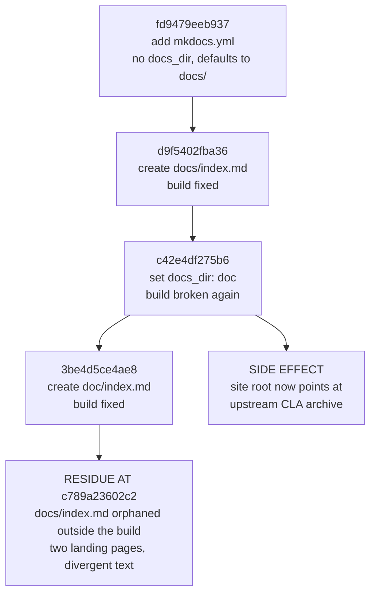

# Change Archaeology & Segmented PR Review

> ⚠️ **Provenance**: this record covers the **agent-authored change set on branch `19.0`** of `Blitzy-Sandbox/blitzy-odoo`, reconstructed by commit authorship rather than by filename. The reconstructed range is the fixed interval `7bd7718bcd4c..c789a23602c24606458ee86783a318f7224d1dd8` — **13 commits, 6 files, 2,025 insertions, 0 deletions**. Both endpoints are named explicitly rather than left as `HEAD`, because the remediation commits that follow `c789a23602c2` change every figure below: this is an archaeology record of a fixed historical range, not a census of the branch as it now stands.
>
> ⚠️ **This document is the assessment half of "assess and remediate".** It records what was found and what each repair must achieve. It is not itself a specification of working software, and it makes no claim about accounting capability on this branch — see [the landing page](index.md) for what branch `19.0` actually contains.

## 1. Scope and Method

### 1.1 How the boundary was derived

No commit range and no file list were supplied, so scope was derived from authorship. Filtering `git log` by author isolates a contiguous block of Blitzy-authored commits at the tip of branch `19.0`, bounded below by the last upstream commit.

| Boundary | Commit | Author | Date | Subject |
|----------|--------|--------|------|---------|
| Last upstream commit (exclusive lower bound) | `7bd7718bcd4c5d232779e8eab0340169461af14e` | Gauthier Wala (gawa) &lt;gawa@odoo.com&gt; | 2025-11-18 | `[FIX] account: fix cash basis tax calculation for full payments` |
| Last commit of the reconstructed set (inclusive upper bound) | `c789a23602c24606458ee86783a318f7224d1dd8` | ajay-blitzy &lt;awadhwani@blitzy.com&gt; | 2026-05-15 | `chore: extend catalog tags (security, audit)` |

At `c789a23602c2` the repository carries **197,413 commits** (`git rev-list --count c789a23602c2`) and **45,666 tracked files** (`git ls-tree -r --name-only c789a23602c2 | wc -l`). Thirteen commits is therefore the entire authored surface — a **0.0066 %** share of the history, computed from those two counts. Authorship-based discovery was essential: a path-based guess would have missed `catalog-info.yaml` and `mkdocs.yml` at the repository root while wrongly capturing upstream files under `doc/`.

Discovery was completed in full — the commit inventory, the per-commit replay, and the non-regression proof — **before** any finding was raised. That ordering was imposed by the request itself, which conditioned the review on *"once all changes are identified"*.

Every figure in this record is a measurement taken from an executed command or an executed documentation build, never an estimate. Where a measurement depends on the state of the tree, the commit it was taken at is named.

### 1.2 Segmentation

The change set is partitioned along the axis of **artifact family and consuming contract**, so that each segment is judged against exactly one authoritative specification, with a final segment for the seams between them.

| Segment | Artifacts | Authoritative contract |
|---------|-----------|------------------------|
| **SEG-1** Service-catalog metadata | `catalog-info.yaml` | Backstage Component descriptor schema, well-known field vocabularies, entity relations |
| **SEG-2** Docs toolchain configuration | `mkdocs.yml` | MkDocs configuration schema, Backstage TechDocs publishing requirements, plugin availability |
| **SEG-3** Documentation entry points | `doc/index.md`, `docs/index.md` | Navigation reachability; a single canonical landing page |
| **SEG-4** Generated documentation content | `doc/project-guide.md`, `doc/technical-specifications.md` | Factual accuracy against the repository; internal consistency |
| **SEG-5** Cross-segment integration | The seams between the above | Agreement between the TechDocs reference, the documentation root, navigation targets, on-disk files, and outbound catalog links |
| **SEG-6** Blast radius and hygiene | Packaging, lint reach, CI absence, build output | Positive proof of upstream non-regression |

### 1.3 Defect taxonomy and severity scale

Each segment is evaluated against a uniform eight-class taxonomy so that the review's completeness is independently checkable.

| Class | Meaning |
|-------|---------|
| **D1** | Contract violation — the artifact breaks its consuming tool's documented schema or semantics |
| **D2** | Broken reference — a path, URL, navigation target, or anchor does not resolve |
| **D3** | Factual inaccuracy — a statement is contradicted by the repository itself |
| **D4** | Internal inconsistency — two in-scope artifacts assert conflicting facts |
| **D5** | Dead or orphaned artifact — present in the tree but unreachable by any consumer |
| **D6** | Missing required or strongly recommended element — its omission degrades the consuming tool's output |
| **D7** | Unsubstantiated claim — a capability or attribute asserted with no supporting evidence |
| **D8** | Hygiene or convention deviation |

| Severity | Meaning |
|----------|---------|
| **Blocker** | The consuming tool fails, or produces a wrong or unresolvable result |
| **Major** | User-visible incorrectness, or a broken link |
| **Minor** | A missing recommended element, or an inconsistency between artifacts |
| **Nit** | Style and wording alone |

Every segment was worked through the same six steps: state the authoritative contract and its source; mechanically validate whatever is machine-checkable; walk every diff line against the taxonomy; assign severity; specify the remediation as a concrete minimal edit; and define the acceptance check that proves the defect is gone.

### 1.4 Methodological disclosure — the named rule definition does not exist

> ⚠️ **The review was requested "using the Segmented PR Review rule definition". No such rule definition exists in this project, and none was retrievable.** The project's rules document was read twice — once with the default window and once over its explicit full range — and returned no rules on both reads. It is empty; this was not a partial read. No segmentation axes, no defect taxonomy, and no severity scale were supplied by it.

The named artifact was therefore treated as a **named methodology** rather than as retrievable text, and the canonical interpretation was instantiated in its place and written out in full in subsections 1.2 and 1.3, so that a reader can check this review against the standard it claims to follow. **What appears in those subsections is that instantiation, not the requester's rule.** No rule was invented, and nothing here is presented as though it had been supplied.

**Why this resolution rather than the alternatives.** Three considerations settled it.

- **Fabricating a definition and attributing it to the requester was rejected outright.** Inventing a rule and presenting it as the project's own would be a worse failure than the missing text, and the absence of rules is explicitly not treated as permission to lower the bar.
- **Abandoning the segmentation was also rejected**, because it would ignore an explicit instruction and discard the rigor the request asked for. A segmented review is fully determined once the segmentation axes and the per-segment defect taxonomy are fixed, and both are fixed in writing here.
- **The substitution is low-risk in this particular case, because the findings are properties of the artifacts themselves rather than of the grouping applied to them.** A link that returns 404 returns 404 regardless of which segment it is filed under. Supplying a different segmentation would reorganise and re-rank this report without changing a single one of its conclusions.

If a canonical Segmented PR Review definition exists outside this project, supplying it would allow these same findings to be re-grouped under that scheme. No finding would be lost in the process.

### 1.5 Standards applied in place of rules

Because no rules were supplied, the review was held to enterprise-standard best practice reinforced by the conventions this repository documents for itself. These standards are named here so that the record can be audited against them, and each is tied to the evidence that establishes it.

| Standard | Basis | Consequence for this review |
|----------|-------|-----------------------------|
| **ST-1** Stable-series change discipline | [CONTRIBUTING.md:L14] — *"There are restrictions on the kind of changes allowed in stable series"* | Every remediation is the minimal edit that closes its finding. No behavioural change, and no scope expansion beyond the findings recorded here |
| **ST-2** Generated-file immutability | [ruff.toml:L1-L2] declares itself generated by the runbot nightly checks and marked do-not-modify | `ruff.toml` is excluded from remediation, and the principle generalises to any file bearing such a marker |
| **ST-3** External-contract conformance over syntactic validity | Both changed configuration files parse cleanly under a plain YAML safe-loader | Parse success establishes nothing. Each artifact is validated against its consuming tool's published contract and then verified **by running that tool** — which is the only reason the two blockers were found |
| **ST-4** Forward-fixing only | The thirteen commits are merged and published on a stable series | All repair is additive follow-up edits. No rebase, no amend, no revert-by-rewrite, no force-push. Commit messages are immutable history |
| **ST-5** Evidence and citation obligation | — | Every claim about the existing system carries an inline path-and-locator citation, and every quantitative claim is a measurement from an executed command or build |
| **ST-6** Repository convention adherence | Sibling documentation filenames are kebab-case; [.gitignore:L45-L53] root-anchors build and environment output | New filenames follow the kebab-case pattern; every file the remediation touches ends with a newline |
| **ST-7** Dependency ordering, never calendar time | Platform-authored planning content describes how work is sequenced, not when it happens | This record states dependency ordering only. Commit dates appear because they are historical fact. It is also why finding S4-05 is a defect and not a stylistic preference |
| **ST-8** Advisory-only linting | The repository ships no `.markdownlint*`, `.editorconfig`, `.pre-commit-config.yaml`, `.yamllint*`, `pyproject.toml`, `tox.ini`, `Makefile`, or `package.json` | YAML and Markdown linter output is reported as advisory. No linter configuration is introduced |

---

## 2. Change Inventory

### 2.1 The six files

Every entry is an addition. There are no deletions and no modifications to any pre-existing file anywhere in the range.

| File | Status | Insertions | Deletions | Artifact family |
|------|--------|-----------:|----------:|-----------------|
| `catalog-info.yaml` | Added | 32 | 0 | Service-catalog metadata |
| `mkdocs.yml` | Added | 9 | 0 | Docs toolchain configuration |
| `doc/index.md` | Added | 5 | 0 | Documentation entry point |
| `docs/index.md` | Added | 3 | 0 | Documentation entry point |
| `doc/project-guide.md` | Added | 502 | 0 | Generated documentation content |
| `doc/technical-specifications.md` | Added | 1,474 | 0 | Generated documentation content |
| **Total** | **6 files, all adds** | **2,025** | **0** | **4 families** |

### 2.2 The thirteen commits

Twelve are authored by Michael Montanaro &lt;michael@blitzy.com&gt; on 2026-04-06; the thirteenth by ajay-blitzy &lt;awadhwani@blitzy.com&gt; on 2026-05-15.

| # | Commit | Subject | Effect |
|---|--------|---------|--------|
| 1 | `3322c9fb56fc` | Add Backstage catalog-info.yaml for developer portal integration | Adds the descriptor with tags `python`/`web-app`/`in-progress`, an `in-progress` status label, no TechDocs annotation, and system `blitzy-sandbox-projects` |
| 2 | `89bf914d81fe` | chore: update catalog tags — remove status, add work type | Removes both the `in-progress` tag and the status label; adds tag `refactor`. Net effect: the only in-progress signal is deleted while the declared lifecycle stays `production` |
| 3 | `4519ac913f3c` | chore: add techdocs-ref annotation for TechDocs support | Adds `backstage.io/techdocs-ref: dir:.`; also strips the trailing newline |
| 4 | `fd9479eeb937` | chore: add mkdocs.yml for TechDocs | Adds the site config with no `docs_dir`, so MkDocs defaults to `docs/` — which did not yet exist. **The build is broken at this commit.** |
| 5 | `d9f5402fba36` | chore: add docs/index.md for TechDocs | Creates `docs/index.md`. The build is fixed |
| 6 | `c42e4df275b6` | chore: set docs_dir to doc/ for TechDocs compatibility | Repoints the documentation root to `doc/`. **Breaks the build again** and strands `docs/index.md`; also strips the trailing newline |
| 7 | `f3679676519f` | chore: assign component to blitzy-python system for catalog graph | Changes `spec.system` to `blitzy-python` |
| 8 | `3be4d5ce4ae8` | docs: add index.md for TechDocs | Creates `doc/index.md` with text differing from `docs/index.md`. The build is fixed and `docs/index.md` is now permanently orphaned |
| 9 | `4e0e6df0811f` | docs: add mermaid2 plugin for diagram support | Adds the `mermaid2` plugin but no fence configuration, so the stated purpose is not achieved |
| 10 | `ce5781adcadf` | docs: add Project Guide from Blitzy | Adds the 502-line project guide |
| 11 | `e684fbe46c33` | docs: add Technical Specifications from Blitzy | Adds the 1,474-line specification |
| 12 | `b58d620c4fb2` | docs: add Blitzy documentation to nav | Adds two navigation entries; leaves the file without a trailing newline |
| 13 | `c789a23602c2` | chore: extend catalog tags (security, audit) | Adds two tags, but the diff is sixteen insertions against thirteen deletions because the whole file was round-tripped through a YAML serialiser — the description was folded, sequence indentation changed from four spaces to two, quoting style changed, and the trailing newline was restored |

Reviewing the net diff alone would have concealed commits 4 through 8 entirely, because their effects cancel in the aggregate while leaving permanent residue. Each commit was therefore replayed individually.

---

## 3. Chronological Narrative

### 3.1 The documentation-root flip-flop

Commits 4 through 8 form a flip-flop whose net result is two landing pages with different text, only one of which is reachable.

| Step | Commit | Configured root | On-disk index | Build state |
|------|--------|-----------------|---------------|-------------|
| 1 | `fd9479eeb937` | `docs/` (MkDocs default; `docs_dir` absent) | none | **Broken** — no documentation directory exists |
| 2 | `d9f5402fba36` | `docs/` | `docs/index.md` | Fixed |
| 3 | `c42e4df275b6` | `doc/` (explicit `docs_dir: doc`) | `docs/index.md` only | **Broken again** — and `docs/index.md` is now stranded |
| 4 | `3be4d5ce4ae8` | `doc/` | `doc/index.md` **and** `docs/index.md` | Fixed, with permanent residue |



Two consequences outlived the sequence. First, `docs/index.md` was left orphaned outside the build — present in the tree, reachable by no consumer, and carrying text that diverged from the page that replaced it. Second, and far more consequential, the configured site root was pointed at `doc/`, a directory that at the boundary commit contained **nothing but Odoo's contributor-agreement archive**.

### 3.2 Why pointing the root at `doc/` was a capture, not a preference

Ownership of the two similarly named directories was established with hard counts rather than by inspection.

- Pre-boundary history contains **3,623** commits touching `doc/` (`git rev-list --count 7bd7718bcd4c -- doc/`), reaching back to a 2006 trunk import. At the boundary commit that directory contained **only** the `cla` subtree — `git ls-tree --name-only 7bd7718bcd4c doc/` returns the single entry `doc/cla`.
- Pre-boundary history contains **zero** commits touching `docs/` (`git rev-list --count 7bd7718bcd4c -- docs/`), confirming it as greenfield created by this change set.
- Upstream was still adding to `doc/` after the boundary, so every future contributor-agreement signature would silently join the published developer portal.
- Historical Sphinx tooling under `doc/` is still referenced by the `_build/` ignore rule at [.gitignore:L1-L2] and by extension copyright attributions at [debian/copyright:L216].

At the boundary the `doc/` tree held **997** tracked files, of which **996** are Markdown. The `doc/cla/` subtree accounts for **994** of them — **993** Markdown files, being **715** individual agreements, **275** corporate agreements and exactly **3** policy documents (`doc/cla/ccla-1.0.md`, `doc/cla/icla-1.0.md`, `doc/cla/sign-cla.md`), plus one Python helper at [doc/cla/stats.py]. The remaining three files were the Blitzy documents. **993 of the 996 Markdown files under the configured site root were therefore contributor agreements**, which is the arithmetic behind the capture recorded as S2-01.

### 3.3 The status-signal deletion

Commit 1 declared the component with an `in-progress` tag **and** an `in-progress` status label, alongside `spec.lifecycle: production`. Commit 2 removed both in-progress signals and left the `production` lifecycle in place at [catalog-info.yaml:L30].

The descriptor thereafter asserted an established, maintained component while the repository's own project guide reported the work as substantially incomplete: [doc/project-guide.md:L5] states *"Project Completion: 17% (110 hours completed out of 640 total hours)"*. A descriptor claiming `production` against a self-reported **17%** completion is an internal contradiction, and it was created by a commit whose subject describes it as a tag tidy-up.

Framed as the repository's own pull-request template frames a change — **current behaviour**: the catalog advertises a production-ready component with no in-progress signal of any kind; **desired behaviour**: the declared lifecycle matches the repository's stated completion status, and the in-progress signal that commit 1 supplied is restored.

### 3.4 The newline regressions and their accidental repair

Trailing newlines were stripped twice, by commits 3 and 6, and `mkdocs.yml` was left without one by commit 12. The descriptor's newline was restored by commit 13 — not deliberately, but as a side effect of round-tripping the whole file through a YAML serialiser. That round trip is also why commit 13 reports sixteen insertions against thirteen deletions for what its subject describes as adding two tags: it reformatted the description folding, the sequence indentation, and the quoting style at the same time.

### 3.5 The scoping error behind the factual inaccuracies

The project guide asserts delivery statistics at [doc/project-guide.md:L378-L388] — 47 commits, 81 files created, 27,707 lines added, a 43-file documentation set, and a 36-file financial-reports module — that bear no relation to a branch containing 13 commits and 6 files. Querying the repository's published metadata resolved the discrepancy rather than leaving it as apparent fabrication: the pull request the documents describe, PR #2 as linked at [catalog-info.yaml:L22-L23], was merged into a branch named **`pdlc`**, not `19.0`, and carries **81 changed files and 27,905 additions**. The `tickets/` tree and the `addons/account_financial_report_ce/` module both exist there and are absent here, as are `account_reports`, `account_accountant`, `account_asset`, `account_budget`, and `account_followup`.

The two generated documents are therefore substantially **accurate about `pdlc` and wrong about the branch they are published on**. That single insight converts a cluster of apparently invented claims into one fixable scoping error, and it is why the remediation re-attributes the statistics rather than deleting them.

---

## 4. Non-Regression Proof

Because the checkout carries tens of thousands of tracked files, the absence of source-code change was **proven, not assumed**. Every check below is re-runnable.

Commands are written against the pinned upper bound `c789a23602c2` rather than `HEAD`, so that they keep returning these results after the remediation commits land. They are reproduced verbatim and are copy-runnable from the repository root:

The first two commands are the decisive ones: they establish that no source file and no upstream path was touched. The third and fourth report the composition of the change set and the state of the tree, and the fifth counts the contributor-agreement archive that the capture was publishing.

```bash
git diff --name-only 7bd7718bcd4c..c789a23602c2 | grep -Ec '\.(py|js|xml|csv|scss|po|pot)$'
git diff --name-only 7bd7718bcd4c..c789a23602c2 | grep -Ec '^(addons/|odoo/|setup/|debian/|\.github/)'
git diff --stat 7bd7718bcd4c..c789a23602c2
git status --porcelain
git ls-tree -r --name-only c789a23602c2 -- doc/cla/ | wc -l
```

| Check | Result |
|-------|--------|
| Source-extension files in the agent-authored range | **0** |
| Upstream-path files in the same range | **0** |
| Change composition | 6 files, **2,025 insertions, 0 deletions** — every entry an addition, no modification to any pre-existing file |
| Working tree state | empty; clean |
| Contributor-agreement archive | **994** files, none modified |
| Repository-wide sweep for the marker string `blitzy` | matches only the in-scope files |
| Sweep for `techdocs` / `catalog-info` | the two configuration files, plus **one** upstream false positive — see below |

> ⚠️ **The one false positive a naive keyword sweep produces.** [addons/base_vat/models/res_partner.py:L569] contains a `techdocs.broadcom.com` URL inside a **pre-existing upstream comment**, entirely unrelated to Backstage TechDocs. It is recorded explicitly so that a future reviewer re-running the sweep is not misled into treating an untouched upstream file as part of this change set.

The upstream surface is provably untouched, measured at `c789a23602c2`: **43,419** tracked files under `addons/`, **1,195** under `odoo/`, **605** addon modules, and **8,183** Python, **5,698** JavaScript and **5,310** XML files across the tree. Of **197,413** commits, exactly **13** are agent-authored. **Odoo runtime behaviour is therefore unaffected.** No in-scope file enters the source distribution or the Debian package — [MANIFEST.in] ships only `requirements.txt`, `LICENSE` and `README.md` plus a graft of `odoo`, [setup.py:L24-L26] uses namespace-package discovery, [debian/odoo.docs] lists `README.md`, and [debian/install:L2] installs `README.md` only.

Lint reach over this change set is nil: the flake8 configuration at [setup.cfg:L5-L10] excludes `doc` and `setup`, no Python was added, [ruff.toml:L1-L2] declares itself generated and not to be modified, and the repository ships no Markdown or YAML linter configuration. No continuous-integration workflow exists — `.github/` holds only `ISSUE_TEMPLATE/1_bug_form.yml`, `ISSUE_TEMPLATE/config.yml` and `PULL_REQUEST_TEMPLATE.md` — which is the direct reason none of the defects below was caught before merge.

**Re-asserted after remediation.** The same two zero-counts were re-run against the current branch tip once the remediation had landed, substituting `HEAD` for the pinned upper bound, and both still return **0**. The repository remains byte-identical outside the in-scope paths.

---

## 5. Findings

Twenty-nine findings were raised: **5 Blocker, 7 Major, 12 Minor, 5 Nit**. None is in Odoo runtime code. SEG-6 contributes five verification entries that carry no severity, because they record checks that produced no defect.

| Segment | Blocker | Major | Minor | Nit | Total | Headline finding |
|---------|--------:|------:|------:|----:|------:|------------------|
| SEG-1 catalog metadata | 0 | 2 | 3 | 2 | 7 | A documentation link returning 404, and a `production` lifecycle contradicted by the repository's own completion status |
| SEG-2 toolchain configuration | 2 | 1 | 2 | 1 | 6 | The site root captures 993 upstream legal documents, and diagram support does not function |
| SEG-3 entry points | 0 | 2 | 1 | 0 | 3 | An orphaned landing page and a divergent duplicate |
| SEG-4 generated content | 3 | 2 | 4 | 1 | 10 | Delivery statistics and file inventories describing a different branch |
| SEG-5 integration | 0 | 0 | 2 | 1 | 3 | Four competing descriptions of the same repository |
| SEG-6 blast radius | 0 | 0 | 0 | 0 | 0 | Clean — non-regression proven; packaging and lint reach unaffected |
| **Total** | **5** | **7** | **12** | **5** | **29** | — |

**How the count reconciles.** The twenty-nine findings are the severity-bearing entries `S1-01`…`S1-07`, `S2-01`…`S2-06`, `S3-01`…`S3-03`, `S4-01`…`S4-10` and `S5-01`…`S5-03` — 7 + 6 + 3 + 10 + 3 = **29**. Every per-segment count above is derived from the per-finding severities in the tables that follow, so the aggregate and the individual entries agree by construction. SEG-6 contributes **five further verification entries**, `S6-01`…`S6-05`, which are enumerated individually in subsection 5.6; they carry **no severity because every one of them passed**, which is why the segment scores zero in all four columns and adds nothing to the finding total.

### 5.1 SEG-1 — Service-catalog metadata

| ID | Sev. | Class | Finding | Remediation | Acceptance check |
|----|------|-------|---------|-------------|------------------|
| S1-01 | Major | D2 | [catalog-info.yaml:L25] targets a `blitzy/documentation` tree path that exists neither locally nor on the published branch; an HTTP request returns **404** while the repository root [catalog-info.yaml:L20] and the pull request [catalog-info.yaml:L22] both return **200**. `ls -d blitzy` reports no such directory. The repository is public, so this is a genuine missing path, not an access restriction | Repoint the link at the real documentation root | Every outbound link in the descriptor returns HTTP 200 |
| S1-02 | Major | D7/D1 | `lifecycle: production` at [catalog-info.yaml:L30] asserts an established, maintained component. The documented well-known vocabulary defines `production` as established and maintained and `experimental` as early, non-production, with low or no reliability guarantees. The repository's own guide states **17% completion (110 of 640 hours)** at [doc/project-guide.md:L5], and the in-progress signal commit 1 supplied was deleted by commit 2 | Set lifecycle to the well-known value `experimental`; restore the in-progress status label | Lifecycle is a documented well-known value and agrees with the stated project status |
| S1-03 | Minor | D1 | `type: website` at [catalog-info.yaml:L29] misclassifies a deployable application server. The documented well-known vocabulary is `service`, `website`, `library` | Change to `service` | Type is a documented well-known value. **Flagged for owner confirmation** — a taxonomy judgement, reversible in one line |
| S1-04 | Minor | D7 | The tag sequence at [catalog-info.yaml:L7-L12] is `audit`, `python`, `refactor`, `security`, `web-app`. Tags are documented as component *classification* with no special semantics, constrained to lowercase alphanumerics and a small punctuation set separated by hyphens — yet `refactor` encodes a work type and `security`/`audit` assert attributes no evidence in the repository supports | Retain genuine classification tags; move the work-type claim to a label alongside [catalog-info.yaml:L13-L14]; drop the unevidenced attribute tags | Every remaining tag is a classification term and satisfies the documented tag format. **Flagged for owner confirmation** — dropping `security` and `audit` may remove signal the owner intended |
| S1-05 | Minor | D1 | `owner: blitzy-sandbox` and `system: blitzy-python` at [catalog-info.yaml:L31-L32] generate ownership and parent relations that resolve against portal entities this repository cannot create; registering as-is risks dangling relations | **No file change is possible** — nothing in this repository can define a portal entity | Recorded as a portal-side prerequisite in section 7 |
| S1-06 | Nit | D8 | Link icons are internally inconsistent: the links at [catalog-info.yaml:L22-L24] and [catalog-info.yaml:L25-L27] each carry an `icon`, while the first link at [catalog-info.yaml:L19-L21] does not. The documented guidance is that links carry a required URL plus optional title, icon and type, and should be used only where an equivalent well-known annotation does not already cover the case | Add the missing icon | All links carry an icon |
| S1-07 | Nit | D8 | Advisory YAML style: no `---` document-start marker, and several over-length lines | None mandated | **Advisory only** under ST-8 — the repository ships no YAML linter configuration, so nothing enforces this |

### 5.2 SEG-2 — Docs toolchain configuration

| ID | Sev. | Class | Finding | Remediation | Acceptance check |
|----|------|-------|---------|-------------|------------------|
| S2-01 | **Blocker** | D1 | `docs_dir: doc` at [mkdocs.yml:L1] points the site root at a directory that, when the setting was introduced, held only the contributor-agreement archive. **Measured by executing the build**: 997 HTML files — **996 content pages** plus one theme-generated `404.html` — totalling **17 MB** in **8.62 s**, of which **993** are contributor-agreement documents listed as absent from the navigation configuration, plus **3** unresolved-link notices all originating in `doc/cla/sign-cla.md`. **993 of 996 content pages, or 99.7% of the published developer portal, is unrelated legal paperwork.** Critically, `mkdocs build --strict` **exits 0** here, because omitted-navigation files are reported at *informational* level and the run emits zero `WARNING` lines — which is exactly why the capture went unnoticed | Repoint the documentation root to the Blitzy-owned `docs/` folder and relocate the three Markdown documents into it | Strict build exits 0 **and** publishes exactly the intended page count **and** reports zero omitted-navigation notices |
| S2-02 | **Blocker** | D1 | The `mermaid2` plugin at [mkdocs.yml:L9] is declared but provably inert. **Root cause, established by reading the installed package sources**: the `techdocs-core` bundle appends an extension pack that already claims the `mermaid` fence and renders it as highlighted plain text, and it relocates the fence configuration to a different key than `mermaid2` inspects, so that plugin's custom loader never activates and its post-page hook never fires. All **7** fences — [doc/project-guide.md:L58] and [doc/project-guide.md:L64], plus [doc/technical-specifications.md:L291], [doc/technical-specifications.md:L491], [doc/technical-specifications.md:L506], [doc/technical-specifications.md:L524] and [doc/technical-specifications.md:L539] — render as `language-text` highlight tables with line numbers, emitting **zero** diagram markup and no diagram runtime. **Plugin ordering is irrelevant**: both orderings were tested and produce identical output, and the same plugin works correctly when the TechDocs bundle is absent. The bundle's own diagram support covers **Graphviz and PlantUML only**; Mermaid is not part of it at any version | Remove the inert plugin declaration and declare a `pymdownx.superfences` custom fence mapping the `mermaid` fence name to a passthrough code format | Exact count of correctly emitted diagram blocks rises to **2** and **5** respectively, accounting for all seven fences |
| S2-03 | Major | D6 | No `site_description`, so the site metadata the publisher writes for the portal contains the literal string `"None"` where the component's documentation description belongs | Supply the site description | Published metadata carries real text, not `"None"` |
| S2-04 | Minor | D6 | No `repo_url` and no `edit_uri`, so the theme's per-page edit action is enabled but dead. Severity is **Minor rather than Major because the publisher auto-populates both when absent**, warning that they may be set manually to control the behaviour | Add both, with the edit reference matching the final documentation root | Per-page edit action resolves; the publisher's derivation warning is gone |
| S2-05 | Nit | D8 | File left without a trailing newline by commit 12, and still without one at the upper bound — the only one of the two newline regressions never repaired | Restore it | File ends with a newline |
| S2-06 | Minor | D6 | Introducing MkDocs without ignoring its default output directory leaves that directory reported as untracked; the existing ignore rules at [.gitignore:L1-L2] cover only the superseded Sphinx `_build/` path. **Zero tracked paths** match a `site` directory anywhere in the tree, so a root-anchored entry cannot mask tracked content | Add a root-anchored ignore entry, matching the file's own convention for build and environment output at [.gitignore:L45-L53] | `git status` is clean after a documentation build |

### 5.3 SEG-3 — Documentation entry points

| ID | Sev. | Class | Finding | Remediation | Acceptance check |
|----|------|-------|---------|-------------|------------------|
| S3-01 | Major | D5 | `docs/index.md` is orphaned by the four-commit chain in subsection 3.1 — present in the tree, outside the configured root, reachable by no consumer, and excluded from the published site entirely | Promote it to the canonical landing page **rather than delete it** | The page is reachable and is the site's entry point |
| S3-02 | Major | D4 | Two landing pages assert different descriptions of the same repository: [docs/index.md:L3] carries the accounting-parity and IBM Carbon tagline, while [doc/index.md:L3-L5] instead says the repository is a Blitzy fork of Odoo and is the documentation home | Reconcile into one page and delete the duplicate | Exactly one index page exists under the documentation root |
| S3-03 | Minor | D8 | The layout deviates from the vendor's documented canonical arrangement, which places the index page in a root-level `docs` folder beside the descriptor and site configuration | Converge on the documented layout | Layout matches the vendor default, so future tooling changes need no repository-specific compensation |

### 5.4 SEG-4 — Generated documentation content

| ID | Sev. | Class | Finding | Remediation | Acceptance check |
|----|------|-------|---------|-------------|------------------|
| S4-01 | **Blocker** | D3 | The delivery statistics at [doc/project-guide.md:L378-L388] — 47 commits, 81 files created, 27,707 lines added, 43 documentation files, 36 module source files — describe a different branch entirely. This branch carries 13 commits and 6 files | Re-attribute the table to the pull request and branch it describes; correct the line-count figure against the authoritative record of **27,905** additions; add a row stating what this branch actually contains | Every statistic names the branch it applies to |
| S4-02 | **Blocker** | D3 | The completion claim at [doc/project-guide.md:L7] and [doc/project-guide.md:L10] asserts a 100%-complete 43-file documentation set, and the tree at [doc/project-guide.md:L393-L419] describes a `tickets/` documentation set **absent from this branch** | Re-scope both to the branch that contains them | Each claim is scoped; absence on this branch is stated plainly |
| S4-03 | **Blocker** | D3 | The module inventory at [doc/project-guide.md:L11-L12] and [doc/project-guide.md:L421-L460] gives a 36-file inventory and validation verdicts for `addons/account_financial_report_ce/`, an addon **absent from this branch** | Re-scope the inventory and the validation claims | Scoped, with absence stated |
| S4-04 | Major | D3 | The concluding assessment at [doc/project-guide.md:L490-L502] draws a delivery-and-hand-off conclusion the branch cannot support — including a "zero blocking issues, all code compiles" verdict over module source that does not exist here | Withdraw or qualify it | No unsupported conclusion remains |
| S4-05 | Minor | D8 | [doc/project-guide.md:L465-L487] schedules work in calendar bands — *"Immediate Actions (Week 1)"* at [doc/project-guide.md:L466] and *"Short-term Actions (Weeks 2-8)"* at [doc/project-guide.md:L471]. **This is a defect under ST-7, not a stylistic preference**: platform-authored planning content states dependency ordering and never calendar time, so calendar bands in such content are a contract breach regardless of taste | Replace the calendar bands with dependency-ordered phases | No calendar scheduling remains |
| S4-06 | Minor | D3 | [doc/technical-specifications.md:L1473] cites *"`odoo/release.py` line 10"* as the source of `version_info = (19, 0, 0, FINAL, 0, '')`. **Verified directly**: that declaration is at [odoo/release.py:L15]; line 10 is a comment | Correct the cited line number | The citation resolves to the claimed content |
| S4-07 | Minor | D8 | Two top-level headings — `# Technical Specification` at [doc/technical-specifications.md:L1] and `# 0. Agent Action Plan` at [doc/technical-specifications.md:L3] — produce an ambiguous page title | Delete the redundant heading. **Demoting the second was explicitly rejected**: it would cascade a re-levelling of the entire numbered hierarchy across 1,474 lines, disproportionate on a stable branch under ST-1 | Exactly one top-level heading |
| S4-08 | Minor | D4 | The constraints row at [doc/technical-specifications.md:L1452] states `Odoo 18.0` without qualification, while four other places in the same document already disclose the discrepancy — L41, L786, L1024, and §0.11.7 at L1471-L1474 | Qualify it consistently with those four. [doc/technical-specifications.md:L1227] is a verbatim quote of the user requirement and is deliberately left alone | The constraint agrees with its siblings |
| S4-09 | Major | D3 | A planning artifact is published under the label "Technical Specifications", so a portal visitor reads it as a description of what exists rather than as an unexecuted plan. The preamble at [doc/technical-specifications.md:L3-L45] carries no status qualification | Add a provenance and status banner to **both** relocated documents | A banner names the source branch and pull request and identifies absent artifacts |
| S4-10 | Nit | D8 | [doc/project-guide.md] is not terminated with a newline — its 502 inserted lines report as 501 under `wc -l` for exactly that reason | Terminate it | File ends with a newline |

### 5.5 SEG-5 — Cross-segment integration

| ID | Sev. | Class | Finding | Remediation | Acceptance check |
|----|------|-------|---------|-------------|------------------|
| S5-01 | Minor | D4 | The documentation root at [mkdocs.yml:L1], the outbound catalog documentation link at [catalog-info.yaml:L25], and the absent edit reference form a **lockstep triangle**; fixing any one alone reintroduces a broken reference | Change all three as one atomic unit | All three agree, and the portal never observes an intermediate state with a broken link |
| S5-02 | Minor | D4 | **Four** different descriptions of the same repository are in circulation: [docs/index.md:L3], [doc/index.md:L3-L5], the published repository description, and [catalog-info.yaml:L5-L6]. No single source of truth exists | Establish the descriptor description as the single source of truth and derive the landing page text and site description from it | One authoritative description; the other two are derived |
| S5-03 | Nit | D7 | The "IBM Carbon Design System" claim at [catalog-info.yaml:L5-L6] and [docs/index.md:L3] asserts a capability with no supporting code. The string appears **only** inside the change-set content under review; a repository-wide search finds no code reference anywhere | Reword as planned direction | The claim reads as direction, not delivered capability |

### 5.6 SEG-6 — Blast radius and hygiene

Five verification checks were run to bound the blast radius. **Every one passed**, so none is a finding; they are recorded individually as positive evidence, because "we found nothing" is only credible if the checks are named.

| ID | Check | Evidence | Verdict |
|----|-------|----------|---------|
| S6-01 | No second service-catalog descriptor or site configuration exists anywhere in the tracked tree that could conflict with the two under review | A repository-wide file listing filtered for `mkdocs`, `catalog-info` and `.backstage` returns only [catalog-info.yaml] and [mkdocs.yml] | ✅ Clean |
| S6-02 | Packaging is unaffected — no in-scope file reaches the source distribution or the Debian package | [MANIFEST.in] includes only `requirements.txt`, `LICENSE` and `README.md` plus a graft of `odoo`; [setup.py:L24-L26] uses namespace-package discovery with package data; [debian/odoo.docs] lists `README.md`; [debian/install:L2] installs `README.md` only | ✅ Clean |
| S6-03 | Lint reach over the change set is nil, so no lint gate was bypassed | [setup.cfg:L5-L10] excludes `doc` and `setup` from flake8, and no Python was added by the change set. [ruff.toml:L1-L2] is generated and do-not-modify | ✅ Clean |
| S6-04 | No continuous-integration workflow exists to update or to have been broken | `.github/` contains only `ISSUE_TEMPLATE/1_bug_form.yml`, `ISSUE_TEMPLATE/config.yml` and `PULL_REQUEST_TEMPLATE.md`. **No workflow file exists** | ✅ Clean — and see section 7, since this is also the reason the defects went undetected |
| S6-05 | Link and reference integrity across the change set, so the relocation could not break an inbound reference | The Markdown link count is **zero** across all four in-scope Markdown files, and a repository-wide search for the two relocated filenames returns only the navigation entries at [mkdocs.yml:L5-L6] | ✅ Clean |

Their underlying measurements are the ones tabulated in section 4.

### 5.7 Findings deliberately not remediated

- **Commit messages.** The thirteen subjects use conventional-commit prefixes where upstream follows a bracketed-tag convention. Commit messages are immutable published history; the deviation is recorded, not rewritten.
- **`ruff.toml`.** Declares itself generated by nightly checks and marked do-not-modify. Excluded, and the principle generalised to any file bearing such a marker.
- **Advisory style output.** YAML and Markdown linter findings are reported for in-scope files only. No repository-wide style pass is performed and no linter configuration is introduced, because the repository deliberately ships none.
- **The `pdlc` branch.** Referenced as the factual source that explains the content errors. Nothing on it is imported, ported, or modified; the remediation corrects the *claims*, it does not build the capability.

---

## 6. Remediation Summary

Repair is **forward-fixing only**. The reconstructed commits are merged and published on a stable series, so there is no rebase, no amend, no revert-by-rewrite, and no force-push anywhere in the remediation. Every fix is an additive follow-up edit, and every fix is the minimal edit that closes its finding — stable-series discipline, as [CONTRIBUTING.md:L14] requires.

Ten transformations close the change set. Every finding maps to one of them, or to an explicit no-change disposition.

| Target | Action | Findings closed |
|--------|--------|-----------------|
| `docs/project-guide.md` | Relocated from `doc/` and factually corrected | S4-01 … S4-05, S4-09, S4-10, S3-03 |
| `docs/technical-specifications.md` | Relocated from `doc/` and factually corrected | S4-06 … S4-09, S3-03 |
| `docs/index.md` | Promoted to the single canonical landing page | S3-01, S3-02, S5-02, S5-03 |
| `docs/change-archaeology-and-review.md` | Created — this document | The assessment deliverable itself; the record for S1-05, S1-07 and S6-01 … S6-05 |
| `mkdocs.yml` | Documentation root, site metadata, diagram fence, navigation | S2-01 … S2-05, S5-01 |
| `catalog-info.yaml` | Link, lifecycle, type, tags, labels, description, icon | S1-01 … S1-04, S1-06, S5-01 … S5-03 |
| `.gitignore` | Root-anchored output-directory entry | S2-06 |
| `doc/index.md`, `doc/project-guide.md`, `doc/technical-specifications.md` | Deleted — relocation completed | S2-01, S3-02, S3-03 |

Three findings are closed by **no file change at all**, and each is recorded here rather than silently dropped: **S1-05** cannot be discharged inside the repository at all and becomes a portal-side prerequisite in section 7; **S1-07** is advisory under ST-8, because no YAML linter configuration exists to enforce it; and **S6-01 … S6-05** are verification checks that passed, so there was nothing to repair. This document is their disposition.

The three deletions paired with three creations are a **relocation**, performed with move semantics so that authorship history follows the content. Returning `doc/` to a pure contributor-agreement archive also makes one pre-existing statement in the specification — that `doc/` holds CLA files only — accurate again, having been slightly wrong while the three Blitzy documents lived there.

### 6.1 Measured outcome

Every figure below is a measurement taken from an executed documentation build, before and after, using the same generator and the same command shape. None is an estimate. The "before" column was obtained by rebuilding the pre-remediation state from git at the pinned upper bound; the "after" column by building the remediated tree. Build times are single-run measurements and vary slightly between runs. The four diagram and plain-text rows were measured with the S2-02 fence declaration present, since those counts are what that specific remediation changes.

| Metric | Before | After |
|--------|--------|-------|
| Published content pages | 996 | **4** |
| Contributor-agreement pages published | 993 | **0** |
| Total HTML files, including the theme's generated `404.html` | 997 | **5** |
| Published size (`du -sh`) | 17 MB | **3.3 MB** |
| Build time, as reported by the generator | 8.62 s | **0.94 s** |
| Omitted-navigation notices | 993 | **0** |
| Unresolved-link notices | 3 | **0** |
| `WARNING` lines under `--strict` | 0 | **0** |
| Strict-build exit status | 0 | **0** |
| Diagram blocks, project guide | 0 | **2** |
| Diagram blocks, specification | 0 | **5** |
| Highlighted plain-text blocks, project guide | 4 | **2** |
| Highlighted plain-text blocks, specification | 10 | **5** |

> ⚠️ **The residual plain-text blocks are not defects.** The counts fall to **2** and **5** rather than to zero because those remaining blocks are genuinely *unlabelled* fences in the source — code blocks with no language tag, which are correctly rendered as plain text. The seven labelled diagram fences are fully accounted for: two become diagram blocks in the project guide and five in the specification, which is exactly the reduction visible in the plain-text rows.

Note that the strict-build exit status is **0 both before and after**, which is precisely why it is listed alongside the counts rather than instead of them. Exit status alone would have certified the captured site as healthy.

The net effect is a reduction in published size from 17 MB to 3.3 MB and in build time from 8.62 seconds to 0.94 seconds — factors of **5.15** and **9.17**, computed from those measurements — because 993 unintended pages are no longer generated on every publish. Neither was a stated requirement; both follow from removing the capture. Build time was taken over three consecutive runs reporting 0.94, 0.94 and 0.93 seconds.

### 6.2 Reference updates

The relocation forces exactly **three** reference changes, all of them configuration values rather than code imports. No in-document link rewriting is required anywhere, because the Markdown link count across all four in-scope documents is zero.

| Reference | Old | New | Applies to |
|-----------|-----|-----|------------|
| Documentation root | `docs_dir: doc` | `docs_dir: docs` | `mkdocs.yml` |
| Catalog documentation link | the non-existent `blitzy/documentation` tree path | the relocated documentation directory on the published branch | `catalog-info.yaml` |
| Edit reference | absent | the branch-and-documentation-root edit path | `mkdocs.yml` |

Three further references were verified as needing **no** change, which matters as much as the three that do, because changing any of them would introduce a new defect while fixing none.

| Reference | Why it stays exactly as it is |
|-----------|-------------------------------|
| `backstage.io/techdocs-ref: dir:.` at [catalog-info.yaml:L16] | The annotation designates the directory, relative to the descriptor, in which the site configuration is found. Both files remain at the repository root, which is precisely what `dir:.` denotes — and it is the documented form |
| The source-location annotation at [catalog-info.yaml:L18] | It points at the branch root, not at the documentation folder, so the relocation does not affect it |
| The three navigation targets at [mkdocs.yml:L4-L6] | MkDocs resolves navigation paths **relative to the configured documentation root**, so repointing that root is sufficient. Rewriting the targets would break them. Only a fourth entry is appended |

### 6.3 Why the toolchain was repaired in configuration rather than in content

Two alternatives were considered and rejected on design merit, not on capability.

- **Excluding the `cla` subtree instead of relocating.** Rejected: `doc/` is live upstream territory with 3,623 pre-boundary commits and new agreements still arriving, so an exclusion list is a perpetual-maintenance trap requiring re-audit every time upstream adds a subdirectory, whereas a relocation cannot regress. Exclusion also masks a mis-designation of ownership, diverges from the vendor default, and would leave the orphaned landing page orphaned. Relocation closes three further findings at no extra cost.
- **Rewriting all seven diagrams into a natively-rendered notation.** Rejected and retained as the documented fallback: the configuration fix touches one file where the rewrite touches two content files, it *removes* a dependency rather than adding one, and it preserves the authors' chosen notation instead of discarding it.

### 6.4 Verification approach

Correctness is judged against the consuming tools' published contracts, never against syntactic validity alone. **Both blocking toolchain defects are in files that parse cleanly** and neither is visible in the diff — which is the entire reason every artifact is validated by *running* its consuming tool. Two properties of the build make exit status insufficient evidence on its own:

- Omitted-navigation files are reported at **informational** level, so a strict build exits successfully while publishing the wrong site. Acceptance therefore asserts an explicit published-page count and an explicit omitted-navigation count of zero.
- The publisher parses, sanitises, patches, and rewrites the site configuration before building, maintaining an **allowlist** of supported keys and deleting anything outside it with a warning. Every key introduced by the remediation was confirmed to sit inside that allowlist.

---

## 7. Open Risks and Portal-Side Prerequisites

Two prerequisites cannot be discharged by any file edit in this repository, and are recorded here rather than silently assumed.

| Prerequisite | Why it cannot be closed here | Consequence if unmet |
|--------------|------------------------------|----------------------|
| The `Group` referenced as owner — **`blitzy-sandbox`** at [catalog-info.yaml:L31] — and the `System` referenced as parent — **`blitzy-python`** at [catalog-info.yaml:L32] — must exist in the portal | Portal entities are not defined by this repository, and no file edit here can create one | The catalog entry registers with unresolved relations (finding S1-05) |
| Client-side diagram rendering requires a portal addon | The portal renders TechDocs content inside a **shadow DOM** under its own reader, and the documented contributed addon set — expandable navigation, issue reporting, text sizing — contains **no** diagram addon. No file in this repository can add one, so the repository's obligation ends at emitting correct diagram markup | The markup is emitted correctly and its **validity is independently proven** — served from a standalone build of this tree, the theme bundle fetches a Mermaid runtime and renders the section 3.1 fence as a six-node, five-edge flowchart with no parse error — but **the portal does not guarantee that runtime**, so the same markup may still display as plain text there. **Documented fallback**: convert the seven diagrams to a notation the TechDocs bundle renders natively — Graphviz or PlantUML — which needs no client prerequisite |

Two remediation decisions are **flagged for owner confirmation** rather than asserted as settled: the component type change (S1-03), a reversible one-line taxonomy judgement; and the removal of two unevidenced attribute tags (S1-04), which may remove signal the owner intended even though nothing in the repository supports it.

One tolerated consequence is recorded for downstream tooling: the custom diagram fence requires a Python-style `!!python/name:` YAML tag that **a plain safe-loader rejects while the generator's own loader accepts**. Any tooling that reads the site configuration must therefore use the generator's loader rather than a generic one. That serialised form was tested against the generator and survives the portal's parse-and-rewrite cycle intact.

**The forward-fixing constraint is itself a permanent limitation on this record.** The thirteen commits are merged and published on a stable series, so under ST-4 nothing here rewrites them. In particular, the thirteen commit subjects use conventional-commit prefixes where upstream follows a bracketed-tag convention — a real deviation from repository practice, **noted and deliberately left unremediated**, because commit messages are the historical record. Several commit subjects also describe their change inaccurately: commit 2 presents the deletion of the only in-progress signal as a tag tidy-up, and commit 13 presents a whole-file serialiser round trip as adding two tags. Those messages stand as written.

**A standing warning for future reviewers, beyond these findings.** A passing strict build is not sufficient evidence that a documentation site is correct. Omitted-navigation files are reported at *informational* level, so `mkdocs build --strict` exits 0 while publishing entirely the wrong site — measured here at 996 content pages of which 993 were unintended, with zero `WARNING` lines emitted. Any future acceptance check on this site must assert **explicit counts**: the published page count, the omitted-navigation count, and the emitted diagram-block count. Exit status alone certified this defect as healthy for the whole life of the change set.

Finally, the structural risk that produced all twenty-nine findings remains open by design: **there is no CI pipeline.** `.github/` holds only issue and pull-request templates, so nothing mechanically gates a documentation build, a link check, or a descriptor schema check. Creating one was outside the scope of this work, but its absence is the single best explanation for how a developer portal came to publish 993 contributor-agreement documents without anyone noticing.
