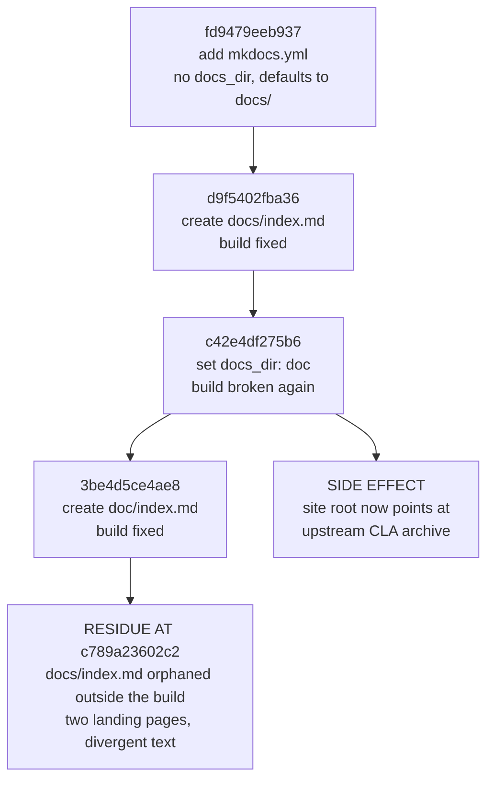

# Change Archaeology & Segmented PR Review

> ⚠️ **Provenance**: `Blitzy-Sandbox/blitzy-odoo`, branch `19.0`. This record covers the **agent-authored change set on that branch**, reconstructed by commit authorship rather than by filename. The reconstructed range is the fixed interval `7bd7718bcd4c..c789a23602c2` — **13 commits, 6 files, 2,025 insertions, 0 deletions**. Both endpoints are named explicitly rather than left as `HEAD`, because the remediation commits that follow `c789a23602c2` change every figure below: this is an archaeology record of a fixed historical range, not a census of the branch as it now stands. Both endpoints are given in the abbreviated form this document uses throughout, per the conventions of subsection 1.2; their full forty-character object names are recorded in the boundary table of subsection 1.1.
>
> ⚠️ **This document is the assessment half of "assess and remediate".** It records what was found and what each repair must achieve. It is not itself a specification of working software, and it makes no claim about accounting capability on this branch — see [the landing page](index.md) for what branch `19.0` actually contains.

## 1. Scope and Method

### 1.1 How the boundary was derived

No commit range and no file list were supplied, so scope was derived from authorship. Filtering `git log` by author isolates a contiguous block of Blitzy-authored commits at the tip of branch `19.0`, bounded below by the last upstream commit.

| Boundary | Commit | Author | Date | Subject |
|----------|--------|--------|------|---------|
| Last upstream commit (exclusive lower bound) | `7bd7718bcd4c5d232779e8eab0340169461af14e` | Gauthier Wala (gawa) &lt;gawa@odoo.com&gt; | 2025-11-18 | `[FIX] account: fix cash basis tax calculation for full payments` |
| Last commit of the reconstructed set (inclusive upper bound) | `c789a23602c24606458ee86783a318f7224d1dd8` | ajay-blitzy &lt;awadhwani@blitzy.com&gt; | 2026-05-15 | `chore: extend catalog tags (security, audit)` |

At `c789a23602c2` the repository carries **197,413 commits** (`git rev-list --count c789a23602c2`) and **45,666 tracked files** (`git ls-tree -r --name-only c789a23602c2 | wc -l`). Thirteen commits is therefore the entire authored surface — a **0.0066 %** share of the history, computed from those two counts. Authorship-based discovery was essential: a path-based guess would have missed `catalog-info.yaml` and `mkdocs.yml` at the repository root while wrongly capturing upstream files under `doc/`.

Discovery was completed in full — the commit inventory, the per-commit replay, and the non-regression proof — **before** any finding was raised. That ordering was imposed by the request itself, which conditioned the review on *"once all changes are identified"*.

Every figure in this record is a measurement taken from an executed command or an executed documentation build, never an estimate. Where a measurement depends on the state of the tree, the commit it was taken at is named.

### 1.2 Citation and command conventions

Every claim about the repository carries a locator and every quantitative claim carries the command that produced it, so that a later reviewer can re-derive each figure rather than trust it. Two conventions govern the whole record, and both are stated here so that no reader has to guess which tree a locator refers to.

- **Citations are pinned to the reconstructed range.** Every `[path:Lnn]` locator names the file *as it stood at `c789a23602c2`*, the inclusive upper bound of the range under review, because five of the six reconstructed paths have since been remediated or removed. Read-only authorities that lie outside the range — `odoo/release.py`, `setup.cfg`, `MANIFEST.in`, `setup.py`, `debian/odoo.docs`, `debian/install`, `debian/copyright`, `.gitignore`, `CONTRIBUTING.md`, `ruff.toml`, `.github/**` and `addons/base_vat/models/res_partner.py` — are cited at their unchanged line numbers, because the range modifies no upstream file.
- **Commands are pinned to fixed endpoints, never to a moving `HEAD`.** Every command quoted below uses the literal interval `7bd7718bcd4c..c789a23602c2`, and every tree-wide count is taken at `c789a23602c2` explicitly. Substituting a moving reference would silently re-scope every figure the moment a remediation commit lands — which is precisely the property an archaeology record has to preserve.

| Form | Meaning |
|------|---------|
| `path:Lx` / `path:Lx-Ly` | A line or an inclusive line range, read at `c789a23602c2` unless a different commit is named |
| `path:Lx @ <sha>` | The same, read explicitly at the named commit. Used where a file's line numbering drifted between commits |
| `` `<command>` `` → **result** | A re-runnable measurement. Ranges are always two fixed SHAs; working-tree queries are given in their commit-pinned `git ls-tree` / `git grep <sha>` form so that they return the same answer indefinitely |
| HTTP *nnn* | The status code returned by an unauthenticated request to a public URL |
| PR record | A field of the pull-request record itself. Its merge commit `2c52c6b3aaf70560eff44eb4e60d57cf8a211f8b` sits on branch `pdlc`, so it does **not** resolve in a `19.0`-only checkout — `git cat-file -e` on it fails locally, and the field is re-derived through the repository API instead |

Because citations are pinned to the boundary commit, a cited historical path is often **not** the path the same content occupies after remediation. The mapping is recorded explicitly rather than left to inference, and the relationships are not uniform — two are moves and one is not.

| Cited historical path | Path after remediation | Relationship |
|-----------------------|------------------------|--------------|
| `doc/project-guide.md` | `docs/project-guide.md` | **Relocated** — moved with move semantics, so authorship history follows the content |
| `doc/technical-specifications.md` | `docs/technical-specifications.md` | **Relocated** — moved with move semantics |
| `doc/index.md` | *removed; no successor path* | **Superseded, not moved** — `docs/index.md` already existed, so this page was the later duplicate; its two distinguishing facts were carried into the surviving canonical page. See subsection 6.2 |
| `docs/index.md` | `docs/index.md` | **Same path** before and after; rewritten in place |
| `catalog-info.yaml`, `mkdocs.yml`, `.gitignore` | unchanged | **Same path** before and after |

### 1.3 Segmentation

The change set is partitioned along the axis of **artifact family and consuming contract**, so that each segment is judged against exactly one authoritative specification, with a final segment for the seams between them.

| Segment | Artifacts | Authoritative contract |
|---------|-----------|------------------------|
| **SEG-1** Service-catalog metadata | `catalog-info.yaml` | Backstage Component descriptor schema, well-known field vocabularies, entity relations |
| **SEG-2** Docs toolchain configuration | `mkdocs.yml` | MkDocs configuration schema, Backstage TechDocs publishing requirements, plugin availability |
| **SEG-3** Documentation entry points | `doc/index.md`, `docs/index.md` | Navigation reachability; a single canonical landing page |
| **SEG-4** Generated documentation content | `doc/project-guide.md`, `doc/technical-specifications.md` | Factual accuracy against the repository; internal consistency |
| **SEG-5** Cross-segment integration | The seams between the above | Agreement between the TechDocs reference, the documentation root, navigation targets, on-disk files, and outbound catalog links |
| **SEG-6** Blast radius and hygiene | Packaging, lint reach, CI absence, build output | Positive proof of upstream non-regression |

### 1.4 Defect taxonomy and severity scale

Each segment is evaluated against a uniform eight-class taxonomy so that the review's completeness is independently checkable.

| Class | Meaning |
|-------|---------|
| **D1** | Contract violation — the artifact breaks its consuming tool's documented schema or semantics |
| **D2** | Broken reference — a path, URL, navigation target, or anchor does not resolve |
| **D3** | Factual inaccuracy — a statement is contradicted by the repository itself |
| **D4** | Internal inconsistency — two in-scope artifacts assert conflicting facts |
| **D5** | Dead or orphaned artifact — present in the tree but unreachable by any consumer |
| **D6** | Missing required or strongly recommended element — its omission degrades the consuming tool's output |
| **D7** | Unsubstantiated claim — a capability or attribute asserted with no supporting evidence |
| **D8** | Hygiene or convention deviation |

| Severity | Meaning |
|----------|---------|
| **Blocker** | The consuming tool fails, or produces a wrong or unresolvable result |
| **Major** | User-visible incorrectness, or a broken link |
| **Minor** | A missing recommended element, or an inconsistency between artifacts |
| **Nit** | Style and wording alone |

Every segment was worked through the same six steps: state the authoritative contract and its source; mechanically validate whatever is machine-checkable; walk every diff line against the taxonomy; assign severity; specify the remediation as a concrete minimal edit; and define the acceptance check that proves the defect is gone.

### 1.5 Methodological disclosure — the named rule definition does not exist

> ⚠️ **The review was requested "using the Segmented PR Review rule definition". No such rule definition exists in this project, and none was retrievable.** The project's rules document was read twice — once with the default window and once over its explicit full range — and returned no rules on both reads. It is empty; this was not a partial read. No segmentation axes, no defect taxonomy, and no severity scale were supplied by it.

The named artifact was therefore treated as a **named methodology** rather than as retrievable text, and the canonical interpretation was instantiated in its place and written out in full in subsections 1.3 and 1.4, so that a reader can check this review against the standard it claims to follow. **What appears in those subsections is that instantiation, not the requester's rule.** No rule was invented, and nothing here is presented as though it had been supplied.

**Why this resolution rather than the alternatives.** Three considerations settled it.

- **Fabricating a definition and attributing it to the requester was rejected outright.** Inventing a rule and presenting it as the project's own would be a worse failure than the missing text, and the absence of rules is explicitly not treated as permission to lower the bar.
- **Abandoning the segmentation was also rejected**, because it would ignore an explicit instruction and discard the rigor the request asked for. A segmented review is fully determined once the segmentation axes and the per-segment defect taxonomy are fixed, and both are fixed in writing here.
- **The substitution is low-risk in this particular case, because the findings are properties of the artifacts themselves rather than of the grouping applied to them.** A link that returns 404 returns 404 regardless of which segment it is filed under. Supplying a different segmentation would reorganise and re-rank this report without changing a single one of its conclusions.

If a canonical Segmented PR Review definition exists outside this project, supplying it would allow these same findings to be re-grouped under that scheme. No finding would be lost in the process.

### 1.6 Standards applied in place of rules

Because no rules were supplied, the review was held to enterprise-standard best practice reinforced by the conventions this repository documents for itself. These standards are named here so that the record can be audited against them, and each is tied to the evidence that establishes it.

| Standard | Basis | Consequence for this review |
|----------|-------|-----------------------------|
| **ST-1** Stable-series change discipline | [CONTRIBUTING.md:L14] — *"There are restrictions on the kind of changes allowed in stable series"* | Every remediation is the minimal edit that closes its finding. No behavioural change, and no scope expansion beyond the findings recorded here |
| **ST-2** Generated-file immutability | [ruff.toml:L1-L2] declares itself generated by the runbot nightly checks and marked do-not-modify | `ruff.toml` is excluded from remediation, and the principle generalises to any file bearing such a marker |
| **ST-3** External-contract conformance over syntactic validity | Both changed configuration files parse cleanly under a plain YAML safe-loader | Parse success establishes nothing. Each artifact is validated against its consuming tool's published contract and then verified **by running that tool** — which is the only reason the two blockers were found |
| **ST-4** Forward-fixing only | The thirteen commits are merged and published on a stable series | All repair is additive follow-up edits. No rebase, no amend, no revert-by-rewrite, no force-push. Commit messages are immutable history |
| **ST-5** Evidence and citation obligation | The conventions of subsection 1.2 | Every claim about the existing system carries an inline path-and-locator citation, and every quantitative claim is a measurement from an executed command or build |
| **ST-6** Repository convention adherence | Sibling documentation filenames are kebab-case; [.gitignore:L45-L53] root-anchors build and environment output | New filenames follow the kebab-case pattern; every file the remediation touches ends with a newline |
| **ST-7** Dependency ordering, never calendar time | Platform-authored planning content describes how work is sequenced, not when it happens | This record states dependency ordering only. Commit dates appear because they are historical fact. It is also why finding S4-05 is a defect and not a stylistic preference |
| **ST-8** Advisory-only linting | The repository ships no `.markdownlint*`, `.editorconfig`, `.pre-commit-config.yaml`, `.yamllint*`, `pyproject.toml`, `tox.ini`, `Makefile`, or `package.json` | YAML and Markdown linter output is reported as advisory. No linter configuration is introduced |

---

## 2. Change Inventory

### 2.1 The six files

Every entry is an addition. There are no deletions and no modifications to any pre-existing file anywhere in the range.

| File | Status | Insertions | Deletions | Artifact family |
|------|--------|-----------:|----------:|-----------------|
| `catalog-info.yaml` | Added | 32 | 0 | Service-catalog metadata |
| `mkdocs.yml` | Added | 9 | 0 | Docs toolchain configuration |
| `doc/index.md` | Added | 5 | 0 | Documentation entry point |
| `docs/index.md` | Added | 3 | 0 | Documentation entry point |
| `doc/project-guide.md` | Added | 502 | 0 | Generated documentation content |
| `doc/technical-specifications.md` | Added | 1,474 | 0 | Generated documentation content |
| **Total** | **6 files, all adds** | **2,025** | **0** | **4 families** |

### 2.2 The thirteen commits

Twelve are authored by Michael Montanaro &lt;michael@blitzy.com&gt; on 2026-04-06; the thirteenth by ajay-blitzy &lt;awadhwani@blitzy.com&gt; on 2026-05-15. Every row nevertheless carries its own author identity and commit date rather than relying on that summary, so each entry is attributable on its own. The ordering is oldest first, and the metadata is authoritative: `git log --reverse --date=short --format='%h|%s|%an <%ae>|%ad' 7bd7718bcd4c..c789a23602c2`.

| # | Commit | Author & date | Subject | Effect |
|---|--------|---------------|---------|--------|
| 1 | `3322c9fb56fc` | `Michael Montanaro <michael@blitzy.com>` · 2026-04-06 | Add Backstage catalog-info.yaml for developer portal integration | Adds the descriptor with tags `python`/`web-app`/`in-progress`, an `in-progress` status label, no TechDocs annotation, and system `blitzy-sandbox-projects` |
| 2 | `89bf914d81fe` | `Michael Montanaro <michael@blitzy.com>` · 2026-04-06 | chore: update catalog tags — remove status, add work type | Removes both the `in-progress` tag and the status label; adds tag `refactor`. Net effect: the only in-progress signal is deleted while the declared lifecycle stays `production` |
| 3 | `4519ac913f3c` | `Michael Montanaro <michael@blitzy.com>` · 2026-04-06 | chore: add techdocs-ref annotation for TechDocs support | Adds `backstage.io/techdocs-ref: dir:.`; also strips the trailing newline |
| 4 | `fd9479eeb937` | `Michael Montanaro <michael@blitzy.com>` · 2026-04-06 | chore: add mkdocs.yml for TechDocs | Adds the site config with no `docs_dir`, so MkDocs defaults to `docs/` — which did not yet exist. **The build is broken at this commit.** |
| 5 | `d9f5402fba36` | `Michael Montanaro <michael@blitzy.com>` · 2026-04-06 | chore: add docs/index.md for TechDocs | Creates `docs/index.md`. The build is fixed |
| 6 | `c42e4df275b6` | `Michael Montanaro <michael@blitzy.com>` · 2026-04-06 | chore: set docs_dir to doc/ for TechDocs compatibility | Repoints the documentation root to `doc/`. **Breaks the build again** and strands `docs/index.md`; also strips the trailing newline |
| 7 | `f3679676519f` | `Michael Montanaro <michael@blitzy.com>` · 2026-04-06 | chore: assign component to blitzy-python system for catalog graph | Changes `spec.system` to `blitzy-python` |
| 8 | `3be4d5ce4ae8` | `Michael Montanaro <michael@blitzy.com>` · 2026-04-06 | docs: add index.md for TechDocs | Creates `doc/index.md` with text differing from `docs/index.md`. The build is fixed and `docs/index.md` is now permanently orphaned |
| 9 | `4e0e6df0811f` | `Michael Montanaro <michael@blitzy.com>` · 2026-04-06 | docs: add mermaid2 plugin for diagram support | Adds the `mermaid2` plugin but no fence configuration, so the stated purpose is not achieved — see subsection 3.5 |
| 10 | `ce5781adcadf` | `Michael Montanaro <michael@blitzy.com>` · 2026-04-06 | docs: add Project Guide from Blitzy | Adds the 502-line project guide |
| 11 | `e684fbe46c33` | `Michael Montanaro <michael@blitzy.com>` · 2026-04-06 | docs: add Technical Specifications from Blitzy | Adds the 1,474-line specification |
| 12 | `b58d620c4fb2` | `Michael Montanaro <michael@blitzy.com>` · 2026-04-06 | docs: add Blitzy documentation to nav | Adds two navigation entries; leaves the file without a trailing newline |
| 13 | `c789a23602c2` | `ajay-blitzy <awadhwani@blitzy.com>` · 2026-05-15 | chore: extend catalog tags (security, audit) | Adds two tags, but the diff is sixteen insertions against thirteen deletions because the whole file was round-tripped through a YAML serialiser — the description was folded, sequence indentation changed from four spaces to two, quoting style changed, and the trailing newline was restored |

Reviewing the net diff alone would have concealed commits 4 through 8 entirely, because their effects cancel in the aggregate while leaving permanent residue. Each commit was therefore replayed individually.

---

## 3. Chronological Narrative

### 3.1 The documentation-root flip-flop

Commits 4 through 8 form a flip-flop whose net result is two landing pages with different text, only one of which is reachable.

| Step | Commit | Configured root | On-disk index | Build state |
|------|--------|-----------------|---------------|-------------|
| 1 | `fd9479eeb937` | `docs/` (MkDocs default; `docs_dir` absent) | none | **Broken** — no documentation directory exists |
| 2 | `d9f5402fba36` | `docs/` | `docs/index.md` | Fixed |
| 3 | `c42e4df275b6` | `doc/` (explicit `docs_dir: doc`) | `docs/index.md` only | **Broken again** — and `docs/index.md` is now stranded |
| 4 | `3be4d5ce4ae8` | `doc/` | `doc/index.md` **and** `docs/index.md` | Fixed, with permanent residue |

**Diagram text alternative** — *the documentation-root flip-flop*, a
top-to-bottom graph with six nodes and five edges. The chain runs
`fd9479eeb937` (add `mkdocs.yml`, no `docs_dir`, defaults to `docs/`) to
`d9f5402fba36` (create `docs/index.md`, build fixed) to `c42e4df275b6` (set
`docs_dir: doc`, build broken again) to `3be4d5ce4ae8` (create `doc/index.md`,
build fixed), and finally to a terminal node reading *residue at
`c789a23602c2`* — `docs/index.md` orphaned outside the build, two landing pages
with divergent text. A fifth edge branches separately out of `c42e4df275b6` to
a second terminal node reading *side effect* — the site root now points at the
upstream CLA archive. So `c42e4df275b6` is the only node with two outbound
edges, and the two terminal nodes are the two consequences that outlived the
sequence.

Two consequences outlived the sequence. First, `docs/index.md` was left orphaned outside the build — present in the tree, reachable by no consumer, and carrying text that diverged from the page that replaced it. Second, and far more consequential, the configured site root was pointed at `doc/`, a directory that at the boundary commit contained **nothing but Odoo's contributor-agreement archive**.

### 3.2 Why pointing the root at `doc/` was a capture, not a preference

Ownership of the two similarly named directories was established with hard counts rather than by inspection.

- Pre-boundary history contains **3,623** commits touching `doc/` (`git rev-list --count 7bd7718bcd4c -- doc/`), reaching back to a 2006 trunk import. At the boundary commit that directory contained **only** the `cla` subtree — `git ls-tree --name-only 7bd7718bcd4c doc/` returns the single entry `doc/cla`.
- Pre-boundary history contains **zero** commits touching `docs/` (`git rev-list --count 7bd7718bcd4c -- docs/`), confirming it as greenfield created by this change set.
- Upstream was still adding to `doc/` after the boundary, so every future contributor-agreement signature would silently join the published developer portal.
- Historical Sphinx tooling under `doc/` is still referenced by the `_build/` ignore rule at [.gitignore:L1-L2] and by extension copyright attributions at [debian/copyright:L216].

At the boundary the `doc/` tree held **997** tracked files, of which **996** are Markdown. The `doc/cla/` subtree accounts for **994** of them — **993** Markdown files, being **715** individual agreements under `doc/cla/individual/`, **275** corporate agreements under `doc/cla/corporate/` and exactly **3** policy documents (`doc/cla/ccla-1.0.md`, `doc/cla/icla-1.0.md`, `doc/cla/sign-cla.md`), plus one Python helper at [doc/cla/stats.py]. The remaining three files were the Blitzy documents. **993 of the 996 Markdown files under the configured site root were therefore contributor agreements**, which is the arithmetic behind the capture recorded as S2-01.

### 3.3 The status-signal deletion

Commit 1 declared the component with an `in-progress` tag **and** an `in-progress` status label, alongside `spec.lifecycle: production`. Commit 2 removed both in-progress signals and left the `production` lifecycle in place at [catalog-info.yaml:L30].

The descriptor thereafter asserted an established, maintained component while the repository's own project guide reported the work as substantially incomplete: [doc/project-guide.md:L5] states *"Project Completion: 17% (110 hours completed out of 640 total hours)"*. A descriptor claiming `production` against a self-reported **17%** completion is an internal contradiction, and it was created by a commit whose subject describes it as a tag tidy-up.

Framed as the repository's own pull-request template frames a change — **current behaviour**: the catalog advertises a production-ready component with no in-progress signal of any kind; **desired behaviour**: the declared lifecycle matches the repository's stated completion status, and the in-progress signal that commit 1 supplied is restored.

### 3.4 The newline regressions and their accidental repair

Trailing newlines were stripped twice, by commits 3 and 6, and `mkdocs.yml` was left without one by commit 12. The descriptor's newline was restored by commit 13 — not deliberately, but as a side effect of round-tripping the whole file through a YAML serialiser. That round trip is also why commit 13 reports sixteen insertions against thirteen deletions for what its subject describes as adding two tags: it reformatted the description folding, the sequence indentation, and the quoting style at the same time.

The site configuration's own missing newline outlived the range and is recorded as S2-05. Because the file's length changed during the remediation, its locators are qualified where that matters: the final line is `mkdocs.yml:L9 @ c789a23602c2` and `mkdocs.yml:L10 @ f9bee9fb4234`, with `wc -c mkdocs.yml` reporting 263 bytes and a last byte of `2` at the latter commit.

### 3.5 Commit 9's inert diagram plugin

Commit 9 — `4e0e6df0811f`, *"docs: add mermaid2 plugin for diagram support"* — states diagram support as its purpose and does not achieve it. It appends `mermaid2` to the plugin list at [mkdocs.yml:L9] and supplies no fence configuration, and in that arrangement the plugin cannot work: the `techdocs-core` bundle declared immediately above it at [mkdocs.yml:L8] already claims the `mermaid` fence, and it relocates the fence configuration to a different key than `mermaid2` inspects, so the plugin's custom loader never activates and its post-page hook never fires.

The effect is measured, not inferred. Built from the boundary tree, all **seven** diagram fences — [doc/project-guide.md:L58], [doc/project-guide.md:L64], [doc/technical-specifications.md:L291], [doc/technical-specifications.md:L491], [doc/technical-specifications.md:L506], [doc/technical-specifications.md:L524] and [doc/technical-specifications.md:L539] — emit `language-text highlight` code blocks with line numbers, and the built pages contain no diagram element and no diagram runtime at all: **4** plain-text blocks on the project guide and **10** on the specification, against **0** diagram blocks on either. The commit therefore added a third-party package to the documentation toolchain and delivered nothing. Plugin ordering is not the cause — both orderings were tested and produce identical output, and the same plugin renders correctly when the `techdocs-core` bundle is absent. The defect is recorded as **S2-02** in subsection 5.2 with its remediation and acceptance check, and the before-and-after block counts are in the metric table of subsection 6.4.

### 3.6 The scoping error behind the factual inaccuracies

The project guide asserts delivery statistics at [doc/project-guide.md:L378-L388] — 47 commits, 81 files created, 27,707 lines added, a 43-file documentation set, and a 36-file financial-reports module — that bear no relation to a branch containing 13 commits and 6 files. Querying the repository's published metadata resolved the discrepancy rather than leaving it as apparent fabrication: the pull request the documents describe is PR #2, linked at [catalog-info.yaml:L22-L23].

| PR record field | Value | Consequence |
|-----------------|-------|-------------|
| `base` | **`pdlc`** | The change set was merged into a different branch, not `19.0` |
| `merged` | `true`, merge commit `2c52c6b3aaf70560eff44eb4e60d57cf8a211f8b` | The record is settled and citable by a fixed SHA — one that does not resolve in a `19.0`-only checkout, as subsection 1.2 discloses |
| `changed_files` | **81** | Matches the guide's *Files Created* figure exactly |
| `additions` | **27,905** | The guide's 27,707 is wrong by 198; the authoritative figure is 27,905 |
| `deletions` | 0 | Entirely additive, like this branch's own change set |

Absence on this branch was verified directly and — because the two cases differ in a way that changes the remediation — so was presence on `pdlc`.

| Artifact the documents describe | On branch `19.0` | On branch `pdlc` |
|--------------------------------|------------------|------------------|
| `tickets/` | **Absent** — `git ls-tree -r --name-only c789a23602c2 -- tickets/` returns nothing | **Present** — the repository contents API returns HTTP 200 for this path at `ref=pdlc` |
| `addons/account_financial_report_ce/` | **Absent** — the same query returns nothing | **Present** — HTTP 200 at `ref=pdlc` |
| `addons/account_reports/`, `addons/account_accountant/`, `addons/account_asset/`, `addons/account_budget/`, `addons/account_followup/` | **Absent** — the same query returns nothing for any of the five | **Also absent** — HTTP **404** at `ref=pdlc` for each of the five |

The distinction matters. The first two artifacts genuinely exist, just not here, so the corresponding claims are a **scoping** error and the remediation re-attributes them. The five accounting addons exist on **neither** branch, so claims about them were aspirational from the outset and the remediation states that plainly rather than re-attributing them to `pdlc`.

The two generated documents are therefore substantially **accurate about `pdlc` and wrong about the branch they are published on**. That single insight converts a cluster of apparently invented claims into one fixable scoping error, and it is why the remediation re-attributes the statistics rather than deleting them.

---

## 4. Non-Regression Proof

Because the checkout carries **45,666** tracked files at `c789a23602c2`, the absence of source-code change was **proven, not assumed**. Every check below is re-runnable and returns the same answer indefinitely, because no check is expressed against a moving reference.

> ⚠️ **Boundary discipline — no measurement in this section is expressed against a moving reference.** The archaeology range has a *fixed* upper bound, `c789a23602c2`. Substituting `HEAD` for it would not merely be imprecise, it would be wrong: measured while this record was being written, `7bd7718bcd4c..HEAD` already resolved to more commits and more insertions than the fixed range's **13 commits and 2,025 insertions**, and it moves again with every remediation commit. Working-tree queries such as `git status --porcelain` and `git ls-files` are moving references for the same reason, so every check below is given in its commit-pinned `git diff <sha>..<sha>` / `git ls-tree <sha>` / `git grep <sha>` form instead.

### 4.1 Proof pinned to the reconstructed change set — `7bd7718bcd4c..c789a23602c2`

| # | Check | Exact command | Result |
|---|-------|---------------|--------|
| NR-1 | Files changed in the range | `git diff --name-only 7bd7718bcd4c..c789a23602c2` | **6** paths: `catalog-info.yaml`, `doc/index.md`, `doc/project-guide.md`, `doc/technical-specifications.md`, `docs/index.md`, `mkdocs.yml` |
| NR-2 | Every changed path is an addition | `git diff --name-status 7bd7718bcd4c..c789a23602c2` | six entries, all `A`; **0** `M`, **0** `D` |
| NR-3 | Aggregate delta | `git diff --shortstat 7bd7718bcd4c..c789a23602c2` | *6 files changed, 2025 insertions(+)* — zero deletions, and no modification to any pre-existing file |
| NR-4 | Source-extension files in the range | `git diff --name-only 7bd7718bcd4c..c789a23602c2 -- '*.py' '*.js' '*.xml' '*.csv' '*.scss' '*.po' '*.pot'` | **0 paths** |
| NR-5 | Upstream-path files in the range | `git diff --name-only 7bd7718bcd4c..c789a23602c2 -- addons odoo setup debian .github` | **0 paths** |
| NR-6 | Contributor-agreement archive intact | `git ls-tree -r --name-only c789a23602c2 -- doc/cla/` and the same range restricted to `doc/cla/` | **994** paths present; **0** changed |
| NR-7 | Repository-wide sweep for the marker string | `git grep -lil blitzy c789a23602c2` | exactly the six paths of NR-1, nothing else — an independent corroboration of the authorship-derived boundary |
| NR-8 | Sweep for `techdocs` / `catalog-info` | `git grep -lil -e techdocs -e catalog-info c789a23602c2` | the two configuration files, plus **one** upstream false positive — see subsection 4.4 |
| NR-9 | Markdown link integrity | `git show c789a23602c2:<path>` for each of the four in-scope Markdown files, matched against a Markdown link pattern | **0** links in all four — so the relocation could not break an inbound link |

### 4.2 Cumulative re-assertion — separately labelled and pinned to `39efbcd2b81b`

The requirement that the repository remain byte-identical outside the ten in-scope paths must be **re-asserted after remediation**, using the same two zero-count checks that established non-regression at the start. That is a **different claim** about a **different range**, so it is recorded separately rather than folded into subsection 4.1 — and it too is pinned to a fixed commit, never to a moving reference.

| # | Check | Exact command | Result |
|---|-------|---------------|--------|
| NR-10 | Source-extension files, baseline through the remediation series | `git diff --name-only 7bd7718bcd4c..f9bee9fb4234 -- '*.py' '*.js' '*.xml' '*.csv' '*.scss' '*.po' '*.pot'` | **0 paths** |
| NR-11 | Upstream-path files, same range | `git diff --name-only 7bd7718bcd4c..f9bee9fb4234 -- addons odoo setup debian .github` | **0 paths** |
| NR-12 | The remediation touches only in-scope paths | `git diff --name-only c789a23602c2..f9bee9fb4234` | `doc/index.md`, `docs/change-archaeology-and-review.md`, `docs/index.md`, `docs/project-guide.md`, `docs/technical-specifications.md`, `mkdocs.yml` — six paths, every one drawn from the ten transformations of subsection 6.1 |
| NR-13 | The same three assertions, re-measured at the later remediation commit that hardened this record | `git diff --name-only 7bd7718bcd4c..39efbcd2b81b` with the two pathspecs of NR-10 and NR-11, and `git diff --name-only c789a23602c2..39efbcd2b81b` | **0 paths**, **0 paths**, and the same **six** in-scope paths — the changed-path set did not widen |

**The invariant, and the obligation it places on whoever extends this record.** The property being asserted is per-commit and does not depend on which commit is currently the tip: *for every commit `C` in the remediation series, `git diff --name-only 7bd7718bcd4c..C` contains no path matching a source extension, no path under an upstream prefix, and no path outside the ten in-scope paths of subsection 6.1.* The measurements above are its instances at `f9bee9fb4234` and `39efbcd2b81b`. **Any later remediation commit must add its own pinned row rather than re-point these to a moving reference** — the failure mode this subsection exists to prevent.

**The one commit this table cannot cite, and why that is not a loophole.** A commit cannot contain its own hash, so the row that records a commit must be written in a *later* one; the pinned instances therefore always lag the branch tip by exactly the commit that publishes the row. That residue is covered deliberately rather than left silent: the claim being carried forward is the **invariant**, not any single row, and the invariant is stated above in a form that quantifies over every commit in the series including the ones not yet written. The obligation on the next extension is consequently precise — pin every commit added since the last row, never substitute a moving reference for the range, and never delete an existing row to make room. Following that rule, the table grows and the pinned lower bound `7bd7718bcd4c` never moves.

### 4.3 The scale of what is provably untouched

Unless another command is named, every figure is the number of paths listed by `git ls-tree -r --name-only c789a23602c2` restricted as the *Filter* column describes. Not one member of any population below appears in NR-1.

| Surface | Count | Filter |
|---------|------:|--------|
| Tracked files in total | 45,666 | *(unrestricted)* |
| Files under `addons/` | 43,419 | pathspec `-- addons` |
| Files under `odoo/` | 1,195 | pathspec `-- odoo` |
| Addon modules | 605 | top-level directories under `addons/` |
| Python files | 8,183 | paths ending `.py` |
| JavaScript files | 5,698 | paths ending `.js` |
| XML files | 5,310 | paths ending `.xml` |
| Markdown files under `doc/cla/` | 993 | pathspec `-- doc/cla`, of 994 tracked files |
| Commits in history | 197,413 | `git rev-list --count c789a23602c2` |
| …of which agent-authored | 13 | `git rev-list --count 7bd7718bcd4c..c789a23602c2` |

**Odoo runtime behaviour is therefore unaffected**, and no in-scope file enters the source distribution or the Debian package: [MANIFEST.in] ships only `requirements.txt`, `LICENSE` and `README.md` plus a graft of `odoo`; [setup.py:L24-L26] uses namespace-package discovery with package data included; [debian/odoo.docs] lists `README.md`; and [debian/install:L2] installs `README.md` alone.

Lint reach over this change set is nil: the flake8 configuration at [setup.cfg:L5-L10] excludes `doc` and `setup` — the `doc,` entry is at L9 — no Python was added, [ruff.toml:L1-L2] declares itself *"automatically generated file by the runbot nightly ruff checks, do not modify"*, and the repository ships no Markdown or YAML linter configuration. No continuous-integration workflow exists: `git ls-tree -r --name-only c789a23602c2 -- .github` returns exactly three files, `ISSUE_TEMPLATE/1_bug_form.yml`, `ISSUE_TEMPLATE/config.yml` and `PULL_REQUEST_TEMPLATE.md`, none of them a workflow — which is the direct reason none of the defects in section 5 was caught before merge.

Finally, the fact that makes the whole of section 5 necessary: **both changed configuration files parse cleanly.** `yaml.safe_load` on `git show c789a23602c2:catalog-info.yaml` yields the keys `apiVersion`, `kind`, `metadata`, `spec`, and on `git show c789a23602c2:mkdocs.yml` yields `docs_dir`, `site_name`, `nav`, `plugins`. Parse success therefore establishes nothing about correctness, which is why every artifact is judged against its consuming tool's published contract and then verified by **running** that tool.

### 4.4 Marker sweeps, and the one false positive they produce

- The `blitzy` sweep of NR-7 returns exactly the six reconstructed paths. `git ls-files blitzy/` returns **nothing**: no `blitzy/` path is tracked at the boundary or anywhere in the range, which is the check that matters for S1-01 — an untracked local directory of that name may exist in a working checkout for unrelated tooling output, so a bare filesystem test is not evidence.
- The `techdocs` / `catalog-info` sweep of NR-8 returns **three** paths: the two configuration files, plus **one upstream false positive** at [addons/base_vat/models/res_partner.py:L569], which carries a `techdocs.broadcom.com` reference URL inside a comment that predates the baseline. It is recorded explicitly so that a future reviewer re-running the sweep is not misled into treating an untouched upstream file as part of this change set.
- `git grep -n -e 'project-guide.md' -e 'technical-specifications.md' c789a23602c2` returns, outside the two documents themselves, only the two navigation entries at [mkdocs.yml:L5-L6] — so the relocation has no other dependent anywhere in the tree.
- These blast-radius checks are registered individually as **S6-01 … S6-05** in subsection 5.6.

---

## 5. Findings

**Twenty-nine defect findings** were raised — **5 Blocker, 7 Major, 12 Minor, 5 Nit** — alongside **five verification checks**, S6-01 … S6-05, which produced no defect at all. That is **thirty-four named identifiers**: twenty-nine defects that required remediation plus five positive-evidence checks that required none. None of the twenty-nine lies in Odoo runtime code.

Every total below is derived mechanically by adding up the per-finding rows in subsections 5.1 to 5.5; none is restated from a separate summary, precisely so that the register and the totals cannot drift apart. Two arithmetic facts are worth stating explicitly because they are easy to miscount: SEG-4 carries **three** Blockers — S4-01, S4-02 and S4-03 are each a factual claim the branch itself contradicts — and SEG-6 contributes **no** defect rows at all, so it adds nothing to any severity column.

| Segment | Blocker | Major | Minor | Nit | Headline finding |
|---------|--------:|------:|------:|----:|------------------|
| SEG-1 catalog metadata | 0 | 2 | 3 | 2 | A documentation link returning 404, and a `production` lifecycle contradicted by the repository's own completion status |
| SEG-2 toolchain configuration | 2 | 1 | 2 | 1 | The site root captures 993 upstream legal documents, and diagram support does not function |
| SEG-3 entry points | 0 | 2 | 1 | 0 | An orphaned landing page and a divergent duplicate |
| SEG-4 generated content | 3 | 2 | 4 | 1 | Delivery statistics and file inventories describing a different branch |
| SEG-5 integration | 0 | 0 | 2 | 1 | Four competing descriptions of the same repository |
| SEG-6 blast radius and hygiene | 0 | 0 | 0 | 0 | Clean — non-regression proven; packaging and lint reach unaffected |
| **Total** | **5** | **7** | **12** | **5** | — |

**Entries per segment**, restated here rather than as a seventh column because seven columns cannot fit the published content width: SEG-1 catalog metadata — 7 defects; SEG-2 toolchain configuration — 6 defects; SEG-3 entry points — 3 defects; SEG-4 generated content — 10 defects; SEG-5 integration — 3 defects; SEG-6 blast radius and hygiene — 0 defects, 5 verification checks; Total — 29 defects + 5 checks = 34 identifiers.

**How the count reconciles, three ways.** By severity, 5 + 7 + 12 + 5 = **29**. By segment, 7 + 6 + 3 + 10 + 3 + 0 = **29**. By identifier, `S1-01`…`S1-07` (7) + `S2-01`…`S2-06` (6) + `S3-01`…`S3-03` (3) + `S4-01`…`S4-10` (10) + `S5-01`…`S5-03` (3) = **29**. All three agree. SEG-6's five entries are verification checks that produced no defect, which is why its row reads 0/0/0/0 and why they are deliberately **not** counted among the 29.

Every row carries an **Evidence** cell holding the locator that fixes the finding to a place in the tree — read at `c789a23602c2` unless another commit is named, per the conventions of subsection 1.2 — together with the command, HTTP status, PR-record field or stored build log that produced any quantitative claim in the row. The two stored build logs referred to below are the **baseline strict-build log** (the reconstructed configuration at `c789a23602c2` built against `doc/` at that commit) and the **current strict-build log** (the configuration and tree as they now stand); both were produced with `mkdocs build --strict` under MkDocs 1.6.1 and `mkdocs-techdocs-core` 1.7.0.

### 5.1 SEG-1 — Service-catalog metadata

| ID | Severity · class | Finding | Remediation |
|----|------------------|---------|-------------|
| S1-01 | Major · D2 | The third link targets a `blitzy/documentation` tree path that is tracked nowhere in the range and does not exist on the published branch; an HTTP request returns **404**, while the repository root and the pull-request link both return **200**. The repository is public, so this is a genuine missing path, not an access restriction | Repoint the link at the real documentation root |
| S1-02 | Major · D7/D1 | `lifecycle: production` asserts an established, maintained component. The documented well-known vocabulary defines `production` as established and maintained and `experimental` as early, non-production, with low or no reliability guarantees. The repository's own guide states **17% completion (110 of 640 hours)**, and the in-progress signal commit 1 supplied was deleted by commit 2 while `production` stayed | Set lifecycle to the well-known value `experimental`; restore the in-progress status label |
| S1-03 | Minor · D1 | `spec.type: website` misclassifies a deployable application server. The documented well-known vocabulary is `service`, `website`, `library` | Change to `service` |
| S1-04 | Minor · D7 | The tag sequence is `audit`, `python`, `refactor`, `security`, `web-app`. Tags are documented as component *classification* with no special semantics, constrained to lowercase alphanumerics and a small punctuation set separated by hyphens — yet `refactor` encodes a work type and `security`/`audit` assert attributes no evidence in the repository supports | Retain genuine classification tags; move the work-type claim to a label; drop the unevidenced attribute tags |
| S1-05 | Minor · D1 | `owner: blitzy-sandbox` and `system: blitzy-python` generate ownership and parent relations that resolve against portal entities this repository cannot create; registering as-is risks dangling relations | **No file change is possible** — nothing in this repository can define a portal entity |
| S1-06 | Nit · D8 | Link icons are internally inconsistent: the second and third links each carry an `icon`, the first does not. The documented guidance is that links carry a required URL plus optional title, icon and type, and should be used only where an equivalent well-known annotation does not already cover the case | Add the missing icon |
| S1-07 | Nit · D8 | Advisory YAML style: no document-start marker, three lines beyond the 80-character default, and the two sequence-indentation positions a default linter profile flags — the latter a direct consequence of the commit-13 serialiser round trip described in subsection 3.4. Six advisory items in total, all in the descriptor | None mandated |

**Evidence and acceptance checks.**

- **S1-01** — *Evidence:* [catalog-info.yaml:L25] against [catalog-info.yaml:L20] and [catalog-info.yaml:L22]; `git ls-files blitzy/` → empty — *Acceptance check:* Every outbound link in the descriptor returns HTTP 200
- **S1-02** — *Evidence:* [catalog-info.yaml:L30] against [doc/project-guide.md:L5] — *Acceptance check:* Lifecycle is a documented well-known value and agrees with the stated project status
- **S1-03** — *Evidence:* [catalog-info.yaml:L29] — *Acceptance check:* Type is a documented well-known value. **Flagged for owner confirmation** — a taxonomy judgement, reversible in one line
- **S1-04** — *Evidence:* [catalog-info.yaml:L7-L12]; labels at [catalog-info.yaml:L13-L14]. `refactor` was added by commit 2 (`89bf914d81fe`) and `security`/`audit` by commit 13 (`c789a23602c2`); `git grep -lil -e security-audit -e 'security review' c789a23602c2` finds no supporting artifact — *Acceptance check:* Every remaining tag is a classification term and satisfies the documented tag format. **Flagged for owner confirmation** — dropping `security` and `audit` may remove signal the owner intended
- **S1-05** — *Evidence:* [catalog-info.yaml:L31-L32] — *Acceptance check:* Recorded as a portal-side prerequisite in section 7
- **S1-06** — *Evidence:* [catalog-info.yaml:L19-L21] against the icons at [catalog-info.yaml:L24] and [catalog-info.yaml:L27] — *Acceptance check:* All links carry an icon
- **S1-07** — *Evidence:* `yamllint` on the descriptor reports six items verbatim — the warning `1:1 missing document start "---"` at [catalog-info.yaml:L1]; `line too long` at `5:81` (83 > 80), `18:81` (94 > 80) and `25:81` (85 > 80), citing [catalog-info.yaml:L5], [catalog-info.yaml:L18] and [catalog-info.yaml:L25]; and `wrong indentation: expected 4 but found 2` at `8:3` and `20:3`, citing the tag sequence at [catalog-info.yaml:L8] and the link sequence at [catalog-info.yaml:L20]. No `.yamllint*`, `.markdownlint*`, `.editorconfig`, `pyproject.toml`, `tox.ini`, `Makefile` or `package.json` is tracked anywhere — *Acceptance check:* **Advisory only** under ST-8 — the repository ships no YAML linter configuration, so nothing enforces this

### 5.2 SEG-2 — Docs toolchain configuration

| ID | Severity · class | Finding | Remediation |
|----|------------------|---------|-------------|
| S2-01 | **Blocker** · D1 | `docs_dir: doc` points the site root at a directory that, when the setting was introduced, held only the contributor-agreement archive. **Measured by executing the build**: 997 HTML files — **996 content pages** plus one theme-generated `404.html` — totalling **17 MB**, of which **993** are contributor-agreement documents listed as absent from the navigation configuration, plus **3** unresolved-link notices all originating in `doc/cla/sign-cla.md`. **993 of 996 content pages, or 99.7% of the published developer portal, is unrelated legal paperwork.** Critically, `mkdocs build --strict` **exits 0** here, because omitted-navigation files are reported at *informational* level and the run emits zero `WARNING` lines — which is exactly why the capture went unnoticed | Repoint the documentation root to the Blitzy-owned `docs/` folder and relocate the three Markdown documents into it |
| S2-02 | **Blocker** · D1 | The `mermaid2` plugin is declared but provably inert. **Root cause, established by reading the installed package sources**: the `techdocs-core` bundle appends an extension pack that already claims the `mermaid` fence and renders it as highlighted plain text, and it relocates the fence configuration to a different key than `mermaid2` inspects, so that plugin's custom loader never activates and its post-page hook never fires. All **7** fences render as `language-text` highlight tables with line numbers, emitting **zero** diagram markup and no diagram runtime. **Plugin ordering is irrelevant**: both orderings were tested and produce identical output, and the same plugin works correctly when the TechDocs bundle is absent. The bundle's own diagram support covers **Graphviz and PlantUML only**; Mermaid is not part of it at any version | Remove the inert plugin declaration and declare a `pymdownx.superfences` custom fence mapping the `mermaid` fence name to a passthrough code format |
| S2-03 | Major · D6 | With no site description, the metadata the publisher writes for the portal contains the literal string `"None"` where the component's documentation description belongs | Supply the site description |
| S2-04 | Minor · D6 | The theme's per-page edit action is enabled but dead. Severity is **Minor rather than Major because the publisher auto-populates both when absent**, warning that they may be set manually to control the behaviour | Add both, with the edit reference matching the final documentation root |
| S2-05 | Nit · D8 | File left without a trailing newline by commit 12, and still without one at the upper bound — the only one of the two newline regressions never repaired inside the range | Restore it |
| S2-06 | Minor · D6 | Introducing MkDocs without ignoring its default output directory leaves that directory reported as untracked; the existing ignore rules cover only the superseded Sphinx `_build/` path. **Zero tracked paths** match a `site` directory anywhere in the tree, so a root-anchored entry cannot mask tracked content | Add a root-anchored ignore entry, matching the file's own convention for build and environment output |

**Evidence and acceptance checks.**

- **S2-01** — *Evidence:* [mkdocs.yml:L1]; the captured tree measured in subsection 3.2; baseline strict-build log — *Acceptance check:* Strict build exits 0 **and** publishes exactly the intended page count **and** reports zero omitted-navigation notices
- **S2-02** — *Evidence:* [mkdocs.yml:L9] against [mkdocs.yml:L8]; the seven fences at [doc/project-guide.md:L58], [doc/project-guide.md:L64], [doc/technical-specifications.md:L291], [doc/technical-specifications.md:L491], [doc/technical-specifications.md:L506], [doc/technical-specifications.md:L524] and [doc/technical-specifications.md:L539]; both build logs — *Acceptance check:* Exact count of correctly emitted diagram blocks rises to **2** and **5** respectively, accounting for all seven fences
- **S2-03** — *Evidence:* [mkdocs.yml:L1-L9] — no `site_description` key anywhere; the published metadata file in the baseline build — *Acceptance check:* Published metadata carries real text, not `"None"`
- **S2-04** — *Evidence:* [mkdocs.yml:L1-L9] — neither `repo_url` nor `edit_uri` present — *Acceptance check:* Per-page edit action resolves; the publisher's derivation warning is gone
- **S2-05** — *Evidence:* [mkdocs.yml:L9] — the final byte is `2`, not a newline; equivalently `mkdocs.yml:L10 @ f9bee9fb4234` at 263 bytes — *Acceptance check:* File ends with a newline
- **S2-06** — *Evidence:* [.gitignore:L1-L2]; the file's own convention at [.gitignore:L45-L53] — *Acceptance check:* `git status` is clean after a documentation build

### 5.3 SEG-3 — Documentation entry points

| ID | Severity · class | Finding | Remediation |
|----|------------------|---------|-------------|
| S3-01 | Major · D5 | `docs/index.md` is orphaned by the four-commit chain — present in the tree, outside the configured root, reachable by no consumer, and excluded from the published site entirely | Promote it to the canonical landing page **rather than delete it** |
| S3-02 | Major · D4 | Two landing pages assert different descriptions of the same repository: one carries the accounting-parity and IBM Carbon tagline, while the other says the repository is a Blitzy fork of Odoo and is the documentation home | Reconcile into one page and delete the duplicate |
| S3-03 | Minor · D8 | The layout deviates from the vendor's documented arrangement, which places the index page in a root-level `docs` folder beside the descriptor and site configuration — the same layout the generator writes as its own default | Converge on the documented layout |

**Evidence and acceptance checks.**

- **S3-01** — *Evidence:* [docs/index.md:L1-L3] against [mkdocs.yml:L1]; the orphaning chain in subsection 3.1 — *Acceptance check:* The page is reachable and is the site's entry point
- **S3-02** — *Evidence:* [docs/index.md:L3] against [doc/index.md:L3-L5] — *Acceptance check:* Exactly one index page exists under the documentation root
- **S3-03** — *Evidence:* [mkdocs.yml:L1] against the vendor's documented canonical layout — *Acceptance check:* Layout matches the vendor default, so future tooling changes need no repository-specific compensation

### 5.4 SEG-4 — Generated documentation content

| ID | Severity · class | Finding | Remediation |
|----|------------------|---------|-------------|
| S4-01 | **Blocker** · D3 | The delivery statistics — 47 commits, 81 files created, 27,707 lines added, 43 documentation files, 36 module source files — describe a different branch entirely. This branch carries 13 commits and 6 files | Re-attribute the table to the pull request and branch it describes; correct the line-count figure against the authoritative record of **27,905** additions; add a row stating what this branch actually contains |
| S4-02 | **Blocker** · D3 | The completion claim asserts a 100%-complete 43-file documentation set, and the tree describes a `tickets/` documentation set **absent from this branch**, verified by the direct check in subsection 3.6 | Re-scope both to the branch that contains them |
| S4-03 | **Blocker** · D3 | The module inventory gives a 36-file inventory and validation verdicts for `addons/account_financial_report_ce/`, an addon **absent from this branch** | Re-scope the inventory and the validation claims |
| S4-04 | Major · D3 | The concluding assessment draws a delivery-and-hand-off conclusion the branch cannot support — including a "zero blocking issues, all code compiles" verdict over module source that does not exist here | Withdraw or qualify it |
| S4-05 | Minor · D8 | Work is scheduled in calendar bands — *"Immediate Actions (Week 1)"* and *"Short-term Actions (Weeks 2-8)"*. **This is a defect under ST-7, not a stylistic preference**: platform-authored planning content states dependency ordering and never calendar time, so calendar bands in such content are a contract breach regardless of taste | Replace the calendar bands with dependency-ordered phases |
| S4-06 | Minor · D3 | The document cites *"`odoo/release.py` line 10"* as the source of `version_info = (19, 0, 0, FINAL, 0, '')`. **Verified directly**: that declaration is at line 15; line 10 is a comment | Correct the cited line number |
| S4-07 | Minor · D8 | Two top-level headings — `# Technical Specification` and `# 0. Agent Action Plan` — produce an ambiguous page title | Delete the redundant heading. **Demoting the second was explicitly rejected**: it would cascade a re-levelling of the entire numbered hierarchy across 1,474 lines, disproportionate on a stable branch under ST-1 |
| S4-08 | Minor · D4 | The constraints row states `Odoo 18.0` without qualification, while four other places in the same document already disclose the discrepancy. [doc/technical-specifications.md:L1227] is a verbatim quote of the user requirement and is deliberately left alone | Qualify it consistently with those four |
| S4-09 | Major · D3 | A planning artifact is published under the label "Technical Specifications", so a portal visitor reads it as a description of what exists rather than as an unexecuted plan. The preamble carries no status qualification | Add a provenance and status banner to **both** relocated documents |
| S4-10 | Nit · D8 | The file is not terminated with a newline — its 502 inserted lines report as 501 under `wc -l` for exactly that reason | Terminate it |

**Evidence and acceptance checks.**

- **S4-01** — *Evidence:* [doc/project-guide.md:L378-L388]; PR record `changed_files` 81 and `additions` 27,905 — *Acceptance check:* Every statistic names the branch it applies to
- **S4-02** — *Evidence:* [doc/project-guide.md:L7], [doc/project-guide.md:L10], [doc/project-guide.md:L393-L419] — *Acceptance check:* Each claim is scoped; absence on this branch is stated plainly
- **S4-03** — *Evidence:* [doc/project-guide.md:L11-L12], [doc/project-guide.md:L421-L460] — *Acceptance check:* Scoped, with absence stated
- **S4-04** — *Evidence:* [doc/project-guide.md:L490-L502] — *Acceptance check:* No unsupported conclusion remains
- **S4-05** — *Evidence:* [doc/project-guide.md:L465-L487], with the calendar bands at [doc/project-guide.md:L466] and [doc/project-guide.md:L471] — *Acceptance check:* No calendar scheduling remains
- **S4-06** — *Evidence:* [doc/technical-specifications.md:L1473] against [odoo/release.py:L15] — *Acceptance check:* The citation resolves to the claimed content
- **S4-07** — *Evidence:* [doc/technical-specifications.md:L1] and [doc/technical-specifications.md:L3] — *Acceptance check:* Exactly one top-level heading
- **S4-08** — *Evidence:* [doc/technical-specifications.md:L1452] against [doc/technical-specifications.md:L41], L786, L1024 and L1471-L1474 — *Acceptance check:* The constraint agrees with its siblings
- **S4-09** — *Evidence:* [doc/technical-specifications.md:L3-L45] and [doc/project-guide.md:L1-L20] — *Acceptance check:* A banner names the source branch and pull request and identifies absent artifacts
- **S4-10** — *Evidence:* [doc/project-guide.md:L502] — the final byte is not a newline — *Acceptance check:* File ends with a newline

### 5.5 SEG-5 — Cross-segment integration

| ID | Severity · class | Finding | Remediation |
|----|------------------|---------|-------------|
| S5-01 | Minor · D4 | The documentation root, the outbound catalog documentation link and the edit reference form a **lockstep triangle**; fixing any one alone reintroduces a broken reference. All three are enumerated in the reference matrix of subsection 6.5 | Change all three as one atomic unit |
| S5-02 | Minor · D4 | **Four** different descriptions of the same repository are in circulation — the two landing pages, the published repository description and the descriptor — so no single source of truth exists | Establish the descriptor description as the single source of truth and derive the landing page text and site description from it |
| S5-03 | Nit · D7 | The "IBM Carbon Design System" claim asserts a capability with no supporting code. The string appears **only** inside the change-set content under review; a repository-wide search finds no code reference anywhere | Reword as planned direction |

**Evidence and acceptance checks.**

- **S5-01** — *Evidence:* [mkdocs.yml:L1], [catalog-info.yaml:L25], and the absent `edit_uri` in [mkdocs.yml:L1-L9] — *Acceptance check:* All three agree, and the portal never observes an intermediate state with a broken link
- **S5-02** — *Evidence:* [docs/index.md:L3], [doc/index.md:L3-L5], [catalog-info.yaml:L5-L6], and the published repository description — *Acceptance check:* One authoritative description; the other two are derived
- **S5-03** — *Evidence:* [catalog-info.yaml:L5-L6] and [docs/index.md:L3] — *Acceptance check:* The claim reads as direction, not delivered capability

### 5.6 SEG-6 — Blast radius and hygiene

This segment produced **no defect at all**. Its five checks are recorded below as individually identified positive evidence, because "nothing was found" is only auditable when the reader can see exactly what was looked for. None of the five contributes to the severity totals above — they are verification entries, not findings.

| ID | Verification check | Evidence | Result |
|----|--------------------|----------|--------|
| S6-01 | No other service-catalog descriptor and no other documentation-site configuration exists anywhere in the tracked tree, so the two changed files are the entire configuration surface | `git ls-tree -r --name-only c789a23602c2` filtered for `mkdocs`, `catalog-info` and `backstage` returns exactly `catalog-info.yaml` and `mkdocs.yml` | ✅ Clean — there is no hidden second configuration |
| S6-02 | Packaging is unaffected — no in-scope file reaches the source distribution or the Debian package | [MANIFEST.in] includes only `requirements.txt`, `LICENSE` and `README.md` plus a graft of `odoo`; [setup.py:L24-L26] uses namespace-package discovery with package data; [debian/odoo.docs] lists `README.md`; [debian/install:L2] installs `README.md` only | ✅ Clean — nothing that reaches a runtime environment changes |
| S6-03 | Lint reach over the change set is nil, so no lint gate was bypassed | [setup.cfg:L5-L10] excludes `doc` and `setup` from flake8 — the entry is at L9 — and no Python was added by the change set. [ruff.toml:L1-L2] is generated and do-not-modify | ✅ Clean — and it partly explains why no gate fired |
| S6-04 | No continuous-integration workflow exists to update or to have been broken | `git ls-tree -r --name-only c789a23602c2 -- .github` returns exactly three files — `ISSUE_TEMPLATE/1_bug_form.yml`, `ISSUE_TEMPLATE/config.yml`, `PULL_REQUEST_TEMPLATE.md` — **none of them a workflow** | ✅ Clean as a change requirement; carried into section 7 as a standing risk, since it is also the reason the defects went undetected |
| S6-05 | Link and reference integrity audited exhaustively across the change set, so the relocation could not break an inbound reference | The Markdown link count is **0** across all four in-scope Markdown files (NR-9); `git grep` for the two relocated filenames resolves only to [mkdocs.yml:L5-L6]; every outbound descriptor link tested by HTTP request — [catalog-info.yaml:L20] 200, [catalog-info.yaml:L22] 200, [catalog-info.yaml:L25] **404** | ✅ Clean apart from the 404, which is registered as S1-01 under SEG-1 |

The measured outputs behind S6-01 … S6-05 sit in section 4, and the two zero-count assertions that frame them are NR-4 and NR-5.

### 5.7 Findings deliberately not remediated

- **Commit messages.** The thirteen subjects use conventional-commit prefixes where upstream follows a bracketed-tag convention. Commit messages are immutable published history; the deviation is recorded, not rewritten.
- **`ruff.toml`.** Declares itself generated by nightly checks and marked do-not-modify. Excluded, and the principle generalised to any file bearing such a marker.
- **Advisory style output.** YAML and Markdown linter findings are reported for in-scope files only. No repository-wide style pass is performed and no linter configuration is introduced, because the repository deliberately ships none.
- **The `pdlc` branch.** Referenced as the factual source that explains the content errors. Nothing on it is imported, ported, or modified; the remediation corrects the *claims*, it does not build the capability.

---

## 6. Remediation Summary

Repair is **forward-fixing only**. The reconstructed commits are merged and published on a stable series, so there is no rebase, no amend, no revert-by-rewrite, and no force-push anywhere in the remediation. Every fix is an additive follow-up edit, and every fix is the minimal edit that closes its finding — stable-series discipline, as [CONTRIBUTING.md:L14] requires.

### 6.1 The ten transformations

Ten paths carry the remediation, and each receives exactly **one** operation. The operation and the relocation semantics are recorded per path rather than grouped, because "three deletions and three creations" would conceal the fact that only two of the three pairs are genuine moves. The *Status* column is the honest record of what has actually landed, pinned to the commit that carried it; a row marked *deferred* means the findings it would close are **still open**, not closed.

| # | Path | Operation | Relocation semantics | Status | Findings closed |
|---|------|-----------|----------------------|--------|-----------------|
| 1 | `docs/project-guide.md` | CREATE | History-preserving **move** of `doc/project-guide.md` (row 9), detected by git as rename **R067**; `git log --follow` reaches the original commit `ce5781adcadf` | **Landed** — `7a543d4b3eea`, refined by `9e7ea620a69e` | S4-01 … S4-05, S4-09, S4-10, S3-03 |
| 2 | `docs/technical-specifications.md` | CREATE | History-preserving **move** of `doc/technical-specifications.md` (row 10), detected as rename **R096**; `git log --follow` reaches `e684fbe46c33` | **Landed** — `7a543d4b3eea`, refined by `9e7ea620a69e` | S4-06 … S4-09, S3-03 |
| 3 | `docs/index.md` | UPDATE | **Not a move.** The already-existing orphaned page is edited in place and becomes the single canonical landing page, absorbing the two distinguishing facts of `doc/index.md` | **Landed** — `f9bee9fb4234` | S3-01, S3-02, and the landing-page halves of S5-02 and S5-03 |
| 4 | `docs/change-archaeology-and-review.md` | CREATE | Brand-new authorship — no source file, and therefore no rename pairing | **Landed** — `f9bee9fb4234`, hardened by `39efbcd2b81b` and extended by the commit that publishes this revision | The assessment deliverable itself; the disposition of S1-05, S1-07 and S6-01 … S6-05 |
| 5 | `mkdocs.yml` | UPDATE | In place at the repository root, which the TechDocs reference annotation requires | **Landed** — the documentation root and the fourth navigation entry in `f9bee9fb4234`; the site description, repository and edit references, plugin removal, diagram fence and trailing newline with the commit that publishes this revision. See subsection 6.3 | S2-01 … S2-05, and the site-configuration legs of S5-01 and S5-02 |
| 6 | `catalog-info.yaml` | UPDATE | In place at the repository root | **Deferred** — byte-identical to `c789a23602c2` | S1-01 … S1-04, S1-06 and the descriptor legs of S5-01 … S5-03 — **still open** |
| 7 | `.gitignore` | UPDATE | In place. This path is a **proven ripple effect** of introducing MkDocs rather than a defect in the change set's own content | **Deferred** — byte-identical to `c789a23602c2` | S2-06 — **still open** |
| 8 | `doc/index.md` | DELETE | **Superseded, not renamed.** Its content is absorbed into the UPDATEd `docs/index.md` at row 3, so git records a plain deletion with no rename pairing — the destination file already existed | **Landed** — `f9bee9fb4234` | S3-02, S3-03 |
| 9 | `doc/project-guide.md` | DELETE | The source half of the row-1 move (**R067**) | **Landed** — `f9bee9fb4234` | S2-01, S3-03 |
| 10 | `doc/technical-specifications.md` | DELETE | The source half of the row-2 move (**R096**) | **Landed** — `f9bee9fb4234` | S2-01, S3-03 |

The ten are dependency-ordered rather than independent, which is why they are listed in this order: the documentation files must exist at their final paths before the site configuration can be written or validated against them, and the descriptor must follow the site configuration because its outbound documentation link and the configuration's edit reference have to resolve to the same final root. Rows 1 to 4 therefore precede row 5, which precedes rows 6 and 7.

Findings closed by **no file change at all** are recorded here rather than silently dropped: **S1-05** cannot be discharged inside the repository and becomes a portal-side prerequisite in section 7; the client-rendering half of **S2-02** is likewise portal-side; **S1-07** is advisory under ST-8, because no YAML linter configuration exists to enforce it; and **S6-01 … S6-05** are verification checks that passed, so there was nothing to repair. This document is their disposition.

### 6.2 Relocation versus supersession — the two are not the same operation

Three files were removed from `doc/` and four now exist under `docs/`, but that is **not** three relocations. Git itself distinguishes them, and the distinction matters because it determines whether authorship history survives.

| Removed file | Git operation over `c789a23602c2..f9bee9fb4234` | Destination | History |
|--------------|------------------------------------------------|-------------|---------|
| `doc/project-guide.md` | `R067` — rename detected with 67 % similarity | `docs/project-guide.md` | **Preserved.** `git log --follow -- docs/project-guide.md` reaches the original commit `ce5781adcadf` |
| `doc/technical-specifications.md` | `R096` — rename detected with 96 % similarity | `docs/technical-specifications.md` | **Preserved.** `git log --follow -- docs/technical-specifications.md` reaches the original commit `e684fbe46c33` |
| `doc/index.md` | `D` — plain deletion, paired with `M docs/index.md` | *(no destination — its content was folded into an already-existing file)* | **Not carried across, and correctly so.** `docs/index.md` was independently authored at `d9f5402fba36` and updated in place later; `git log -- docs/index.md` lists exactly those commits |

So: **two relocations, performed with move semantics so that authorship history follows the content, and one deletion/supersession** in which `doc/index.md` was retired and its distinguishing content — the fork-relationship statement it carried at [doc/index.md:L3-L5] — was reconciled into the canonical `docs/index.md` as part of the same landing-page update that closes S3-01 and S3-02. Describing that third removal as a relocation would misstate the history: there is no rename to follow, because the destination file predates the removal by eleven commits (`git rev-list --count d9f5402fba36..f9bee9fb4234`) and predates even the *creation* of `doc/index.md` by three (`git rev-list --count d9f5402fba36..3be4d5ce4ae8`). All three are verified with `git diff -M c789a23602c2..f9bee9fb4234 --name-status`, which reports `R067`, `R096`, `D doc/index.md` and `M docs/index.md`; the classification is stable under `-M50%` as well.

Returning `doc/` to a pure contributor-agreement archive also makes one pre-existing statement in the specification — that `doc/` holds CLA files only — accurate again, having been slightly wrong while the three Blitzy documents lived there. After the deletions, `doc/` contains exactly the 994 files of `doc/cla/` and nothing else.

### 6.3 How the site configuration landed, and why it could not be deferred

The documentation layer was reviewed as a checkpoint whose scope named `mkdocs.yml` as *not yet processed*, with its updates designated for a later configuration checkpoint. Two of its keys nevertheless changed alongside the relocation, in `f9bee9fb4234`: `docs_dir` at [mkdocs.yml:L1] from `doc` to `docs`, and a fourth navigation entry `Change Archaeology & Review: change-archaeology-and-review.md` at `mkdocs.yml:L7 @ f9bee9fb4234`. That is a scope change, and it is recorded here **explicitly and with its evidence** rather than left to be inferred from a diff.

**Why those two keys could not wait.** They are not independent edits; they are the preconditions that make the documentation layer buildable at all.

| Dependency | Governing requirement | What breaks if the key waits |
|------------|----------------------|------------------------------|
| The documentation root must name the directory the documents actually live in | The plan sequences relocation **before** toolchain repair *"because every navigation target and the root itself must resolve on disk"*, and specifies `docs_dir: docs` as the target value | Every one of the three existing navigation targets vanishes from the configured root the moment the relocation lands |
| A new Markdown file under the documentation root obliges a matching navigation entry | *"Adding a Markdown file under the documentation root obliges a matching navigation entry, or the build reports it as omitted. The site configuration and the new document are therefore coupled and were validated together"* | This very document is reported as omitted from navigation, breaching the mandatory zero-notice acceptance criterion |

**The alternative was measured, not assumed.** Restoring the configuration to its `c789a23602c2` state while the relocation stands was built and observed: `mkdocs build --strict` exits **1** with *"Aborted with 3 warnings in strict mode!"*, the three warnings being that references to `index.md`, `project-guide.md` and `technical-specifications.md` are included in the navigation configuration but are not found in the documentation files. The published site would then contain **zero** of the four intended documents and would again consist solely of the 993 contributor-agreement pages. Deferring the root therefore does not preserve the pre-remediation state; it produces a **third, worse** state that existed at no point in the reconstructed history — reinstating blocker S2-01 while additionally breaking the build outright.

**The remaining keys followed rather than waiting, so that no partial configuration is left behind.** Landing the root alone would have left the transformation of row 5 two-ninths complete, with S2-02 … S2-05 silently open behind a configuration that looked finished. The whole target was therefore completed in one place, and each key is measured on the configuration as it now stands.

| Finding | Key | Measurement on the current configuration | Status |
|---------|-----|------------------------------------------|--------|
| S2-01 | `docs_dir: docs` | Strict build publishes 4 content pages, 0 contributor-agreement pages, 0 omitted-navigation notices | **Closed** |
| S2-02 | `plugins: techdocs-core` only, plus a `pymdownx.superfences` custom `mermaid` fence | `class="mermaid"` blocks on the project-guide and specification pages: **2** and **5** — all seven fences; `language-text` blocks on those two pages fall to 2 and 5; and no diagram fence anywhere emits a `language-mermaid` highlight class | **Closed** |
| S2-03 | `site_description` | The published metadata file carries the real description text; the literal `"None"` is gone, and a page-level description element is emitted where none was before | **Closed** |
| S2-04 | `repo_url` and `edit_uri: edit/19.0/docs/` | All four pages emit a per-page edit anchor resolving to `edit/19.0/docs/<file>.md`; the publisher's derivation warning no longer fires | **Closed** |
| S2-05 | trailing newline | The file ends with exactly one newline | **Closed** |
| S2-06 | root-anchored output-directory ignore in `.gitignore` | `.gitignore` is byte-identical to `c789a23602c2` | **Open** — deferred with row 7 |
| S1-01 … S1-04, S1-06 | descriptor fields | `catalog-info.yaml` is byte-identical to `c789a23602c2`; [catalog-info.yaml:L25] still returns HTTP **404** | **Open** — deferred with row 6 |
| S5-01 | the lockstep triangle | Two of its three references have landed together — the documentation root and `edit_uri: edit/19.0/docs/`, which already names the final root. The outbound catalog documentation link has not | **Partially closed** |

**Consequence to carry forward.** Because the documentation root and the edit reference have landed while [catalog-info.yaml:L25] has not, the lockstep unit is currently two-thirds closed. Closing S5-01 means landing the outbound documentation link in the configuration checkpoint that owns `catalog-info.yaml` and `.gitignore`; it will resolve to the same `docs/` root the edit reference already names, so the two cannot disagree. No compensating edit is possible or attempted here: the link was already returning 404 at `c789a23602c2`, so the root moving introduced no *new* breakage — but the split is real and must not be forgotten. Every key the configuration now carries — `docs_dir`, `site_name`, `site_description`, `repo_url`, `edit_uri`, `nav`, `plugins`, `markdown_extensions` — was confirmed to sit inside the publisher's allowlist of supported keys, so none is stripped when the portal sanitises the file before building.

### 6.4 Measured outcome, before and after

Every figure below is a measurement taken from an executed documentation build, before and after, using the same generator and the same command shape. None is an estimate. The *before* column was obtained by rebuilding the pre-remediation state from git at the pinned upper bound; the *after* column by building the remediated tree. Both columns come from `mkdocs build --strict` under MkDocs 1.6.1 with `mkdocs-techdocs-core` 1.7.0.

| # | Metric | Before | After |
|---|--------|-------:|------:|
| 1 | Published content pages | 996 | **4** |
| 2 | Contributor-agreement pages published | 993 | **0** |
| 3 | Total HTML files, including the theme's generated `404.html` | 997 | **5** |
| 4 | Published size (`du -sh` of the site directory) | 17 MB | **3.4 MB** |
| 5 | Build time, as reported by the generator | 8.71 s | **0.79 s** |
| 6 | Omitted-navigation notices | 993 | **0** |
| 7 | Unresolved-link notices | 3 | **0** |
| 8 | `WARNING` / `ERROR` lines under `--strict` | 0 / 0 | **0 / 0** |
| 9 | Strict-build exit status | 0 | **0** |
| 10 | Diagram blocks (`class="mermaid"`), project guide | 0 | **2** |
| 11 | Diagram blocks, specification | 0 | **5** |
| 12 | Highlighted plain-text blocks (`class="language-text"`), project guide | 4 | **2** |
| 13 | Highlighted plain-text blocks, specification | 10 | **5** |

Three notes make the table checkable rather than merely quotable.

- **Counting convention for rows 1, 3, 6 and 7.** Row 1 counts *content* pages; row 3 counts every HTML file written, which is one higher in each column because the theme also emits its own `404.html`. The 996 corresponds exactly to the 996 Markdown files `doc/` held at the boundary. Row 6 counts the *files* reported as omitted, not the log records: the generator emits a **single** informational block headed `The following pages exist in the docs directory, but are not included in the "nav" configuration:` and then lists 993 files beneath it, so one record and 993 omissions describe the same fact. Row 7 counts three separate records, all three naming `doc/cla/sign-cla.md` — two unrecognised relative links, `individual/` and `corporate/`, and one absolute link, `/odoo/odoo`.
- **Rows 12 and 13 fall to 2 and 5, not to 0, and that is correct.** The residual blocks are genuinely *unlabelled* fences in the source — two in the project guide and five in the specification — which carry no diagram content and are therefore **not defects**. Rows 10 to 13 together account for all seven diagram fences: 2 + 5 emitted as diagrams, with the plain-text counts dropping by exactly those seven. This record's own page adds one further diagram block, from the flip-flop diagram in subsection 3.1. One caveat on how rows 10 to 13 must be measured: subsection 6.3 quotes the class names verbatim, so a naive text search of *this* page also matches those quotations. Every count above is therefore taken on the specific page each row names, never site-wide.
- **Rows 4 and 5 are environment-sensitive; the rest are not.** Page counts, notice counts and block counts do not vary by machine, which is why acceptance is asserted against them rather than against size or time. Size tracks the length of the four documents and so drifts with any subsequent edit; both size figures are stated on one basis, `du -sh` disk usage of the site directory. Build time was taken over three consecutive runs, reporting 0.79, 0.77 and 0.77 seconds.

Note that the strict-build exit status is **0 both before and after**, which is precisely why it is listed alongside the counts rather than instead of them. Exit status alone would have certified the captured site as healthy.

The net effect is a reduction in published size from 17 MB to 3.4 MB and in build time from 8.71 seconds to 0.79 seconds — factors of **5.0** and **11.0**, computed from those measurements — because 993 unintended pages are no longer generated on every publish. Neither was a stated requirement; both follow from removing the capture.

### 6.5 Reference updates, and references verified as needing none

Exactly **three** references change, and they are the lockstep triangle of S5-01. No in-document link rewriting is required anywhere, because the Markdown link count across all four in-scope documents is zero (NR-9).

| # | Reference | Before | After | Applies to | Status |
|---|-----------|--------|-------|------------|--------|
| 1 | Documentation root | `docs_dir: doc` | `docs_dir: docs` | [mkdocs.yml:L1] | Landed |
| 2 | Catalog documentation link | the `blitzy/documentation` tree path — HTTP **404** | the relocated `docs` directory on the published branch | [catalog-info.yaml:L25] | Deferred with row 6 of subsection 6.1 |
| 3 | Per-page edit reference | absent | `edit_uri: edit/19.0/docs/` | `mkdocs.yml`, new key | Landed |

Exactly **three** further references were examined and deliberately left alone. Stating them is as important as stating the changes, because each would become a new defect if "fixed".

| # | Reference | Value | Why it must not change |
|---|-----------|-------|------------------------|
| 4 | TechDocs reference annotation | `backstage.io/techdocs-ref: dir:.` at [catalog-info.yaml:L16] | It designates, relative to the descriptor, the directory holding the site configuration. Both files stay at the repository root, so `dir:.` remains exactly right — and it is the documented form |
| 5 | Source-location annotation | the branch-root URL at [catalog-info.yaml:L18] | It points at the branch root, not at the documentation folder, so the relocation cannot invalidate it |
| 6 | The three existing navigation targets | `index.md`, `project-guide.md`, `technical-specifications.md` at [mkdocs.yml:L4-L6] | MkDocs resolves navigation paths relative to the configured documentation root, so repointing the root is sufficient and rewriting the targets would break them. Only a fourth entry is appended, for this record |

### 6.6 Why the toolchain was repaired in configuration rather than in content

Two alternatives were considered and rejected on design merit, not on capability.

- **Excluding the `cla` subtree instead of relocating.** Rejected: `doc/` is live upstream territory with **3,623** pre-boundary commits and new agreements still arriving, so an exclusion list is a perpetual-maintenance trap requiring re-audit every time upstream adds a subdirectory, whereas a relocation cannot regress. Exclusion also masks a mis-designation of ownership, diverges from the vendor default, and would leave the orphaned landing page orphaned. Relocation closes three further findings at no extra cost.
- **Rewriting all seven diagrams into a notation `techdocs-core` renders natively — Graphviz or PlantUML.** Rejected and retained as the documented fallback: the configuration fix touches one file where the rewrite touches two content files totalling 1,976 lines at `c789a23602c2`, it *removes* a dependency rather than adding one, and it preserves the authors' chosen notation instead of discarding it. Those two notations are the whole of the bundle's native diagram support, confirmed from its declared dependencies and the extensions it registers.

### 6.7 Verification approach

Correctness is judged against the consuming tools' published contracts, never against syntactic validity alone. **Both blocking toolchain defects are in files that parse cleanly** — `yaml.safe_load` succeeds on each of them at `c789a23602c2`, per section 4 — and neither is visible in the diff, which is the entire reason every artifact is validated by *running* its consuming tool. Two properties of the build make exit status insufficient evidence on its own:

- Omitted-navigation files are reported at **informational** level, so a strict build exits successfully while publishing the wrong site. The baseline build is the proof: exit **0** while emitting 996 pages of which 993 were listed under a single informational notice. Acceptance therefore asserts an explicit published-page count and an explicit omitted-navigation count of zero, exactly as recorded in subsection 6.4.
- The publisher parses, sanitises, patches, and rewrites the site configuration before building, maintaining an **allowlist** of supported keys and deleting anything outside it with a warning. Every key the configuration carries was confirmed to sit inside that allowlist, and the serialised form of the custom fence was tested against the generator and survives the parse-and-rewrite cycle intact.

---

## 7. Open Risks and Portal-Side Prerequisites

Two prerequisites cannot be discharged by any file edit in this repository, and are recorded here rather than silently assumed.

| Prerequisite | Why it cannot be closed here | Consequence if unmet |
|--------------|------------------------------|----------------------|
| The `Group` referenced as owner — **`blitzy-sandbox`** at [catalog-info.yaml:L31] — and the `System` referenced as parent — **`blitzy-python`** at [catalog-info.yaml:L32] — must exist in the portal | Portal entities are not defined by this repository, and no file edit here can create one | The catalog entry registers with unresolved relations (finding S1-05) |
| Client-side diagram rendering requires a portal addon | The portal renders TechDocs content inside a **shadow DOM** under its own reader, and the documented contributed addon set — expandable navigation, issue reporting, text sizing — contains **no** diagram addon. No file in this repository can add one, so the repository's obligation ends at emitting correct diagram markup | The markup is emitted correctly and its **validity is independently proven** — served from a standalone build of this tree, the theme bundle fetches a Mermaid runtime and renders the subsection 3.1 fence as a six-node, five-edge flowchart with no parse error — but **the portal does not guarantee that runtime**, so the same markup may still display as plain text there. **Documented fallback**: convert the seven diagrams to a notation the TechDocs bundle renders natively — Graphviz or PlantUML — which needs no client prerequisite |

### 7.1 Runtime defects observed in the published site that no file in this repository can close

Runtime testing of the built site raised a further set of rendering, interaction
and accessibility defects beyond the twenty-nine documented above. They are
recorded here, in the section that exists for exactly this purpose, because
**their root cause lies in the theme or in the build plugin rather than in any
in-scope file** — the theme is `mkdocs-material` 9.7.6, pinned transitively by
`mkdocs-techdocs-core` 1.7.0, and neither package is declared by this repository
at all.

That attribution is a **measurement, not an assumption**. The published site
loads exactly one stylesheet (`main.484c7ddc.min.css`, 139,849 bytes, 930 rules)
and exactly one script bundle (`bundle.79ae519e.min.js`, 114,308 bytes), with
**zero project-authored CSS and zero project-authored JavaScript**; every one of
the 105 CSS rules governing the defects below resolves to that single bundle.
The drawer toggle markup and its backing checkbox are **byte-identical across all
four independently generated documents** (203 and 98 bytes respectively), which
is only possible if a template — not authored content — emits them. Authored
Markdown determines *how many* offending elements exist, by way of heading and
table counts, and nothing else: not one colour, not one icon, not one ARIA
attribute.

Three constraints, taken together, make them non-closable here rather than
merely inconvenient. Altering theme markup or theme CSS requires a `theme:` key
carrying a `custom_dir` override, but the site configuration is fixed to
exactly the eight allowlisted top-level keys enumerated in subsection 6.3, and
`techdocs-core` must remain the **sole** declared plugin. Independently of that,
the TechDocs generator maintains its own allowlist of supported configuration
keys and **actively deletes anything outside it** before building, so even an
added key would not survive publication. And the stable-series discipline at
[CONTRIBUTING.md:L14] restricts the kind of change permitted on a maintained
series. The repository's obligation therefore ends at the content and
configuration it owns.

One entry below is a **deliberate non-override rather than an impossibility**,
and is labelled as such so that no reader mistakes a judgement for a technical
limit. Where a lever exists, this record names it, states its cost, and gives the
reason it was refused.

> **Identifier note.** The `D`-prefixed references in this subsection are the
> runtime testing round's own finding numbers. They are **not** the eight defect
> *classes* `D1`–`D8` defined in subsection 1.4, which this record uses to
> classify the twenty-nine review findings in section 5. The two numbering
> schemes are unrelated and happen to overlap in the range `D1`–`D8`; every
> reference below is a finding number.

| Findings | What was observed at runtime | Why no file here can close it |
|----------|------------------------------|-------------------------------|
| **D8, D9, D10, D11, D12, D13, D17** | The mobile navigation drawer, with every mechanism established at source level. The toggle is **occluded at depth 10 of a 15-element hit stack** while the drawer is open, and the element actually on top at those coordinates is the drawer's own logo link — which is precisely why activating it navigates to the landing page. `Escape` does not dismiss the drawer because **no `Escape` branch exists in the bundle at all**; the seven registered hotkeys are other keys. Focus is not trapped: on the **52nd** consecutive press it escapes to the edit control, which is itself **behind the modal overlay**, and the occluded document scrolls roughly two thousand pixels to chase it. Keyboard tabbing can land on a **blank white panel 242 pixels wide and the full height of the viewport** — measured at 242 × 844 in an 844-tall viewport and 242 × 1024 in a 1024-tall one, because its height is declared as 100% — containing **54 focusable elements, none visually visible and none a recovery control**. The drawer **cannot be opened by keyboard at all**: fifteen consecutive presses never reach the toggle, and a whole-document enumeration of 150 focusable elements finds **zero** drawer toggles in the tab order. **51** closed-drawer links remain focusable off-screen at x = −242. And browser Back re-opens the drawer unprompted | The drawer is implemented entirely in the theme's own bundle and its label-and-checkbox markup — whose bytes are **identical across all four documents**. Two findings deserve their precise root cause on record. First, the bundle's **only** programmatic write to the drawer state is a *close*; there is no open path except a pointer-activated label, and the theme's own keyboard branch for such labels is dead code because it requires the label to already hold focus, which is impossible. Second, the Back behaviour is **the browser's back-forward cache restoring the live document**, proven by a unique realm marker surviving the navigation with both lifecycle events reporting a persisted document — not form-state restoration, so the `autocomplete="off"` the markup already carries cannot prevent it, and the bundle registers no handler for either event. No document, navigation entry or permitted configuration key participates in any of this |
| **D14, D20, D26, D27** | Missing accessible names and programmatic state on theme chrome. The drawer toggle is not merely unnamed but **entirely absent from the accessibility tree**, confirmed in two independent snapshots. The edit pencil carries `aria-label: null`, though it does resolve a real accessible name — the tree exposes `link "Edit this page"` derived from its `title` — so its unambiguous defect is its **2.23:1** icon contrast rather than anonymity, and its 24 × 24 target does meet the minimum size criterion. The active navigation item exposes **no state of any kind**: a search across all 5,117 tree nodes finds zero `current`, `selected` or `active`, and `aria-current` appears **0 times** in the served markup of all four pages **and 0 times in the theme bundle**, so it is never emitted at build time or at runtime. **30 of 30** inline icons are unlabelled and **0 of 30** are marked decorative, leaving them neither named nor hidden | Every element named is emitted by a theme template, and authored Markdown contributes **zero** icons. The edit pencil and the whole footer exist only because the plugin unconditionally appends the corresponding theme features to the configuration, so neither their presence nor their styling is reachable from any key this repository may set |
| **D31** *(deliberate non-override, not an impossibility)* | **156** heading permalinks — 3, 47, 65 and 41 across the four pages — announce as "¶" and all sit in the tab order. The pilcrow is additionally concatenated into each heading's **own** accessible name, so a screen-reader user hears it **twice per section** | The anchor is injected by the **build plugin**, not the theme, and a project-declared override **would** take effect, because the plugin snapshots any user configuration for this extension before injecting its own and re-merges it afterwards — and the key involved is already one of the eight allowlisted keys. It is nevertheless **declined**, because the only lever that changes the announced name sets the anchor's **visible text**: any string that fixes the announcement replaces the pilcrow with those words on all 156 headings. The title lever cannot substitute — the anchor **already** carries `title="Permanent link"` and still announces "¶", since an accessible name takes element text in preference to a title tooltip. The contrasting "Edit this page" link on the same page proves the mechanism rather than asserting it: identical title pattern, but no text content, and there the title **does** become the name. Suppressing the anchors outright would delete a navigation capability rather than repair it. Changing the visible rendering of every heading on every page is neither minimal nor non-behavioural under [CONTRIBUTING.md:L14], sits outside the extension content subsection 6.3 enumerates, and an accessibility heuristic does not override the plan |
| **D18, D19, D22** | Colour-state defects in the theme palette. The header focus ring measures **1.61:1**; the root cause is sharper than a bad ring colour, because the identical ring measures **3.78:1 and passes** against the footer — it is the indigo header background, not the indicator, that breaks it. The selected navigation state sits at **2.35:1** against its unselected siblings and is **colour-only**, confirmed by diffing 22 computed properties — weight, decoration, background, all four borders, shadow, outline, padding, margin and both pseudo-elements are identical, and only `color` differs. Hovering then erases the distinction entirely: a hovered active item and a hovered inactive item resolve to the **same colour value**, a ratio of **1.00**, while the active item's own contrast *drops* from 6.86:1 to 4.26:1 | All are values in the theme's compiled stylesheet. The hover rule carries no exclusion for the active state and no media query, so it wins deterministically at every width; and the theme's own non-colour active-state variants cannot substitute, because the classes they need are never emitted and one of them paints white on white in this palette. Overriding requires `extra_css` or a `theme.custom_dir`, both outside the fixed key set |
| **D21** | Footer hover is an inverted affordance, and the mechanism is an **opacity drop rather than a colour swap**: hovering reduces opacity from 1 to 0.7, taking contrast from **16.07:1 down to 8.50:1**, a 47% loss, with no underline, border, background, shadow or transform added in compensation — so the hovered link is visibly *less* prominent than its unhovered sibling in the same bar. Focus shares the same rule. The defect is also **self-inconsistent**: the adjacent footer-meta link hovers the *correct* way, brightening from 9.20:1 to 18.01:1, so two contradictory hover behaviours coexist inside one footer | A single theme declaration governs both hover and focus for this control, and a second theme rule supplies the compounding opacity on its sub-label. Neither is reachable without `extra_css` or a theme override |
| **D24** | The Pygments line-number gutter is **borderline rather than clearly failing**, and the earlier figure of 4.47:1 across 87 nodes is not reproducible from any build of this tree. Measured against the gutter cell's own background — which the cell paints itself, so page white is the wrong reference — it resolves to **4.5152:1** from the exact colour tokens, **4.4963:1** from the browser's serialised values and **4.5423:1** rounded: it straddles the 4.5:1 threshold depending only on rounding. It is recorded as **not safely passing**. The node population is **268** gutter spans site-wide, not 87 | The gutter markup is generated wholesale by the build plugin, which forces line numbering on, and its colour is a theme token. Neither the markup nor the colour is expressible in authored Markdown |
| **D23** | **Does not reproduce.** The footer copyright measures **4.51:1**, which **passes** AA for its 12.8 px weight-400 text. Three independent derivations agree — 4.5213 from exact tokens, 4.5059 from serialised values, 4.5194 rounded — and the reported 4.47:1 is not derivable from any colour token present in the build, nor from any of the five plausible alternative backgrounds tested. The stylesheet is **byte-identical** between the reporting round and this one, so no site change can explain the difference; the earlier value appears to rest on a background assumption rather than the three-layer composite the element actually sits on | No action required or taken. Recorded so the finding is disposed of on measured evidence rather than left open. A genuinely related defect *was* found in the same block and is noted below |
| **D15** | **51** interactive targets on the project guide fall below the 44 × 44 minimum, 49 of them in both dimensions, and 47 of the 51 are the hover-only permalinks. Those permalinks sit at `opacity: 0` until their **parent heading** is hovered — the reveal is triggered by the ancestor, not the anchor itself — and the theme ships **no accommodation whatsoever for coarse pointers**: its single touch-oriented media block contains two rules, neither touching these anchors. On a real touch device the 156 anchors are therefore **permanently invisible yet permanently focusable and permanently announced** | Target sizing, the `opacity: 0` default and the ancestor-hover reveal are all theme CSS, and the anchors themselves are injected by the build plugin. Neither layer is reachable from authored content |
| **D29, D30, D33** | Table and landmark semantics, with corrected populations. **129** tables site-wide — **116** authored data tables plus **13** generated code-block layout tables — carry **zero** captions and **zero** accessible names, and of **350** header cells **not one** uses `scope`. **0 of 13** layout tables are marked presentational, so all 13 announce as real data tables. Navigation landmarks are worse than first reported, not better: the heaviest page carries **27** in the markup, against the 15 previously noted, of which **13** are exposed in the accessibility tree. All 13 *are* labelled, so this is a **duplication** defect rather than an anonymity one — the theme renders the entire in-page contents tree twice, and ten of the thirteen exposed landmarks are contents wrappers rather than site navigation, one of them nested inside another | **Proven by ten empirical render tests rather than by reasoning.** Markdown's table syntax cannot emit a caption, a `scope` or a `role` on this stack: the attribute-list extension is enabled but has **no handler for the table processor**, which consumes the pipe-delimited lines first, so an attribute block placed after a table renders as a **visible extra table row** and one placed inside a header cell renders as **literal cell text** — both of which pass a naive check while being defects. The caption block extension emits a detached figure caption, never a table child. Only wholesale raw-HTML passthrough works, which would forfeit the raw-HTML-free property recorded as a positive in testing. The layout tables are generated by the highlighter and are never authored at all, and the scroll wrapper around every data table is injected by **theme JavaScript at runtime**, placing it beyond the reach even of a build-time post-processor |
| **D25** | Performance reproduces: 99 desktop and 84 mobile on the landing page, 90–91 desktop and 44–49 mobile on the specification page, the mobile spread being ±4 across three consecutive runs on a 4× throttled simulation. The attribution was **measured by a counterfactual run rather than estimated** — repeating the mobile audit with the diagram CDN blocked raised Performance from 49 to **67** and cut total blocking time by **934 ms, or 82.5%**. That apportions roughly **18 points to the third-party diagram runtime**, **28 points to the theme's render-blocking stylesheet and bundle** — first paint stays at 4.59 s even with the CDN gone, so those points are structural — and about **5 points to the sheer length of the document**, which is served uncompressed. Layout stability is a perfect 0 and costs nothing | None of the three contributors is reachable from the eight permitted keys: the CDN reference and the bundle are inside the theme, and compression is a server concern. Performance optimisation is explicitly not a stated requirement of this work |
| **D34** | With the diagram CDN blocked, the theme's bootstrap raises uncaught `ReferenceError`s at a rate of **one per diagram on the page plus one**, reproduced exactly as **3, 6 and 2** on the three diagram-bearing pages and **0** on the landing page, which carries none and for which the theme never injects the script at all. It is **not a retry storm**: one network request, one script element, every repeat inside a 1–2 millisecond window and nothing further across eighteen seconds of observation, with **zero** unhandled promise rejections on any page. The failure is **silent in signalling** — no banner, no placeholder, no broken-image glyph — and the raw diagram source leaks into view looking like a deliberate code sample | The bootstrap and its CDN reference are inside the theme bundle, and client-side diagram infrastructure is a portal-side prerequisite recorded in the table above. **Degradation is nevertheless graceful in content terms, and this was verified rather than assumed: all 8 of 8 text alternatives added for D28 survive the failed render intact**, fully laid out and between 180 and 853 characters each. On the archaeology page the alternative is in fact *more* complete than the leaked source, because 470 pixels of that source overflow horizontally behind an undrawn scrollbar while the alternative wraps and is wholly on screen. The documented fallback remains available: convert the diagrams to a notation the bundle renders natively, which needs no client prerequisite |

**Two further theme-level observations surfaced while disposing of the findings
above.** Neither was reported, and neither is actionable here, but both are
recorded so the register is a complete account of what was measured.

- **The footer attribution link is a second instance of the D19 colour-only
  class.** It reads 9.20:1 against its own background, so it passes on its own
  terms, but it contrasts with the immediately surrounding text at only
  **2.04:1** and carries no underline — so its linkness is conveyed by colour
  alone, exactly the failure mode D19 describes for navigation. It is theme
  markup and theme CSS.
- **No search interface renders anywhere, although the build ships a complete
  search index.** The search container is absent from all four documents, and the
  worker is never fetched, yet roughly 255 KB of index and worker are published
  on every build. The cause is a **key-name mismatch between the two packages**:
  the plugin registers the search engine under one key while the theme's header
  template tests for a different one, so the condition guarding the search box can
  never be true. This is worth stating precisely because the configuration
  option this project *does* set for search achieved exactly what subsection 6.3
  claims for it — the scripting error it was added to remove is gone, and the
  console is clean on all four pages — but it cannot conjure a search box on this
  package pairing. The absent search was already classified as vendor-inherent in
  testing, and no key in the permitted set changes it.

**Residuals measured inside the repairs themselves.** These are consequences of
the remediation that were measured rather than assumed, and are recorded so that
no future reader mistakes them for regressions.

- **Horizontal scrolling persists at narrow viewports, and provably cannot be
  eliminated.** At a 390 px viewport the content column is 358 px, leaving about
  276 px of visible code width at an effective monospace advance of 8.57 px per
  character — roughly 34 characters. A single unavoidable command such as
  `./odoo-bin -d odoo_enterprise_accounting \` is 41 characters, so a
  zero-overflow narrow-viewport render is unreachable without destroying the
  commands the guide exists to convey. The repair still removed 74% of the code
  overflow on the project guide, taking its worst single block from 824 px to
  82 px, and content remains reachable by horizontal swipe inside the theme's
  own scroll containers. The `addons/` tree listing in the specification is the
  largest remaining contributor at that width; it is left as authored because it
  does not overflow at all at the published desktop width.
- **The two 2% slices of the *Documentation Completion* chart are narrower than
  their own labels.** Each spans 8.37°, so each label's trailing `%` is grazed
  by that slice's own boundary stroke. This is stroke-over-glyph geometry rather
  than the label-over-label collision that was repaired, it is symmetric across
  both slices, and neither glyph is rendered illegible.
- **Inline code chips can paint up to 4.00 px beyond the text column when they
  wrap, and which chips do so is positional rather than authored.** The specific
  banner instance that was reported is closed, and this is the residual class
  behind it. The theme sets `box-decoration-break: clone` with `padding: 0 4px`
  on inline code, so a chip that breaks across two lines repaints its 4 px
  trailing padding on the first fragment. The line breaker fits the *glyphs*
  inside the content box but does not reserve that cloned padding: on the landing
  page at a 390 px viewport one chip's text edge lands at 373.81 px against a
  374.00 px bound — 0.19 px to spare — while its painted rect reaches 377.81 px,
  exactly 4.00 px further. Every observed fragment width decomposes as
  `4 + n × 8.158 + 4` at the theme's 13.6 px monospace advance, which is the same
  arithmetic seen from the other side. The effect is **not** a function of chip
  content: one byte-identical twenty-one-character chip occurs twelve times across
  the site and measures anywhere from 3.58 px past the bound to 403.69 px inside
  it, only one of the twelve being negative, because the overhang depends on where
  the preceding prose leaves the line. Nor is it a function of length or
  punctuation — one chip lost twenty-eight characters with no change whatever in
  its clearance, and four of the eight residual cases contain neither a hyphen nor
  a slash. A chip that does not wrap is **structurally immune**: the tightest
  positive measurement anywhere is an unfragmented chip sitting 0.17 px inside the
  bound, which can graze the edge but can never cross it. Eight cases survive
  across twelve page-and-viewport measurements, and the populations are **not
  nested** — the narrowest viewport and the widest each expose cases the other
  does not, so a single-width check would miss them. Severity is bounded by
  construction: the overhang is painted background decoration only, no glyph is
  ever clipped, and the document scroll width equals its client width on all
  twelve measurements, so no page acquires a horizontal scrollbar. The only
  durable repair is CSS-side — reserving the cloned padding, or trading `clone`
  for `slice` — which needs a stylesheet this configuration cannot carry, because
  that would require a ninth top-level key beyond the eight allowlisted in
  subsection 6.3, or a fifth file in the documentation root. Content editing was
  measured and is **counterproductive as a general remedy**: shortening
  neighbouring chips reflows the paragraph and re-rolls every break point in it,
  which in one round pushed two previously-grazing chips 1.72 px further past the
  bound before a second, targeted edit cleared both.
- **A cross-origin request for the repository's latest release returns 404** on
  every desktop page load, because the repository has no published release; the
  sibling repository request returns 200. It is a network-level response with no
  JavaScript exception, it is emitted by the theme's repository-information
  widget, and it is a direct consequence of the `repo_url` key required by
  subsection 6.3. It cannot be removed without removing that key, and it is
  absent entirely at mobile widths where the widget is not rendered.
- **No search input is rendered, although a search index is built and served.**
  The theme's header gates the search control on `material/search` appearing in
  the plugin list, whereas `techdocs-core` registers whichever search plugin it
  selects under the key `search`. The control therefore cannot render, both
  before and after remediation. Closing the gap would need a `theme:` key. The
  configuration does select the theme's own search implementation, which is what
  removes the stale bootstrap script that previously threw on every page load.

**Findings that remain open by design, and where they will close.** The descriptor and the ignore file are deferred to the configuration checkpoint that owns them, so **S1-01 … S1-04, S1-06, S2-06** and the descriptor leg of **S5-01 … S5-03** are still open at the time of writing; subsection 6.1 pins the status of every transformation and subsection 6.3 measures each one. Nothing in this record should be read as claiming them closed.

Two remediation decisions are **flagged for owner confirmation** rather than asserted as settled: the component type change (S1-03), a reversible one-line taxonomy judgement; and the removal of two unevidenced attribute tags (S1-04), which may remove signal the owner intended even though nothing in the repository supports it.

One tolerated consequence is recorded for downstream tooling: the custom diagram fence requires a Python-style `!!python/name:` YAML tag that **a plain safe-loader rejects while the generator's own loader accepts**. Any tooling that reads the site configuration must therefore use the generator's loader rather than a generic one.

**The forward-fixing constraint is itself a permanent limitation on this record.** The thirteen commits are merged and published on a stable series, so under ST-4 nothing here rewrites them. In particular, the thirteen commit subjects use conventional-commit prefixes where upstream follows a bracketed-tag convention — a real deviation from repository practice, **noted and deliberately left unremediated**, because commit messages are the historical record. Several commit subjects also describe their change inaccurately: commit 2 presents the deletion of the only in-progress signal as a tag tidy-up, and commit 13 presents a whole-file serialiser round trip as adding two tags. Those messages stand as written.

**A standing warning for future reviewers, beyond these findings.** A passing strict build is not sufficient evidence that a documentation site is correct. Omitted-navigation files are reported at *informational* level, so `mkdocs build --strict` exits 0 while publishing entirely the wrong site — measured here at 996 content pages of which 993 were unintended, with zero `WARNING` lines emitted. Any future acceptance check on this site must assert **explicit counts**: the published page count, the omitted-navigation count, and the emitted diagram-block count. Exit status alone certified this defect as healthy for the whole life of the change set.

Finally, the structural risk that produced all twenty-nine findings remains open by design: **there is no CI pipeline.** `.github/` holds only issue and pull-request templates, so nothing mechanically gates a documentation build, a link check, or a descriptor schema check. Creating one was outside the scope of this work, but its absence is the single best explanation for how a developer portal came to publish 993 contributor-agreement documents without anyone noticing.
