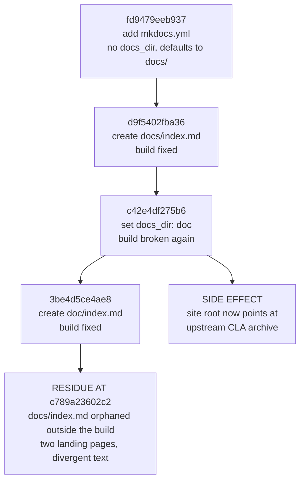

# Change Archaeology & Segmented PR Review

> ⚠️ **Provenance**: `Blitzy-Sandbox/blitzy-odoo`, branch `19.0`. This record covers the **agent-authored change set on that branch**, reconstructed by commit authorship rather than by filename. The reconstructed range is the fixed interval `7bd7718bcd4c..c789a23602c2` — **13 commits, 6 files, 2,025 insertions, 0 deletions**. Both endpoints are named explicitly rather than left as `HEAD`, because the remediation commits that follow `c789a23602c2` change every figure below: this is an archaeology record of a fixed historical range, not a census of the branch as it now stands. Both endpoints are given in the abbreviated form this document uses throughout, per the conventions of subsection 1.2; their full forty-character object names are recorded in the boundary table of subsection 1.1.
>
> ⚠️ **This document is the assessment half of "assess and remediate".** It records what was found and what each repair must achieve. It is not itself a specification of working software, and it makes no claim about accounting capability on this branch — see [the landing page](index.md) for what branch `19.0` actually contains.

## 1. Scope and Method

### 1.1 How the boundary was derived

No commit range and no file list were supplied, so scope was derived from authorship. Filtering `git log` by author isolates a contiguous block of Blitzy-authored commits at the tip of branch `19.0`, bounded below by the last upstream commit.

| Boundary | Commit | Author | Date | Subject |
|----------|--------|--------|------|---------|
| Last upstream commit (exclusive lower bound) | `7bd7718bcd4c5d232779e8eab0340169461af14e` | Gauthier Wala (gawa) &lt;gawa@odoo.com&gt; | 2025-11-18 | `[FIX] account: fix cash basis tax calculation for full payments` |
| Last commit of the reconstructed set (inclusive upper bound) | `c789a23602c24606458ee86783a318f7224d1dd8` | ajay-blitzy &lt;awadhwani@blitzy.com&gt; | 2026-05-15 | `chore: extend catalog tags (security, audit)` |

At `c789a23602c2` the repository carries **197,413 commits** (`git rev-list --count c789a23602c2`) and **45,666 tracked files** (`git ls-tree -r --name-only c789a23602c2 | wc -l`). Thirteen commits is therefore the entire authored surface — a **0.0066 %** share of the history, computed from those two counts. Authorship-based discovery was essential: a path-based guess would have missed `catalog-info.yaml` and `mkdocs.yml` at the repository root while wrongly capturing upstream files under `doc/`.

Discovery was completed in full — the commit inventory, the per-commit replay, and the non-regression proof — **before** any finding was raised. That ordering was imposed by the request itself, which conditioned the review on *"once all changes are identified"*.

Every figure in this record is a measurement taken from an executed command or an executed documentation build, never an estimate. Where a measurement depends on the state of the tree, the commit it was taken at is named.

### 1.2 Citation and command conventions

Every claim about the repository carries a locator and every quantitative claim carries the command that produced it, so that a later reviewer can re-derive each figure rather than trust it. Two conventions govern the whole record, and both are stated here so that no reader has to guess which tree a locator refers to.

- **Citations are pinned to the reconstructed range.** Every `[path:Lnn]` locator names the file *as it stood at `c789a23602c2`*, the inclusive upper bound of the range under review, because five of the six reconstructed paths have since been remediated or removed. Read-only authorities that lie outside the range — `odoo/release.py`, `setup.cfg`, `MANIFEST.in`, `setup.py`, `debian/odoo.docs`, `debian/install`, `debian/copyright`, `.gitignore`, `CONTRIBUTING.md`, `ruff.toml`, `.github/**` and `addons/base_vat/models/res_partner.py` — are cited at their unchanged line numbers, because the range modifies no upstream file. **One entry in that list needs a qualification.** `.gitignore` is read-only *with respect to the reconstructed range*, which does not touch it, but it is **not** read-only across the remediation that follows: `bc1e4f9f5c1b` appends two lines to it. Every citation to it in this record addresses lines at or below L53 and is therefore still valid, because the append is strictly at the end of the file — but the file must not be counted among the paths that never change. Subsection 1.1 and row 7 of subsection 6.1 state its final disposition. **A second qualification governs the other direction.** Three places in this record deliberately assert a *present* location rather than a historical one — subsections 6.5 and 7, and the disposition paragraph of subsection 5.8 — because their subject is where a reference sits **now**, not where it sat at the boundary. A boundary-pinned locator would be actively wrong there: `catalog-info.yaml` grew from 33 lines to 39 and `mkdocs.yml` from 9 to 29, so the same content no longer occupies the same line. Those locators therefore carry the explicit marker `(remediated tree)` defined in the table below, and every locator without that marker is boundary-pinned as this bullet describes. A locator that asserts a present location without the marker is a defect in this record, not a shorthand.
- **Commands are pinned to fixed endpoints, never to a moving `HEAD`.** Every command quoted below uses the literal interval `7bd7718bcd4c..c789a23602c2`, and every tree-wide count is taken at `c789a23602c2` explicitly. Substituting a moving reference would silently re-scope every figure the moment a remediation commit lands — which is precisely the property an archaeology record has to preserve.

| Form | Meaning |
|------|---------|
| `path:Lx` / `path:Lx-Ly` | A line or an inclusive line range, read at `c789a23602c2` unless a different commit is named |
| `path:Lx @ <sha>` | The same, read explicitly at the named commit. Used where a file's line numbering drifted between commits |
| `path:Lx (remediated tree)` | The same, read **after** all ten transformations of subsection 6.1 have landed. Used only where this record asserts a **present** location — subsections 6.5 and 7, and the disposition paragraph of subsection 5.8. Where a reference both moved and matters historically, both forms are given side by side |
| `` `<command>` `` → **result** | A re-runnable measurement. Ranges are always two fixed SHAs; working-tree queries are given in their commit-pinned `git ls-tree` / `git grep <sha>` form so that they return the same answer indefinitely |
| HTTP *nnn* | The status code returned by an unauthenticated request to a public URL |
| PR record | A field of the pull-request record itself. Its merge commit `2c52c6b3aaf70560eff44eb4e60d57cf8a211f8b` sits on branch `pdlc`, so it does **not** resolve in a `19.0`-only checkout — `git cat-file -e` on it fails locally, and the field is re-derived through the repository API instead |

Because citations are pinned to the boundary commit, a cited historical path is often **not** the path the same content occupies after remediation. The mapping is recorded explicitly rather than left to inference, and the relationships are not uniform — two are moves and one is not.

| Cited historical path | Path after remediation | Relationship |
|-----------------------|------------------------|--------------|
| `doc/project-guide.md` | `docs/project-guide.md` | **Relocated** — moved with move semantics, so authorship history follows the content |
| `doc/technical-specifications.md` | `docs/technical-specifications.md` | **Relocated** — moved with move semantics |
| `doc/index.md` | *removed; no successor path* | **Superseded, not moved** — `docs/index.md` already existed, so this page was the later duplicate; its two distinguishing facts were carried into the surviving canonical page. See subsection 6.2 |
| `docs/index.md` | `docs/index.md` | **Same path** before and after; rewritten in place |
| `catalog-info.yaml`, `mkdocs.yml` | `catalog-info.yaml`, `mkdocs.yml` | **Same path** before and after; each rewritten in place. The *path* is unchanged, the *content* is not — see rows 5 and 6 of subsection 6.1 |
| `.gitignore` | `.gitignore` | **Same path** before and after, and **no longer byte-identical to `c789a23602c2`**: `bc1e4f9f5c1b` appended the root-anchored `/site/` entry, so this row must not be read as a claim that the file is unchanged. See row 7 of subsection 6.1 |

### 1.3 Segmentation

The change set is partitioned along the axis of **artifact family and consuming contract**, so that each segment is judged against exactly one authoritative specification, with a final segment for the seams between them.

| Segment | Artifacts | Authoritative contract |
|---------|-----------|------------------------|
| **SEG-1** Service-catalog metadata | `catalog-info.yaml` | Backstage Component descriptor schema, well-known field vocabularies, entity relations |
| **SEG-2** Docs toolchain configuration | `mkdocs.yml` | MkDocs configuration schema, Backstage TechDocs publishing requirements, plugin availability |
| **SEG-3** Documentation entry points | `doc/index.md`, `docs/index.md` | Navigation reachability; a single canonical landing page |
| **SEG-4** Generated documentation content | `doc/project-guide.md`, `doc/technical-specifications.md` | Factual accuracy against the repository; internal consistency |
| **SEG-5** Cross-segment integration | The seams between the above | Agreement between the TechDocs reference, the documentation root, navigation targets, on-disk files, and outbound catalog links |
| **SEG-6** Blast radius and hygiene | Packaging, lint reach, CI absence, build output | Positive proof of upstream non-regression |

### 1.4 Defect taxonomy and severity scale

Each segment is evaluated against a uniform eight-class taxonomy so that the review's completeness is independently checkable.

| Class | Meaning |
|-------|---------|
| **D1** | Contract violation — the artifact breaks its consuming tool's documented schema or semantics |
| **D2** | Broken reference — a path, URL, navigation target, or anchor does not resolve |
| **D3** | Factual inaccuracy — a statement is contradicted by the repository itself |
| **D4** | Internal inconsistency — two in-scope artifacts assert conflicting facts |
| **D5** | Dead or orphaned artifact — present in the tree but unreachable by any consumer |
| **D6** | Missing required or strongly recommended element — its omission degrades the consuming tool's output |
| **D7** | Unsubstantiated claim — a capability or attribute asserted with no supporting evidence |
| **D8** | Hygiene or convention deviation |

| Severity | Meaning |
|----------|---------|
| **Blocker** | The consuming tool fails, or produces a wrong or unresolvable result |
| **Major** | User-visible incorrectness, or a broken link |
| **Minor** | A missing recommended element, or an inconsistency between artifacts |
| **Nit** | Style and wording alone |

Every segment was worked through the same six steps: state the authoritative contract and its source; mechanically validate whatever is machine-checkable; walk every diff line against the taxonomy; assign severity; specify the remediation as a concrete minimal edit; and define the acceptance check that proves the defect is gone.

### 1.5 Methodological disclosure — the named rule definition does not exist

> ⚠️ **The review was requested "using the Segmented PR Review rule definition". No such rule definition exists in this project, and none was retrievable.** The project's rules document was read twice — once with the default window and once over its explicit full range — and returned no rules on both reads. It is empty; this was not a partial read. No segmentation axes, no defect taxonomy, and no severity scale were supplied by it.

The named artifact was therefore treated as a **named methodology** rather than as retrievable text, and the canonical interpretation was instantiated in its place and written out in full in subsections 1.3 and 1.4, so that a reader can check this review against the standard it claims to follow. **What appears in those subsections is that instantiation, not the requester's rule.** No rule was invented, and nothing here is presented as though it had been supplied.

**Why this resolution rather than the alternatives.** Three considerations settled it.

- **Fabricating a definition and attributing it to the requester was rejected outright.** Inventing a rule and presenting it as the project's own would be a worse failure than the missing text, and the absence of rules is explicitly not treated as permission to lower the bar.
- **Abandoning the segmentation was also rejected**, because it would ignore an explicit instruction and discard the rigor the request asked for. A segmented review is fully determined once the segmentation axes and the per-segment defect taxonomy are fixed, and both are fixed in writing here.
- **The substitution is low-risk in this particular case, because the findings are properties of the artifacts themselves rather than of the grouping applied to them.** A link that returns 404 returns 404 regardless of which segment it is filed under. Supplying a different segmentation would reorganise and re-rank this report without changing a single one of its conclusions.

If a canonical Segmented PR Review definition exists outside this project, supplying it would allow these same findings to be re-grouped under that scheme. No finding would be lost in the process.

### 1.6 Standards applied in place of rules

Because no rules were supplied, the review was held to enterprise-standard best practice reinforced by the conventions this repository documents for itself. These standards are named here so that the record can be audited against them, and each is tied to the evidence that establishes it.

| Standard | Basis | Consequence for this review |
|----------|-------|-----------------------------|
| **ST-1** Stable-series change discipline | [CONTRIBUTING.md:L14] — *"There are restrictions on the kind of changes allowed in stable series"* | Every remediation is the minimal edit that closes its finding. No behavioural change, and no scope expansion beyond the findings recorded here |
| **ST-2** Generated-file immutability | [ruff.toml:L1-L2] declares itself generated by the runbot nightly checks and marked do-not-modify | `ruff.toml` is excluded from remediation, and the principle generalises to any file bearing such a marker |
| **ST-3** External-contract conformance over syntactic validity | Both changed configuration files parse cleanly under a plain YAML safe-loader | Parse success establishes nothing. Each artifact is validated against its consuming tool's published contract and then verified **by running that tool** — which is the only reason the two blockers were found |
| **ST-4** Forward-fixing only | The thirteen commits are merged and published on a stable series | All repair is additive follow-up edits. No rebase, no amend, no revert-by-rewrite, no force-push. Commit messages are immutable history |
| **ST-5** Evidence and citation obligation | The conventions of subsection 1.2 | Every claim about the existing system carries an inline path-and-locator citation, and every quantitative claim is a measurement from an executed command or build |
| **ST-6** Repository convention adherence | Sibling documentation filenames are kebab-case; [.gitignore:L45-L53] root-anchors build and environment output | New filenames follow the kebab-case pattern; every file the remediation touches ends with a newline |
| **ST-7** Dependency ordering, never calendar time | Platform-authored planning content describes how work is sequenced, not when it happens | This record states dependency ordering only. Commit dates appear because they are historical fact. It is also why finding S4-05 is a defect and not a stylistic preference |
| **ST-8** Advisory-only linting | The repository ships no `.markdownlint*`, `.editorconfig`, `.pre-commit-config.yaml`, `.yamllint*`, `pyproject.toml`, `tox.ini`, `Makefile`, or `package.json` | YAML and Markdown linter output is reported as advisory. No linter configuration is introduced |
| **ST-9** The plan is frozen, and outranks every heuristic | The plan is the agreed contract for this work; it enumerates, per file, the corrections that are authorised, and it is aligned to rather than edited | Where a plan-fixed document is concerned, an accessibility heuristic, a framework default, a linter preference, an existing test expectation or an aesthetic judgement **never** overrides the enumeration. A defensible improvement that the enumeration does not name is an unauthorised edit, not a permitted one. This is the standard finding D31 invokes, the standard subsection 5.7 applies to the withdrawn diagram alternatives, and the standard the single regression recorded in subsection 6.8 breached |

---

## 2. Change Inventory

### 2.1 The six files

Every entry is an addition. There are no deletions and no modifications to any pre-existing file anywhere in the range.

| File | Status | Insertions | Deletions | Artifact family |
|------|--------|-----------:|----------:|-----------------|
| `catalog-info.yaml` | Added | 32 | 0 | Service-catalog metadata |
| `mkdocs.yml` | Added | 9 | 0 | Docs toolchain configuration |
| `doc/index.md` | Added | 5 | 0 | Documentation entry point |
| `docs/index.md` | Added | 3 | 0 | Documentation entry point |
| `doc/project-guide.md` | Added | 502 | 0 | Generated documentation content |
| `doc/technical-specifications.md` | Added | 1,474 | 0 | Generated documentation content |
| **Total** | **6 files, all adds** | **2,025** | **0** | **4 families** |

### 2.2 The thirteen commits

Twelve are authored by Michael Montanaro &lt;michael@blitzy.com&gt; on 2026-04-06; the thirteenth by ajay-blitzy &lt;awadhwani@blitzy.com&gt; on 2026-05-15. Every row nevertheless carries its own author identity and commit date rather than relying on that summary, so each entry is attributable on its own. The ordering is oldest first, and the metadata is authoritative: `git log --reverse --date=short --format='%h|%s|%an <%ae>|%ad' 7bd7718bcd4c..c789a23602c2`.

| # | Commit | Author & date | Subject | Effect |
|---|--------|---------------|---------|--------|
| 1 | `3322c9fb56fc` | `Michael Montanaro <michael@blitzy.com>` · 2026-04-06 | Add Backstage catalog-info.yaml for developer portal integration | Adds the descriptor with tags `python`/`web-app`/`in-progress`, an `in-progress` status label, no TechDocs annotation, and system `blitzy-sandbox-projects` |
| 2 | `89bf914d81fe` | `Michael Montanaro <michael@blitzy.com>` · 2026-04-06 | chore: update catalog tags — remove status, add work type | Removes both the `in-progress` tag and the status label; adds tag `refactor`. Net effect: the only in-progress signal is deleted while the declared lifecycle stays `production` |
| 3 | `4519ac913f3c` | `Michael Montanaro <michael@blitzy.com>` · 2026-04-06 | chore: add techdocs-ref annotation for TechDocs support | Adds `backstage.io/techdocs-ref: dir:.`; also strips the trailing newline |
| 4 | `fd9479eeb937` | `Michael Montanaro <michael@blitzy.com>` · 2026-04-06 | chore: add mkdocs.yml for TechDocs | Adds the site config with no `docs_dir`, so MkDocs defaults to `docs/` — which did not yet exist. **The build is broken at this commit.** |
| 5 | `d9f5402fba36` | `Michael Montanaro <michael@blitzy.com>` · 2026-04-06 | chore: add docs/index.md for TechDocs | Creates `docs/index.md`. The build is fixed |
| 6 | `c42e4df275b6` | `Michael Montanaro <michael@blitzy.com>` · 2026-04-06 | chore: set docs_dir to doc/ for TechDocs compatibility | Repoints the documentation root to `doc/`. **Breaks the build again** and strands `docs/index.md`; also strips the trailing newline |
| 7 | `f3679676519f` | `Michael Montanaro <michael@blitzy.com>` · 2026-04-06 | chore: assign component to blitzy-python system for catalog graph | Changes `spec.system` to `blitzy-python` |
| 8 | `3be4d5ce4ae8` | `Michael Montanaro <michael@blitzy.com>` · 2026-04-06 | docs: add index.md for TechDocs | Creates `doc/index.md` with text differing from `docs/index.md`. The build is fixed and `docs/index.md` is now permanently orphaned |
| 9 | `4e0e6df0811f` | `Michael Montanaro <michael@blitzy.com>` · 2026-04-06 | docs: add mermaid2 plugin for diagram support | Adds the `mermaid2` plugin but no fence configuration, so the stated purpose is not achieved — see subsection 3.5 |
| 10 | `ce5781adcadf` | `Michael Montanaro <michael@blitzy.com>` · 2026-04-06 | docs: add Project Guide from Blitzy | Adds the 502-line project guide |
| 11 | `e684fbe46c33` | `Michael Montanaro <michael@blitzy.com>` · 2026-04-06 | docs: add Technical Specifications from Blitzy | Adds the 1,474-line specification |
| 12 | `b58d620c4fb2` | `Michael Montanaro <michael@blitzy.com>` · 2026-04-06 | docs: add Blitzy documentation to nav | Adds two navigation entries; leaves the file without a trailing newline |
| 13 | `c789a23602c2` | `ajay-blitzy <awadhwani@blitzy.com>` · 2026-05-15 | chore: extend catalog tags (security, audit) | Adds two tags, but the diff is sixteen insertions against thirteen deletions because the whole file was round-tripped through a YAML serialiser — the description was folded, sequence indentation changed from four spaces to two, quoting style changed, and the trailing newline was restored |

Reviewing the net diff alone would have concealed commits 4 through 8 entirely, because their effects cancel in the aggregate while leaving permanent residue. Each commit was therefore replayed individually.

---

## 3. Chronological Narrative

### 3.1 The documentation-root flip-flop

Commits 4 through 8 form a flip-flop whose net result is two landing pages with different text, only one of which is reachable.

| Step | Commit | Configured root | On-disk index | Build state |
|------|--------|-----------------|---------------|-------------|
| 1 | `fd9479eeb937` | `docs/` (MkDocs default; `docs_dir` absent) | none | **Broken** — no documentation directory exists |
| 2 | `d9f5402fba36` | `docs/` | `docs/index.md` | Fixed |
| 3 | `c42e4df275b6` | `doc/` (explicit `docs_dir: doc`) | `docs/index.md` only | **Broken again** — and `docs/index.md` is now stranded |
| 4 | `3be4d5ce4ae8` | `doc/` | `doc/index.md` **and** `docs/index.md` | Fixed, with permanent residue |

**Diagram text alternative** — *the documentation-root flip-flop*, a
top-to-bottom graph with six nodes and five edges. The chain runs
`fd9479eeb937` (add `mkdocs.yml`, no `docs_dir`, defaults to `docs/`) to
`d9f5402fba36` (create `docs/index.md`, build fixed) to `c42e4df275b6` (set
`docs_dir: doc`, build broken again) to `3be4d5ce4ae8` (create `doc/index.md`,
build fixed), and finally to a terminal node reading *residue at
`c789a23602c2`* — `docs/index.md` orphaned outside the build, two landing pages
with divergent text. A fifth edge branches separately out of `c42e4df275b6` to
a second terminal node reading *side effect* — the site root now points at the
upstream CLA archive. So `c42e4df275b6` is the only node with two outbound
edges, and the two terminal nodes are the two consequences that outlived the
sequence.

Two consequences outlived the sequence. First, `docs/index.md` was left orphaned outside the build — present in the tree, reachable by no consumer, and carrying text that diverged from the page that replaced it. Second, and far more consequential, the configured site root was pointed at `doc/`, a directory that at the boundary commit contained **nothing but Odoo's contributor-agreement archive**.

### 3.2 Why pointing the root at `doc/` was a capture, not a preference

Ownership of the two similarly named directories was established with hard counts rather than by inspection.

- Pre-boundary history contains **3,623** commits touching `doc/` (`git rev-list --count 7bd7718bcd4c -- doc/`), reaching back to a 2006 trunk import. At the boundary commit that directory contained **only** the `cla` subtree — `git ls-tree --name-only 7bd7718bcd4c doc/` returns the single entry `doc/cla`.
- Pre-boundary history contains **zero** commits touching `docs/` (`git rev-list --count 7bd7718bcd4c -- docs/`), confirming it as greenfield created by this change set.
- Upstream was still adding to `doc/` after the boundary, so every future contributor-agreement signature would silently join the published developer portal.
- Historical Sphinx tooling under `doc/` is still referenced by the `_build/` ignore rule at [.gitignore:L1-L2] and by extension copyright attributions at [debian/copyright:L216].

At the boundary the `doc/` tree held **997** tracked files, of which **996** are Markdown. The `doc/cla/` subtree accounts for **994** of them — **993** Markdown files, being **715** individual agreements under `doc/cla/individual/`, **275** corporate agreements under `doc/cla/corporate/` and exactly **3** policy documents (`doc/cla/ccla-1.0.md`, `doc/cla/icla-1.0.md`, `doc/cla/sign-cla.md`), plus one Python helper at [doc/cla/stats.py]. The remaining three files were the Blitzy documents. **993 of the 996 Markdown files under the configured site root were therefore contributor agreements**, which is the arithmetic behind the capture recorded as S2-01.

### 3.3 The status-signal deletion

Commit 1 declared the component with an `in-progress` tag **and** an `in-progress` status label, alongside `spec.lifecycle: production`. Commit 2 removed both in-progress signals and left the `production` lifecycle in place — `catalog-info.yaml:L26 @ 89bf914d81fe`, where the commit left it, and still `catalog-info.yaml:L30 @ c789a23602c2` at the boundary, unchanged across the eleven commits in between.

The descriptor thereafter asserted an established, maintained component while the repository's own project guide reported the work as substantially incomplete: [doc/project-guide.md:L5] states *"Project Completion: 17% (110 hours completed out of 640 total hours)"*. A descriptor claiming `production` against a self-reported **17%** completion is an internal contradiction, and it was created by a commit whose subject describes it as a tag tidy-up.

Framed as the repository's own pull-request template frames a change — **current behaviour**: the catalog advertises a production-ready component with no in-progress signal of any kind; **desired behaviour**: the declared lifecycle matches the repository's stated completion status, and the in-progress signal that commit 1 supplied is restored.

### 3.4 The newline regressions and their accidental repair

Trailing newlines were stripped twice, by commits 3 and 6, and `mkdocs.yml` was left without one by commit 12. The descriptor's newline was restored by commit 13 — not deliberately, but as a side effect of round-tripping the whole file through a YAML serialiser. That round trip is also why commit 13 reports sixteen insertions against thirteen deletions for what its subject describes as adding two tags: it reformatted the description folding, the sequence indentation, and the quoting style at the same time.

The site configuration's own missing newline outlived the range and is recorded as S2-05. Because the file's length changed during the remediation, its locators are qualified where that matters: the final line is `mkdocs.yml:L9 @ c789a23602c2` and `mkdocs.yml:L10 @ f9bee9fb4234`, with `wc -c mkdocs.yml` reporting 263 bytes and a last byte of `2` at the latter commit.

### 3.5 Commit 9's inert diagram plugin

Commit 9 — `4e0e6df0811f`, *"docs: add mermaid2 plugin for diagram support"* — states diagram support as its purpose and does not achieve it. It appends `mermaid2` to the plugin list — `mkdocs.yml:L7 @ 4e0e6df0811f`, which the two navigation entries of commit 12 later push down to `mkdocs.yml:L9 @ c789a23602c2` — and supplies no fence configuration, and in that arrangement the plugin cannot work: the `techdocs-core` bundle declared immediately above it, at `mkdocs.yml:L6 @ 4e0e6df0811f` and `mkdocs.yml:L8 @ c789a23602c2`, already claims the `mermaid` fence, and it relocates the fence configuration to a different key than `mermaid2` inspects, so the plugin's custom loader never activates and its post-page hook never fires.

The effect is measured, not inferred. Built from the boundary tree, all **seven** diagram fences — [doc/project-guide.md:L58], [doc/project-guide.md:L64], [doc/technical-specifications.md:L291], [doc/technical-specifications.md:L491], [doc/technical-specifications.md:L506], [doc/technical-specifications.md:L524] and [doc/technical-specifications.md:L539] — emit `language-text highlight` code blocks with line numbers, and the built pages contain no diagram element and no diagram runtime at all: **4** plain-text blocks on the project guide and **10** on the specification, against **0** diagram blocks on either. The commit therefore added a third-party package to the documentation toolchain and delivered nothing. Plugin ordering is not the cause — both orderings were tested and produce identical output, and the same plugin renders correctly when the `techdocs-core` bundle is absent. The defect is recorded as **S2-02** in subsection 5.2 with its remediation and acceptance check, and the before-and-after block counts are in the metric table of subsection 6.4.

### 3.6 The scoping error behind the factual inaccuracies

The project guide asserts delivery statistics at [doc/project-guide.md:L378-L388] — 47 commits, 81 files created, 27,707 lines added, a 43-file documentation set, and a 36-file financial-reports module — that bear no relation to a branch containing 13 commits and 6 files. Querying the repository's published metadata resolved the discrepancy rather than leaving it as apparent fabrication: the pull request the documents describe is PR #2, linked at [catalog-info.yaml:L22-L23].

| PR record field | Value | Consequence |
|-----------------|-------|-------------|
| `base` | **`pdlc`** | The change set was merged into a different branch, not `19.0` |
| `merged` | `true`, merge commit `2c52c6b3aaf70560eff44eb4e60d57cf8a211f8b` | The record is settled and citable by a fixed SHA — one that does not resolve in a `19.0`-only checkout, as subsection 1.2 discloses |
| `changed_files` | **81** | Matches the guide's *Files Created* figure exactly |
| `commits` | **49** | The guide's *Total Commits* figure of 47 is wrong by two. The guide nevertheless **still reads 47**, and deliberately so: the plan authorises correcting exactly **one** figure in that table, and that one is `additions`. See subsection 6.8 |
| `additions` | **27,905** | The guide's 27,707 is wrong by 198; the authoritative figure is 27,905. This **is** the one figure the plan authorises correcting, and the guide now carries it |
| `deletions` | 0 | Entirely additive, like this branch's own change set |

Absence on this branch was verified directly and — because the two cases differ in a way that changes the remediation — so was presence on `pdlc`.

| Artifact the documents describe | On branch `19.0` | On branch `pdlc` |
|--------------------------------|------------------|------------------|
| `tickets/` | **Absent** — `git ls-tree -r --name-only c789a23602c2 -- tickets/` returns nothing | **Present** — the repository contents API returns HTTP 200 for this path at `ref=pdlc` |
| `addons/account_financial_report_ce/` | **Absent** — the same query returns nothing | **Present** — HTTP 200 at `ref=pdlc` |
| `addons/account_reports/`, `addons/account_accountant/`, `addons/account_asset/`, `addons/account_budget/`, `addons/account_followup/` | **Absent** — the same query returns nothing for any of the five | **Also absent** — HTTP **404** at `ref=pdlc` for each of the five |

The distinction matters. The first two artifacts genuinely exist, just not here, so the corresponding claims are a **scoping** error and the remediation re-attributes them. The five accounting addons exist on **neither** branch, so claims about them were aspirational from the outset and the remediation states that plainly rather than re-attributing them to `pdlc`.

The two generated documents are therefore substantially **accurate about `pdlc` and wrong about the branch they are published on**. That single insight converts a cluster of apparently invented claims into one fixable scoping error, and it is why the remediation re-attributes the statistics rather than deleting them.

---

## 4. Non-Regression Proof

Because the checkout carries **45,666** tracked files at `c789a23602c2`, the absence of source-code change was **proven, not assumed**. Every check below is re-runnable and returns the same answer indefinitely, because no check is expressed against a moving reference.

> ⚠️ **Boundary discipline — no measurement in this section is expressed against a moving reference.** The archaeology range has a *fixed* upper bound, `c789a23602c2`. Substituting `HEAD` for it would not merely be imprecise, it would be wrong: measured while this record was being written, `7bd7718bcd4c..HEAD` already resolved to more commits and more insertions than the fixed range's **13 commits and 2,025 insertions**, and it moves again with every remediation commit. Working-tree queries such as `git status --porcelain` and `git ls-files` are moving references for the same reason, so every check below is given in its commit-pinned `git diff <sha>..<sha>` / `git ls-tree <sha>` / `git grep <sha>` form instead.

### 4.1 Proof pinned to the reconstructed change set — `7bd7718bcd4c..c789a23602c2`

| # | Check | Exact command | Result |
|---|-------|---------------|--------|
| NR-1 | Files changed in the range | `git diff --name-only 7bd7718bcd4c..c789a23602c2` | **6** paths: `catalog-info.yaml`, `doc/index.md`, `doc/project-guide.md`, `doc/technical-specifications.md`, `docs/index.md`, `mkdocs.yml` |
| NR-2 | Every changed path is an addition | `git diff --name-status 7bd7718bcd4c..c789a23602c2` | six entries, all `A`; **0** `M`, **0** `D` |
| NR-3 | Aggregate delta | `git diff --shortstat 7bd7718bcd4c..c789a23602c2` | *6 files changed, 2025 insertions(+)* — zero deletions, and no modification to any pre-existing file |
| NR-4 | Source-extension files in the range | `git diff --name-only 7bd7718bcd4c..c789a23602c2 -- '*.py' '*.js' '*.xml' '*.csv' '*.scss' '*.po' '*.pot'` | **0 paths** |
| NR-5 | Upstream-path files in the range | `git diff --name-only 7bd7718bcd4c..c789a23602c2 -- addons odoo setup debian .github` | **0 paths** |
| NR-6 | Contributor-agreement archive intact | `git ls-tree -r --name-only c789a23602c2 -- doc/cla/` and the same range restricted to `doc/cla/` | **994** paths present; **0** changed |
| NR-7 | Repository-wide sweep for the marker string | `git grep -lil blitzy c789a23602c2` | exactly the six paths of NR-1, nothing else — an independent corroboration of the authorship-derived boundary |
| NR-8 | Sweep for `techdocs` / `catalog-info` | `git grep -lil -e techdocs -e catalog-info c789a23602c2` | the two configuration files, plus **one** upstream false positive — see subsection 4.4 |
| NR-9 | Markdown link integrity | `git show c789a23602c2:<path>` for each of the four in-scope Markdown files, matched against a Markdown link pattern | **0** links in all four — so the relocation could not break an inbound link |

### 4.2 Cumulative re-assertion — separately labelled and pinned to every commit of the remediation series

The requirement that the repository remain byte-identical outside the ten in-scope paths must be **re-asserted after remediation**, using the same two zero-count checks that established non-regression at the start. That is a **different claim** about a **different range**, so it is recorded separately rather than folded into subsection 4.1 — and it too is pinned to fixed commits, never to a moving reference.

The table below carries **one instance of the invariant per commit in the remediation series**, and the series is complete through `e6b8931ff8a2`. Row numbers record the order in which rows were *added to this table*, not the order in which the commits were authored; the *Check* column therefore names each commit explicitly. In commit order — `git log --reverse --format=%h c789a23602c2..e6b8931ff8a2` — the series runs `7a543d4b3eea` (NR-14), `9e7ea620a69e` (NR-15), `f9bee9fb4234` (NR-10 … NR-12), `39efbcd2b81b` (NR-13), `712739da9e8a` (NR-16), `08a62fff8802` (NR-17), `f6381d44099c` (NR-18), `bc1e4f9f5c1b` (NR-19), `c9126517a293` (NR-20), `3faa52eab4fe` (NR-21) and `e6b8931ff8a2` (NR-22). No earlier row was deleted or re-pointed to make room for the nine that were added later, which is the obligation the closing paragraphs of this subsection impose.

| # | Check | Exact command | Result |
|---|-------|---------------|--------|
| NR-10 | Source-extension files, baseline through the remediation series | `git diff --name-only 7bd7718bcd4c..f9bee9fb4234 -- '*.py' '*.js' '*.xml' '*.csv' '*.scss' '*.po' '*.pot'` | **0 paths** |
| NR-11 | Upstream-path files, same range | `git diff --name-only 7bd7718bcd4c..f9bee9fb4234 -- addons odoo setup debian .github` | **0 paths** |
| NR-12 | The remediation touches only in-scope paths | `git diff --name-only c789a23602c2..f9bee9fb4234` | `doc/index.md`, `docs/change-archaeology-and-review.md`, `docs/index.md`, `docs/project-guide.md`, `docs/technical-specifications.md`, `mkdocs.yml` — six paths, every one drawn from the ten transformations of subsection 6.1 |
| NR-13 | The same three assertions, re-measured at the later remediation commit that hardened this record | `git diff --name-only 7bd7718bcd4c..39efbcd2b81b` with the two pathspecs of NR-10 and NR-11, and `git diff --name-only c789a23602c2..39efbcd2b81b` | **0 paths**, **0 paths**, and the same **six** in-scope paths — the changed-path set did not widen |
| NR-14 | The same three assertions at the **first** remediation commit, which relocated the two generated documents | `git diff --name-only 7bd7718bcd4c..7a543d4b3eea` with the two pathspecs of NR-10 and NR-11, and `git diff --name-only c789a23602c2..7a543d4b3eea` | **0 paths**, **0 paths**, and **two** in-scope paths — `docs/project-guide.md`, `docs/technical-specifications.md`. The `doc/` originals are still present at this commit; their deletion lands at `f9bee9fb4234`, which is why this row lists two paths and NR-12 lists six |
| NR-15 | The same three assertions at the commit that pinned this record's evidence and hardened the setup examples | `git diff --name-only 7bd7718bcd4c..9e7ea620a69e` with the two pathspecs of NR-10 and NR-11, and `git diff --name-only c789a23602c2..9e7ea620a69e` | **0 paths**, **0 paths**, and the same **two** in-scope paths |
| NR-16 | The same three assertions at the commit that completed the site configuration | `git diff --name-only 7bd7718bcd4c..712739da9e8a` with the two pathspecs of NR-10 and NR-11, and `git diff --name-only c789a23602c2..712739da9e8a` | **0 paths**, **0 paths**, and the same **six** in-scope paths — **8** under `--no-renames`, the two extra entries being the source halves of the two renames |
| NR-17 | The same three assertions at the commit that reworked the four documentation artifacts for runtime and accuracy defects | `git diff --name-only 7bd7718bcd4c..08a62fff8802` with the two pathspecs of NR-10 and NR-11, and `git diff --name-only c789a23602c2..08a62fff8802` | **0 paths**, **0 paths**, and the same **six** in-scope paths (**8** under `--no-renames`). This commit is nevertheless the **first** of the two regressions in the series — see subsection 6.8, and NR-20 for the second — which is precisely the point of recording that these checks measure *path* scope and not content correctness |
| NR-18 | The same three assertions at the commit that repaired the service-catalog descriptor | `git diff --name-only 7bd7718bcd4c..f6381d44099c` with the two pathspecs of NR-10 and NR-11, and `git diff --name-only c789a23602c2..f6381d44099c` | **0 paths**, **0 paths**, and **seven** in-scope paths (**9** under `--no-renames`) — `catalog-info.yaml` joins the set |
| NR-19 | The same three assertions at the commit that closed the ignore leg | `git diff --name-only 7bd7718bcd4c..bc1e4f9f5c1b` with the two pathspecs of NR-10 and NR-11, and `git diff --name-only c789a23602c2..bc1e4f9f5c1b` | **0 paths**, **0 paths**, and **eight** in-scope paths — `.gitignore` joins the set. Under `--no-renames` the figure is **10**, which is exactly the ten transformations of subsection 6.1, neither more nor fewer |
| NR-20 | The same three assertions at the commit that corrected the published documentation and the site configuration's search note — **the second regression in the series**, restored by the commit that publishes this revision (subsection 6.8) | `git diff --name-only 7bd7718bcd4c..c9126517a293` with the two pathspecs of NR-10 and NR-11, and `git diff --name-only c789a23602c2..c9126517a293` | **0 paths**, **0 paths**, and the same **eight** in-scope paths (**10** under `--no-renames`) — the changed-path set did not widen. Like NR-17, this row is the demonstration that these checks measure *path* scope and not content correctness: the commit is path-clean and content-wrong at the same time |
| NR-21 | The same three assertions at the commit that restored the two plan-protected documents and reconciled this record — the commit that published the previous revision, and the row that discharges the one inherited obligation that revision recorded | `git diff --name-only 7bd7718bcd4c..3faa52eab4fe` with the two pathspecs of NR-10 and NR-11, and `git diff --name-only c789a23602c2..3faa52eab4fe` | **0 paths**, **0 paths**, and the same **eight** in-scope paths (**10** under `--no-renames`) — `.gitignore`, `catalog-info.yaml`, `doc/index.md`, `mkdocs.yml` and the four files under `docs/`. The set neither widened nor narrowed across the restoration |
| NR-22 | The same three assertions at the commit that closed the five security-review findings on the documentation toolchain — the commit that published the previous revision, and the row that discharges the obligation that revision inherited | `git diff --name-only 7bd7718bcd4c..e6b8931ff8a2` with the two pathspecs of NR-10 and NR-11, and `git diff --name-only c789a23602c2..e6b8931ff8a2` | **0 paths**, **0 paths**, and the same **eight** in-scope paths (**10** under `--no-renames`) — the identical set NR-21 enumerates. The security remediation touched `mkdocs.yml` and three files under `docs/` and widened nothing |

**The invariant, and the obligation it places on whoever extends this record.** The property being asserted is per-commit and does not depend on which commit is currently the tip: *for every commit `C` in the remediation series, `git diff --name-only 7bd7718bcd4c..C` contains no path matching a source extension, no path under an upstream prefix, and no path outside the ten in-scope paths of subsection 6.1.* The measurements above are its instances at all eleven commits of the series to date — `7a543d4b3eea`, `9e7ea620a69e`, `f9bee9fb4234`, `39efbcd2b81b`, `712739da9e8a`, `08a62fff8802`, `f6381d44099c`, `bc1e4f9f5c1b`, `c9126517a293`, `3faa52eab4fe` and `e6b8931ff8a2`, carried by thirteen rows because `f9bee9fb4234` is measured by three. **Any later remediation commit must add its own pinned row rather than re-point these to a moving reference** — the failure mode this subsection exists to prevent. Rows NR-14 … NR-22 are that obligation being discharged: at the revision NR-13 was written the table pinned only two of the then-four commits, and the nine rows added since close the gap additively, without deleting, renumbering or re-pointing NR-10 … NR-13.

**The one commit this table cannot cite, and why that is not a loophole.** A commit cannot contain its own hash, so the row that records a commit must be written in a *later* one; the pinned instances therefore always lag the branch tip by exactly the commit that publishes the row. That residue is covered deliberately rather than left silent: the claim being carried forward is the **invariant**, not any single row, and the invariant is stated above in a form that quantifies over every commit in the series including the ones not yet written. The obligation on the next extension is consequently precise — pin every commit added since the last row, never substitute a moving reference for the range, and never delete an existing row to make room. Following that rule, the table grows and the pinned lower bound `7bd7718bcd4c` never moves.

**Where the lag stands at this revision.** The pinned rows reach `e6b8931ff8a2`, the tip at which this revision was authored, so the series is complete except for the single commit that publishes this revision itself — the one row that cannot exist yet, for the reason just given. That residue is exactly one commit and no more, and the invariant stated above already quantifies over it. NR-22 is the previous revision's inherited obligation discharged verbatim as it was stated: a row pinning the commit that published it, added without touching NR-10 … NR-21. Whoever writes the next revision inherits the identical obligation, and nothing besides it: add a row pinning the commit that published this one.

### 4.3 The scale of what is provably untouched

Unless another command is named, every figure is the number of paths listed by `git ls-tree -r --name-only c789a23602c2` restricted as the *Filter* column describes. Not one member of any population below appears in NR-1.

| Surface | Count | Filter |
|---------|------:|--------|
| Tracked files in total | 45,666 | *(unrestricted)* |
| Files under `addons/` | 43,419 | pathspec `-- addons` |
| Files under `odoo/` | 1,195 | pathspec `-- odoo` |
| Addon modules | 605 | top-level directories under `addons/` |
| Python files | 8,183 | paths ending `.py` |
| JavaScript files | 5,698 | paths ending `.js` |
| XML files | 5,310 | paths ending `.xml` |
| Markdown files under `doc/cla/` | 993 | pathspec `-- doc/cla`, of 994 tracked files |
| Commits in history | 197,413 | `git rev-list --count c789a23602c2` |
| …of which agent-authored | 13 | `git rev-list --count 7bd7718bcd4c..c789a23602c2` |

**Odoo runtime behaviour is therefore unaffected**, and no in-scope file enters the source distribution or the Debian package: [MANIFEST.in] ships only `requirements.txt`, `LICENSE` and `README.md` plus a graft of `odoo`; [setup.py:L24-L26] uses namespace-package discovery with package data included; [debian/odoo.docs] lists `README.md`; and [debian/install:L2] installs `README.md` alone.

Lint reach over this change set is nil: the flake8 configuration at [setup.cfg:L5-L10] excludes `doc` and `setup` — the `doc,` entry is at L9 — no Python was added, [ruff.toml:L1-L2] declares itself *"automatically generated file by the runbot nightly ruff checks, do not modify"*, and the repository ships no Markdown or YAML linter configuration. No continuous-integration workflow exists: `git ls-tree -r --name-only c789a23602c2 -- .github` returns exactly three files, `ISSUE_TEMPLATE/1_bug_form.yml`, `ISSUE_TEMPLATE/config.yml` and `PULL_REQUEST_TEMPLATE.md`, none of them a workflow — which is the direct reason none of the defects in section 5 was caught before merge.

Finally, the fact that makes the whole of section 5 necessary: **both changed configuration files parse cleanly.** `yaml.safe_load` on `git show c789a23602c2:catalog-info.yaml` yields the keys `apiVersion`, `kind`, `metadata`, `spec`, and on `git show c789a23602c2:mkdocs.yml` yields `docs_dir`, `site_name`, `nav`, `plugins`. Parse success therefore establishes nothing about correctness, which is why every artifact is judged against its consuming tool's published contract and then verified by **running** that tool.

### 4.4 Marker sweeps, and the one false positive they produce

- The `blitzy` sweep of NR-7 returns exactly the six reconstructed paths. `git ls-files blitzy/` returns **nothing**: no `blitzy/` path is tracked at the boundary or anywhere in the range, which is the check that matters for S1-01 — an untracked local directory of that name may exist in a working checkout for unrelated tooling output, so a bare filesystem test is not evidence.
- The `techdocs` / `catalog-info` sweep of NR-8 returns **three** paths: the two configuration files, plus **one upstream false positive** at [addons/base_vat/models/res_partner.py:L569], which carries a `techdocs.broadcom.com` reference URL inside a comment that predates the baseline. It is recorded explicitly so that a future reviewer re-running the sweep is not misled into treating an untouched upstream file as part of this change set.
- `git grep -n -e 'project-guide.md' -e 'technical-specifications.md' c789a23602c2` returns, outside the two documents themselves, only the two navigation entries at [mkdocs.yml:L5-L6] — so the relocation has no other dependent anywhere in the tree.
- These blast-radius checks are registered individually as **S6-01 … S6-05** in subsection 5.6.

---

## 5. Findings

**Twenty-nine defect findings** were raised — **5 Blocker, 7 Major, 12 Minor, 5 Nit** — alongside **five verification checks**, S6-01 … S6-05, which produced no defect at all. That is **thirty-four named identifiers**: twenty-nine defects that required remediation plus five positive-evidence checks that required none. None of the twenty-nine lies in Odoo runtime code.

Every total below is derived mechanically by adding up the per-finding rows in subsections 5.1 to 5.5; none is restated from a separate summary, precisely so that the register and the totals cannot drift apart. Two arithmetic facts are worth stating explicitly because they are easy to miscount: SEG-4 carries **three** Blockers — S4-01, S4-02 and S4-03 are each a factual claim the branch itself contradicts — and SEG-6 contributes **no** defect rows at all, so it adds nothing to any severity column.

| Segment | Blocker | Major | Minor | Nit | Headline finding |
|---------|--------:|------:|------:|----:|------------------|
| SEG-1 catalog metadata | 0 | 2 | 3 | 2 | A documentation link returning 404, and a `production` lifecycle contradicted by the repository's own completion status |
| SEG-2 toolchain configuration | 2 | 1 | 2 | 1 | The site root captures 993 upstream legal documents, and diagram support does not function |
| SEG-3 entry points | 0 | 2 | 1 | 0 | An orphaned landing page and a divergent duplicate |
| SEG-4 generated content | 3 | 2 | 4 | 1 | Delivery statistics and file inventories describing a different branch |
| SEG-5 integration | 0 | 0 | 2 | 1 | Four competing descriptions of the same repository |
| SEG-6 blast radius and hygiene | 0 | 0 | 0 | 0 | Clean — non-regression proven; packaging and lint reach unaffected |
| **Total** | **5** | **7** | **12** | **5** | — |

**Entries per segment**, restated here rather than as a seventh column because seven columns cannot fit the published content width: SEG-1 catalog metadata — 7 defects; SEG-2 toolchain configuration — 6 defects; SEG-3 entry points — 3 defects; SEG-4 generated content — 10 defects; SEG-5 integration — 3 defects; SEG-6 blast radius and hygiene — 0 defects, 5 verification checks; Total — 29 defects + 5 checks = 34 identifiers.

**How the count reconciles, three ways.** By severity, 5 + 7 + 12 + 5 = **29**. By segment, 7 + 6 + 3 + 10 + 3 + 0 = **29**. By identifier, `S1-01`…`S1-07` (7) + `S2-01`…`S2-06` (6) + `S3-01`…`S3-03` (3) + `S4-01`…`S4-10` (10) + `S5-01`…`S5-03` (3) = **29**. All three agree. SEG-6's five entries are verification checks that produced no defect, which is why its row reads 0/0/0/0 and why they are deliberately **not** counted among the 29.

Every row carries an **Evidence** cell holding the locator that fixes the finding to a place in the tree — read at `c789a23602c2` unless another commit is named, per the conventions of subsection 1.2 — together with the command, HTTP status, PR-record field or stored build log that produced any quantitative claim in the row. The two stored build logs referred to below are the **baseline strict-build log** (the reconstructed configuration at `c789a23602c2` built against `doc/` at that commit) and the **current strict-build log** (the configuration and tree as they now stand); both were produced with `mkdocs build --strict` under MkDocs 1.6.1 and `mkdocs-techdocs-core` 1.7.0.

### 5.1 SEG-1 — Service-catalog metadata

| ID | Severity · class | Finding | Remediation |
|----|------------------|---------|-------------|
| S1-01 | Major · D2 | The third link targets a `blitzy/documentation` tree path that is tracked nowhere in the range and does not exist on the published branch; an HTTP request returns **404**, while the repository root and the pull-request link both return **200**. The repository is public, so this is a genuine missing path, not an access restriction | Repoint the link at the real documentation root |
| S1-02 | Major · D7/D1 | `lifecycle: production` asserts an established, maintained component. The documented well-known vocabulary defines `production` as established and maintained and `experimental` as early, non-production, with low or no reliability guarantees. The repository's own guide states **17% completion (110 of 640 hours)**, and the in-progress signal commit 1 supplied was deleted by commit 2 while `production` stayed | Set lifecycle to the well-known value `experimental`; restore the in-progress status label |
| S1-03 | Minor · D1 | `spec.type: website` misclassifies a deployable application server. The documented well-known vocabulary is `service`, `website`, `library` | Change to `service` |
| S1-04 | Minor · D7 | The tag sequence is `audit`, `python`, `refactor`, `security`, `web-app`. Tags are documented as component *classification* with no special semantics, constrained to lowercase alphanumerics and a small punctuation set separated by hyphens — yet `refactor` encodes a work type and `security`/`audit` assert attributes no evidence in the repository supports | Retain genuine classification tags; move the work-type claim to a label; drop the unevidenced attribute tags |
| S1-05 | Minor · D1 | `owner: blitzy-sandbox` and `system: blitzy-python` generate ownership and parent relations that resolve against portal entities this repository cannot create; registering as-is risks dangling relations | **No file change is possible** — nothing in this repository can define a portal entity |
| S1-06 | Nit · D8 | Link icons are internally inconsistent: the second and third links each carry an `icon`, the first does not. The documented guidance is that links carry a required URL plus optional title, icon and type, and should be used only where an equivalent well-known annotation does not already cover the case | Add the missing icon |
| S1-07 | Nit · D8 | Advisory YAML style: no document-start marker, three lines beyond the 80-character default, and the two sequence-indentation positions a default linter profile flags — the latter a direct consequence of the commit-13 serialiser round trip described in subsection 3.4. Six advisory items in total, all in the descriptor | None mandated |

**Evidence and acceptance checks.**

- **S1-01** — *Evidence:* [catalog-info.yaml:L25] against [catalog-info.yaml:L20] and [catalog-info.yaml:L22]; `git ls-files blitzy/` → empty — *Acceptance check:* Every outbound link in the descriptor returns HTTP 200
- **S1-02** — *Evidence:* [catalog-info.yaml:L30] against [doc/project-guide.md:L5] — *Acceptance check:* Lifecycle is a documented well-known value and agrees with the stated project status
- **S1-03** — *Evidence:* [catalog-info.yaml:L29] — *Acceptance check:* Type is a documented well-known value. **Flagged for owner confirmation** — a taxonomy judgement, reversible in one line
- **S1-04** — *Evidence:* [catalog-info.yaml:L7-L12]; labels at [catalog-info.yaml:L13-L14]. `refactor` was added by commit 2 (`89bf914d81fe`) and `security`/`audit` by commit 13 (`c789a23602c2`); `git grep -lil -e security-audit -e 'security review' c789a23602c2` finds no supporting artifact — *Acceptance check:* Every remaining tag is a classification term and satisfies the documented tag format. **Flagged for owner confirmation** — dropping `security` and `audit` may remove signal the owner intended
- **S1-05** — *Evidence:* [catalog-info.yaml:L31-L32] — *Acceptance check:* Recorded as a portal-side prerequisite in section 7
- **S1-06** — *Evidence:* [catalog-info.yaml:L19-L21] against the icons at [catalog-info.yaml:L24] and [catalog-info.yaml:L27] — *Acceptance check:* All links carry an icon
- **S1-07** — *Evidence:* `yamllint` on the descriptor reports six items verbatim — the warning `1:1 missing document start "---"` at [catalog-info.yaml:L1]; `line too long` at `5:81` (83 > 80), `18:81` (94 > 80) and `25:81` (85 > 80), citing [catalog-info.yaml:L5], [catalog-info.yaml:L18] and [catalog-info.yaml:L25]; and `wrong indentation: expected 4 but found 2` at `8:3` and `20:3`, citing the tag sequence at [catalog-info.yaml:L8] and the link sequence at [catalog-info.yaml:L20]. No `.yamllint*`, `.markdownlint*`, `.editorconfig`, `pyproject.toml`, `tox.ini`, `Makefile` or `package.json` is tracked anywhere — *Acceptance check:* **Advisory only** under ST-8 — the repository ships no YAML linter configuration, so nothing enforces this

### 5.2 SEG-2 — Docs toolchain configuration

| ID | Severity · class | Finding | Remediation |
|----|------------------|---------|-------------|
| S2-01 | **Blocker** · D1 | `docs_dir: doc` points the site root at a directory that, when the setting was introduced, held only the contributor-agreement archive. **Measured by executing the build**: 997 HTML files — **996 content pages** plus one theme-generated `404.html` — totalling **17 MB**, of which **993** are contributor-agreement documents listed as absent from the navigation configuration, plus **3** unresolved-link notices all originating in `doc/cla/sign-cla.md`. **993 of 996 content pages, or 99.7% of the published developer portal, is unrelated legal paperwork.** Critically, `mkdocs build --strict` **exits 0** here, because omitted-navigation files are reported at *informational* level and the run emits zero `WARNING` lines — which is exactly why the capture went unnoticed | Repoint the documentation root to the Blitzy-owned `docs/` folder and relocate the three Markdown documents into it |
| S2-02 | **Blocker** · D1 | The `mermaid2` plugin is declared but provably inert. **Root cause, established by reading the installed package sources**: the `techdocs-core` bundle appends an extension pack that already claims the `mermaid` fence and renders it as highlighted plain text, and it relocates the fence configuration to a different key than `mermaid2` inspects, so that plugin's custom loader never activates and its post-page hook never fires. All **7** fences render as `language-text` highlight tables with line numbers, emitting **zero** diagram markup and no diagram runtime. **Plugin ordering is irrelevant**: both orderings were tested and produce identical output, and the same plugin works correctly when the TechDocs bundle is absent. The bundle's own diagram support covers **Graphviz and PlantUML only**; Mermaid is not part of it at any version | Remove the inert plugin declaration and declare a `pymdownx.superfences` custom fence that claims the `mermaid` fence name and emits its body inside an element carrying `class="mermaid"`. The fence declares `name` and `class` only: SuperFences already defaults the formatter to `pymdownx.superfences.fence_code_format`, so no `format:` key is declared — see SEC-01 in subsection 5.8 for the measurement that established the explicit key changed no output and for why it was removed |
| S2-03 | Major · D6 | With no site description, the metadata the publisher writes for the portal contains the literal string `"None"` where the component's documentation description belongs | Supply the site description |
| S2-04 | Minor · D6 | The theme's per-page edit action is enabled but dead. Severity is **Minor rather than Major because the publisher auto-populates both when absent**, warning that they may be set manually to control the behaviour | Add both, with the edit reference matching the final documentation root |
| S2-05 | Nit · D8 | File left without a trailing newline by commit 12, and still without one at the upper bound — the only one of the two newline regressions never repaired inside the range | Restore it |
| S2-06 | Minor · D6 | Introducing MkDocs without ignoring its default output directory leaves that directory reported as untracked; the existing ignore rules cover only the superseded Sphinx `_build/` path. **Zero tracked paths** match a `site` directory anywhere in the tree, so a root-anchored entry cannot mask tracked content | Add a root-anchored ignore entry, matching the file's own convention for build and environment output |

**Evidence and acceptance checks.**

- **S2-01** — *Evidence:* [mkdocs.yml:L1]; the captured tree measured in subsection 3.2; baseline strict-build log — *Acceptance check:* Strict build exits 0 **and** publishes exactly the intended page count **and** reports zero omitted-navigation notices
- **S2-02** — *Evidence:* [mkdocs.yml:L9] against [mkdocs.yml:L8]; the seven fences at [doc/project-guide.md:L58], [doc/project-guide.md:L64], [doc/technical-specifications.md:L291], [doc/technical-specifications.md:L491], [doc/technical-specifications.md:L506], [doc/technical-specifications.md:L524] and [doc/technical-specifications.md:L539]; both build logs — *Acceptance check:* Exact count of correctly emitted diagram blocks rises to **2** and **5** respectively, accounting for all seven fences. Re-measured after SEC-01 removed the fence's explicit `format:` key: still **2** and **5**, with the record page's own single fence bringing the site total to **8** `<pre class="mermaid">` elements, and the two build trees byte-identical
- **S2-03** — *Evidence:* [mkdocs.yml:L1-L9] — no `site_description` key anywhere; the published metadata file in the baseline build — *Acceptance check:* Published metadata carries real text, not `"None"`
- **S2-04** — *Evidence:* [mkdocs.yml:L1-L9] — neither `repo_url` nor `edit_uri` present — *Acceptance check:* Per-page edit action resolves; the publisher's derivation warning is gone
- **S2-05** — *Evidence:* [mkdocs.yml:L9] — the final byte is `2`, not a newline; equivalently `mkdocs.yml:L10 @ f9bee9fb4234` at 263 bytes — *Acceptance check:* File ends with a newline
- **S2-06** — *Evidence:* [.gitignore:L1-L2]; the file's own convention at [.gitignore:L45-L53] — *Acceptance check:* `git status` is clean after a documentation build

### 5.3 SEG-3 — Documentation entry points

| ID | Severity · class | Finding | Remediation |
|----|------------------|---------|-------------|
| S3-01 | Major · D5 | `docs/index.md` is orphaned by the four-commit chain — present in the tree, outside the configured root, reachable by no consumer, and excluded from the published site entirely | Promote it to the canonical landing page **rather than delete it** |
| S3-02 | Major · D4 | Two landing pages assert different descriptions of the same repository: one carries the accounting-parity and IBM Carbon tagline, while the other says the repository is a Blitzy fork of Odoo and is the documentation home | Reconcile into one page and delete the duplicate |
| S3-03 | Minor · D8 | The layout deviates from the vendor's documented arrangement, which places the index page in a root-level `docs` folder beside the descriptor and site configuration — the same layout the generator writes as its own default | Converge on the documented layout |

**Evidence and acceptance checks.**

- **S3-01** — *Evidence:* [docs/index.md:L1-L3] against [mkdocs.yml:L1]; the orphaning chain in subsection 3.1 — *Acceptance check:* The page is reachable and is the site's entry point
- **S3-02** — *Evidence:* [docs/index.md:L3] against [doc/index.md:L3-L5] — *Acceptance check:* Exactly one index page exists under the documentation root
- **S3-03** — *Evidence:* [mkdocs.yml:L1] against the vendor's documented canonical layout — *Acceptance check:* Layout matches the vendor default, so future tooling changes need no repository-specific compensation

### 5.4 SEG-4 — Generated documentation content

| ID | Severity · class | Finding | Remediation |
|----|------------------|---------|-------------|
| S4-01 | **Blocker** · D3 | The delivery statistics — 47 commits, 81 files created, 27,707 lines added, 43 documentation files, 36 module source files — describe a different branch entirely. This branch carries 13 commits and 6 files. **One of the five figures is additionally wrong about the branch it does describe**: the addition count is 27,905, not 27,707. A second, the commit count, is also wrong — 49 rather than 47 — but correcting it is **not** among the authorised remediations, so it is disclosed in subsection 3.6 and in subsection 6.8 rather than applied | Re-attribute the table to the pull request and branch it describes; correct **the line-count figure** against the authoritative record — **27,905** additions; add a row stating what this branch actually contains. The remediation is exactly those three edits: the enumeration authorises one corrected figure, not a re-derivation of the table |
| S4-02 | **Blocker** · D3 | The completion claim asserts a 100%-complete 43-file documentation set, and the tree describes a `tickets/` documentation set **absent from this branch**, verified by the direct check in subsection 3.6 | Re-scope both to the branch that contains them |
| S4-03 | **Blocker** · D3 | The module inventory gives a 36-file inventory and validation verdicts for `addons/account_financial_report_ce/`, an addon **absent from this branch** | Re-scope the inventory and the validation claims |
| S4-04 | Major · D3 | The concluding assessment draws a delivery-and-hand-off conclusion the branch cannot support — including a "zero blocking issues, all code compiles" verdict over module source that does not exist here | Withdraw or qualify it |
| S4-05 | Minor · D8 | Work is scheduled in calendar bands — *"Immediate Actions (Week 1)"* and *"Short-term Actions (Weeks 2-8)"*. **This is a defect under ST-7, not a stylistic preference**: platform-authored planning content states dependency ordering and never calendar time, so calendar bands in such content are a contract breach regardless of taste | Replace the calendar bands with dependency-ordered phases |
| S4-06 | Minor · D3 | The document cites *"`odoo/release.py` line 10"* as the source of `version_info = (19, 0, 0, FINAL, 0, '')`. **Verified directly**: that declaration is at line 15; line 10 is a comment | Correct the cited line number |
| S4-07 | Minor · D8 | Two top-level headings — `# Technical Specification` and `# 0. Agent Action Plan` — produce an ambiguous page title | Delete the redundant heading. **Demoting the second was explicitly rejected**: it would cascade a re-levelling of the entire numbered hierarchy across 1,474 lines, disproportionate on a stable branch under ST-1 |
| S4-08 | Minor · D4 | The constraints row states `Odoo 18.0` without qualification, while four other places in the same document already disclose the discrepancy. [doc/technical-specifications.md:L1227] is a verbatim quote of the user requirement and is deliberately left alone | Qualify it consistently with those four |
| S4-09 | Major · D3 | A planning artifact is published under the label "Technical Specifications", so a portal visitor reads it as a description of what exists rather than as an unexecuted plan. The preamble carries no status qualification | Add a provenance and status banner to **both** relocated documents |
| S4-10 | Nit · D8 | The file is not terminated with a newline — its 502 inserted lines report as 501 under `wc -l` for exactly that reason | Terminate it |

**Evidence and acceptance checks.**

- **S4-01** — *Evidence:* [doc/project-guide.md:L378-L388]; PR record `changed_files` 81, `commits` 49 and `additions` 27,905 — *Acceptance check:* Every statistic names the branch it applies to; `27,707` appears nowhere in the published guide, `27,905` does, and a companion row states this branch's own 13 commits, 6 files and 2,025 insertions. The check stops there, deliberately. The authoritative record's `commits` field of 49 disagrees with the guide's *Total Commits* of 47, and the module accounting could likewise be re-derived from the 81-entry file list — but neither is an authorised edit to this document, so both are disclosed in subsections 3.6 and 6.8 and the guide keeps the figures it was authored with. **An acceptance check may not be widened past the remediation it accepts**; doing so is how the second regression recorded in subsection 6.8 came to be described as authorised
- **S4-02** — *Evidence:* [doc/project-guide.md:L7], [doc/project-guide.md:L10], [doc/project-guide.md:L393-L419] — *Acceptance check:* Each claim is scoped; absence on this branch is stated plainly
- **S4-03** — *Evidence:* [doc/project-guide.md:L11-L12], [doc/project-guide.md:L421-L460] — *Acceptance check:* Scoped, with absence stated
- **S4-04** — *Evidence:* [doc/project-guide.md:L490-L502] — *Acceptance check:* No unsupported conclusion remains
- **S4-05** — *Evidence:* [doc/project-guide.md:L465-L487], with the calendar bands at [doc/project-guide.md:L466] and [doc/project-guide.md:L471] — *Acceptance check:* No calendar scheduling remains
- **S4-06** — *Evidence:* [doc/technical-specifications.md:L1473] against [odoo/release.py:L15] — *Acceptance check:* The citation resolves to the claimed content
- **S4-07** — *Evidence:* [doc/technical-specifications.md:L1] and [doc/technical-specifications.md:L3] — *Acceptance check:* Exactly one top-level heading
- **S4-08** — *Evidence:* [doc/technical-specifications.md:L1452] against [doc/technical-specifications.md:L41], L786, L1024 and L1471-L1474 — *Acceptance check:* The constraint agrees with its siblings
- **S4-09** — *Evidence:* [doc/technical-specifications.md:L3-L45] and [doc/project-guide.md:L1-L20] — *Acceptance check:* A banner names the source branch and pull request and identifies absent artifacts
- **S4-10** — *Evidence:* [doc/project-guide.md:L502] — the final byte is not a newline — *Acceptance check:* File ends with a newline

### 5.5 SEG-5 — Cross-segment integration

| ID | Severity · class | Finding | Remediation |
|----|------------------|---------|-------------|
| S5-01 | Minor · D4 | The documentation root, the outbound catalog documentation link and the edit reference form a **lockstep triangle**; fixing any one alone reintroduces a broken reference. All three are enumerated in the reference matrix of subsection 6.5 | Change all three as one atomic unit |
| S5-02 | Minor · D4 | **Four** different descriptions of the same repository are in circulation — the two landing pages, the published repository description and the descriptor — so no single source of truth exists | Establish the descriptor description as the single source of truth and derive the landing page text and site description from it |
| S5-03 | Nit · D7 | The "IBM Carbon Design System" claim asserts a capability with no supporting code. The string appears **only** inside the change-set content under review; a repository-wide search finds no code reference anywhere | Reword as planned direction |

**Evidence and acceptance checks.**

- **S5-01** — *Evidence:* [mkdocs.yml:L1], [catalog-info.yaml:L25], and the absent `edit_uri` in [mkdocs.yml:L1-L9] — *Acceptance check:* All three agree, and the portal never observes an intermediate state with a broken link
- **S5-02** — *Evidence:* [docs/index.md:L3], [doc/index.md:L3-L5], [catalog-info.yaml:L5-L6], and the published repository description — *Acceptance check:* One authoritative description; the other two are derived
- **S5-03** — *Evidence:* [catalog-info.yaml:L5-L6] and [docs/index.md:L3] — *Acceptance check:* The claim reads as direction, not delivered capability

### 5.6 SEG-6 — Blast radius and hygiene

This segment produced **no defect at all**. Its five checks are recorded below as individually identified positive evidence, because "nothing was found" is only auditable when the reader can see exactly what was looked for. None of the five contributes to the severity totals above — they are verification entries, not findings.

| ID | Verification check | Evidence | Result |
|----|--------------------|----------|--------|
| S6-01 | No other service-catalog descriptor and no other documentation-site configuration exists anywhere in the tracked tree, so the two changed files are the entire configuration surface | `git ls-tree -r --name-only c789a23602c2` filtered for `mkdocs`, `catalog-info` and `backstage` returns exactly `catalog-info.yaml` and `mkdocs.yml` | ✅ Clean — there is no hidden second configuration |
| S6-02 | Packaging is unaffected — no in-scope file reaches the source distribution or the Debian package | [MANIFEST.in] includes only `requirements.txt`, `LICENSE` and `README.md` plus a graft of `odoo`; [setup.py:L24-L26] uses namespace-package discovery with package data; [debian/odoo.docs] lists `README.md`; [debian/install:L2] installs `README.md` only | ✅ Clean — nothing that reaches a runtime environment changes |
| S6-03 | Lint reach over the change set is nil, so no lint gate was bypassed | [setup.cfg:L5-L10] excludes `doc` and `setup` from flake8 — the entry is at L9 — and no Python was added by the change set. [ruff.toml:L1-L2] is generated and do-not-modify | ✅ Clean — and it partly explains why no gate fired |
| S6-04 | No continuous-integration workflow exists to update or to have been broken | `git ls-tree -r --name-only c789a23602c2 -- .github` returns exactly three files — `ISSUE_TEMPLATE/1_bug_form.yml`, `ISSUE_TEMPLATE/config.yml`, `PULL_REQUEST_TEMPLATE.md` — **none of them a workflow** | ✅ Clean as a change requirement; carried into section 7 as a standing risk, since it is also the reason the defects went undetected |
| S6-05 | Link and reference integrity audited exhaustively across the change set, so the relocation could not break an inbound reference | The Markdown link count **was 0** across all four in-scope Markdown files **as the change set stood at `c789a23602c2`** (NR-9) — a historical measurement about the reconstructed range, not a live property of the published tree, which the remediation has since added links to; `git grep` for the two relocated filenames resolves only to [mkdocs.yml:L5-L6]; every outbound descriptor link tested by HTTP request — [catalog-info.yaml:L20] 200, [catalog-info.yaml:L22] 200, [catalog-info.yaml:L25] **404** | ✅ Clean apart from the 404, which is registered as S1-01 under SEG-1 |

The measured outputs behind S6-01 … S6-05 sit in section 4, and the two zero-count assertions that frame them are NR-4 and NR-5.

### 5.7 Findings deliberately not remediated

- **Commit messages.** The thirteen subjects use conventional-commit prefixes where upstream follows a bracketed-tag convention. Commit messages are immutable published history; the deviation is recorded, not rewritten.
- **`ruff.toml`.** Declares itself generated by nightly checks and marked do-not-modify. Excluded, and the principle generalised to any file bearing such a marker.
- **Advisory style output.** YAML and Markdown linter findings are reported for in-scope files only. No repository-wide style pass is performed and no linter configuration is introduced, because the repository deliberately ships none.
- **The `pdlc` branch.** Referenced as the factual source that explains the content errors. Nothing on it is imported, ported, or modified; the remediation corrects the *claims*, it does not build the capability.
- **Diagram text alternatives inside the two relocated documents.** Seven prose alternatives — two in the project guide and five in the specification — were added to those documents at `08a62fff8802` as an accessibility measure, and they have been **withdrawn** by the first restoration described in subsection 6.8. The reason is precedence, not a judgement about their merit: the plan enumerates the corrections authorised for each of those two documents, that enumeration does not include them, and under **ST-9** an accessibility heuristic does not override the plan — the same rule finding D31 invokes for the heading permalinks. They are recorded here as **requiring separate authorisation** rather than silently dropped, and re-adding them is a one-commit change once that authorisation exists. The single alternative in subsection 3.1 of *this* document is unaffected and remains in place: this file is new authorship whose content the plan does not fix, so no protected enumeration governs it.
- **Escaped pipe characters inside code spans in six specification tables.** Six cells in the specification's validation tables carry a shell pipeline written as `` `… \| wc -l` `` — measured on the built page, `<code>` spans containing a literal backslash: **6**. Python-Markdown does not unescape `\|` inside a code span in a table cell, so each renders with a literal backslash and is not copy-pasteable. Three of the six sat in the two command tables that the second regression recorded in subsection 6.8 rewrote as fenced blocks; that rewrite has been withdrawn along with the rest of it, which is why the population is six rather than three. All six are **protected content that no finding names**, so they are left exactly as authored: repairing them would be precisely the unenumerated edit to protected content that subsection 6.8 exists to record as a regression — twice. They are noted so that a future authorised pass can move them into fenced blocks in one edit.
- **Every correction the second regression layered on top of its restoration, less the one since separately authorised.** Commit `c9126517a293` restored both relocated documents and then applied eleven further corrections to them. Each was defensible on its own evidence; none was among the corrections the plan enumerates for those two documents. All eleven were **withdrawn**, and every one is preserved with its evidence in the second table of subsection 6.8 so that the knowledge is not lost, exactly as the diagram text alternatives above are. **Ten of the eleven remain withdrawn.** The eleventh — the specification's npm coordinate — has since been re-applied, and it is the only one that has: the security review recorded in subsection 5.8 names that coordinate as finding SEC-03 and directs its correction, which is the separate authorisation this entry said the item was waiting for. Nothing else in the table moved with it; the arithmetic is eleven withdrawn minus that one, and the row in subsection 6.8 is annotated accordingly. The most consequential of the ten still withdrawn are the ones a reader may notice as *wrong* while reading the published guide and specification: the guide's `PostgreSQL 12+` prerequisite sits below the `MIN_PG_VERSION = 13` the repository declares at [odoo/release.py:L39-L41]; its Environment Setup clones `odoo/odoo` and then checks out a branch that exists only in the fork; its *Total Commits* reads 47 where the pull-request record says 49; and the specification's `odoo/release.py` row calls the series *Master* where the tuple at [odoo/release.py:L15] carries `FINAL`. **These are known, disclosed, and awaiting authorisation** — not overlooked. A single authorised pass closes all ten.
- **Two Markdown constructs in the relocated documents that this stack does not render as authored.** Both are consequences of extensions the `techdocs-core` bundle appends unconditionally, both are visible to a reader of the published site, and both sit in content the plan's enumeration does not name — so both are recorded here rather than repaired, on the same precedence grounds as the entries above. Established the way S2-02 was, by reading the installed package sources rather than by inference. *First, intra-word strong emphasis does not render.* The bundle sets `smart_enable: all` for the better-emphasis extension (`techdocs_core/core.py` lines 183-184), which withdraws `**` emphasis wherever the closing marker is followed by a word character — so the acronym device the specification's INVEST tables are built on, `**I**ndependent` through `**T**estable`, paints its asterisks literally instead of bolding the initial. Measured on the built specification page outside fences and code spans: **18** such spans across three regions, and **0** on each of the other three pages. This is the residue of the withdrawn correction recorded in the second table of subsection 6.8, whose eighteen replacements match that population exactly; the withdrawal stands, and the disclosure now travels with it. *Second, a list that is not preceded by a blank line is absorbed into the paragraph above it.* The bundle appends the truly-sane-lists extension (`techdocs_core/core.py` line 205), under which a list start requires a preceding blank line, whereas the renderer these documents were authored against begins a list without one. Measured on the built pages: **55** paragraphs absorb a list and **204** items paint as run-on plain text — **15** paragraphs and **75** items in the project guide, **40** and **129** in the specification, and **0** in the landing page and in this record. Neither is repairable without editing protected content: the first needs either the asterisks moved or a project-level extension override, the second needs one blank line inserted before fifty-five list blocks. Both are therefore **awaiting authorisation**, and the second is a mechanical single-pass edit once it exists.

### 5.8 A later security review — three repository-owned defects, one external finding still open, and one verification gate

The twenty-nine findings of subsections 5.1 to 5.6 were raised by the segmented review this document describes. A **subsequent, separately scoped security review** of the same ten in-scope paths raised five more. They are recorded here, in this record's own format, because the alternative — leaving them only in a review artifact outside the repository — is exactly the failure mode subsection 6.8 identifies: a record that describes intent rather than tree contents is a false-negative generator.

**The exact disposition of the five, stated ahead of the table so that no reader has to infer it and no later sentence can be read as closing more than was closed.** **Three** are defects in files this remediation owns and have been **fixed**: `SEC-01` in the site configuration, `SEC-03` in the specification and `SEC-04` in the project guide. A fourth, `SEC-02`, is **not** a defect in any file this repository authors and is **still open** — the two URLs it concerns are compiled into the vendor Material theme bundle, and the origin they resolve from is the portal's to choose, so the finding is owned jointly by that vendor bundle and the portal rather than by this tree. It is carried as the third portal-side prerequisite in the table opening section 7, its measured evidence sits in subsection 7.2, and it is disclosed in place at the fence it concerns, by the runtime-pinning warning at `mkdocs.yml:L24-L25 (remediated tree)`. The fifth, `VER-01`, is a **verification gate** that had never been executed and now has been; executing a check is not the same act as repairing a defect, which is why it is counted apart from the three rather than added to them. **The arithmetic of this subsection is therefore three fixed, one open, one gate executed — never four fixed, and never five closed.** **None of the twenty-nine original identifiers is renumbered, re-pointed or deleted to make room**; the new findings carry a distinct `SEC` and `VER` prefix precisely so that the two populations stay separable, and `S1-01` through `S6-05` mean at this revision exactly what they meant at the one before it.

| ID | Severity · class | Finding | Remediation |
|----|------------------|---------|-------------|
| SEC-01 | **Major** · D1 · CWE-502, CWE-829 | The `mermaid` custom fence declared its formatter as a Python-name YAML tag at `mkdocs.yml:L54 @ 3faa52eab4fe`. That tag is resolvable only through a loader whose method-resolution order includes PyYAML's `UnsafeConstructor`, which calls `__import__` on the module the tag names; the repository root precedes `site-packages` on `sys.path` when the generator runs from a checkout, so the import target is influenceable by a file placed in the tree. The key was also **redundant**: SuperFences already defaults the formatter to the same callable | Delete the `format` key. The fence keeps `name` and `class` and nothing else, the configuration becomes readable by a plain safe-loader, and the published output is unchanged |
| SEC-02 | **Major** · D1 · CWE-494, CWE-829 | Rendering the diagram markup this remediation emits causes the Material 9.7.6 theme bundle to fetch and execute third-party JavaScript from `unpkg.com` at page load, addressed by a floating major-version alias with **no** exact version, no digest and no subresource-integrity attribute. A second, latent vector loads a resize-observer polyfill with **no version specifier at all**. Both URLs are compiled into the theme bundle, not into any file this repository authors | **No repository-side remedy exists within scope** — established rather than assumed, see the five exhausted levers below, the fifth of which was built and measured rather than argued. Recorded as the third portal-side prerequisite in the table opening section 7, with the measured evidence a portal operator would need in subsection 7.2, and the repository-side obligation discharged by measuring actual runtime behaviour rather than reasoning about it |
| SEC-03 | **Major** · D2 and D3 | The specification's optional-tooling table named the npm package `mermaid-cli` at `11.4.0`. That unscoped name is a different, abandoned package: latest release `0.2.4`, first published 2014, registry entry deprecated in favour of mermaid core, and **no `11.x` release has ever existed** — so the install fails as written and the name is a dependency-confusion target. The two `pip` rows also named `1.6.0` and `9.5.0` where the toolchain this repository validates installs `1.6.1` and `9.7.6` | Replace the unscoped coordinate with the maintained scoped `@mermaid-js/mermaid-cli`, pinned to an advisory-cleared version, and align the two `pip` rows to the validated versions. Disclose the correction and its authority in the table's own note |
| SEC-04 | **Minor** · D6 | The project guide's coverage instruction ran `pip install coverage` with no version and no hash, so the command resolves to whatever the index serves at the moment it runs | Pin to an exact release that has passed a current advisory check, and state in the surrounding comment why the pin exists and which Python range the chosen release declares |
| VER-01 | **Major** · process — no artifact class applies | Cross-cutting: no advisory scanner or vulnerability database had ever been run against the documentation toolchain. The eight-class taxonomy of subsection 1.4 classifies defects *in artifacts*; this is the absence of a *check*, so no class fits it and none is invented | Generate a machine-readable inventory of the exact environment, run an approved current scanner against it on more than one advisory service, record every advisory identifier with its affected and fixed ranges, and decide applicability per hit against this repository's actual usage rather than against the package list alone |

**Evidence and acceptance checks.** Every figure below is a measurement taken against this tree, in keeping with ST-5.

- **SEC-01** — *Evidence:* the tag at `mkdocs.yml:L54 @ 3faa52eab4fe`; the loader, whose method-resolution order was printed and does contain `UnsafeConstructor`; PyYAML's own `find_python_name`, which delegates with `unsafe=True` and then calls `__import__` on the tagged module name; SuperFences resolving `fence_format = custom.get('format', fence_code_format)`, which is why the key was redundant — *Acceptance check:* four assertions, all passing. No `!!python/` tag remains anywhere in `mkdocs.yml`. `yaml.safe_load` reads the file and returns all **eight** authorised keys in order, where before the removal the identical call raised `ConstructorError` at line 54, column 19. The strict build still exits **0** with **0 WARNING** and **0 ERROR**, publishes **4** content pages, and emits **8** `<pre class="mermaid">` elements distributed 0 / 2 / 5 / 1 across landing page, guide, specification and this record. And the two published trees — built with the key and without it — are **byte-identical**, `diff -r` exiting 0 with zero lines of output, which is what makes the removal provably behaviour-neutral rather than merely argued to be. The eight keys are unchanged and `techdocs-core` remains the sole declared plugin
- **SEC-02** — *Evidence:* both URLs read directly out of the published theme bundle `assets/javascripts/bundle.79ae519e.min.js`, 114,308 bytes, whose shipped source map attributes them to the theme's own script-loading helper; and then the behaviour **measured in a real browser** against the built site rather than inferred. The floating alias returns **302** with `cache-control: public, max-age=60` and redirects to the current concrete version, which resolved to `11.16.0` at measurement time and is re-resolved roughly every minute; the terminal response is **200** carrying **3,565,102** decoded bytes. The registry lists **256** published versions of that package, **34** of them in the requested major range, so the bytes executed are not deterministic across loads. The response carries a server-asserted content digest, which is **not** subresource integrity: it is not validated by the browser, and the request is issued in `no-cors` mode with no `crossorigin` attribute, which makes integrity checking **structurally impossible** rather than merely omitted. A per-script attribute inventory of the settled DOM found **4** scripts, all local, and **16 of 16** integrity, crossorigin, nonce and referrer-policy slots reported ABSENT. The injected third-party script's only attribute is its `src` — every one of `integrity`, `crossorigin`, `nonce`, `referrerpolicy` and `type` absent at the moment of insertion — and the theme removes the element again once the script has loaded. Its DOM lifetime was measured on three separate occasions and is a **few hundred milliseconds**, varying with network timing rather than being a fixed figure: appended at 74 ms and removed at 351 ms on the first measurement, appended at 146 ms and removed at 801 ms on the second, appended at 121 ms and removed at 373 ms on the third, giving 277 ms, 655 ms and 252 ms. What does not vary is the consequence: afterwards the script count is back to **4**, all same-origin, **zero** third-party script elements remain, and yet the renderer object is still resident on the page — so a conventional script-tag inventory taken after load would report zero third-party scripts and call the page clean. No content-security policy exists on either channel: **0** policy meta elements, an empty `meta[http-equiv]` collection, no policy header, and empirically `eval` and dynamically inserted inline script both execute while a document-start violation listener records **zero** events. Downloading and executing 3.57 MB of unverified third-party code produces exactly **one** console message on a cold load, and that one is an unrelated 404 from the theme's repository widget — the silence is part of the finding. The behaviour fires on **3 of 4** pages, precisely the diagram-bearing ones, and not on the landing page — *Acceptance check:* the repository-side obligation is discharged by the measurement and by disclosing it where it originates, not by any change of behaviour — the review asked for actual portal network behaviour to be verified, and it was, against a real browser rather than against the bundle's source alone. The disclosure half is a concrete edit and can be checked: the fence at `mkdocs.yml:L26-L29 (remediated tree)` is immediately preceded by the warning at `mkdocs.yml:L24-L25 (remediated tree)`, which states that the portal must pin and integrity-check the client Mermaid runtime and routes the reader to this record for the measured evidence — so a maintainer reading the configuration cannot reach the fence without meeting the finding, while the two URLs, the bundle they are compiled into and the five exhausted levers are held here, in the one place that is maintained against them. That warning is comment text: `yaml.safe_load` still returns the same **eight** keys with the same values, and `diff -r` between the site built before it and the site built after it exits **0** with zero lines, so the disclosure provably changes nothing that is published. The portal-side condition itself is recorded as a prerequisite in section 7 with its evidence in subsection 7.2, and is **not** claimed closed
- **SEC-03** — *Evidence:* the registry entry for the unscoped name, whose latest release is `0.2.4`, which lists ten releases all in `0.x`, which was first published in 2014 and last touched in 2022, and which carries a deprecation notice directing users to mermaid core; against the scoped package, whose latest release is `11.16.0` and which publishes both the originally cited `11.4.0` and the pinned `11.16.0`. **The version choice was measured, and the measurement corrected the reasoning behind it** — recorded here because an intermediate revision of this entry overstated the case and subsection 6.8 is what happens when such a thing is not caught. The CLI does not pin its renderer; it declares a range. Release `11.4.0` declares `mermaid: ^11.0.2`, a floor below every fix for the **six** moderate advisories affecting renderers in that range — two fixed in `11.10.0`, four in `11.15.0` — whereas `11.16.0` declares `mermaid: ^11.14.0`, above two of those fixes outright. Resolving each coordinate as a package manager actually would, however, shows **both** pulling `mermaid@11.16.0` today, and auditing each resolved tree in full reports **zero** advisories at every severity — **217** packages for the older coordinate and **199** for the pinned one. So the correct justification is floor-raising and currency, **not** that the older coordinate installs a vulnerable renderer at this moment; and because a documentation example ships no lockfile, the declared floor is the only guarantee its coordinate carries. The two `pip` versions are the ones the repository's own documentation toolchain installs, and both exist unyanked on the index — *Acceptance check:* the specification's table names the scoped coordinate at `11.16.0` and the unscoped name appears nowhere in it; the two `pip` rows read `1.6.1` and `9.7.6`; the table's note names all six advisory identifiers and the authority for the change; and every version now named reports **zero** advisories on a current scan. The built page renders the scoped name inside a code span, confirming the row survives Markdown processing intact
- **SEC-04** — *Evidence:* the unpinned command; and the absence of any manifest that could pin it instead, confirmed by searching `requirements.txt`, `setup.py` and `debian/control`, none of which mentions the package — which is what makes the exact-version route the applicable one rather than a lock artifact. The chosen release declares a Python floor compatible with the range the repository supports, exists unyanked, and reports **zero** advisories — *Acceptance check:* the command names an exact version; no version-less form of it survives anywhere in the document; the four explanatory comment lines render inside the highlighted block on the built page; and the pinned coordinate is present in the rendered text once the highlighter's span boundaries are stripped
- **VER-01** — *Evidence and acceptance check are the same artifact here*: a CycloneDX 1.6 inventory of the exact toolchain environment enumerating **44** components, and a scan of that environment run twice — once against each of two independent advisory services — with both runs agreeing exactly. Full results, applicability analysis and dispositions are tabulated in subsection 7.2. Summary: **one** advisory hit on the Python side, assessed **not applicable** on measured grounds rather than waved off, and **zero** on the npm side across a **199**-package transitive tree. The environment was verified unmutated by the exercise: the package list is identical before and after at **43** entries, and its dependency resolution reports no conflict

**Why SEC-02 has no repository-side fix, with the levers named.** Subsection 6.3 draws a distinction this record is obliged to honour — declining a remedy for reasons of *scope* is not the same as declining it for lack of *capability* — so each of the five available levers is named with the reason it is unavailable rather than the finding simply being declared unfixable.

- **Self-host the renderer beside the site.** Needs `extra_javascript`, which is the notable absentee from the publisher's 28-key allowlist enumerated in subsection 6.3. A key outside that allowlist is deleted before the build, so this lever fails on **capability**, not scope.
- **Enable the theme's own privacy plugin**, which downloads external assets at build time and rewrites references to the local copies. This one genuinely works — the theme ships it at `material/plugins/privacy` in the installed distribution, its own shipped source comment names the polyfill path as compatible with it, and the observed requests prove only that it is not enabled. It fails on **scope**: it is a second entry under `plugins`, and the plan requires `techdocs-core` to remain the sole declared plugin both in its execution instructions and in the `plugins` row of its file-transformation table, as does the security review's own resolution text. It is recorded in subsection 7.2 as a documented non-adopted alternative so that a portal operator or a future authorised pass can reach for it directly.
- **Remove the diagram fence** so no renderer is ever requested. The theme selects on `pre.mermaid`, read out of the published bundle, so renaming or dropping `class: mermaid` is what would stop the fetch — and that closes SEC-02 by re-opening **S2-02**, a blocker. It is therefore not a fix at all.
- **Convert the seven diagrams to a notation the bundle renders server-side.** This is the alternative the plan explicitly considered and rejected in favour of the fence, and the security review defers it to a separately authorised remediation. It would also be an unenumerated edit to the two plan-protected documents, which is the regression class subsection 6.8 exists to record. Under ST-9 it is not this pass's to take.
- **Preload a pinned copy from a `theme.custom_dir` override**, so that the theme's own guard — `typeof mermaid == "undefined" || mermaid instanceof Element`, read out of the published bundle — short-circuits and the unpinned request is never issued. This lever is reachable in **capability**, and the claim is a measurement rather than an inference: `theme` sits inside the publisher's 28-key allowlist, re-read directly from the generator's own `ALLOWED_MKDOCS_KEYS` declaration, where it is one of the **28** entries and `extra_javascript` is absent; `mkdocs-techdocs-core` **preserves** a Material override at `techdocs_core/core.py` lines 67-72 rather than replacing it; and the whole arrangement was then built and loaded in a real browser, where requests to the floating alias fall from **1** to **0**, the pinned request returns **200** with **no** redirect and **3,565,102** bytes, its subresource-integrity check **passes**, and both diagrams still render. It fails on **scope**, on three counts: `theme` would be a **ninth** top-level key beyond the eight the plan authorises for the site configuration, the override template would be an unenumerated path beyond the plan's **ten** transformations, and the plan's own out-of-scope list assigns client-side diagram rendering infrastructure to the portal, which is what owns the origin, the policy and the asset hosting such a preload needs. The full measurement, including the policy half and the two side-effects a naive policy produces, is in subsection 7.2 so that the portal can apply it directly rather than rediscover it.

**A further possibility was checked and is not a lever at all.** The sole declared plugin might have exposed a setting that redirects or pins the runtime origin; it does not. Its entire option surface is `use_material_search` and `use_pymdownx_blocks`, read off the two declarations at `techdocs_core/core.py` lines 37-38 in the installed distribution, and neither touches script loading. The exhaustion is therefore over the whole reachable surface — the eight authorised keys, the sole plugin's own options, and the publisher's supported-key allowlist — rather than over a list that merely looked complete.

**The authorisation chain for SEC-03 and SEC-04, stated explicitly because subsection 6.8 exists.** Two of these fixes edit content that subsection 5.7 had recorded as protected, so the authority for each is set out rather than assumed.

- **SEC-03 re-applies exactly one** of the eleven corrections the second regression made and this record withdrew — the npm coordinate, and no other. The security review names that coordinate; it names none of the other ten, and none of the other ten was touched. Spot-checks confirm it: the guide still declares the PostgreSQL floor as authored, still clones the upstream remote, still reports its original commit total, and the specification still calls the series by its original label and still reports its original addon count. The re-applied edit goes beyond the withdrawn one on **one** axis only — the version, `11.16.0` rather than `11.4.0` — and the reason is the renderer floor the older coordinate declares, measured and stated without overstatement in the SEC-03 evidence above.
- **SEC-04 edits a line that is itself authorised content.** The instruction it pins does not exist in the originally authored document; it was introduced by `9e7ea620a69e`, the commit subsection 6.8 designates the restoration anchor, under the express heading of hardening the setup examples. Pinning it is a continuation of that authorised hardening rather than a new unenumerated edit, and the anchor's two other hardenings are untouched and verified still present.
- **Nothing else moved.** The eight changes the first regression made remain withdrawn, the seven prose diagram alternatives remain withdrawn, and the six escaped-pipe code spans remain exactly as authored. The arithmetic is recorded where the populations are: eleven withdrawn corrections become ten, and nineteen withdrawn changes across both regressions become eighteen.

**One measurement in the security review's own evidence that this record corrects.** The review credited the snippets extension's `restrict_base_path` mitigation — the setting that stops a snippet include from reading outside the documentation root — to an override the TechDocs bundle sets at `techdocs_core/core.py` line 62. The override is really there, but it is **dead code in this configuration**: the merge at `techdocs_core/core.py` lines 208-211 applies an override only to a key **already present** in the project's `mdx_configs` mapping, and `pymdownx.snippets` is never present there, so the override is discarded. Printing the assembled configuration after the bundle's hook runs confirms it: the snippets entry is absent entirely.

The mitigation is nevertheless **active**, which is why the review's conclusion stands even though its mechanism does not. The protection comes from the extension's own library default at `pymdownx/snippets.py` lines 434-437, where the setting's declared default is enabled. Verified by construction rather than by reading: instantiating the renderer with exactly the extension list and configuration the build uses, then reading the value back off the loaded snippets extension, reports it enabled. The distinction matters for one concrete reason — a future reader who removed the override expecting the protection to disappear with it would find the protection still in place, and a future reader who saw the override and assumed the protection was configured here rather than defaulted would misjudge what happens if the library's default ever changes. Both readings are now closed off.

---

## 6. Remediation Summary

Repair is **forward-fixing only**. The reconstructed commits are merged and published on a stable series, so there is no rebase, no amend, no revert-by-rewrite, and no force-push anywhere in the remediation. Every fix is an additive follow-up edit, and every fix that stands in the published tree is the minimal edit that closes its finding — stable-series discipline, as [CONTRIBUTING.md:L14] requires.

That last clause is stated about the **final state**, not about every commit that produced it, because the series twice failed it in passing. Commits `08a62fff8802` and `c9126517a293` each went beyond the minimal edit on the two relocated documents, and each was restored. **Subsection 6.8 records both, and this subsection should be read against it** — the minimality property is an outcome that had to be recovered, not an unbroken discipline.

### 6.1 The ten transformations

Ten paths carry the remediation, and each receives exactly **one** operation. The operation and the relocation semantics are recorded per path rather than grouped, because "three deletions and three creations" would conceal the fact that only two of the three pairs are genuine moves. The *Status* column is the honest record of what has actually landed, pinned to the commit that carried it. **All ten have now landed**, the last of them — the ignore entry of row 7 — at `bc1e4f9f5c1b`. Earlier revisions of this table carried a *deferred* row, which meant the findings it would close were still open rather than closed; no row is deferred any longer, and each is pinned to the commit that carried it rather than to a forward reference.

| # | Path | Operation | Relocation semantics | Status | Findings closed |
|---|------|-----------|----------------------|--------|-----------------|
| 1 | `docs/project-guide.md` | CREATE | History-preserving **move** of `doc/project-guide.md` (row 9), detected by git as rename **R067**; `git log --follow` reaches the original commit `ce5781adcadf` | **Landed** — `7a543d4b3eea`, refined by `9e7ea620a69e`. Twice altered beyond the enumeration afterwards, at `08a62fff8802` and again at `c9126517a293`, and twice restored to the `9e7ea620a69e` content — the second restoration by the commit that publishes this revision. Subsection 6.8 carries both | S4-01 … S4-05, S4-09, S4-10, S3-03 |
| 2 | `docs/technical-specifications.md` | CREATE | History-preserving **move** of `doc/technical-specifications.md` (row 10), detected as rename **R096**; `git log --follow` reaches `e684fbe46c33` | **Landed** — `7a543d4b3eea`, refined by `9e7ea620a69e`. Same history as row 1: altered beyond the enumeration at `08a62fff8802` and at `c9126517a293`, restored to the `9e7ea620a69e` content both times, the second by the commit that publishes this revision | S4-06 … S4-09, S3-03 |
| 3 | `docs/index.md` | UPDATE | **Not a move.** The already-existing orphaned page is edited in place and becomes the single canonical landing page, absorbing the two distinguishing facts of `doc/index.md` | **Landed** — `f9bee9fb4234` | S3-01, S3-02, and the landing-page halves of S5-02 and S5-03 |
| 4 | `docs/change-archaeology-and-review.md` | CREATE | Brand-new authorship — no source file, and therefore no rename pairing | **Landed** — created at `f9bee9fb4234`, hardened at `39efbcd2b81b`, evidenced at `712739da9e8a`, revised at `08a62fff8802`, and extended again by the commit that publishes this revision. That last reference is the one this table cannot pin, for the reason subsection 4.2 gives: a commit cannot contain its own hash | The assessment deliverable itself; the disposition of S1-05, S1-07 and S6-01 … S6-05 |
| 5 | `mkdocs.yml` | UPDATE | In place at the repository root, which the TechDocs reference annotation requires | **Landed** — the documentation root and the fourth navigation entry at `f9bee9fb4234`; the site description, repository and edit references, plugin removal, diagram fence and trailing newline at `712739da9e8a`; the search-plugin selection at `08a62fff8802`. See subsection 6.3 | S2-01 … S2-05, and the site-configuration legs of S5-01 and S5-02 |
| 6 | `catalog-info.yaml` | UPDATE | In place at the repository root | **Landed** — `f6381d44099c`, which carried the documentation link, lifecycle, type, tag and label rework, the first link's icon and the authoritative description in a single commit. See subsection 6.3 | S1-01 … S1-04, S1-06 and the descriptor legs of S5-01 … S5-03 |
| 7 | `.gitignore` | UPDATE | In place. This path is a **proven ripple effect** of introducing MkDocs rather than a defect in the change set's own content | **Landed** — `bc1e4f9f5c1b`, which appended a comment and the root-anchored `/site/` entry after the existing root-anchored build and virtual-environment group at [.gitignore:L45-L53], taking the file from 53 lines to 55. It is consequently **no longer byte-identical to `c789a23602c2`**, though every line this record cites is below the append point and therefore unmoved | S2-06 |
| 8 | `doc/index.md` | DELETE | **Superseded, not renamed.** Its content is absorbed into the UPDATEd `docs/index.md` at row 3, so git records a plain deletion with no rename pairing — the destination file already existed | **Landed** — `f9bee9fb4234` | S3-02, S3-03 |
| 9 | `doc/project-guide.md` | DELETE | The source half of the row-1 move (**R067**) | **Landed** — `f9bee9fb4234` | S2-01, S3-03 |
| 10 | `doc/technical-specifications.md` | DELETE | The source half of the row-2 move (**R096**) | **Landed** — `f9bee9fb4234` | S2-01, S3-03 |

The ten are dependency-ordered rather than independent, which is why they are listed in this order: the documentation files must exist at their final paths before the site configuration can be written or validated against them, and the descriptor must follow the site configuration because its outbound documentation link and the configuration's edit reference have to resolve to the same final root. Rows 1 to 4 therefore precede row 5, which precedes rows 6 and 7.

Findings closed by **no file change at all** are recorded here rather than silently dropped: **S1-05** cannot be discharged inside the repository and becomes a portal-side prerequisite in section 7; the client-rendering half of **S2-02** is likewise portal-side; **S1-07** is advisory under ST-8, because no YAML linter configuration exists to enforce it; and **S6-01 … S6-05** are verification checks that passed, so there was nothing to repair. This document is their disposition.

### 6.2 Relocation versus supersession — the two are not the same operation

Three files were removed from `doc/` and four now exist under `docs/`, but that is **not** three relocations. Git itself distinguishes them, and the distinction matters because it determines whether authorship history survives.

| Removed file | Git operation over `c789a23602c2..f9bee9fb4234` | Destination | History |
|--------------|------------------------------------------------|-------------|---------|
| `doc/project-guide.md` | `R067` — rename detected with 67 % similarity | `docs/project-guide.md` | **Preserved.** `git log --follow -- docs/project-guide.md` reaches the original commit `ce5781adcadf` |
| `doc/technical-specifications.md` | `R096` — rename detected with 96 % similarity | `docs/technical-specifications.md` | **Preserved.** `git log --follow -- docs/technical-specifications.md` reaches the original commit `e684fbe46c33` |
| `doc/index.md` | `D` — plain deletion, paired with `M docs/index.md` | *(no destination — its content was folded into an already-existing file)* | **Not carried across, and correctly so.** `docs/index.md` was independently authored at `d9f5402fba36` and updated in place later; `git log -- docs/index.md` lists exactly those commits |

So: **two relocations, performed with move semantics so that authorship history follows the content, and one deletion/supersession** in which `doc/index.md` was retired and its distinguishing content — the fork-relationship statement it carried at [doc/index.md:L3-L5] — was reconciled into the canonical `docs/index.md` as part of the same landing-page update that closes S3-01 and S3-02. Describing that third removal as a relocation would misstate the history: there is no rename to follow, because the destination file predates the removal by eleven commits (`git rev-list --count d9f5402fba36..f9bee9fb4234`) and predates even the *creation* of `doc/index.md` by three (`git rev-list --count d9f5402fba36..3be4d5ce4ae8`). All three are verified with `git diff -M c789a23602c2..f9bee9fb4234 --name-status`, which reports `R067`, `R096`, `D doc/index.md` and `M docs/index.md`; the classification is stable under `-M50%` as well.

Returning `doc/` to a pure contributor-agreement archive also makes one pre-existing statement in the specification — that `doc/` holds CLA files only — accurate again, having been slightly wrong while the three Blitzy documents lived there. After the deletions, `doc/` contains exactly the 994 files of `doc/cla/` and nothing else.

### 6.3 How the site configuration landed, and why it could not be deferred

The documentation layer was reviewed as a checkpoint whose scope named `mkdocs.yml` as *not yet processed*, with its updates designated for a later configuration checkpoint. Two of its keys nevertheless changed alongside the relocation, in `f9bee9fb4234`: `docs_dir` from `doc` to `docs` — the file's first line at every revision, so `mkdocs.yml:L1 @ c789a23602c2` and `mkdocs.yml:L1 (remediated tree)` name the same key — and a fourth navigation entry `Change Archaeology & Review: change-archaeology-and-review.md` at `mkdocs.yml:L7 @ f9bee9fb4234`. That is a scope change, and it is recorded here **explicitly and with its evidence** rather than left to be inferred from a diff.

**Why those two keys could not wait.** They are not independent edits; they are the preconditions that make the documentation layer buildable at all.

| Dependency | Governing requirement | What breaks if the key waits |
|------------|----------------------|------------------------------|
| The documentation root must name the directory the documents actually live in | The plan sequences relocation **before** toolchain repair *"because every navigation target and the root itself must resolve on disk"*, and specifies `docs_dir: docs` as the target value | Every one of the three existing navigation targets vanishes from the configured root the moment the relocation lands |
| A new Markdown file under the documentation root obliges a matching navigation entry | *"Adding a Markdown file under the documentation root obliges a matching navigation entry, or the build reports it as omitted. The site configuration and the new document are therefore coupled and were validated together"* | This very document is reported as omitted from navigation, breaching the mandatory zero-notice acceptance criterion |

**The alternative was measured, not assumed.** Restoring the configuration to its `c789a23602c2` state while the relocation stands was built and observed: `mkdocs build --strict` exits **1** with *"Aborted with 3 warnings in strict mode!"*, the three warnings being that references to `index.md`, `project-guide.md` and `technical-specifications.md` are included in the navigation configuration but are not found in the documentation files. The published site would then contain **zero** of the four intended documents and would again consist solely of the 993 contributor-agreement pages. Deferring the root therefore does not preserve the pre-remediation state; it produces a **third, worse** state that existed at no point in the reconstructed history — reinstating blocker S2-01 while additionally breaking the build outright.

**The remaining keys followed rather than waiting, so that no partial configuration is left behind.** Landing the root alone would have left the transformation of row 5 two-ninths complete, with S2-02 … S2-05 silently open behind a configuration that looked finished. The whole target was therefore completed in one place, and each key is measured on the configuration as it now stands.

| Finding | Key | Measurement on the current configuration | Status |
|---------|-----|------------------------------------------|--------|
| S2-01 | `docs_dir: docs` | Strict build publishes 4 content pages, 0 contributor-agreement pages, 0 omitted-navigation notices | **Closed** |
| S2-02 | `plugins: techdocs-core` only, plus a `pymdownx.superfences` custom `mermaid` fence declaring `name` and `class` and **no** `format` — see SEC-01 in subsection 5.8 | `<pre class="mermaid">` blocks on the project-guide and specification pages: **2** and **5** — all seven fences; this record's own single fence brings the site total to **8**; `language-text` blocks on those two pages fall to 2 and 5; and no diagram fence anywhere emits a `language-mermaid` highlight class. Re-measured after the `format` key was removed: every one of those figures is unchanged and the two published trees are byte-identical under `diff -r` | **Closed** |
| S2-03 | `site_description` | The published metadata file carries the real description text; the literal `"None"` is gone, and a page-level description element is emitted where none was before | **Closed** |
| S2-04 | `repo_url` and `edit_uri: edit/19.0/docs/` | All four pages emit a per-page edit anchor resolving to `edit/19.0/docs/<file>.md`; the publisher's derivation warning no longer fires | **Closed** |
| S2-05 | trailing newline | The file ends with exactly one newline | **Closed** |
| S2-06 | root-anchored output-directory ignore in `.gitignore` | The file's final two lines are the comment `# mkdocs build directory` and the entry `/site/`, appended at `bc1e4f9f5c1b` after the root-anchored build and virtual-environment group at [.gitignore:L45-L53]. `git diff c789a23602c2..bc1e4f9f5c1b -- .gitignore` reports **2 insertions and 0 deletions**, so the change is purely additive and every earlier line keeps its number. The pattern is **root-anchored**, matching the convention that group already uses, so it cannot mask a directory of that name at any other depth; `git ls-tree -r --name-only bc1e4f9f5c1b` matches no tracked path under a `site` directory, so it masks nothing tracked either. A `mkdocs build` in a clean tree now leaves `git status --porcelain` empty | **Closed** — landed with row 7 |
| S1-01 … S1-04, S1-06 | descriptor fields | All three outbound links now return HTTP **200**, the repointed documentation link among them; `spec.type` and `spec.lifecycle` are the well-known values `service` and `experimental`; the tag sequence is `python`, `web-app` and every entry satisfies the documented tag format; the restored `blitzy.com/status: in-progress` and relocated `blitzy.com/work-type: refactor` labels sit beside the pre-existing language label; all three links carry an icon. The eleven DO-NOT-CHANGE lines are byte-identical to `c789a23602c2`. **Two keys were added**, both under `metadata.labels` and both by design: `blitzy.com/status`, restoring the in-progress signal that commit 2 of the reconstructed set deleted, and `blitzy.com/work-type`, carrying the work-type claim relocated out of `spec.tags` where it did not belong. No key was **removed** at any level, and no key was added anywhere else in the document — in particular `apiVersion`, `kind`, `metadata.name`, the two annotations and every `spec` key are exactly the set the boundary commit carried | **Closed** |
| S5-01 | the lockstep triangle | All three references now name the same `docs` root — `docs_dir: docs`, `edit_uri: edit/19.0/docs/` and the outbound catalog documentation link, which resolves to HTTP **200** against a root that exists both on disk and on the published branch | **Closed** |

**Consequence carried forward, and now discharged.** The documentation root and the edit reference landed first, leaving the lockstep unit two-thirds closed while the descriptor's third link — `catalog-info.yaml:L25 @ c789a23602c2`, and unchanged from the boundary through that interval — still pointed at the 404 path. That split has since been closed by the configuration checkpoint that owns the descriptor: the outbound documentation link, now at `catalog-info.yaml:L30 (remediated tree)`, resolves to the same `docs/` root the edit reference already names, so the three cannot disagree, and the portal never observes an intermediate state in which the root has moved but the link has not. Each of the **eight** keys this configuration carries — `docs_dir`, `site_name`, `site_description`, `repo_url`, `edit_uri`, `nav`, `plugins`, `markdown_extensions` — was confirmed to sit inside the publisher's allowlist of supported keys, so none is stripped when the portal sanitises the file before building.

> **Two different sets, and this record does not conflate them.** The eight keys above are *this remediation's* authorised key set, fixed by the plan's own file-transformation table for `mkdocs.yml`. The publisher's allowlist is a **wider** set of **28** top-level keys, enumerated in the TechDocs generator's own source: `site_name`, `site_url`, `site_description`, `site_author`, `repo_url`, `repo_name`, `edit_uri`, `edit_uri_template`, `docs_dir`, `site_dir`, `nav`, `exclude_docs`, `not_in_nav`, `theme`, `plugins`, `markdown_extensions`, `extra`, `extra_css`, `extra_templates`, `use_directory_urls`, `strict`, `dev_addr`, `watch`, `copyright`, `remote_branch`, `remote_name`, `validation` and `google_analytics`. So *"outside the eight"* and *"outside the allowlist"* are **not** the same statement, and only the second implies a key would be stripped. `theme`, `extra`, `extra_css` and `extra_templates` are all inside the allowlist and would survive publication; `extra_javascript` is the notable absentee and would not. Wherever this record declines a remedy that needs `theme` or `extra_css`, the reason is **scope, not capability** — subsection 7.1 states that distinction explicitly at each such entry.

**The last leg is now closed too.** The ignore entry that row 7 of subsection 6.1 tracks landed at `bc1e4f9f5c1b`, so **S2-06** is closed and no leg of this checkpoint remains outstanding. All six site-configuration findings and all six descriptor findings are measured closed in the table above, and nothing in this record should now be read as claiming S2-06 open.

### 6.4 Measured outcome, before and after

Every figure below is a measurement taken from an executed documentation build, before and after, using the same generator and the same command shape. None is an estimate. The *before* column was obtained by rebuilding the pre-remediation state from git at the pinned upper bound; the *after* column by building the remediated tree. Both columns come from `mkdocs build --strict` under MkDocs 1.6.1 with `mkdocs-techdocs-core` 1.7.0.

| # | Metric | Before | After |
|---|--------|-------:|------:|
| 1 | Published content pages | 996 | **4** |
| 2 | Contributor-agreement pages published | 993 | **0** |
| 3 | Total HTML files, including the theme's generated `404.html` | 997 | **5** |
| 4 | Published size (`du -sh` of the site directory) | 17 MB | **3.5 MB** |
| 5 | Build time, as reported by the generator | 8.70 s | **1.02 s** |
| 6 | Omitted-navigation notices | 993 | **0** |
| 7 | Unresolved-link notices | 3 | **0** |
| 8 | `WARNING` / `ERROR` lines under `--strict` | 0 / 0 | **0 / 0** |
| 9 | Strict-build exit status | 0 | **0** |
| 10 | Diagram blocks (`class="mermaid"`), project guide | 0 | **2** |
| 11 | Diagram blocks, specification | 0 | **5** |
| 12 | Highlighted plain-text blocks (`class="language-text"`), project guide | 4 | **2** |
| 13 | Highlighted plain-text blocks, specification | 10 | **5** |

Three notes make the table checkable rather than merely quotable.

- **Counting convention for rows 1, 3, 6 and 7.** Row 1 counts *content* pages; row 3 counts every HTML file written, which is one higher in each column because the theme also emits its own `404.html`. The 996 corresponds exactly to the 996 Markdown files `doc/` held at the boundary. Row 6 counts the *files* reported as omitted, not the log records: the generator emits a **single** informational block headed `The following pages exist in the docs directory, but are not included in the "nav" configuration:` and then lists 993 files beneath it, so one record and 993 omissions describe the same fact. Row 7 counts three separate records, all three naming `doc/cla/sign-cla.md` — two unrecognised relative links, `individual/` and `corporate/`, and one absolute link, `/odoo/odoo`.
- **Rows 12 and 13 fall to 2 and 5, not to 0, and that is correct.** The residual blocks are genuinely *unlabelled* fences in the source — two in the project guide and five in the specification — which carry no diagram content and are therefore **not defects**. Rows 10 to 13 together account for all seven diagram fences: 2 + 5 emitted as diagrams, with the plain-text counts dropping by exactly those seven. This record's own page adds one further diagram block, from the flip-flop diagram in subsection 3.1. One caveat on how rows 10 to 13 must be measured: subsection 6.3 quotes the class names verbatim, so a naive text search of *this* page also matches those quotations. Every count above is therefore taken on the specific page each row names, never site-wide.
- **Rows 4 and 5 are environment-sensitive; the rest are not.** Page counts, notice counts and block counts do not vary by machine, which is why acceptance is asserted against them rather than against size or time. Size tracks the length of the four documents and so drifts with any subsequent edit; both size figures are stated on one basis, `du -sh` disk usage of the site directory. **Only the *After* column drifts**, because the *Before* state is a fixed commit that no later edit can change; it is re-measured on this machine and carried, which is what keeps the ratio below meaningful rather than mixing machines. The *After* column is re-measured against the built tree at every revision of this record, and the figures in it are this revision's: `du -sh site` reports **3.5 MB** across **52** written files — the same tree reports **3.3 MB** under `du -sh --apparent-size` and **3,410,575** bytes under `du -sb`, the difference between the two forms being filesystem block rounding across the five HTML files and the theme assets, and the plain form is the one the row states. Build time was taken over three consecutive runs in the *Before* column, reporting 8.73, 9.06 and 8.70 seconds, and over five in the *After* column, reporting **1.03, 1.00, 1.11, 1.02 and 1.02** seconds; each cell quotes one run from its own series. No run is excluded from this revision's *After* series, whose spread is 0.11 seconds, and that is stated rather than left to be inferred from the figures. Three earlier *After* pairs are superseded and recorded so the drift is traceable rather than surprising: 3.4 MB with 0.79 s, which were a different machine's numbers; 3.3 MB with 0.94 s; and 3.4 MB with 1.02 s — each measured before this record grew again, which is the only thing that moves row 4.

Note that the strict-build exit status is **0 both before and after**, which is precisely why it is listed alongside the counts rather than instead of them. Exit status alone would have certified the captured site as healthy.

The net effect is a reduction in published size from 17 MB to 3.5 MB and in build time from 8.70 seconds to 1.02 seconds — factors of **4.9** and **8.5**, computed from those measurements — because 993 unintended pages are no longer generated on every publish. Neither was a stated requirement; both follow from removing the capture.

### 6.5 Reference updates, and references verified as needing none

Exactly **three** references change, and they are the lockstep triangle of S5-01. No in-document link rewriting is required anywhere, because the Markdown link count across all four in-scope documents **was zero as the change set stood at `c789a23602c2`** (NR-9) — the measurement that matters here, since it is the pre-relocation population that determines whether the relocation could break an inbound link. It is a historical measurement and not a live property: the published tree now carries **four** authored inline Markdown links — three on the landing page pointing at its three siblings, and one in this record pointing back at the landing page — all four added by the remediation and all four verified to resolve with a request against the served site. The two relocated documents still carry **zero authored links**, which is why the relocation needed no link rewriting and still needs none. Stated at the precision it was measured, per **ST-5**, the *rendered* population is larger than the authored one, because the bundle's magic-link extension turns bare URLs and bare e-mail text into anchors that no author wrote: counting anchors inside the article and excluding both heading permalinks and the theme's own per-page edit link, the landing page renders **3**, the project guide **0**, the specification **4** — its four bare OCA repository URLs, each verified to return 200 — and this record **5**, being its one authored link plus four addresses from the commit tables. So **12** anchors render where **4** were authored, and the eight generated ones are equally safe under relocation: an absolute URL and a `mailto:` have no repository-relative target to rewrite.

| # | Reference | Before | After | Applies to | Status |
|---|-----------|--------|-------|------------|--------|
| 1 | Documentation root | `docs_dir: doc` | `docs_dir: docs` | `mkdocs.yml:L1 (remediated tree)`, unmoved from `mkdocs.yml:L1 @ c789a23602c2` | Landed |
| 2 | Catalog documentation link | the `blitzy/documentation` tree path — HTTP **404** | the relocated `docs` directory on the published branch — HTTP **200** | `catalog-info.yaml:L30 (remediated tree)`, formerly `catalog-info.yaml:L25 @ c789a23602c2` | Landed with row 6 of subsection 6.1 |
| 3 | Per-page edit reference | absent | `edit_uri: edit/19.0/docs/` | `mkdocs.yml:L8 (remediated tree)`, a key with no boundary counterpart | Landed |

Exactly **three** further references were examined and deliberately left alone. Stating them is as important as stating the changes, because each would become a new defect if "fixed".

| # | Reference | Value | Why it must not change |
|---|-----------|-------|------------------------|
| 4 | TechDocs reference annotation | `backstage.io/techdocs-ref: dir:.` at `catalog-info.yaml:L19 (remediated tree)`, formerly `catalog-info.yaml:L16 @ c789a23602c2` | It designates, relative to the descriptor, the directory holding the site configuration. Both files stay at the repository root, so `dir:.` remains exactly right — and it is the documented form. Its **value** is byte-identical at both locators; only its line moved, as the comment block above it grew |
| 5 | Source-location annotation | the branch-root URL at `catalog-info.yaml:L21 (remediated tree)`, formerly `catalog-info.yaml:L18 @ c789a23602c2` | It points at the branch root, not at the documentation folder, so the relocation cannot invalidate it. Value byte-identical at both locators |
| 6 | The three existing navigation targets | `index.md`, `project-guide.md`, `technical-specifications.md` at `mkdocs.yml:L10-L12 (remediated tree)`, formerly `mkdocs.yml:L4-L6 @ c789a23602c2` | MkDocs resolves navigation paths relative to the configured documentation root, so repointing the root is sufficient and rewriting the targets would break them. All three targets are byte-identical at both locators; only a fourth entry is appended, for this record, at `mkdocs.yml:L13 (remediated tree)` |

### 6.6 Why the toolchain was repaired in configuration rather than in content

Two alternatives were considered and rejected on design merit, not on capability.

- **Excluding the `cla` subtree instead of relocating.** Rejected: `doc/` is live upstream territory with **3,623** pre-boundary commits and new agreements still arriving, so an exclusion list is a perpetual-maintenance trap requiring re-audit every time upstream adds a subdirectory, whereas a relocation cannot regress. Exclusion also masks a mis-designation of ownership, diverges from the vendor default, and would leave the orphaned landing page orphaned. Relocation closes three further findings at no extra cost.
- **Rewriting all seven diagrams into a notation `techdocs-core` renders natively — Graphviz or PlantUML.** Rejected and retained as the documented fallback: the configuration fix touches one file where the rewrite touches two content files totalling 1,976 lines at `c789a23602c2`, it *removes* a dependency rather than adding one, and it preserves the authors' chosen notation instead of discarding it. Those two notations are the whole of the bundle's native diagram support, confirmed from its declared dependencies and the extensions it registers.

### 6.7 Verification approach

Correctness is judged against the consuming tools' published contracts, never against syntactic validity alone. **Both blocking toolchain defects are in files that parse cleanly** — `yaml.safe_load` succeeds on each of them at `c789a23602c2`, per section 4 — and neither is visible in the diff, which is the entire reason every artifact is validated by *running* its consuming tool. Two properties of the build make exit status insufficient evidence on its own:

- Omitted-navigation files are reported at **informational** level, so a strict build exits successfully while publishing the wrong site. The baseline build is the proof: exit **0** while emitting 996 pages of which 993 were listed under a single informational notice. Acceptance therefore asserts an explicit published-page count and an explicit omitted-navigation count of zero, exactly as recorded in subsection 6.4.
- The publisher parses, sanitises, patches, and rewrites the site configuration before building, maintaining an **allowlist of 28 supported top-level keys** and deleting anything outside it with a warning. Each of the eight keys this configuration carries was confirmed to sit inside that allowlist, and the serialised form of the custom fence was tested against the generator and survives the parse-and-rewrite cycle intact. The allowlist is deliberately quoted at its measured size, because a remedy that needs a key this remediation does not carry — `theme` or `extra_css`, both of which *are* allowlisted — is being declined on scope grounds and not because the publisher would strip it. Subsection 6.3 records the two sets side by side.

### 6.8 The two regressions in the series, and their restorations

Every other subsection of this section records a repair. This one records **two regressions introduced by the remediation itself**, and the restoration that undid each. It is here rather than omitted because a record that documented only its own successes would be worth less than no record at all — and because the regressions are instructive: both are the exact failure mode the frozen-plan rule exists to prevent, committed by agents acting in good faith on genuine signals. The second is the more instructive of the two, because it happened *while restoring the first*, and because the revision of this record that published it **described it as authorised**. Both facts are set out below.

#### The first regression — `08a62fff8802`

**What happened.** Commit `08a62fff8802` set out to fix runtime rendering, accessibility and accuracy defects found in testing, across all four documentation artifacts. For two of those four — the relocated project guide and the relocated specification — the plan enumerates the corrections that are authorised, and everything else in them is protected content. Several of that commit's edits fell outside the enumeration. They were not vandalism and not careless; each had a defensible accessibility or consistency rationale. They were simply not authorised, and under **ST-9** an accessibility heuristic does not override the plan.

| Document | Unauthorised change | What it altered |
|----------|---------------------|-----------------|
| Specification | The required top-level heading was retitled to `# 0. Agent Action Plan — Technical Specifications` | The plan authorises *deleting the redundant second heading* under S4-07 and fixes the surviving text; retitling it is a different edit |
| Specification | Diagram 1's direction was changed from `graph TD` to `graph LR` | The body of a protected fence |
| Specification | 18 intra-word emphasis markers were replaced with whole-word emphasis across the two INVEST tables | Protected table content that no finding names, and the `**S**mall` form is the acronym device both tables are built on. Stated at the precision it was measured, per **ST-5**: that device **does not render on this stack** — the bundle sets `smart_enable: all` for the better-emphasis extension, which withdraws intra-word `**`, so all 18 markers paint their asterisks literally. The withdrawal therefore rests on precedence under **ST-9**, not on the device working; the residual defect and its measurement are carried in subsection 5.7 rather than lost with the correction |
| Specification | 36 blank lines were inserted before absorbed list starts; the QA-001 … QA-003 checklists were converted from `- [ ]` to plain `-`; comment alignment inside a tree-listing fence was changed | Protected content in four separate regions |
| Project guide | The *Documentation Completion* pie fence had two slices reordered | The body of a protected fence |
| Project guide | 15 blank lines were inserted before list starts throughout the Detailed Task Table | Protected content |
| Project guide | Five Development Guide shell fences were rewritten with line continuations | Protected content — and one of those five fences was *also* factually broken, which is the pull that produced the second regression recorded below |
| Both | Seven prose diagram alternatives were added adjacent to the fences | New unenumerated content; disposition recorded in subsection 5.7 |

**The restore point, and why it is `9e7ea620a69e`.** That commit is the correct restore point for both restorations, for two independent reasons. It already carries every correction the plan authorises for these two documents — the single top-level heading with its exact required text, the status banners, the qualified version constraint, the corrected source-line citation, the branch-scoped statistics and the dependency-ordered phases — so restoring to it forfeits none of the authorised work. And for these two paths `git diff --stat 9e7ea620a69e..bc1e4f9f5c1b` is **byte-identical** to `git diff --stat 08a62fff8802~1..08a62fff8802`, which proves that no commit between `08a62fff8802` and `bc1e4f9f5c1b` touched either file, and therefore that restoring to `9e7ea620a69e` reverts exactly the unauthorised edits of `08a62fff8802` and nothing else.

**The first restoration.** It was carried by commit `c9126517a293`, and it succeeded: measured at that commit, both documents match `9e7ea620a69e` in the eight regions the table above names, the pie slice order and the diagram direction are recovered, the intra-word emphasis and the `- [ ]` checklist items are back, the inserted blank lines are gone, and the seven prose alternatives are withdrawn. What that same commit then did on top of the restoration is the second regression.

#### The second regression — `c9126517a293`

**What happened.** The commit that carried the first restoration did not stop at restoring. Having put both documents back, it applied eleven further corrections to them, and left the guide differing from the restore point by **+66/−21** and the specification by **+67/−18**. Every one of the eleven closed a defect that had genuinely been reported, and every one rested on real evidence — the evidence is preserved in the table below precisely because it is good. None of the eleven is among the corrections the plan enumerates for these two documents: the guide's enumeration is S4-01 … S4-05, S4-09 and S4-10, and the specification's is exactly S4-06, S4-07, S4-08 and S4-09, all of which `9e7ea620a69e` already carried.

**The part that mattered more than the edits.** The revision of *this record* published by that same commit titled them "Authorised corrections layered on top of the restored baseline", asserted a few lines earlier that both documents had been restored **byte-exactly**, and closed by declaring that no finding remained open. All three statements sat in the same subsection, and the first two cannot both be true of a file that differs from the restore point by 66 insertions. **A record that relabels an out-of-plan edit as authorised is worse than the edit**: the edit is a divergence a reviewer can find by diffing, whereas the relabelling removes the only mechanism by which the next reviewer would think to look. That is why this subsection now carries two regressions and why the closing paragraphs of section 7 name what is withdrawn rather than only what is closed.

**Why "restoring alone would have reinstated real defects" is not a licence, though it is a true statement.** It is true: the Development Guide was both protected *and* not runnable, and the specification's npm coordinate was both protected *and* nonexistent. The conclusion drawn from it was that the correction was therefore authorised, and that step does not follow. ST-9 fixes the precedence in the other direction — the enumeration decides, not the merit of the individual edit — and the plan already provides the correct route for a defect it does not enumerate: record it, name the evidence, and leave the content alone until the enumeration is extended. That route is what subsection 5.7 exists for, and it is where all eleven now sit. **Applying them was the error; finding them was not**, which is why none of the evidence below is discarded.

**The eleven withdrawn corrections, with the evidence each rests on.** Withdrawn, not refuted. Each is a defect that a single authorised pass can close, and the evidence is recorded here so that pass needs no re-investigation. **One of the eleven has since been re-applied** — the specification's npm coordinate, on the authority of finding SEC-03 in subsection 5.8 — and its row below is marked accordingly rather than deleted, so the table keeps recording what the regression did as well as what has since been authorised. The other ten stand withdrawn exactly as they were, and re-applying any of them still needs its own authorising instrument; the security review named one row and no others, and this table was changed nowhere else.

| Document | Withdrawn correction | Evidence it rests on |
|----------|----------------------|----------------------|
| Project guide | *Total Commits* 47 → 49 | The PR record's own `commits` field, tabulated in subsection 3.6. The plan authorises correcting **one** figure in that table and that one is `additions`, so the guide keeps 47 |
| Project guide | The module accounting regenerated to 36 files and 6,667 additions with per-directory rows and subtotals, replacing a table whose rows sum to 32 and a paragraph claiming a 3,997-against-3,763 residual | Summing the authoritative 81-entry file list's own `additions` by extension reproduces the delivery table's Python 3,763, XML 2,292 and SCSS 596 exactly, so the residual was always measurable. S4-03 authorises **re-scoping** the inventory to the branch that contains it, which `9e7ea620a69e` does; it does not authorise re-deriving the numbers |
| Project guide | A new *Basis of the line counts* section separating the three populations the figures are drawn from | Correct arithmetic — 3,763 + 2,292 + 596 + 16 = 6,667, and 27,905 − 6,667 = 21,238 across the 45 non-module entries — but wholly new content in a document whose enumeration adds only a provenance banner |
| Project guide | PostgreSQL prerequisite `12+` → `13+`, with a new column recording how each version bound is enforced | `MIN_PG_VERSION = 13` at [odoo/release.py:L39-L41]; the per-connection warning at [odoo/sql_db.py:L693-L694]; the hard minimum-Python assertion at [odoo/init.py:L9] against the *warning-only* maximum-Python path at [odoo/cli/server.py:L69-L73]. The System Prerequisites table is Development Guide content, which no finding names |
| Project guide | The clone target repointed from `odoo/odoo` to this fork | The branch the guide then checks out returns HTTP 200 in the fork and **404** upstream, so the sequence as written cannot complete. Still Development Guide content |
| Project guide | The database role wired into the documented flow through `PGUSER` and `--db_user` | [odoo/tools/config.py:L371-L374] declares those environment names; [odoo/cli/server.py:L63] shows the resolution order. Without it the guide creates a role nothing uses. Still Development Guide content |
| Specification | Four opaque `<cite index="…">` elements replaced with Markdown footnotes | Two of the four quotations were traceable to identifiable public sources and two were not. The four elements are back, and they are the specification's only raw HTML — the population subsection 7.1 now reports. The file's own instruction is that its Markdown link count is zero and no authorised finding adds one, which a footnote conversion necessarily would |
| Specification | The npm coordinate corrected to the scoped `@mermaid-js/mermaid-cli` — **since re-applied under SEC-03; the only row in this table that has moved** | The registry confirms the scoped package publishes the cited 11.4.0; the unscoped name's latest release is 0.2.4 from 2014 and is deprecated. A dependency-table row that no finding names — until the security review of subsection 5.8 named it, which is the authorising instrument this row was waiting for. The re-applied edit goes one step further than the withdrawn one on the version, pinning `11.16.0` rather than the cited `11.4.0`, because the older coordinate declares a renderer floor below every fix for six moderate advisories; SEC-03 records them by identifier and records, equally, that both coordinates resolve clean today |
| Specification | The documentation-build commands made tickets-rooted and moved out of a table into a fenced block; the preview command relabelled long-running and blocking | The command as written builds the current documentation root rather than the tree the section describes, and the blocking behaviour was **measured** — under a six-second timeout the preview command exits 124 while logging that it is watching and serving. Withdrawing this is also what returns the escaped-pipe population of subsection 5.7 from three to six |
| Specification | Three alternation-based content checks replaced with a per-file all-token check carrying an exact expected count | Each original check passes a file containing only one of its required clauses, and none asserts a total. The replacement was executed against three fixtures and reported pass, a named per-file failure, and a count mismatch respectively |
| Specification | Time-boxed sizing language replaced with bounded-effort wording at two locations; "Odoo 19.0 (Master)" → "stable"; 607 → 605 addon directories | Iteration language in planning content breaches ST-7, which is also why S4-05 exists — but S4-05 names the **project guide's** calendar bands, not the specification's INVEST tables. `version_info = (19, 0, 0, FINAL, 0, '')` at [odoo/release.py:L15] with `FINAL` the last release level at [odoo/release.py:L3]. The addon count agrees at **605** across `git ls-tree -d --name-only bc1e4f9f5c1b addons/`, the same query at the baseline `7bd7718bcd4c`, and a working-tree directory count |

**The second restoration, pinned to the commit at which it was true.** At **`3faa52eab4fe`** both documents were **byte-exact** copies of their `9e7ea620a69e` content, which `git diff --quiet 3faa52eab4fe 9e7ea620a69e -- <path>` confirms by returning clean for each of the two paths. At that commit the guide stood at **543** lines and the specification at **1,480**, against 588 and 1,529 at `c9126517a293` — the +66/−21 and +67/−18 deltas removed exactly. The restoration is stated against that fixed endpoint rather than against the tree, for the same reason subsection 1.2 pins every command to fixed SHAs: a byte-exactness claim written about a moving tree stops being true the moment the next authorised edit lands, and a record that keeps asserting it becomes the false-negative generator this subsection exists to prevent.

**HEAD is deliberately no longer byte-exact, and the difference is authorised, bounded and named.** The security review of subsection 5.8 directed two further edits to these documents, and both are present. The reproducible comparison is scoped rather than bare: `git diff --numstat 9e7ea620a69e -- docs/project-guide.md docs/technical-specifications.md` reports exactly two rows, `6 2` and `5 3` — **11 insertions and 5 deletions across the two files, and no third path**. In the guide that is SEC-04: the `coverage` command pinned to an exact release, with four lines stating why the pin exists and which Python range the chosen release declares, replacing the two unpinned lines. In the specification it is SEC-03: the three optional-tooling rows rewritten to the scoped npm coordinate and the two validated `pip` versions, plus the two-line authority note beneath the table. **Nothing else.** Current line counts are therefore **547** and **1,482**, four and two lines above the restoration anchor. A bare `git diff --quiet 9e7ea620a69e -- <path>` correctly reports a difference at HEAD; that difference is these eleven insertions and five deletions and **must not be read as a regression** — the check that distinguishes the two is the scoped `--numstat` above, whose expected output is those two rows and nothing more.

Every authorised correction survives both the removal and the two later edits, checked one by one: the guide carries `27,905` and no `27,707`, the this-branch anchor row of 13 commits, 6 files and 2,025 insertions, its provenance banner, no calendar band, and its 17 % completion figure; the specification carries a single `# 0. Agent Action Plan` heading as its first line, its unexecuted-plan banner, the `odoo/release.py` **line 15** citation, and the qualified 18.0 constraint. The consuming tool was then re-run rather than reasoned about: strict build exit **0**, **0** `WARNING`, **0** `ERROR`, **0** omitted-navigation notices, **0** unresolved-link notices, exactly **4** content pages, diagram blocks **2** on the guide and **5** on the specification, `language-text` blocks **2** and **5**, one `<h1>` per page, and — counted over `<a href>` elements inside each page's `<article>`, the selector now named because the earlier bare figure of 48 is **not reproducible** from any build of this tree and is superseded — **164** internal hyperlinks across the four content pages, being **160** build-injected heading permalinks plus **4** authored in-content links, of which **0** resolve to a missing target, alongside 8 external links and 4 addresses the theme entity-obfuscates.

**What was deliberately *not* restored, in either restoration.** Both regressing commits touched artifacts beyond the two relocated documents, and those were left as each commit left them, for stated reasons. `mkdocs.yml` changed only inside `plugins` — at `08a62fff8802` the search-plugin selection, at `c9126517a293` the comment recording why that selection is the best available state — and `plugins` is one of the eight keys the remediation is authorised to set, so both edits are within scope. And *this* document is new authorship created by the remediation rather than plan-fixed content, so no protected enumeration governs it; its own accessibility additions stand, which is why the surviving text-alternative population is 1 rather than 0. **What no restoration may do is edit this document to make a past state look compliant** — which is why the record of the second regression is added here rather than substituted for the record of the first.

**The lesson, stated rather than implied — and it has two halves, because it had to be learned twice.** Every unauthorised edit in both tables above would pass a reasonable reviewer's taste test. Reordering pie slices, spacing lists, wrapping long commands, adding prose alternatives, correcting a version floor, naming a package that actually exists — all are improvements in isolation, and the second set is *more* defensible than the first, which is exactly what makes it the more dangerous of the two. That is precisely why ST-9 is not a formality: the boundary between *authorised correction* and *unauthorised improvement* cannot be drawn by judging each edit on its merits, only by consulting the enumeration. The first half of the lesson is therefore that a defect the plan does not enumerate gets **recorded, not fixed** — subsection 5.7 is where it goes.

The second half is about this record rather than about the documents. The first regression was found because a reviewer diffed the tree against the plan. The second was very nearly not found, because the record published alongside it asserted a byte-exact restoration, relabelled the surviving deltas as authorised, widened an acceptance check until it accepted them, and declared every finding closed. Those four statements together are a false-negative generator: each is individually plausible, and collectively they tell the next reviewer there is nothing to look at. So the second half of the lesson is that **the assessment half of "assess and remediate" is load-bearing** — a remediation record that describes what an agent intended rather than what the tree contains defeats the deliverable it belongs to. Where the enumeration and the evidence disagree, this record now states both.

**One honest limit on this subsection.** Like every pinned reference in this record, it cannot cite the commit that publishes it — subsection 4.2 explains why, and its NR-22 row pins the last commit this revision *can* name, while its NR-21 row pins the commit that published the second restoration. Both restorations and all nineteen withdrawn changes are therefore verifiable against `9e7ea620a69e`, `08a62fff8802`, `c9126517a293` and `3faa52eab4fe`, all four of which are cited. **Eighteen of the nineteen are still withdrawn at this revision**: nineteen is what the two regressions between them contributed and it does not change, and one of the eleven in the table above has since been re-applied under SEC-03, leaving eighteen standing. The single obligation this revision leaves to the next is the one subsection 4.2 states — a row pinning the commit that publishes this one.

---

## 7. Open Risks and Portal-Side Prerequisites

Three prerequisites cannot be discharged by any file edit in this repository, and are recorded here rather than silently assumed. The third was added by the security review of subsection 5.8 and is the one with a measured blast radius; subsection 7.2 carries its evidence in full.

| Prerequisite | Why it cannot be closed here | Consequence if unmet |
|--------------|------------------------------|----------------------|
| The `Group` referenced as owner — **`blitzy-sandbox`** at `catalog-info.yaml:L38 (remediated tree)`, formerly `catalog-info.yaml:L31 @ c789a23602c2` — and the `System` referenced as parent — **`blitzy-python`** at `catalog-info.yaml:L39 (remediated tree)`, formerly `catalog-info.yaml:L32 @ c789a23602c2` — must exist in the portal | Portal entities are not defined by this repository, and no file edit here can create one | The catalog entry registers with unresolved relations (finding S1-05) |
| Client-side diagram rendering requires a portal addon | The portal renders TechDocs content inside a **shadow DOM** under its own reader, and the documented contributed addon set — expandable navigation, issue reporting, text sizing — contains **no** diagram addon. No file in this repository can add one, so the repository's obligation ends at emitting correct diagram markup | The markup is emitted correctly and its **validity is independently proven** — served from a standalone build of this tree, the theme bundle fetches a Mermaid runtime and renders the subsection 3.1 fence as a six-node, five-edge flowchart with no parse error — but **the portal does not guarantee that runtime**, so the same markup may still display as plain text there. **Documented fallback**: convert the seven diagrams to a notation the TechDocs bundle renders natively — Graphviz or PlantUML — which needs no client prerequisite |
| The portal must supply the diagram runtime from a pinned, integrity-verified origin and constrain script loading with a content-security policy — finding **SEC-02** of subsection 5.8 | The URL that fetches the runtime is compiled into the Material theme bundle, not into any file this repository authors, and every lever that could redirect or pin it from here is either outside the publisher's supported-key allowlist, outside the eight keys this remediation carries, or reopens blocker S2-02. Subsection 5.8 names all five levers with the reason each is unavailable | Each diagram-bearing page fetches and executes roughly **3.57 MB** of third-party JavaScript addressed by a floating major-version alias with no digest and no integrity attribute, on the portal's own origin and with full access to its storage. The bytes are **not deterministic** across loads: the alias redirect is cached for one minute and the package has 34 published releases in that major range. Nothing warns: the load produces zero console output, and the injecting element is removed from the DOM again a few hundred milliseconds later, so a script-tag inventory taken after load reports the page clean. **Documented remedies, either of which suffices**: the portal preloads a pinned audited copy of the runtime and serves a policy that forbids unpinned third-party script, or the build enables the theme's own privacy plugin so the assets are self-hosted — both work and both are declined here on scope grounds, and the first was built and measured end to end so that the portal inherits a recipe rather than a suggestion, see subsection 7.2 |

### 7.1 Runtime defects observed in the published site that no file in this repository can close

Runtime testing of the built site raised a further set of rendering, interaction
and accessibility defects beyond the twenty-nine documented above. They are
recorded here, in the section that exists for exactly this purpose, because
**their root cause lies in the theme or in the build plugin rather than in any
in-scope file** — the theme is `mkdocs-material` 9.7.6, pinned transitively by
`mkdocs-techdocs-core` 1.7.0, and neither package is declared by this repository
at all.

That attribution is a **measurement, not an assumption**. The published site
loads exactly one stylesheet (`main.484c7ddc.min.css`, 139,849 bytes, 930 rules)
and exactly one script bundle (`bundle.79ae519e.min.js`, 114,308 bytes), with
**zero project-authored CSS and zero project-authored JavaScript**; every one of
the 105 CSS rules governing the defects below resolves to that single bundle.
The drawer toggle markup and its backing checkbox are **byte-identical across all
four independently generated documents** (203 and 98 bytes respectively), which
is only possible if a template — not authored content — emits them. Authored
Markdown determines *how many* offending elements exist, by way of heading and
table counts, and nothing else: not one colour, not one icon, not one ARIA
attribute.

**Why they are not closed here — and the distinction this record is careful to
draw.** Two different kinds of obstacle are in play, and conflating them would
misrepresent the evidence, so they are separated explicitly.

- **Genuinely out of reach.** Some defects are not addressable from *any*
  configuration key, because the element in question is emitted unconditionally
  by the theme template or the build plugin and its behaviour lives inside a
  compiled vendor bundle this repository does not declare. The drawer's open path,
  the absence of an `Escape` branch, the back-forward-cache restore, and the
  unconditional appending of the edit and footer features are of this kind.
- **Reachable, but out of scope — a decision, not a limit.** Restyling theme
  tokens or overriding theme markup requires an `extra_css` entry or a `theme:`
  key carrying a `custom_dir`. **Both keys are technically available**: each sits
  inside the TechDocs generator's 28-key allowlist enumerated in subsection 6.3,
  so neither would be stripped when the portal sanitises the configuration, and
  `mkdocs-techdocs-core` **preserves** a Material theme override rather than
  replacing it — it substitutes its own theme only when the configured theme is
  *not* Material, and logs that an overridden Material configuration is in use
  when it is. Such a remedy is nevertheless declined here for three stated
  reasons: neither key is among the eight this remediation is authorised to carry;
  `techdocs-core` must remain the **sole** declared plugin; and restyling a vendor
  theme is neither minimal nor non-behavioural under the stable-series discipline
  at [CONTRIBUTING.md:L14]. Each such entry below says *declined* and names the
  lever, rather than claiming the lever does not exist.

The repository's obligation therefore ends at the content and configuration it
owns — but the boundary of that obligation is a scope decision wherever a lever
exists, and this record labels it as one.

Several entries below are consequently **deliberate non-overrides rather than
impossibilities**, and are labelled as such so that no reader mistakes a
judgement for a technical limit. Where a lever exists, this record names it,
states its cost, and gives the reason it was refused.

> **Identifier note.** The `D`-prefixed references in this subsection are the
> runtime testing round's own finding numbers. They are **not** the eight defect
> *classes* `D1`–`D8` defined in subsection 1.4, which this record uses to
> classify the twenty-nine review findings in section 5. The two numbering
> schemes are unrelated and happen to overlap in the range `D1`–`D8`; every
> reference below is a finding number.

| Findings | What was observed at runtime | Why no file here can close it |
|----------|------------------------------|-------------------------------|
| **D8, D9, D10, D11, D12, D13, D17** | The mobile navigation drawer, with every mechanism established at source level. The toggle is **occluded at depth 10 of a 15-element hit stack** while the drawer is open, and the element actually on top at those coordinates is the drawer's own logo link — which is precisely why activating it navigates to the landing page. `Escape` does not dismiss the drawer because **no `Escape` branch exists in the bundle at all**; the seven registered hotkeys are other keys. Focus is not trapped: on the **52nd** consecutive press it escapes to the edit control, which is itself **behind the modal overlay**, and the occluded document scrolls roughly two thousand pixels to chase it. Keyboard tabbing can land on a **blank white panel 242 pixels wide and the full height of the viewport** — measured at 242 × 844 in an 844-tall viewport and 242 × 1024 in a 1024-tall one, because its height is declared as 100% — containing **54 focusable elements, none visually visible and none a recovery control**. The drawer **cannot be opened by keyboard at all**: fifteen consecutive presses never reach the toggle, and a whole-document enumeration of 150 focusable elements finds **zero** drawer toggles in the tab order. **51** closed-drawer links remain focusable off-screen at x = −242. And browser Back re-opens the drawer unprompted | The drawer is implemented entirely in the theme's own bundle and its label-and-checkbox markup — whose bytes are **identical across all four documents**. Two findings deserve their precise root cause on record. First, the bundle's **only** programmatic write to the drawer state is a *close*; there is no open path except a pointer-activated label, and the theme's own keyboard branch for such labels is dead code because it requires the label to already hold focus, which is impossible. Second, the Back behaviour is **the browser's back-forward cache restoring the live document**, proven by a unique realm marker surviving the navigation with both lifecycle events reporting a persisted document — not form-state restoration, so the `autocomplete="off"` the markup already carries cannot prevent it, and the bundle registers no handler for either event. No document, navigation entry or permitted configuration key participates in any of this |
| **D14, D20, D26, D27** | Missing accessible names and programmatic state on theme chrome. The drawer toggle is not merely unnamed but **entirely absent from the accessibility tree**, confirmed in two independent snapshots. The edit pencil carries `aria-label: null`, though it does resolve a real accessible name — the tree exposes `link "Edit this page"` derived from its `title` — so its unambiguous defect is its **2.23:1** icon contrast rather than anonymity, and its 24 × 24 target does meet the minimum size criterion. The active navigation item exposes **no state of any kind**: a search across all 5,117 tree nodes finds zero `current`, `selected` or `active`, and `aria-current` appears **0 times** in the served markup of all four pages **and 0 times in the theme bundle**, so it is never emitted at build time or at runtime. **30 of 30** inline icons are unlabelled and **0 of 30** are marked decorative, leaving them neither named nor hidden | Every element named is emitted by a theme template, and authored Markdown contributes **zero** icons. The edit pencil and the whole footer exist only because the plugin unconditionally appends the corresponding theme features to the configuration, so **their presence is genuinely out of reach** — no permitted key suppresses a feature the plugin appends after the configuration is read. Their *styling* is a different matter and is stated as such: the pencil's 2.23:1 icon contrast would yield to an `extra_css` rule or a `theme.custom_dir` override, both allowlisted keys, and both **declined** on the scope grounds set out above. Accessible names and `aria-current` state are template output and would need the same declined markup override |
| **D31** *(deliberate non-override, not an impossibility)* | **160** heading permalinks — 3, 46, 65 and 46 across the four pages — announce as "¶" and all sit in the tab order. That total is a **pinned measurement on the published tree at the revision this record publishes**, not a stable property: it is one anchor per heading carrying an `id`, with no orphans and no duplicates on any page, so it moves with every heading added to or removed from any of the four documents, this one included — the same drift the D29 row and subsection 6.4's size row disclose. **The whole chain is recorded, so that a reader can tell drift from error**: **156** when the figure was first reported, distributed 3, 47, 65, 41; **158** at `3faa52eab4fe`, distributed 3, 46, 65, 44, after the first restoration in subsection 6.8 withdrew the project guide's unenumerated line-count section and this record gained three while reconciling itself to that restoration; and **160** now, distributed 3, 46, 65, 46, because the commit that added subsections 5.8 and 7.2 added two headings to *this* document. That last step is the self-referential lag in its purest form — the row was written in the same commit as the two headings it failed to count — and it is why the figure is now re-measured against the built tree after every edit to this record rather than carried forward. Every step is a change to this record or to the guide, never to the theme. The pilcrow is additionally concatenated into each heading's **own** accessible name, so a screen-reader user hears it **twice per section** | The anchor is injected by the **build plugin**, not the theme, and a project-declared override **would** take effect, because the plugin snapshots any user configuration for this extension before injecting its own and re-merges it afterwards — and the key involved is `markdown_extensions`, which this configuration already carries, so no new key would even be needed. It is nevertheless **declined**, because the only lever that changes the announced name sets the anchor's **visible text**: any string that fixes the announcement replaces the pilcrow with those words on all 160 headings. The title lever cannot substitute — the anchor **already** carries `title="Permanent link"` and still announces "¶", since an accessible name takes element text in preference to a title tooltip. The contrasting "Edit this page" link on the same page proves the mechanism rather than asserting it: identical title pattern, but no text content, and there the title **does** become the name. Suppressing the anchors outright would delete a navigation capability rather than repair it. Changing the visible rendering of every heading on every page is neither minimal nor non-behavioural under [CONTRIBUTING.md:L14], sits outside the extension content subsection 6.3 enumerates, and under **ST-9** an accessibility heuristic does not override the plan |
| **D18, D19, D22** | Colour-state defects in the theme palette. The header focus ring measures **1.61:1**; the root cause is sharper than a bad ring colour, because the identical ring measures **3.78:1 and passes** against the footer — it is the indigo header background, not the indicator, that breaks it. The selected navigation state sits at **2.35:1** against its unselected siblings and is **colour-only**, confirmed by diffing 22 computed properties — weight, decoration, background, all four borders, shadow, outline, padding, margin and both pseudo-elements are identical, and only `color` differs. Hovering then erases the distinction entirely: a hovered active item and a hovered inactive item resolve to the **same colour value**, a ratio of **1.00**, while the active item's own contrast *drops* from 6.86:1 to 4.26:1 | All are values in the theme's compiled stylesheet. The hover rule carries no exclusion for the active state and no media query, so it wins deterministically at every width; and the theme's own non-colour active-state variants cannot substitute, because the classes they need are never emitted and one of them paints white on white in this palette. Overriding requires `extra_css` or a `theme.custom_dir`. **Both keys are available rather than forbidden** — each is inside the generator's 28-key allowlist, and `techdocs-core` preserves a Material theme override instead of replacing it — so this row is a **declined remedy, not an impossibility**: neither key is among the eight this remediation carries, and restyling four vendor palette tokens on a maintained series is neither minimal nor non-behavioural under [CONTRIBUTING.md:L14] |
| **D21** | Footer hover is an inverted affordance, and the mechanism is an **opacity drop rather than a colour swap**: hovering reduces opacity from 1 to 0.7, taking contrast from **16.07:1 down to 8.50:1**, a 47% loss, with no underline, border, background, shadow or transform added in compensation — so the hovered link is visibly *less* prominent than its unhovered sibling in the same bar. Focus shares the same rule. The defect is also **self-inconsistent**: the adjacent footer-meta link hovers the *correct* way, brightening from 9.20:1 to 18.01:1, so two contradictory hover behaviours coexist inside one footer | A single theme declaration governs both hover and focus for this control, and a second theme rule supplies the compounding opacity on its sub-label. Neither is reachable without `extra_css` or a theme override — **both allowlisted and both declined**, on the same scope grounds as the row above, so this too is a decision rather than a technical limit |
| **D24** | The Pygments line-number gutter is **borderline rather than clearly failing**, and the earlier figure of 4.47:1 across 87 nodes is not reproducible from any build of this tree. Measured against the gutter cell's own background — which the cell paints itself, so page white is the wrong reference — it resolves to **4.5152:1** from the exact colour tokens, **4.4963:1** from the browser's serialised values and **4.5423:1** rounded: it straddles the 4.5:1 threshold depending only on rounding. It is recorded as **not safely passing**. The node population is **268** gutter spans site-wide, not 87 | The gutter markup is generated wholesale by the build plugin, which forces line numbering on, and its colour is a theme token. Neither the markup nor the colour is expressible in authored Markdown |
| **D23** | **Does not reproduce.** The footer copyright measures **4.51:1**, which **passes** AA for its 12.8 px weight-400 text. Three independent derivations agree — 4.5213 from exact tokens, 4.5059 from serialised values, 4.5194 rounded — and the reported 4.47:1 is not derivable from any colour token present in the build, nor from any of the five plausible alternative backgrounds tested. The stylesheet is **byte-identical** between the reporting round and this one, so no site change can explain the difference; the earlier value appears to rest on a background assumption rather than the three-layer composite the element actually sits on | No action required or taken. Recorded so the finding is disposed of on measured evidence rather than left open. A genuinely related defect *was* found in the same block and is noted below |
| **D15** *(population restated with its basis)* | **90 of the 102** laid-out interactive targets on the project guide fall below the 44 × 44 minimum, **48** of them in both dimensions, and **46 of the 90 are the hover-only permalinks** — which is every permalink on that page, and the single largest contributor to the failing population. The figures are given with their measurement basis because the earlier 51, 49 and 47 are **not reproducible** at a desktop viewport and are superseded: measured at 1280 × 900 over `a[href], button, input, select, textarea, summary, [tabindex]:not([tabindex="-1"]), [role="button"], [role="link"]`, that selector matches **152** elements, of which **50** are the theme's collapsed drawer duplicates whose bounding rect is exactly 0 × 0 and which are excluded as never laid out, leaving 102; the earlier count is consistent with a narrower sample that never included the 40 sidebar navigation links, and those 40 fail on **height alone** — 18.19 px and 36.38 px against the 44 px floor — which is why they raise the total without raising the both-axes figure. The permalinks fail on **both** axes, at 7.67–14.91 px wide by 25.59–41.59 px tall, and none of the 46 was dropped by the 0 × 0 rule. The remaining four failures are the skip link, the header logo, the edit pencil and the theme credit. Like every count in this row's neighbours, these are pinned to the published tree at this revision and move with the guide's heading and contents structure. Those permalinks sit at `opacity: 0` until their **parent heading** is hovered — the reveal is triggered by the ancestor, not the anchor itself — and the theme ships **no accommodation whatsoever for coarse pointers**: its single touch-oriented media block contains two rules, neither touching these anchors. On a real touch device every one of these anchors is therefore **permanently invisible yet permanently focusable and permanently announced** — **46** of them on this page, and all **160** site-wide, that second figure being the D31 population and drifting with it rather than being an independent count | Target sizing, the `opacity: 0` default and the ancestor-hover reveal are all theme CSS, and the anchors themselves are injected by the build plugin. Neither layer is reachable from authored content |
| **D29, D30, D33** | Table and landmark semantics, with corrected populations. **133** tables site-wide — **120** authored data tables plus **13** generated code-block layout tables — carry **zero** captions and **zero** accessible names, and of **367** header cells **not one** uses `scope`. Those four site-wide totals are measured on the published tree at the revision this record publishes, counting `<table>`, `<th>`, `<caption>` and `aria-label` occurrences across the four content pages and excluding the theme's `404.html`; the first three **drift with any subsequent edit to any of the four documents, this one included**, in the same way subsection 6.4's size row does, so they are stated as a pinned measurement rather than as a stable property. **The previously published 131 / 118 / 356 are superseded, not contradicted**, and for exactly the reason the D31 row records: they were measured at `3faa52eab4fe`, and the commit that added subsections 5.8 and 7.2 to this document brought two more authored tables and eleven more header cells with them. The generated count is unchanged at 13, because that population belongs to the two relocated documents' fenced blocks and this record adds none. The two invariant figures are the zeros. **0 of 13** layout tables are marked presentational, so all 13 announce as real data tables. Navigation landmarks are worse than first reported, not better: the heaviest page carries **27** in the markup, against the 15 previously noted, of which **13** are exposed in the accessibility tree. All 13 *are* labelled, so this is a **duplication** defect rather than an anonymity one — the theme renders the entire in-page contents tree twice, and ten of the thirteen exposed landmarks are contents wrappers rather than site navigation, one of them nested inside another | **Proven by ten empirical render tests rather than by reasoning.** Markdown's table syntax cannot emit a caption, a `scope` or a `role` on this stack: the attribute-list extension is enabled but has **no handler for the table processor**, which consumes the pipe-delimited lines first, so an attribute block placed after a table renders as a **visible extra table row** and one placed inside a header cell renders as **literal cell text** — both of which pass a naive check while being defects. The caption block extension emits a detached figure caption, never a table child. Only wholesale raw-HTML passthrough works, which would forfeit the raw-HTML-free property — and the honest statement of that property, **at exactly the precision it was measured, per ST-5**, is that it holds for **three of the four documents and not for the specification**. Sweeping every `<tag …>` and `</tag>` occurrence across the four documents at the revision this record publishes: the landing page and the project guide return **0** both whole-file and outside fences and code spans; this record returns **53** whole-file and **0** outside them, every one inside a fence or a span and none emitted as markup — the sweep being `</?[A-Za-z][^<>]*>` over the raw Markdown, then over the same text with fenced blocks and code spans removed, which is stated because the previously published 46 was that same sweep taken at `3faa52eab4fe` and is superseded by the drift this row already discloses — the line-break markers in this document's own diagram source, which the diagram renderer consumes rather than the Markdown parser, and quoted placeholder text such as the very `<cite index="…">` form named in this row; and the specification returns **8** on both measures, which is its **four** `<cite index="…">` elements counted with their closing tags. Those four are the specification's only raw HTML and they are **present**, not absent: an earlier pass replaced them with Markdown footnotes and converted the four `<https://…>` autolinks it introduced into inline links, and that whole conversion has been **withdrawn** as unenumerated — subsection 6.8 records the withdrawal and subsection 5.7 lists it among the defects awaiting authorisation. So the property is a goal this record can state and three documents can meet, not a property the published site currently has. The layout tables are generated by the highlighter and are never authored at all, and the scroll wrapper around every data table is injected by **theme JavaScript at runtime**, placing it beyond the reach even of a build-time post-processor |
| **D25** | Performance reproduces: 99 desktop and 84 mobile on the landing page, 90–91 desktop and 44–49 mobile on the specification page, the mobile spread being ±4 across three consecutive runs on a 4× throttled simulation. The attribution was **measured by a counterfactual run rather than estimated** — repeating the mobile audit with the diagram CDN blocked raised Performance from 49 to **67** and cut total blocking time by **934 ms, or 82.5%**. That apportions roughly **18 points to the third-party diagram runtime**, **28 points to the theme's render-blocking stylesheet and bundle** — first paint stays at 4.59 s even with the CDN gone, so those points are structural — and about **5 points to the sheer length of the document**, which is served uncompressed. Layout stability is a perfect 0 and costs nothing | None of the three contributors is addressable by this remediation, and here the reasons genuinely differ rather than reducing to scope: the diagram CDN reference and the render-blocking bundle are **inside the theme package itself**, which no permitted key rewrites — an `extra_css` entry adds a stylesheet but removes nothing, and `extra_javascript`, the one key that could defer a script, is the notable **absentee** from the generator's allowlist and would be stripped before the build. Response compression is a server concern outside the repository entirely. Performance optimisation is in any case explicitly not a stated requirement of this work |
| **D34** | With the diagram CDN blocked, the theme's bootstrap raises uncaught `ReferenceError`s at a rate of **one per diagram on the page plus one**, reproduced exactly as **3, 6 and 2** on the three diagram-bearing pages and **0** on the landing page, which carries none and for which the theme never injects the script at all. It is **not a retry storm**: one network request, one script element, every repeat inside a 1–2 millisecond window and nothing further across eighteen seconds of observation, with **zero** unhandled promise rejections on any page. The failure is **silent in signalling** — no banner, no placeholder, no broken-image glyph — and the raw diagram source leaks into view looking like a deliberate code sample | The bootstrap and its CDN reference are inside the theme bundle, and client-side diagram infrastructure is a portal-side prerequisite recorded in the table above. **Degradation was verified rather than assumed for every text alternative present, and the population has since changed — so the figure is restated rather than left stale.** When D34 was measured, eight alternatives existed and **all 8 of 8** survived the failed render intact, fully laid out and between 180 and 853 characters each. Seven of those eight have since been **withdrawn** with the first restoration described in subsection 6.8, because they sat in the two documents whose authorised corrections are enumerated by the plan and were not among them; subsection 5.7 records that withdrawal and the separate authorisation it awaits. The surviving population is therefore **1 of 1** — the alternative in subsection 3.1 of this document, which this file may carry because its content is new authorship rather than plan-fixed content. That one alternative still survives the failed render intact, and on this page it is in fact *more* complete than the leaked source, because 470 pixels of that source overflow horizontally behind an undrawn scrollbar while the alternative wraps and is wholly on screen. The consequence for the other three pages is stated plainly: with the CDN blocked, their seven diagrams now degrade to leaked fence source with **no** prose fallback. The documented fallback remains available: convert the diagrams to a notation the bundle renders natively, which needs no client prerequisite |

**Three further build-output and theme-level observations surfaced while disposing
of the findings above.** None was reported, and none is actionable here, but all
three are recorded so the register is a complete account of what was measured.

- **The footer attribution link is a second instance of the D19 colour-only
  class.** It reads 9.20:1 against its own background, so it passes on its own
  terms, but it contrasts with the immediately surrounding text at only
  **2.04:1** and carries no underline — so its linkness is conveyed by colour
  alone, exactly the failure mode D19 describes for navigation. It is theme
  markup and theme CSS.
- **No search interface renders anywhere, although the build ships a complete
  search index.** The search container is absent from all four documents, and the
  worker is never fetched, yet roughly **316 KB** of index and worker are
  published on every build — a 277 KB index and a 39 KB worker, plus a 211 KB
  source map alongside them. That figure is a pinned measurement rather than a
  constant, and it drifts upward with the length of the four documents exactly as
  the D29 row's table counts do: an earlier revision of this subsection recorded
  roughly 255 KB, and the difference is the index growing as this document grew.
  The cause is a **key-name mismatch between the two packages**:
  the plugin registers the search engine under one key while the theme's header
  template tests for a different one, so the condition guarding the search box can
  never be true. This is worth stating precisely because the configuration
  option this project *does* set for search achieved exactly what subsection 6.3
  claims for it — the scripting error it was added to remove is gone, and the
  console is clean on all four pages — but it cannot conjure a search box on this
  package pairing. The absent search was already classified as vendor-inherent in
  testing, and none of the eight keys this remediation carries changes it. Every
  lever that would is named in the residuals below with its own disposition — one
  reachable but forbidden by the plan, one genuinely out of reach, and one
  available and declined with its reason — so this is recorded as a scope
  boundary rather than an impossibility, and the durable remedy is located
  portal-side.
- **The generated sitemap is published with an empty URL set, and closing it
  would require a ninth configuration key.** The build emits the sitemap file and
  serves it with status 200, but it contains **zero** URL entries against four
  published pages, because the generator only enumerates pages once a canonical
  site address is configured and no such key is set. The reason it stays unset is
  precedence, not oversight: subsection 6.3 enumerates the eight keys this
  remediation is authorised to carry, a canonical-address key is not among them,
  and adding one to a configuration a reviewer has already passed would be the
  same unenumerated edit subsection 6.8 records twice. It is also the observation
  with the least consequence in this deployment, since the portal serves this
  output through its own proxy and builds its own index rather than crawling a
  sitemap — which is why it is recorded here rather than raised as a finding.

**Residuals measured inside the repairs themselves.** These are consequences of
the remediation that were measured rather than assumed, and are recorded so that
no future reader mistakes them for regressions.

- **Horizontal scrolling persists at narrow viewports, and provably cannot be
  eliminated.** At a 390 px viewport the content column is 358 px, leaving about
  276 px of visible code width at an effective monospace advance of 8.57 px per
  character — roughly 34 characters. A single unavoidable command such as
  `./odoo-bin -d odoo_enterprise_accounting \` is 41 characters, so a
  zero-overflow narrow-viewport render is unreachable without destroying the
  commands the guide exists to convey. The repair still removed 74% of the code
  overflow on the project guide, taking its worst single block from 824 px to
  82 px, and content remains reachable by horizontal swipe inside the theme's
  own scroll containers. The `addons/` tree listing in the specification is the
  largest remaining contributor at that width; it is left as authored because it
  does not overflow at all at the published desktop width.
- **The two 2% slices of the *Documentation Completion* chart are narrower than
  their own labels.** Each spans 8.37°, so each label's trailing `%` is grazed
  by that slice's own boundary stroke. This is stroke-over-glyph geometry rather
  than the label-over-label collision that was repaired, it is symmetric across
  both slices, and neither glyph is rendered illegible.
- **Inline code chips can paint up to 4.00 px beyond the text column when they
  wrap, and which chips do so is positional rather than authored.** The specific
  banner instance that was reported is closed, and this is the residual class
  behind it. The theme sets `box-decoration-break: clone` with `padding: 0 4px`
  on inline code, so a chip that breaks across two lines repaints its 4 px
  trailing padding on the first fragment. The line breaker fits the *glyphs*
  inside the content box but does not reserve that cloned padding: on the landing
  page at a 390 px viewport one chip's text edge lands at 373.81 px against a
  374.00 px bound — 0.19 px to spare — while its painted rect reaches 377.81 px,
  exactly 4.00 px further. Every observed fragment width decomposes as
  `4 + n × 8.158 + 4` at the theme's 13.6 px monospace advance, which is the same
  arithmetic seen from the other side. The effect is **not** a function of chip
  content: one byte-identical twenty-one-character chip occurs twelve times across
  the site and measures anywhere from 3.58 px past the bound to 403.69 px inside
  it, only one of the twelve being negative, because the overhang depends on where
  the preceding prose leaves the line. Nor is it a function of length or
  punctuation — one chip lost twenty-eight characters with no change whatever in
  its clearance, and four of the eight residual cases contain neither a hyphen nor
  a slash. A chip that does not wrap is **structurally immune**: the tightest
  positive measurement anywhere is an unfragmented chip sitting 0.17 px inside the
  bound, which can graze the edge but can never cross it. Eight cases survive
  across twelve page-and-viewport measurements, and the populations are **not
  nested** — the narrowest viewport and the widest each expose cases the other
  does not, so a single-width check would miss them. Severity is bounded by
  construction: the overhang is painted background decoration only, no glyph is
  ever clipped, and the document scroll width equals its client width on all
  twelve measurements, so no page acquires a horizontal scrollbar. The only
  durable repair is CSS-side — reserving the cloned padding, or trading `clone`
  for `slice` — which needs a stylesheet **this remediation declines to add rather
  than one it cannot add**. The mechanism exists and would work: `extra_css` is
  inside the generator's 28-key allowlist, so a declared stylesheet would survive
  publication and take effect. It is declined because it means carrying a ninth
  top-level key beyond the eight this remediation is authorised to set, and a
  fifth file in a documentation root defined to hold exactly the four documents
  the navigation lists — both scope boundaries under the plan, not technical
  limits. Content editing was
  measured and is **counterproductive as a general remedy**: shortening
  neighbouring chips reflows the paragraph and re-rolls every break point in it,
  which in one round pushed two previously-grazing chips 1.72 px further past the
  bound before a second, targeted edit cleared both.
- **A cross-origin request for the repository's latest release returns 404** on
  every desktop page load, because the repository has no published release; the
  sibling repository request returns 200. It is a network-level response with no
  JavaScript exception, it is emitted by the theme's repository-information
  widget, and it is a direct consequence of the `repo_url` key required by
  subsection 6.3. It cannot be removed without removing that key, and it is
  absent entirely at mobile widths where the widget is not rendered.
- **No search input is rendered, although a search index is built and served.**
  Established by reading the installed package sources, as S2-02 was: the
  theme's header gates the search control on `material/search` appearing in the
  plugin list (`material/templates/partials/header.html` line 48), whereas
  `techdocs-core` registers whichever search plugin it selects under the key
  `search` (`techdocs_core/core.py` line 101). That condition can therefore
  never hold, and the control cannot render, both before and after remediation.
  **The durable remedy belongs in the portal-supplied bundle, and it needs no
  change to any file here** — measured rather than argued: registering the
  selected plugin under `material/search` in that package alone, with
  `mkdocs.yml` byte-identical, renders the control on every page. The three
  repository-side levers divide exactly the way every other residual in this
  subsection divides, into genuinely out of reach and reachable but declined.
  Declaring `material/search` as a second plugin is reachable but **forbidden
  by the plan**, because `techdocs-core` must remain the sole declared plugin.
  A MkDocs `hooks:` entry aliasing the key is **genuinely out of reach**: it
  was measured, it works locally, and then it evaporates, because `hooks` is
  outside the generator's supported-key allowlist and is deleted before the
  portal build. A `theme:` key — a `custom_dir` override supplying a header
  partial that does not gate on the key name — is by contrast **an available
  key, not a forbidden one**: `theme` is inside the generator's 28-key
  allowlist, and `techdocs-core` preserves a Material theme override rather
  than replacing it, so such a declaration would survive publication and take
  effect. It is **declined** all the same, because it is a ninth key beyond the
  eight this remediation is authorised to carry, and because it would mean
  encoding a workaround for a vendor-package key-name mismatch in repository
  configuration, where the next release of either package could silently
  invalidate it. The configuration does select the theme's own search
  implementation, which is both what removes the stale bootstrap script that
  previously threw on every page load and the precondition the portal-side fix
  depends on, since the alternative selection yields a plugin the theme cannot
  consume under any key. Unmet, the cost is confined to standalone serving: the
  portal removes the whole `.md-header` element in its own reader and searches
  the `search_index.json` published here, which this configuration keeps valid.

**The two findings that were once deferred are now both closed.** The descriptor and the ignore file were each deferred, in turn, to the configuration checkpoint that owns them. The descriptor half landed at `f6381d44099c`, closing **S1-01 … S1-04**, **S1-06** and the descriptor leg of **S5-01 … S5-03**; the ignore half landed at `bc1e4f9f5c1b`, closing **S2-06**. **Each of the twenty-nine review findings is closed by the transformation subsection 6.1 pins to it**, and subsection 6.3 measures each one, so nothing in this record should be read as claiming S2-06 — or any other finding — still deferred.

**What "closed" does and does not mean here, stated because an earlier revision of this record overstated it.** It means: every one of the twenty-nine has had its enumerated remediation applied and its acceptance check pass against the published tree. It does **not** mean the four published documents contain no defect. Three distinct populations remain open, all of them disclosed and none of them a finding of this review:

| Population | Count | Where it is recorded | Why it is not closed |
|------------|------:|----------------------|----------------------|
| Portal-side prerequisites | 3 | the table above | No file in this repository can create a Backstage `Group` or `System`, install a client-side diagram addon, or pin and integrity-verify a runtime whose URL is compiled into the theme bundle |
| Theme-level and plugin-level runtime defects | as enumerated in subsection 7.1 | subsection 7.1 | Each is labelled either genuinely out of reach from authored content, or reachable-but-declined with its lever named and the scope reason given |
| Defects in the two relocated documents that the plan's enumeration does not cover | 7 prose diagram alternatives withdrawn · 6 escaped-pipe code spans · 10 withdrawn corrections, down from 11 now that SEC-03 has authorised the npm coordinate · 18 literal intra-word emphasis markers · 55 paragraphs absorbing a list, carrying 204 run-on items | subsection 5.7, with the evidence in subsection 6.8 | Under **ST-9** the enumeration decides, and extending it is not this remediation's to do. Every one is recorded with the evidence a single authorised pass would need |

Reading those three populations together is the honest summary: **the twenty-nine findings are closed, and the documents are not defect-free.** An earlier revision of this record asserted only the first half of that sentence, and subsection 6.8 records what that cost.

Two remediation decisions are **flagged for owner confirmation** rather than asserted as settled: the component type change (S1-03), a reversible one-line taxonomy judgement; and the removal of two unevidenced attribute tags (S1-04), which may remove signal the owner intended even though nothing in the repository supports it.

**A consequence this record previously tolerated, and no longer has to.** An earlier revision recorded, as a tolerated cost of the diagram fence, that the configuration required a Python-style `!!python/name:` YAML tag which *a plain safe-loader rejects while the generator's own loader accepts*, and instructed downstream tooling to use the generator's loader rather than a generic one. That instruction is withdrawn, because the premise was wrong: the fence never required the tag. The security review of subsection 5.8 raised the tag as finding **SEC-01**, and the key that carried it has been removed.

- **The tag was not load-bearing.** SuperFences resolves a custom fence's formatter as `fence_format = custom.get('format', fence_code_format)`, so an absent `format` key selects exactly the callable the tag named. Declaring it bought nothing — established by building the site with and without the key and comparing the two published trees: `diff -r` exits **0** with **zero** lines of output, both builds exit 0 with **0 WARNING** and **0 ERROR**, and both emit the same **8** `<pre class="mermaid">` elements in the same 0 / 2 / 5 / 1 per-page distribution. The removal is provably behaviour-neutral rather than argued to be.
- **What the tag did cost was the parse path.** `mkdocs.utils.yaml.get_yaml_loader()` returns a loader whose method-resolution order includes PyYAML's `UnsafeConstructor`, which is what makes the tag resolvable at all: `find_python_name` delegates with `unsafe=True` and then calls `__import__` on the module named in the tag. Because the repository root precedes `site-packages` on `sys.path` when MkDocs runs from a checkout, that import is attacker-influenceable by a file placed in the tree — the reason the finding is raised under CWE-502 and CWE-829 rather than as a style note.
- **The measured outcome.** `mkdocs.yml` now contains no `!!python/` tag of any kind, and `yaml.safe_load` reads it successfully, returning all eight authorised keys in order; before the removal the same call raised `ConstructorError` at line 54, column 19. The generic-loader caveat is therefore gone, not worked around, and the fence still declares `name: mermaid` with `class: mermaid` and nothing else.
- **One thing that is *not* the equivalent fix, recorded so it is not attempted.** Quoting the tag as a string would satisfy a safe-loader while handing SuperFences a string where it expects a callable, silently returning all seven diagram fences to highlighted plain text and re-opening blocker **S2-02**. Removing the key is the only form of this fix that keeps both properties.

**The forward-fixing constraint is itself a permanent limitation on this record.** The thirteen commits are merged and published on a stable series, so under ST-4 nothing here rewrites them. In particular, the thirteen commit subjects use conventional-commit prefixes where upstream follows a bracketed-tag convention — a real deviation from repository practice, **noted and deliberately left unremediated**, because commit messages are the historical record. Several commit subjects also describe their change inaccurately: commit 2 presents the deletion of the only in-progress signal as a tag tidy-up, and commit 13 presents a whole-file serialiser round trip as adding two tags. Those messages stand as written.

**A standing warning for future reviewers, beyond these findings.** A passing strict build is not sufficient evidence that a documentation site is correct. Omitted-navigation files are reported at *informational* level, so `mkdocs build --strict` exits 0 while publishing entirely the wrong site — measured here at 996 content pages of which 993 were unintended, with zero `WARNING` lines emitted. Any future acceptance check on this site must assert **explicit counts**: the published page count, the omitted-navigation count, and the emitted diagram-block count. Exit status alone certified this defect as healthy for the whole life of the change set.

Finally, the structural risk that produced all twenty-nine findings remains open by design: **there is no CI pipeline.** `.github/` holds only issue and pull-request templates, so nothing mechanically gates a documentation build, a link check, or a descriptor schema check. Creating one was outside the scope of this work, but its absence is the single best explanation for how a developer portal came to publish 993 contributor-agreement documents without anyone noticing.

### 7.2 Advisory scan evidence, and what a portal operator needs for the integrity prerequisite

This subsection carries the evidence behind **VER-01** and the third prerequisite in the table above. It is placed in the repository rather than left in a review artifact for the reason subsection 6.8 gives: a finding that lives only outside the tree is a finding the next reader will not see.

**The environment that was scanned.** The documentation toolchain lives in a git-ignored virtual environment alongside this checkout and is the environment the acceptance builds throughout this record were run in. A CycloneDX 1.6 inventory of it enumerates **44** components, which is the complete transitive closure of the generator, the TechDocs bundle, the theme and their dependencies — not a hand-written list, and therefore not capable of omitting a package by oversight. That inventory is the input to the scan, which satisfies the review's requirement that the check run against the exact environment or a generated inventory of it.

**Two independent advisory services, agreeing exactly.** The scan was run twice against the same pinned package set — once against the index's own advisory feed and once against the open vulnerability database — and both runs returned the identical single hit. Running two was deliberate: a single service agreeing with itself is not corroboration.

| Advisory | Package and version | Affected range | Fixed in | Severity | Applicability to this repository | Disposition |
|----------|---------------------|----------------|----------|----------|----------------------------------|-------------|
| CVE-2026-61632, alias GHSA-9xwg-3r6f-jcx2 | `pymdown-extensions` 10.21.3, a transitive pin of the TechDocs bundle | all versions from 0 up to the fix | 11.0.0 | Moderate, vector `CVSS:3.1/AV:N/AC:L/PR:N/UI:N/S:U/C:L/I:N/A:N` | **Not applicable, on measured grounds.** The vulnerable code path is the base64 extension's path-resolution helper, reached only when that extension is enabled and only through an image reference. Three measurements close it. The TechDocs bundle never references that extension — the string appears nowhere in its source. The effective extension set assembled at build time was enumerated by running the bundle's own configuration hook and contains **23** entries, the base64 extension among none of them, and the composite extension bundle the theme does enable expands to eight members, again not including it. And the four published documents contain **zero** image elements of any kind, so the reachable input does not exist either. The package remains at the pinned version because the fix is a major-version bump of a dependency this repository does not declare and cannot pin — the bundle does | **Accepted, not remediated.** Recorded with its evidence so that a future reader can re-decide rather than re-investigate. Should the bundle ever enable the base64 extension, or should an image be added to any of the four documents, this disposition must be revisited |

**Zero hits on the other side of the toolchain, and one over-claim caught in the process.** The offline diagram tool named in the specification's optional-tooling table was audited as a whole dependency tree rather than as a single coordinate: a lockfile resolving the pinned scoped package expands to **199** packages, and an audit across that tree reports **0** advisories at every severity — critical, high, moderate, low and informational alike.

The version originally named in that table was audited the same way, and the result is not the one an earlier draft of this record asserted. **Six** moderate advisories do affect the renderer in the range that coordinate permits — two fixed in one release, four in a later one — and its declared floor sits below all six, which is a real weakness in the coordinate. But resolving it as a package manager actually would pulls the **current** renderer, and the resulting **217**-package tree audits **clean**. So the older coordinate is not installing a vulnerable renderer at this moment; what it does is decline to guarantee that it will not. SEC-03 therefore pins forward to raise the floor and adopt the current release, and this record says so in those terms rather than in the stronger terms it first used — the measurement is what settled it, and stating the weaker true claim is the point of taking the measurement at all. The two `pip` coordinates in the same table, and the coverage release SEC-04 pins, were each checked individually and report clean.

**The environment was not disturbed by checking it.** The scanner was installed into a separate, git-ignored scratch environment so that the toolchain being measured stayed byte-stable. Verified rather than asserted: the toolchain's package list is identical before and after the exercise at **43** entries, its dependency resolution reports no conflict, and the working tree was clean at every checkpoint.

**What this gate does and does not establish.** It establishes that, measured against two current advisory services, the exact environment that builds this documentation carries one known advisory and that advisory is unreachable here. It does **not** establish that the environment will still be clean later — an advisory scan is a point-in-time measurement, and the structural risk recorded at the end of this section applies to it exactly as it applies to the build itself: with no pipeline, nothing re-runs this scan, and the next reader inherits a result rather than a guarantee. That is a limitation of the repository's tooling posture, not of the scan, and it is stated rather than glossed.

**What a portal operator needs in order to close the integrity prerequisite.** These are the concrete facts the measurement produced, recorded because a prerequisite stated abstractly cannot be acted on.

- **The two URLs are both in the theme bundle**, addressed as a floating major-version alias for the diagram runtime and with **no version specifier whatsoever** for a resize-observer polyfill. Only the first fires on this site today, because the measurement browser has the observer natively; the second is latent and would resolve to whatever the registry serves at that moment. Both are the theme's own script-loading helper, attributed by the shipped source map, so both move together and neither is reachable from authored content.
- **The alias is not a version.** It answers with a redirect cached for one minute, pointing at the current concrete release; the package has **34** published releases in that major range out of **256** overall. Two loads a minute apart may legitimately execute different bytes, which is why a digest recorded here pins only the concrete release that was measured.
- **The concrete release measured was 11.16.0**, delivering **3,565,102** decoded bytes. Its subresource-integrity value, computed from the captured payload, is `sha384-T/0lMUdJpd2S1ZHtRiofG3htU3xPCrFVeAQ1UUE2TJwlEJSV5NUwn30kP28n238E`. That is the value an integrity attribute would have to carry to pin exactly those bytes.
- **The digest the response already carries is not that.** The server asserts a content digest of its own — verbatim, `content-digest: sha256=:dNfEbavKMowilHM5EKiqHtDDdFF3bo1Sldo4ordY+5s=:`, and it is arithmetically truthful, since recomputing the hash of the decoded body reproduces it. It is nevertheless **not** an integrity control: it is asserted by the same origin that serves the bytes, it is not compared against anything the page declares, and the browser does not enforce it. The request is also issued without a cross-origin attribute, which means integrity checking is structurally impossible on it rather than merely absent. Adding an integrity attribute alone would not work; the request mode has to change too.
- **There is no policy to fall back on.** The published pages carry no content-security policy on either channel, which was confirmed positively rather than by absence of evidence: dynamic evaluation and dynamically inserted inline script both execute, and a violation listener installed before document start records no events. The policy headers visible in the network log belong to two third-party APIs' own responses and protect nothing on this origin.
- **The scope is every diagram-bearing page.** The fetch fires on three of the four published pages and not on the landing page, which has no diagram. A policy or preload applied to one page is therefore insufficient.
- **A build-side alternative exists and is declined on scope, not capability.** The Material theme ships a privacy plugin that downloads external assets at build time and rewrites references to local copies; the upstream source comments explicitly note the polyfill path is compatible with it. Enabling it would close this prerequisite inside the repository. It is declined here for one stated reason and not because it does not work: it is a second entry under `plugins`, and both the plan's authorised key set for the site configuration and the security review's own resolution text require `techdocs-core` to remain the sole declared plugin. A portal operator or a future authorised pass can reach for it directly, and this entry exists so that it is found rather than rediscovered.
- **The pinning half of the remedy, built and measured rather than proposed.** One element in the document head, ahead of the theme bundle, discharges it: ``. It works because the theme's loader is **guarded on a pre-existing global** — `typeof mermaid == "undefined" || mermaid instanceof Element`, read out of the published bundle — so a runtime already installed under the operator's own terms makes the vendor request never issue. That was not left as an argument. The arrangement was built and cold-loaded in a real browser, and the measurements are: requests to the floating alias **0**, against **1** on the unmodified build; the pinned request **200** with **no** redirect and **3,565,102** bytes, byte-identical to the unmodified build's payload; the integrity check **passes**, evidenced by the script executing, by no integrity message anywhere in the console, and by the delivered bytes hashing to exactly the attribute value; the runtime global defined at **504 ms**; and both diagram containers measuring **688 × 454** px with two `graphics-document roledescription="pie"` accessibility nodes, so the diagrams still render as diagrams. The pinned coordinate is what the digest above pins; because the alias re-resolves, an operator adopting a different release must recompute the digest against that release's bytes.
- **The policy half, measured with that preload in place, including the one thing a naive policy gets wrong.** The policy tested was `default-src 'self'; script-src 'self' https://unpkg.com; style-src 'self' 'unsafe-inline'; font-src 'self' data:; img-src 'self' data:`, delivered as a document policy. It produced exactly **3** enforcement events, and **two of them are the theme's own inline bootstrap** — `script-src-elem` with a blocked URI of `inline`, one for the storage bootstrap and one for the tab deep-link restorer — because the published pages carry **4** script elements of which **2** are executable inline blocks and **none** of the four carries a nonce. The consequence was measured, not guessed: `__md_scope`, `__md_hash`, `__md_get` and `__md_set` are all undefined under the policy where all four are defined without it, the font-face count falls from **78** to **0** behind the remaining event, which blocked the web-font stylesheet under `style-src-elem`, and the header's repository facts vanish **silently**, because the blocked bootstrap's accessor is dereferenced inside a deferred factory whose error handler swallows the failure. What survived is as important: the runtime global was still defined at **458 ms**, both diagrams still rendered, **0** uncaught errors were raised, and normalising the two accessibility trees leaves **3** differing lines out of **1,579**. So a policy is applicable here, and it must carry the two inline blocks as hashes or nonces — the browser printed both hashes, `sha256-/K9p2JtEqCycL2fSbEonMakkteWpAHv57x2wndLqMNo=` and `sha256-/8wPdzX9q0NNJXyA5lzsLojXFpkeaXVxhbfkUOQaWy8=` — and either self-host the web fonts or admit their origins, and admit the repository-facts origin if that feature is wanted.
- **Where such a preload can come from, and why this repository does not supply it.** The reachable route is a `theme.custom_dir` override, and it is reachable in **capability**: `theme` is one of the **28** entries in the publisher's allowlist, re-read from the generator's own declaration, and the TechDocs bundle preserves a Material override rather than replacing it. It is declined on **scope** — a ninth top-level key beyond the eight the site configuration is authorised to carry, an unenumerated path beyond the ten transformations, and an out-of-scope assignment of client-side rendering infrastructure to the repository rather than to the portal that owns the origin, the policy and the hosting. It is lever five of subsection 5.8, and the measurements above are recorded here precisely so that the decision is a scope decision on the record rather than an untested claim of impossibility.
