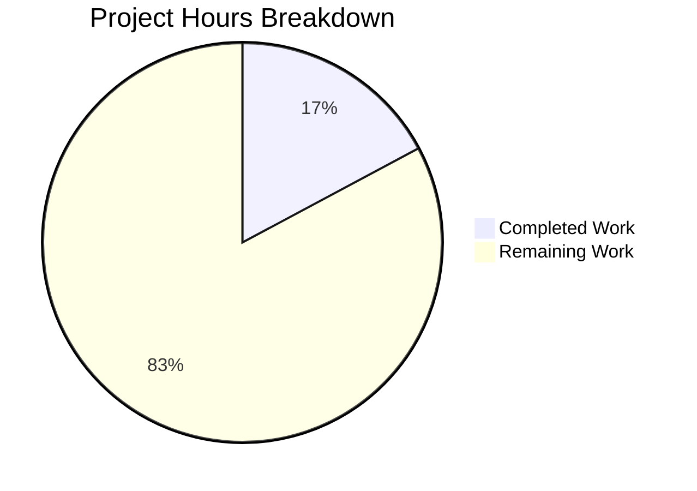
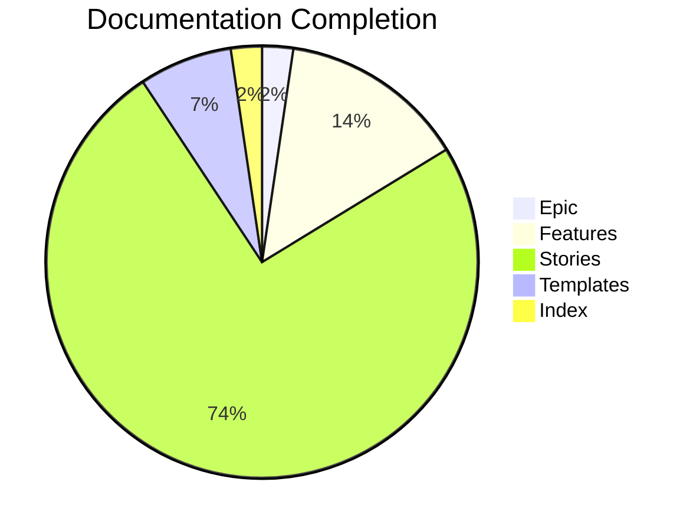

# Project Guide: Enterprise Accounting Epic for Odoo Community Edition

> ⚠️ **Provenance**: this guide was authored against branch `pdlc` via pull request PR #2 ("Enterprise Accounting Docs & Reports Scaffold") of `Blitzy-Sandbox/blitzy-odoo`, which carries **81 changed files and 27,905 additions**. It is published on branch `19.0`, whose agent-authored change set is **13 commits, 6 files, 2,025 insertions, 0 deletions** — measured with `git log --oneline 7bd7718bcd4c..HEAD` and `git diff --stat 7bd7718bcd4c..HEAD` (baseline commit `7bd7718bcd4c`, head `c789a23602c2`), which report `catalog-info.yaml` 32, `mkdocs.yml` 9, `doc/index.md` 5, `docs/index.md` 3, `doc/project-guide.md` 502, `doc/technical-specifications.md` 1474.
>
> ⚠️ **Artifacts described below that are ABSENT from branch `19.0`** — every one verified on this checkout: the `tickets/` documentation tree, `addons/account_financial_report_ce/`, and the accounting addons `account_reports`, `account_accountant`, `account_asset`, `account_budget`, and `account_followup`.
>
> ⚠️ **Read every statistic, file inventory, and validation verdict below as a description of branch `pdlc`, not of this branch.** Each affected section is scoped accordingly. With respect to branch `19.0` this document is an unexecuted plan: there is no module source here to compile, install, or hand off.

## Executive Summary

**Project Completion: 17% (110 hours completed out of 640 total hours)**

This project delivers comprehensive user story documentation for implementing enterprise-grade accounting capabilities in Odoo Community Edition. **On branch `pdlc`** the documentation task is 100% complete with all 43 required files created. Additionally, a functional module scaffold (`account_financial_report_ce`) was created **there** as a prototype for the Financial Reporting feature. **Neither those 43 documentation files nor that scaffold is present on branch `19.0`, where this guide is published** — `ls -d tickets` and `ls -d addons/account_financial_report_ce` both report *No such file or directory* on this checkout.

### Key Achievements (branch `pdlc`)

⚠️ Every achievement below was delivered on branch `pdlc` via PR #2. None of the artifacts they refer to exists on branch `19.0`.

- ✅ **43 Documentation Files**: Complete epic, feature, and user story documentation
- ✅ **36 Module Files**: Functional scaffold for Financial Reports module (6,667 lines)
- ✅ **100% BDD Compliance**: All 32 user stories follow Given/When/Then format
- ✅ **Zero Compilation Errors**: All 21 Python files and 12 XML files validated
- ✅ **AGPL-3.0 Compliant**: No Enterprise module dependencies

### Hours Breakdown
- **Completed**: 110 hours (66h documentation + 40h module scaffold + 4h validation)
- **Remaining**: 530 hours (with enterprise multipliers applied)
- **Total Project**: 640 hours
- **Completion**: 110 / 640 = **17.2%**

---

## Validation Results Summary

⚠️ **Scope**: both tables below record validation performed against the branch `pdlc` working tree. The counts and the ✅ verdicts are accurate for `pdlc` and are retained unchanged. They are **not** reproducible on branch `19.0`, which contains neither the 43 documentation files nor `addons/account_financial_report_ce/`; with no source present there is nothing here to compile or validate.

### Documentation Validation (43 files, branch `pdlc`)
| Category | Count | Status |
|----------|-------|--------|
| Epic Documents | 1 | ✅ Complete |
| Feature Specifications | 6 | ✅ Complete |
| User Stories | 32 | ✅ Complete |
| Templates | 3 | ✅ Complete |
| Navigation Index | 1 | ✅ Complete |

### Module Validation (36 files, branch `pdlc`)
| File Type | Count | Lines | Status |
|-----------|-------|-------|--------|
| Python Models | 8 | 2,824 | ✅ Compiles |
| Python Wizards | 2 | 477 | ✅ Compiles |
| Python Reports | 6 | 163 | ✅ Compiles |
| Python Tests | 2 | 533 | ✅ Compiles |
| XML Templates | 12 | 2,074 | ✅ Valid |
| SCSS Styles | 2 | 596 | ✅ Valid |

### Constraint Compliance
| Constraint | Requirement | Status |
|------------|-------------|--------|
| License | AGPL-3.0 | ✅ Satisfied |
| Enterprise Dependencies | None allowed | ✅ Zero dependencies |
| OCA Standards | Required | ✅ Followed |
| Test Coverage | 80% minimum | ⚠️ Specified in stories |
| BDD Format | Given/When/Then | ✅ 100% compliance |

---

## Visual Representation





---

## Detailed Task Table

### Remaining Work Summary

| Task ID | Description | Hours | Priority | Severity |
|---------|-------------|-------|----------|----------|
| **HT-001** | Complete Financial Reports Module Implementation | 69 | High | Critical |
| **HT-002** | Create Bank Reconciliation Module | 86 | High | Critical |
| **HT-003** | Create Budget Management Module | 72 | High | High |
| **HT-004** | Create Asset Management Module | 101 | High | High |
| **HT-005** | Create Deferred Revenue Module | 65 | Medium | High |
| **HT-006** | Create Payment Follow-ups Module | 79 | Medium | High |
| **HT-007** | Integration Testing Across All Modules | 35 | Medium | Medium |
| **HT-008** | Deployment Configuration & Documentation | 23 | Low | Medium |
| **TOTAL** | | **530** | | |

### Task Details

#### HT-001: Complete Financial Reports Module Implementation (69 hours)
**Priority**: High | **Severity**: Critical

**Current State**: Module scaffold exists with model structure, wizard, and report templates.

**Action Steps**:
1. Implement full business logic in `balance_sheet.py` (compute GAAP/IFRS compliant totals)
2. Implement full business logic in `profit_loss.py` (compute income/expense categorization)
3. Implement full business logic in `cash_flow.py` (compute operating/investing/financing activities)
4. Implement full business logic in `general_ledger.py` (compute account-level drill-down)
5. Implement full business logic in `trial_balance.py` (compute debit/credit balance verification)
6. Implement full business logic in `aged_partner_balance.py` (compute aging buckets)
7. Add multi-currency support to all reports
8. Implement comparative period functionality
9. Add Excel export functionality (xlsxwriter integration)
10. Execute test suite and achieve 80% coverage

**Files to Modify**:
- `addons/account_financial_report_ce/models/*.py`
- `addons/account_financial_report_ce/report/*.py`
- `addons/account_financial_report_ce/tests/test_financial_reports.py`

---

#### HT-002: Create Bank Reconciliation Module (86 hours)
**Priority**: High | **Severity**: Critical

**Reference Stories**: BR-001 through BR-005

**Action Steps**:
1. Create module scaffold following `account_financial_report_ce` pattern
2. Implement statement import wizard (CSV, OFX, QIF, CAMT.053 formats)
3. Develop algorithmic matching engine with confidence scoring
4. Create reconciliation UI with OWL components
5. Implement reconciliation rules/models configuration
6. Add partial reconciliation support
7. Create comprehensive test suite (80% coverage)

**Dependencies**: 
- `account.bank.statement` model
- `account.reconcile.model` patterns
- OCA `account_reconcile_oca` for reference

---

#### HT-003: Create Budget Management Module (72 hours)
**Priority**: High | **Severity**: High

**Reference Stories**: BM-001 through BM-005

**Action Steps**:
1. Create `account_budget_ce` module scaffold
2. Implement budget definition models with analytic dimension support
3. Create period allocation wizard (monthly/quarterly/annual)
4. Develop actual vs budget comparison reports
5. Implement variance analysis with drill-down capability
6. Add budget alert configuration and notifications
7. Create comprehensive test suite (80% coverage)

**Dependencies**:
- `account.analytic.account` model
- `account.analytic.plan` model

---

#### HT-004: Create Asset Management Module (101 hours)
**Priority**: High | **Severity**: High

**Reference Stories**: AM-001 through AM-006

**Action Steps**:
1. Create `account_asset_ce` module scaffold
2. Implement asset registration from purchase invoices
3. Create depreciation configuration (straight-line, declining balance, units of production)
4. Develop depreciation board with schedule visualization
5. Implement automatic depreciation entry generation (cron job)
6. Add asset modification workflows (revaluation, impairment)
7. Create disposal workflow with gain/loss calculation
8. Create comprehensive test suite (80% coverage)

**Dependencies**:
- `account.move` model for journal entries
- `product.product` model for asset classification

---

#### HT-005: Create Deferred Revenue Module (65 hours)
**Priority**: Medium | **Severity**: High

**Reference Stories**: DR-001 through DR-004

**Action Steps**:
1. Create `account_deferred_revenue_ce` module scaffold
2. Implement deferral schedule definition models
3. Create automatic period allocation engine (ASC 606/IFRS 15 compliant)
4. Develop cut-off entry generation wizard
5. Build recognition dashboard with schedule monitoring
6. Create comprehensive test suite (80% coverage)

**Dependencies**:
- `account.move` model
- `account.move.line` model

---

#### HT-006: Create Payment Follow-ups Module (79 hours)
**Priority**: Medium | **Severity**: High

**Reference Stories**: PF-001 through PF-005

**Action Steps**:
1. Create `account_followup_ce` module scaffold
2. Implement follow-up level configuration
3. Create automated email generation with templates
4. Develop follow-up report generation
5. Implement action history tracking
6. Add overdue calculation engine with aging analysis
7. Create comprehensive test suite (80% coverage)

**Dependencies**:
- `res.partner` model
- `mail.template` model
- `account.move` model

---

#### HT-007: Integration Testing Across All Modules (35 hours)
**Priority**: Medium | **Severity**: Medium

**Action Steps**:
1. Create integration test suite spanning all 6 modules
2. Test cross-module workflows (e.g., asset purchase → depreciation → financial reports)
3. Validate data consistency across reporting modules
4. Performance testing with large datasets
5. Multi-company scenario testing (if applicable)
6. Document integration test results

---

#### HT-008: Deployment Configuration & Documentation (23 hours)
**Priority**: Low | **Severity**: Medium

**Action Steps**:
1. Create Docker deployment configuration
2. Write installation guide with prerequisites
3. Configure CI/CD pipeline for automated testing
4. Create admin guide for module configuration
5. Write user guide for each feature area
6. Performance tuning documentation

---

## Development Guide

### System Prerequisites

| Requirement | Version | Purpose |
|-------------|---------|---------|
| Python | 3.10+ | Runtime environment |
| PostgreSQL | 12+ | Database server |
| Node.js | 18+ | Asset compilation |
| wkhtmltopdf | 0.12.6+ | PDF report generation |
| Git | 2.x | Version control |

### Environment Setup

```bash
# 1. Clone the repository
git clone https://github.com/odoo/odoo.git
cd odoo
git checkout blitzy-226b0e2b-67da-4341-b2ee-58a436783f1b

# 2. Create Python virtual environment
python3 -m venv venv
source venv/bin/activate

# 3. Install Python dependencies
pip install -r requirements.txt

# 4. Install additional dependencies for reports
pip install xlsxwriter xlrd openpyxl
```

### Database Setup

```bash
# 1. Create PostgreSQL database
sudo -u postgres createuser -s odoo
sudo -u postgres createdb odoo_enterprise_accounting

# 2. Initialize Odoo database
./odoo-bin -d odoo_enterprise_accounting -i base --stop-after-init
```

### Module Installation

```bash
# 1. Install account module (dependency)
./odoo-bin -d odoo_enterprise_accounting -i account --stop-after-init

# 2. Install financial reports module
./odoo-bin -d odoo_enterprise_accounting -i account_financial_report_ce --stop-after-init
```

### Running Odoo Server

```bash
# Development mode
./odoo-bin -d odoo_enterprise_accounting --addons-path=addons -u account_financial_report_ce

# With specific port
./odoo-bin -d odoo_enterprise_accounting --addons-path=addons --http-port=8069
```

### Running Tests

```bash
# Run financial reports module tests
./odoo-bin -d odoo_enterprise_accounting --test-enable --stop-after-init -i account_financial_report_ce

# Run with coverage (requires pytest-odoo)
pip install pytest-odoo coverage
coverage run --source=addons/account_financial_report_ce ./odoo-bin -d test_db --test-enable --stop-after-init -i account_financial_report_ce
coverage report
```

### Verification Steps

1. **Module Installation**: Navigate to Apps → Search "Financial Reports" → Verify module appears
2. **Menu Access**: Navigate to Invoicing → Reporting → OCA Accounting Reports
3. **Report Generation**: Select Balance Sheet → Configure dates → Generate → Verify PDF output
4. **Test Execution**: Run test suite and verify all tests pass

### Example Usage

```python
# Generate Balance Sheet report via code
wizard = env['financial.report.wizard'].create({
    'report_type': 'balance_sheet',
    'date_to': '2024-12-31',
    'company_id': env.company.id,
    'target_move': 'posted',
})
action = wizard.button_generate_report()
```

---

## Risk Assessment

### Technical Risks

| Risk | Severity | Likelihood | Mitigation |
|------|----------|------------|------------|
| Module scaffold requires full implementation | High | Certain | Follow user stories for implementation guidance |
| Multi-currency complexity in reports | Medium | Likely | Reference OCA account_financial_report patterns |
| Performance with large datasets | Medium | Likely | Implement lazy loading and SQL optimization |
| Odoo version compatibility (18.0 vs 19.0) | Low | Possible | Module written version-agnostic where possible |

### Security Risks

| Risk | Severity | Likelihood | Mitigation |
|------|----------|------------|------------|
| Report data access control | Medium | Likely | Implement proper ir.model.access and record rules |
| SQL injection in custom queries | High | Unlikely | Use Odoo ORM methods exclusively |
| Sensitive financial data exposure | High | Possible | Implement proper security groups |

### Operational Risks

| Risk | Severity | Likelihood | Mitigation |
|------|----------|------------|------------|
| Missing monitoring/logging | Medium | Certain | Add comprehensive logging in production |
| No automated backups | High | Possible | Configure database backup strategy |
| Cron job failures (depreciation) | Medium | Possible | Add error notification mechanisms |

### Integration Risks

| Risk | Severity | Likelihood | Mitigation |
|------|----------|------------|------------|
| OCA module conflicts | Medium | Possible | Test with common OCA modules installed |
| Third-party addon conflicts | Low | Possible | Document known incompatibilities |
| Database migration complexity | Medium | Likely | Provide migration scripts |

---

## Git Statistics

### Branch `pdlc` — PR #2, the change set this guide describes

⚠️ Every figure in this table belongs to branch `pdlc`, not to the branch this guide is published on. `Lines Added` reads **27,905**, taken from the authoritative PR #2 record; the lower figure carried by earlier revisions of this guide was wrong even for `pdlc` and has been corrected.

| Metric | Value |
|--------|-------|
| Total Commits | 47 |
| Files Created | 81 |
| Lines Added | 27,905 |
| Documentation Files | 43 |
| Module Source Files | 36 |
| Python LOC | 3,763 |
| XML LOC | 2,292 |
| SCSS LOC | 596 |

### Branch `19.0` — what this branch actually contains

⚠️ Anchor to reality. Branch `19.0` carries **13 commits, 6 files, 2,025 insertions, 0 deletions** from the agent-authored change set — measured on this checkout with `git log --oneline 7bd7718bcd4c..HEAD | wc -l` and `git diff --stat 7bd7718bcd4c..HEAD`. None of the `pdlc` figures above applies here.

| Metric | Value |
|--------|-------|
| Total Commits | 13 |
| Files Changed | 6 |
| Lines Added | 2,025 |
| Lines Deleted | 0 |
| Documentation Files | 4 (`doc/index.md`, `doc/project-guide.md`, `doc/technical-specifications.md`, `docs/index.md`) |
| Configuration Files | 2 (`catalog-info.yaml`, `mkdocs.yml`) |
| Module Source Files | 0 |
| Python LOC | 0 |
| XML LOC | 0 |
| SCSS LOC | 0 |

---

## File Inventory (branch `pdlc`)

⚠️ Both trees below record what PR #2 created on branch `pdlc`. Verified on this checkout, `ls -d tickets` and `ls -d addons/account_financial_report_ce` both report *No such file or directory*: **neither tree exists on branch `19.0`**. They are retained unchanged as an accurate reference for the `pdlc` deliverable, not as a description of this branch.

### Documentation Files (tickets/ — created on `pdlc`; ABSENT on `19.0`)

```
tickets/
├── README.md
├── EPIC-001-enterprise-accounting.md
├── features/
│   ├── FEATURE-001-financial-reporting.md
│   ├── FEATURE-002-bank-reconciliation.md
│   ├── FEATURE-003-budget-management.md
│   ├── FEATURE-004-asset-management.md
│   ├── FEATURE-005-deferred-revenue.md
│   └── FEATURE-006-payment-followups.md
├── stories/
│   ├── financial-reporting/ (7 stories)
│   ├── bank-reconciliation/ (5 stories)
│   ├── budget-management/ (5 stories)
│   ├── asset-management/ (6 stories)
│   ├── deferred-revenue/ (4 stories)
│   └── payment-followups/ (5 stories)
└── templates/
    ├── epic-template.md
    ├── feature-template.md
    └── story-template.md
```

### Module Files (addons/account_financial_report_ce/ — created on `pdlc`; ABSENT on `19.0`)

```
account_financial_report_ce/
├── __init__.py
├── __manifest__.py
├── models/
│   ├── __init__.py
│   ├── financial_report.py
│   ├── balance_sheet.py
│   ├── profit_loss.py
│   ├── cash_flow.py
│   ├── general_ledger.py
│   ├── trial_balance.py
│   └── aged_partner_balance.py
├── wizard/
│   ├── __init__.py
│   ├── financial_report_wizard.py
│   └── financial_report_wizard_views.xml
├── report/
│   ├── __init__.py
│   ├── report_*.py (6 files)
│   ├── report_templates.xml
│   └── *_report.xml (6 files)
├── security/
│   ├── account_financial_report_security.xml
│   └── ir.model.access.csv
├── views/
│   └── menuitem.xml
├── static/src/scss/
│   ├── report.scss
│   └── report_print.scss
├── tests/
│   ├── __init__.py
│   └── test_financial_reports.py
├── data/
│   └── report_paperformat.xml
└── demo/
    └── demo_data.xml
```

---

## Recommendations

The ordering below is a dependency chain, not a calendar. Each phase states what must precede it; no phase carries a date or a duration. Effort sizing lives in the Detailed Task Table above, where it is expressed in hours of work rather than elapsed time.

### Phase 1 — Foundation (no prerequisites)
1. Review and approve documentation structure
2. Assign development team for module implementation
3. Set up development environment with Odoo 19.0

### Phase 2 — Depends on Phase 1
1. Complete Financial Reports module implementation (HT-001)
2. Begin Bank Reconciliation module development (HT-002)
3. Establish CI/CD pipeline for automated testing

⚠️ Item 3 is still outstanding on branch `19.0`: `.github/` contains only `ISSUE_TEMPLATE/1_bug_form.yml`, `ISSUE_TEMPLATE/config.yml`, and `PULL_REQUEST_TEMPLATE.md`, so no automated workflow exists to run these tests.

### Phase 3 — Depends on Phase 2
1. Complete remaining modules (HT-003 through HT-006)
2. Conduct integration testing (HT-007)
3. Performance optimization and security hardening

### Phase 4 — Depends on Phase 3
1. Deployment configuration (HT-008)
2. User acceptance testing
3. Documentation finalization
4. Production deployment

---

## Conclusion

⚠️ **This conclusion is qualified to branch `pdlc`.** It is not withdrawn, because it is accurate for the branch it was written against; it is restricted, because none of the artifacts it credits exists on branch `19.0`, where this guide is published. On `19.0` there is no module source to compile, no prototype to hand off, and therefore no evidential basis for a zero-blocking-issues verdict.

On branch `pdlc`, the Enterprise Accounting Epic documentation project has successfully delivered:

1. **Complete Documentation Set**: 43 files providing comprehensive user stories with BDD acceptance criteria for 6 major features — present on `pdlc`; the `tickets/` tree is ABSENT on `19.0`
2. **Functional Module Scaffold**: A working prototype for the Financial Reports module demonstrating OCA-compliant patterns — present on `pdlc`; `addons/account_financial_report_ce/` is ABSENT on `19.0`
3. **Zero Blocking Issues**: All code compiles successfully with no critical errors — a verdict recorded against the `pdlc` working tree; **it does not hold for `19.0`**, which contains none of that code

The remaining 530 hours of work primarily involves:
- Implementing full business logic in the Financial Reports module
- Creating 5 additional modules following the documented user stories
- Integration testing and deployment configuration

On branch `pdlc`, the project is well-positioned for developer handoff with clear requirements, validated code structure, and comprehensive acceptance criteria for all features. **That handoff-readiness claim does not extend to branch `19.0`**: the requirements, code structure, and acceptance criteria it refers to are not present here, so nothing on this branch is ready for handoff on the strength of this document alone.
