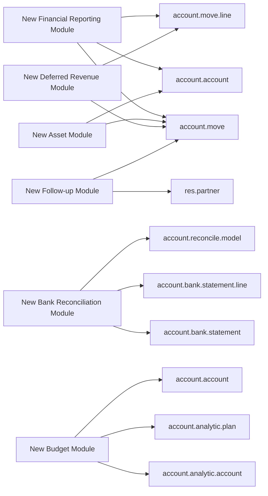
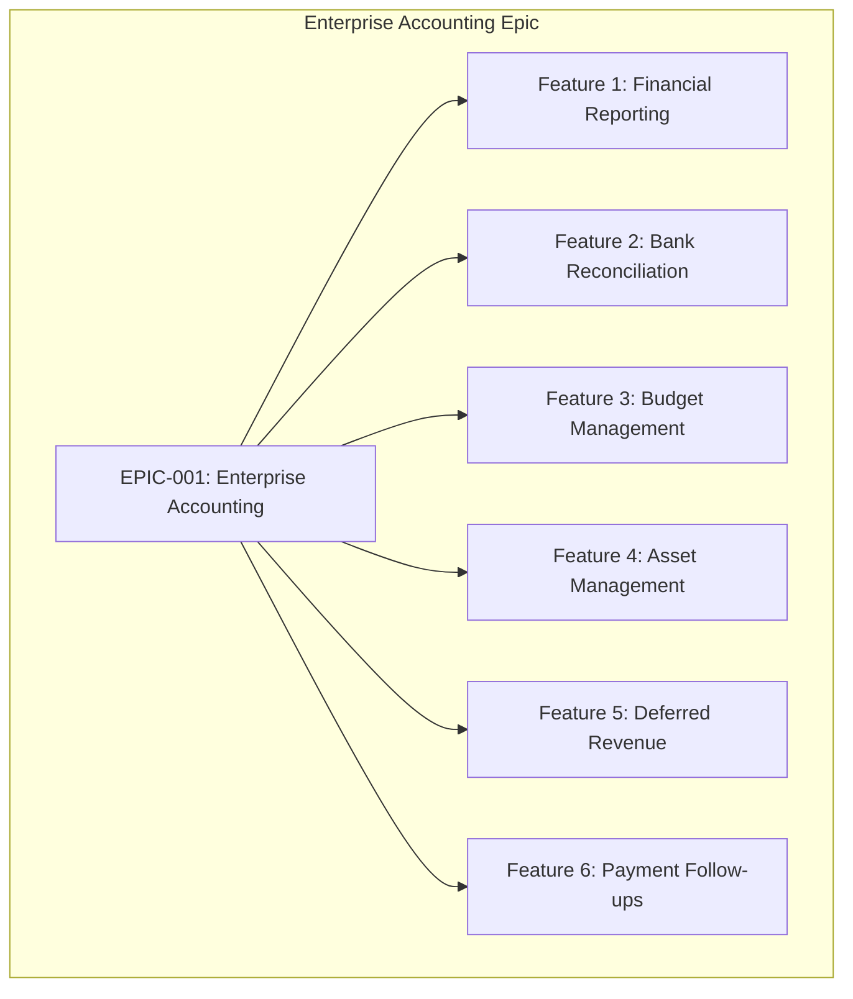
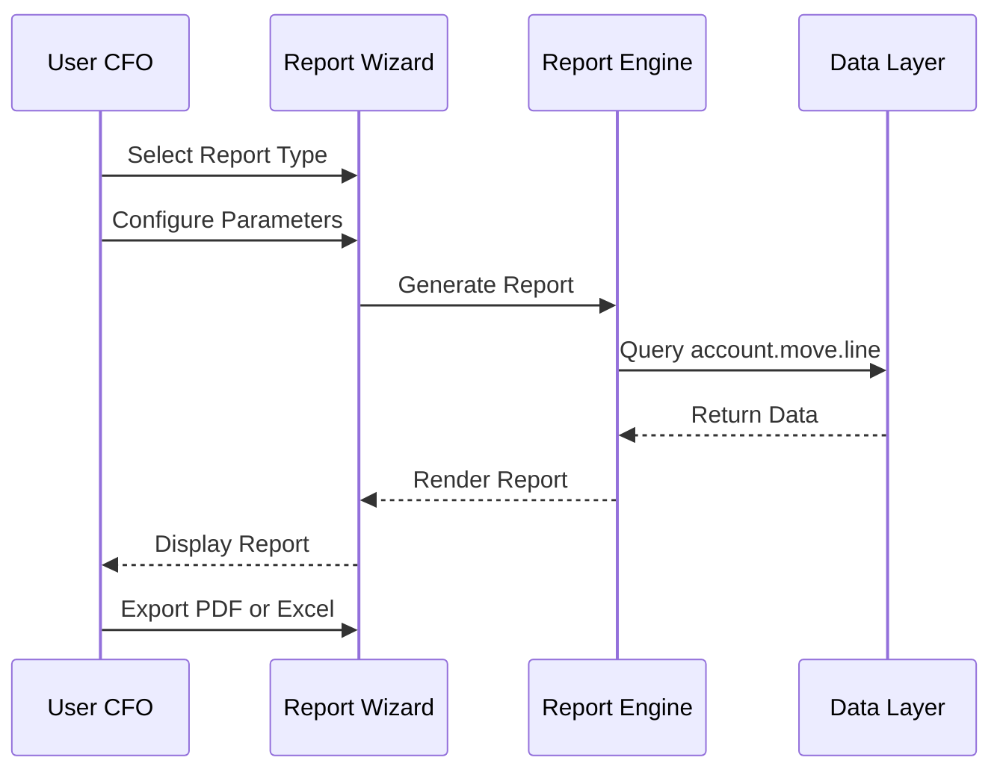
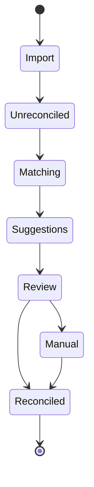
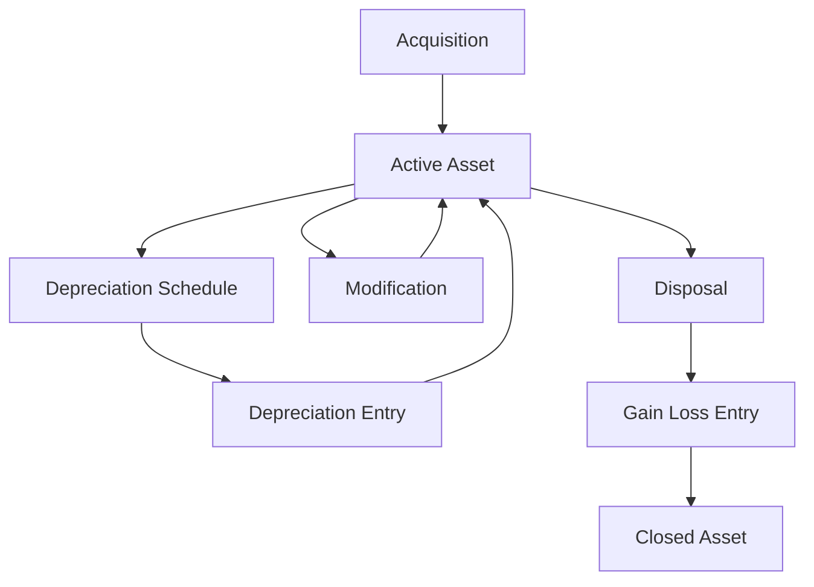

# 0. Agent Action Plan

> **Status: UNEXECUTED PLAN.** This document is a planning artifact, not a description of implemented software. Nothing it specifies has been built on branch `19.0`, the branch you are reading it on. Read every requirement, epic, user story, directory tree, and module inventory below as a creation target, never as an inventory of what exists here.
>
> **Provenance:** The content was authored against branch `pdlc` via pull request #2 of `Blitzy-Sandbox/blitzy-odoo` ("Enterprise Accounting Docs & Reports Scaffold", the pull request linked from this repository's `catalog-info.yaml` service descriptor), whose change set carries 81 changed files and 27,905 additions per the hosting platform's pull-request record. It is published here on branch `19.0`, a different branch carrying a different change set.
>
> **Absent from branch `19.0`:** every artifact this plan targets is missing from the branch you are reading it on, verified by direct filesystem check of this checkout — the `tickets/` documentation tree, the `addons/account_financial_report_ce/` module, and the accounting addons `account_reports`, `account_accountant`, `account_asset`, `account_budget`, and `account_followup`.
>
> **The original reconstructed pre-remediation agent-authored change set on branch `19.0`:** the change set this branch carried before remediation began is 13 commits touching 6 files, with 2,025 insertions and 0 deletions — measured with `git rev-list --count 7bd7718bcd4c..c789a23602c24606458ee86783a318f7224d1dd8` and `git diff --shortstat 7bd7718bcd4c..c789a23602c24606458ee86783a318f7224d1dd8`, the fixed historical range running from the last upstream commit `7bd7718bcd4c` to `c789a23602c2`, the last commit of that change set. All six are documentation and configuration files; no accounting module, financial reporting engine, bank reconciliation, or ticket artifact is among them. Both endpoints are named rather than left as `HEAD` because the remediation commits that follow `c789a23602c2` extend the branch beyond these figures.

## 0.1 Intent Clarification

### 0.1.1 Core Documentation Objective

Based on the provided requirements, the Blitzy platform understands that the documentation objective is to **create comprehensive user epics and user stories** for implementing enterprise-grade accounting capabilities in Odoo Community Edition.

**Documentation Type:** User Epic / User Story Documentation

**Request Category:** Create new documentation (user story artifacts saved to `tickets/` directory)

The primary documentation objectives include:

- Transform the single objective statement into a comprehensive user epic with six features
- Decompose each feature into 3-7 user stories following INVEST principles (Independent, Negotiable, Valuable, Estimable, Small, Testable)
- Write BDD-style (Behavior-Driven Development) acceptance criteria using Given/When/Then format
- Generate all documentation artifacts in the `tickets/` directory at repository root
- Ensure stories specify WHAT and WHY without prescribing HOW—implementation details emerge from agent discovery

**Restated Requirements with Technical Precision:**

| Requirement # | Original Requirement | Technical Interpretation |
|---------------|---------------------|--------------------------|
| REQ-1 | Financial Reporting (Balance Sheet, P&L, Cash Flow, General Ledger, Trial Balance, Aged Reports) | Create user stories for report generation models, QWeb templates, and wizard interfaces for GAAP/IFRS-compliant financial statements |
| REQ-2 | Bank Reconciliation | Create user stories for matching bank statement lines with journal items, algorithmic matching, reconciliation rules/models |
| REQ-3 | Budget Management | Create user stories for budget definition models, period-based budget allocation, variance analysis reporting |
| REQ-4 | Asset Management | Create user stories for asset register, depreciation methods, depreciation journal entries, asset disposal workflows |
| REQ-5 | Deferred Revenue/Expenses | Create user stories for deferral schedule models, automatic period allocation, cut-off entry generation |
| REQ-6 | Payment Follow-ups | Create user stories for follow-up level configuration, automated email generation, action history tracking |

### 0.1.2 Special Instructions and Constraints

**CRITICAL DIRECTIVES:**

- **AGPL-3.0 License Compatibility**: All user stories must specify license compatibility requirements. The repository uses LGPL-3 for the `account` module, and new modules should maintain AGPL-3.0 compatibility as specified.
- **No Enterprise Dependencies**: User stories must explicitly state "No dependencies on Odoo Enterprise modules" as an acceptance criterion.
- **OCA Coding Standards**: Reference Odoo and OCA (Odoo Community Association) coding standards in acceptance criteria.
- **Target Version**: User requirements specify Odoo 18.0; however, the repository is Odoo 19.0 (as identified in `odoo/release.py`). Documentation should note this discrepancy and proceed with 18.0 compatibility stories (which may need version adjustment).
- **Test Coverage**: All stories should include acceptance criteria requiring minimum 80% test coverage.

**Template Requirements:**

User stories must follow the BDD format:

```
## User Story: [ID] [Title]

**As a** [role]
**I want** [capability]
**So that** [business value]

#### Acceptance Criteria

**Scenario 1:** [Scenario Name]
- **Given** [precondition]
- **When** [action]
- **Then** [expected outcome]
```

**Style Preferences:**

- Use markdown format for all documentation
- Include Mermaid diagrams where workflows benefit from visualization
- Keep acceptance criteria concise (3-6 scenarios per story as per BDD best practices)
- Avoid UI/implementation details in acceptance criteria

### 0.1.3 Technical Interpretation

These documentation requirements translate to the following technical documentation strategy:

- **To document Financial Reporting**, we will create user stories that describe report generation from the user's perspective (CFO, Accountant, Auditor), specifying report outputs, comparative period functionality, and drill-down capabilities without prescribing the underlying model implementation.

- **To document Bank Reconciliation**, we will create user stories covering the reconciliation workflow from the Bookkeeper's perspective, including statement import, algorithmic matching suggestions, and reconciliation rule creation.

- **To document Budget Management**, we will create user stories for the Controller and Finance Director personas, covering budget definition, period allocation, and variance analysis reporting.

- **To document Asset Management**, we will create user stories from the Accountant's perspective for asset tracking, depreciation scheduling, and disposal workflows.

- **To document Deferred Revenue/Expenses**, we will create user stories addressing revenue recognition requirements per ASC 606/IFRS 15 standards from the CFO and Accountant perspectives.

- **To document Payment Follow-ups**, we will create user stories for automated customer communication from the Accountant and Credit Controller perspectives.

### 0.1.4 Inferred Documentation Needs

Based on codebase analysis, the following implicit documentation needs have been identified:

**Module Structure Gaps:**

- The `addons/` directory contains no `account_asset`, `account_budget`, `account_followup`, or `account_financial_reports` modules
- These are Enterprise-only features, validating the epic's objective to bridge the Community/Enterprise gap

**Related OCA Reference:**

- User stories should reference OCA patterns from `OCA/account-financial-reporting`, `OCA/account-reconcile`, and `OCA/mis-builder` repositories for compatibility considerations

**Integration Stories Needed:**

- Stories documenting integration between new modules and existing `account.move`, `account.move.line`, `account.bank.statement` models
- Stories for analytic account integration (budget allocation by analytic dimension)

**Discovery Notes for Implementation:**

- Codebase analysis required before implementation to understand existing `account` module structure
- OCA module compatibility evaluation needed for integration vs. replacement decisions
- Report engine strategy determination (extend Odoo reporting vs. dedicated engine)
- OWL component pattern assessment for reconciliation and reporting interfaces

## 0.2 Documentation Discovery and Analysis

### 0.2.1 Existing Documentation Infrastructure Assessment

**CRITICAL FINDING:** Repository analysis reveals minimal existing technical documentation infrastructure with no established user story/epic patterns.

**Search Patterns Employed:**

- Documentation files: `README.md`, `*.rst` files in `doc/`, `addons/*/README.md`
- Documentation generators: No `mkdocs.yml`, `docusaurus.config.js`, or `sphinx.conf.py` found
- User story templates: No existing `tickets/`, `stories/`, or `epics/` directories
- Style guides: `CONTRIBUTING.md` points to Odoo Wiki for contribution guidelines

**Documentation Findings:**

| Location | Content | Status |
|----------|---------|--------|
| `/README.md` | Basic project overview, build status badges, links to official documentation | Minimal |
| `/CONTRIBUTING.md` | Links to Odoo Wiki and PR guidelines | Reference only |
| `/doc/cla/` | Contributor License Agreement files only | Non-technical |
| `/addons/account/README.md` | High-level accounting module description (3 paragraphs) | Sparse |
| `/addons/crm/doc/` | CRM-specific RST documentation (changelog, stages) | Limited example |

**Repository Analysis Summary:**
> "Repository analysis reveals a documentation-light codebase with README files at module level providing minimal feature descriptions. No existing epic/story documentation framework exists, requiring creation of the entire `tickets/` structure."

**Current Documentation Framework:** None established for user stories/epics

**Documentation Generator Configuration:** Not applicable (markdown-based file storage)

**API Documentation Tools:** None integrated; module README files serve as primary documentation

### 0.2.2 Repository Code Analysis for Documentation

**Search Patterns Used for Code to Document:**

| Pattern | Target | Findings |
|---------|--------|----------|
| `addons/account/models/*.py` | Public APIs for accounting | 35+ model files including `account_move.py`, `account_payment.py`, `account_bank_statement.py` |
| `addons/account/wizard/*.py` | Transient wizard models | 15+ wizard implementations including `account_payment_register.py`, `account_resequence.py` |
| `addons/account/report/*.py` | Report models | `account_invoice_report.py` with SQL-view analytics |
| `addons/analytic/models/*.py` | Analytic accounting APIs | `analytic_account.py`, `analytic_plan.py`, `analytic_line.py` |

**Key Directories Examined:**

```
addons/
├── account/                    # Core accounting (LGPL-3) - 35+ models
│   ├── models/                # Business logic
│   ├── views/                 # XML view definitions
│   ├── wizard/                # Transient models for workflows
│   ├── report/                # QWeb reports and analytics
│   └── tests/                 # Test coverage
├── account_payment/           # Payment processing extension
├── analytic/                  # Analytic accounting foundation
└── [No asset/budget/followup modules exist]
```

**Related Documentation Found:**

- `addons/account/__manifest__.py` - Module dependencies: `base_setup`, `onboarding`, `product`, `analytic`, `portal`, `digest`
- Module version: `1.4` (within Odoo 19.0 framework)
- License: `LGPL-3` (compatible with AGPL-3.0 requirement)

**Enterprise Features Absent from Community:**

| Feature | Enterprise Module | OCA Alternative |
|---------|-------------------|-----------------|
| Financial Reports | `account_reports` | `OCA/account-financial-reporting` |
| Bank Reconciliation UI | `account_accountant` | `OCA/account-reconcile` |
| Budget Management | `account_budget` | `OCA/mis-builder` |
| Asset Management | `account_asset` | `OCA/account-financial-tools` |
| Payment Follow-ups | `account_followup` | `OCA/account-payment` |
| Deferred Revenue | `account_deferred_revenue` | Custom development needed |

### 0.2.3 Web Search Research Conducted

**Best Practices for User Story Documentation:**

<cite index="15-2,15-3">"The acronym INVEST helps to remember a widely accepted set of criteria, or checklist, to assess the quality of a user story. If the story fails to meet one of these criteria, the team may want to reword it, or even consider a rewrite."</cite>

**INVEST Principles Applied to This Epic:**

| Principle | Application |
|-----------|-------------|
| **Independent** | Each feature (Financial Reporting, Bank Reconciliation, etc.) can be developed independently |
| **Negotiable** | Stories describe outcomes, not implementations; allows developer flexibility |
| **Valuable** | Each story tied to user persona and business value (CFO, Accountant, Auditor needs) |
| **Estimable** | Stories scoped to 3-7 per feature, small enough to estimate |
| **Small** | Features decomposed into discrete stories (e.g., separate Balance Sheet from P&L) |
| **Testable** | BDD acceptance criteria enable objective verification |

**BDD Acceptance Criteria Best Practices:**

<cite index="16-10,16-11">"BDD often uses the Gherkin syntax, which structures acceptance criteria in a Given-When-Then format. This format describes the preconditions (Given), the action or event (When), and the expected outcome (Then)."</cite>

<cite index="12-12,12-13,12-14">"Firstly, it is to articulate with clarity to a non-technical audience that the criteria will be used to validate a feature's behavior. Secondly, and equally important, it is to ensure that this requirement can be easily transformed into building and testing code. BDD happens to be a good medium to address these outcomes."</cite>

**OCA Module Patterns Research:**

<cite index="3-18,3-19">"This module adds a set of financial reports. They are accessible under Invoicing / Reporting / OCA accounting reports."</cite>

The OCA `account_financial_report` module provides precedent for:

- General Ledger reports
- Trial Balance reports
- Aged Partner Balance reports
- Multi-currency support in reports

## 0.3 Documentation Scope Analysis

### 0.3.1 Code-to-Documentation Mapping

**Modules Requiring User Story Documentation:**

**Feature 1: Financial Reporting**

| Source Code Reference | Documentation Needed | User Story Count |
|----------------------|---------------------|------------------|
| `addons/account/report/account_invoice_report.py` | Reference existing report pattern | - |
| New: Financial Report Engine | Epic-level documentation for report generation | 5-7 stories |
| Reports: Balance Sheet, P&L, Cash Flow, General Ledger, Trial Balance, Aged Reports | Individual report user stories | Included above |

**Feature 2: Bank Reconciliation**

| Source Code Reference | Documentation Needed | User Story Count |
|----------------------|---------------------|------------------|
| `addons/account/models/account_bank_statement.py` | Reference for statement model integration | - |
| `addons/account/models/account_reconcile_model.py` | Reference for reconciliation rules pattern | - |
| `addons/account/views/account_reconcile_model_views.xml` | Reference for UI patterns | - |
| New: Reconciliation Interface & Algorithm | User stories for matching and reconciliation | 4-6 stories |

**Feature 3: Budget Management**

| Source Code Reference | Documentation Needed | User Story Count |
|----------------------|---------------------|------------------|
| `addons/analytic/models/analytic_account.py` | Reference for analytic dimension integration | - |
| `addons/analytic/models/analytic_plan.py` | Reference for multi-dimensional budgeting | - |
| New: Budget Definition & Variance Analysis | User stories for budget lifecycle | 4-5 stories |

**Feature 4: Asset Management**

| Source Code Reference | Documentation Needed | User Story Count |
|----------------------|---------------------|------------------|
| `addons/account/models/account_move.py` | Reference for depreciation journal entries | - |
| `addons/account/models/account_account.py` | Reference for asset accounts | - |
| New: Asset Register & Depreciation Engine | User stories for asset lifecycle | 5-6 stories |

**Feature 5: Deferred Revenue/Expenses**

| Source Code Reference | Documentation Needed | User Story Count |
|----------------------|---------------------|------------------|
| `addons/account/wizard/account_automatic_entry_wizard.py` | Reference for automatic entry patterns | - |
| New: Deferral Schedule & Recognition | User stories for revenue recognition | 3-5 stories |

**Feature 6: Payment Follow-ups**

| Source Code Reference | Documentation Needed | User Story Count |
|----------------------|---------------------|------------------|
| `addons/account/data/mail_template_data.xml` | Reference for email templates | - |
| `addons/account/models/partner.py` | Reference for partner credit data | - |
| New: Follow-up Automation | User stories for payment collection | 4-5 stories |

**Total Estimated Stories:** 25-34 user stories across 6 features

### 0.3.2 Configuration Options Requiring Documentation

| Configuration Area | Options to Document | Current Status |
|-------------------|---------------------|----------------|
| Report Periods | Monthly, Quarterly, Annual comparisons | User story acceptance criteria |
| Depreciation Methods | Straight-line, Declining balance, Units of production | User story acceptance criteria |
| Budget Periods | Monthly, Quarterly, Annual allocation | User story acceptance criteria |
| Follow-up Levels | Configurable reminder, warning, final notice | User story acceptance criteria |
| Statement Import Formats | CSV, OFX, QIF, CAMT.053 | User story acceptance criteria |
| Reconciliation Rules | Pattern-based auto-matching | User story acceptance criteria |

### 0.3.3 Documentation Gap Analysis

Given the requirements and repository analysis, documentation gaps include:

**Complete Absence (No Existing Documentation):**

- User epic/story structure for Enterprise-equivalent features
- BDD acceptance criteria templates for accounting features
- Feature decomposition aligned with INVEST principles
- Target user persona documentation (CFO, Accountant, Controller, Auditor, Business Owner)

**Undocumented Integration Points:**



**Missing User Journey Documentation:**

| Persona | Missing Documentation |
|---------|----------------------|
| CFO / Finance Director | GAAP/IFRS-compliant reporting requirements |
| Accountant / Bookkeeper | Daily operational workflows (reconciliation, follow-ups) |
| Controller | Budget variance analysis requirements |
| Auditor | Transaction trail and data integrity requirements |
| Business Owner | Cash flow visibility and AR management |

### 0.3.4 Feature-to-Story Decomposition Strategy

**Decomposition Principles:**

Based on INVEST and BDD best practices, each feature will be decomposed as follows:

```
EPIC: Enterprise Accounting Capabilities
├── Feature 1: Financial Reporting (5-7 stories)
│   ├── FR-001: Balance Sheet Report
│   ├── FR-002: Profit & Loss Statement
│   ├── FR-003: Cash Flow Statement
│   ├── FR-004: General Ledger Report
│   ├── FR-005: Trial Balance Report
│   ├── FR-006: Aged Receivable/Payable Reports
│   └── FR-007: Report Export & Drill-down
│
├── Feature 2: Bank Reconciliation (4-6 stories)
│   ├── BR-001: Statement Import
│   ├── BR-002: Algorithmic Matching
│   ├── BR-003: Manual Reconciliation
│   ├── BR-004: Reconciliation Rules
│   └── BR-005: Partial Reconciliation
│
├── Feature 3: Budget Management (4-5 stories)
│   ├── BM-001: Budget Definition
│   ├── BM-002: Budget Period Allocation
│   ├── BM-003: Actual vs Budget Reporting
│   ├── BM-004: Variance Analysis
│   └── BM-005: Budget Alerts
│
├── Feature 4: Asset Management (5-6 stories)
│   ├── AM-001: Asset Registration
│   ├── AM-002: Depreciation Configuration
│   ├── AM-003: Depreciation Board
│   ├── AM-004: Automatic Depreciation Entries
│   ├── AM-005: Asset Modification
│   └── AM-006: Asset Disposal
│
├── Feature 5: Deferred Revenue/Expenses (3-5 stories)
│   ├── DR-001: Deferral Schedule Definition
│   ├── DR-002: Automatic Period Allocation
│   ├── DR-003: Cut-off Entry Generation
│   └── DR-004: Recognition Dashboard
│
└── Feature 6: Payment Follow-ups (4-5 stories)
    ├── PF-001: Follow-up Level Configuration
    ├── PF-002: Automated Email Generation
    ├── PF-003: Follow-up Report Generation
    ├── PF-004: Action History Tracking
    └── PF-005: Overdue Calculation
```

## 0.4 Documentation Implementation Design

### 0.4.1 Documentation Structure Planning

**Documentation Hierarchy:**

```
tickets/
├── README.md                               # Epic overview and navigation
├── EPIC-001-enterprise-accounting.md       # Master epic document
├── features/
│   ├── FEATURE-001-financial-reporting.md  # Feature specification
│   ├── FEATURE-002-bank-reconciliation.md
│   ├── FEATURE-003-budget-management.md
│   ├── FEATURE-004-asset-management.md
│   ├── FEATURE-005-deferred-revenue.md
│   └── FEATURE-006-payment-followups.md
├── stories/
│   ├── financial-reporting/
│   │   ├── FR-001-balance-sheet-report.md
│   │   ├── FR-002-profit-loss-statement.md
│   │   ├── FR-003-cash-flow-statement.md
│   │   ├── FR-004-general-ledger-report.md
│   │   ├── FR-005-trial-balance-report.md
│   │   ├── FR-006-aged-reports.md
│   │   └── FR-007-report-export-drilldown.md
│   ├── bank-reconciliation/
│   │   ├── BR-001-statement-import.md
│   │   ├── BR-002-algorithmic-matching.md
│   │   ├── BR-003-manual-reconciliation.md
│   │   ├── BR-004-reconciliation-rules.md
│   │   └── BR-005-partial-reconciliation.md
│   ├── budget-management/
│   │   ├── BM-001-budget-definition.md
│   │   ├── BM-002-budget-period-allocation.md
│   │   ├── BM-003-actual-vs-budget-reporting.md
│   │   ├── BM-004-variance-analysis.md
│   │   └── BM-005-budget-alerts.md
│   ├── asset-management/
│   │   ├── AM-001-asset-registration.md
│   │   ├── AM-002-depreciation-configuration.md
│   │   ├── AM-003-depreciation-board.md
│   │   ├── AM-004-automatic-depreciation-entries.md
│   │   ├── AM-005-asset-modification.md
│   │   └── AM-006-asset-disposal.md
│   ├── deferred-revenue/
│   │   ├── DR-001-deferral-schedule-definition.md
│   │   ├── DR-002-automatic-period-allocation.md
│   │   ├── DR-003-cutoff-entry-generation.md
│   │   └── DR-004-recognition-dashboard.md
│   └── payment-followups/
│       ├── PF-001-followup-level-configuration.md
│       ├── PF-002-automated-email-generation.md
│       ├── PF-003-followup-report-generation.md
│       ├── PF-004-action-history-tracking.md
│       └── PF-005-overdue-calculation.md
└── templates/
    ├── epic-template.md                    # Reusable epic template
    ├── feature-template.md                 # Reusable feature template
    └── story-template.md                   # Reusable story template
```

### 0.4.2 Content Generation Strategy

**Information Extraction Approach:**

- Extract existing model patterns from `addons/account/models/` for integration references
- Generate example workflows by analyzing `addons/account/wizard/` for wizard conventions
- Reference OCA modules (`account_financial_report`, `mis_builder`) for feature patterns
- Map user personas to specific acceptance criteria scenarios

**Epic Template Structure:**

The epic document will follow this structure:

| Section | Content |
|---------|---------|
| Business Context | Problem statement and target users table |
| Success Metrics | Measurable outcomes aligned with user requirements |
| Features | List of 6 features with story counts and priorities |
| Constraints | AGPL-3.0, no Enterprise dependencies, OCA standards, 80% test coverage |
| Out of Scope | Real-time bank feeds, AI/ML OCR, multi-company consolidation, tax service integrations, mobile interfaces |
| References | OCA repository links, Odoo documentation links |

**Story Template Structure:**

Each story will contain:

| Section | Content |
|---------|---------|
| User Story | As a [persona], I want [capability], So that [business value] |
| Acceptance Criteria | 3-6 BDD scenarios using Given/When/Then format |
| Technical Notes | Discovery notes for implementing agents (codebase analysis areas) |
| Dependencies | Related stories, existing modules, external systems |
| Test Requirements | 80% coverage minimum, specific test scenarios |

**Documentation Standards:**

| Element | Standard |
|---------|----------|
| Markdown Headers | # for Epic, ## for Feature, ### for Story sections |
| BDD Scenarios | Given/When/Then with bold formatting |
| Diagrams | Mermaid syntax for workflow and relationship diagrams |
| Tables | Pipe-delimited markdown tables |
| Code References | Backticks for inline code, fenced blocks for examples |
| Source Citations | File paths in code format with line references |

### 0.4.3 Diagram and Visual Strategy

**Mermaid Diagrams to Create:**

**1. Epic Feature Relationship Diagram:**



**2. Financial Reporting Workflow Diagram:**



**3. Bank Reconciliation Workflow Diagram:**



**4. Asset Depreciation Lifecycle Diagram:**



### 0.4.4 Persona-Based Story Mapping

**User Persona Definitions:**

| Persona | Primary Features | Story Focus |
|---------|-----------------|-------------|
| CFO / Finance Director | Financial Reporting, Budget Management, Deferred Revenue | Strategic reporting, compliance, cash flow visibility |
| Accountant / Bookkeeper | Bank Reconciliation, Asset Management, Payment Follow-ups | Daily operations, transaction processing, period close |
| Controller | Budget Management | Variance analysis, budget monitoring, alerts |
| Auditor | Financial Reporting | Transaction trails, data integrity, report drill-down |
| Business Owner | Financial Reporting, Payment Follow-ups | Cash flow statements, aged receivables, AR management |

**Story Assignment by Persona:**

| Feature | CFO | Accountant | Controller | Auditor | Business Owner |
|---------|-----|------------|------------|---------|----------------|
| Financial Reporting | Balance Sheet, P&L, Cash Flow | General Ledger, Trial Balance | - | Drill-down, Export | Cash Flow, Aged Reports |
| Bank Reconciliation | - | All stories | - | - | - |
| Budget Management | Definition, Variance | - | All stories | - | - |
| Asset Management | - | All stories | - | - | - |
| Deferred Revenue | Schedules, Recognition | Period Allocation | - | - | - |
| Payment Follow-ups | - | All stories | - | - | Overdue Reports |

## 0.5 Documentation File Transformation Mapping

### 0.5.1 File-by-File Documentation Plan

**CRITICAL: Complete inventory of all documentation files to be created.**

**Documentation Transformation Modes:**

- **CREATE** - Create a new documentation file
- **UPDATE** - Update an existing documentation file
- **DELETE** - Remove an obsolete documentation file
- **REFERENCE** - Use as an example for documentation style and structure

| Target Documentation File | Transformation | Source Code/Docs | Content/Changes |
|---------------------------|----------------|------------------|-----------------|
| `tickets/README.md` | CREATE | N/A | Epic navigation, feature index, quick start guide |
| `tickets/EPIC-001-enterprise-accounting.md` | CREATE | User requirements input | Master epic with 6 features, business context, constraints |
| `tickets/features/FEATURE-001-financial-reporting.md` | CREATE | `addons/account/report/` | Feature spec with 7 story references |
| `tickets/features/FEATURE-002-bank-reconciliation.md` | CREATE | `addons/account/models/account_bank_statement.py` | Feature spec with 5 story references |
| `tickets/features/FEATURE-003-budget-management.md` | CREATE | `addons/analytic/models/` | Feature spec with 5 story references |
| `tickets/features/FEATURE-004-asset-management.md` | CREATE | `addons/account/models/account_move.py` | Feature spec with 6 story references |
| `tickets/features/FEATURE-005-deferred-revenue.md` | CREATE | `addons/account/wizard/account_automatic_entry_wizard.py` | Feature spec with 4 story references |
| `tickets/features/FEATURE-006-payment-followups.md` | CREATE | `addons/account/models/partner.py` | Feature spec with 5 story references |
| `tickets/stories/financial-reporting/FR-001-balance-sheet-report.md` | CREATE | N/A | User story with BDD acceptance criteria |
| `tickets/stories/financial-reporting/FR-002-profit-loss-statement.md` | CREATE | N/A | User story with BDD acceptance criteria |
| `tickets/stories/financial-reporting/FR-003-cash-flow-statement.md` | CREATE | N/A | User story with BDD acceptance criteria |
| `tickets/stories/financial-reporting/FR-004-general-ledger-report.md` | CREATE | N/A | User story with BDD acceptance criteria |
| `tickets/stories/financial-reporting/FR-005-trial-balance-report.md` | CREATE | N/A | User story with BDD acceptance criteria |
| `tickets/stories/financial-reporting/FR-006-aged-reports.md` | CREATE | N/A | User story with BDD acceptance criteria |
| `tickets/stories/financial-reporting/FR-007-report-export-drilldown.md` | CREATE | N/A | User story with BDD acceptance criteria |
| `tickets/stories/bank-reconciliation/BR-001-statement-import.md` | CREATE | N/A | User story with BDD acceptance criteria |
| `tickets/stories/bank-reconciliation/BR-002-algorithmic-matching.md` | CREATE | N/A | User story with BDD acceptance criteria |
| `tickets/stories/bank-reconciliation/BR-003-manual-reconciliation.md` | CREATE | N/A | User story with BDD acceptance criteria |
| `tickets/stories/bank-reconciliation/BR-004-reconciliation-rules.md` | CREATE | N/A | User story with BDD acceptance criteria |
| `tickets/stories/bank-reconciliation/BR-005-partial-reconciliation.md` | CREATE | N/A | User story with BDD acceptance criteria |
| `tickets/stories/budget-management/BM-001-budget-definition.md` | CREATE | N/A | User story with BDD acceptance criteria |
| `tickets/stories/budget-management/BM-002-budget-period-allocation.md` | CREATE | N/A | User story with BDD acceptance criteria |
| `tickets/stories/budget-management/BM-003-actual-vs-budget-reporting.md` | CREATE | N/A | User story with BDD acceptance criteria |
| `tickets/stories/budget-management/BM-004-variance-analysis.md` | CREATE | N/A | User story with BDD acceptance criteria |
| `tickets/stories/budget-management/BM-005-budget-alerts.md` | CREATE | N/A | User story with BDD acceptance criteria |
| `tickets/stories/asset-management/AM-001-asset-registration.md` | CREATE | N/A | User story with BDD acceptance criteria |
| `tickets/stories/asset-management/AM-002-depreciation-configuration.md` | CREATE | N/A | User story with BDD acceptance criteria |
| `tickets/stories/asset-management/AM-003-depreciation-board.md` | CREATE | N/A | User story with BDD acceptance criteria |
| `tickets/stories/asset-management/AM-004-automatic-depreciation-entries.md` | CREATE | N/A | User story with BDD acceptance criteria |
| `tickets/stories/asset-management/AM-005-asset-modification.md` | CREATE | N/A | User story with BDD acceptance criteria |
| `tickets/stories/asset-management/AM-006-asset-disposal.md` | CREATE | N/A | User story with BDD acceptance criteria |
| `tickets/stories/deferred-revenue/DR-001-deferral-schedule-definition.md` | CREATE | N/A | User story with BDD acceptance criteria |
| `tickets/stories/deferred-revenue/DR-002-automatic-period-allocation.md` | CREATE | N/A | User story with BDD acceptance criteria |
| `tickets/stories/deferred-revenue/DR-003-cutoff-entry-generation.md` | CREATE | N/A | User story with BDD acceptance criteria |
| `tickets/stories/deferred-revenue/DR-004-recognition-dashboard.md` | CREATE | N/A | User story with BDD acceptance criteria |
| `tickets/stories/payment-followups/PF-001-followup-level-configuration.md` | CREATE | N/A | User story with BDD acceptance criteria |
| `tickets/stories/payment-followups/PF-002-automated-email-generation.md` | CREATE | N/A | User story with BDD acceptance criteria |
| `tickets/stories/payment-followups/PF-003-followup-report-generation.md` | CREATE | N/A | User story with BDD acceptance criteria |
| `tickets/stories/payment-followups/PF-004-action-history-tracking.md` | CREATE | N/A | User story with BDD acceptance criteria |
| `tickets/stories/payment-followups/PF-005-overdue-calculation.md` | CREATE | N/A | User story with BDD acceptance criteria |
| `tickets/templates/epic-template.md` | CREATE | N/A | Reusable epic documentation template |
| `tickets/templates/feature-template.md` | CREATE | N/A | Reusable feature documentation template |
| `tickets/templates/story-template.md` | CREATE | N/A | Reusable story documentation template |
| `addons/account/README.md` | REFERENCE | Existing file | Use as style reference for module descriptions |
| `CONTRIBUTING.md` | REFERENCE | Existing file | Reference for Odoo contribution guidelines |

**Total Files to Create:** 43 documentation files

### 0.5.2 New Documentation Files Detail

**Epic File: `tickets/EPIC-001-enterprise-accounting.md`**

| Attribute | Value |
|-----------|-------|
| File | `tickets/EPIC-001-enterprise-accounting.md` |
| Type | Epic Document |
| Source Code | User requirements input, repository analysis |

**Sections:**

- Business Context (Problem Statement, Target Users, Success Metrics)
- Feature Summary (6 features with priorities)
- Constraints (AGPL-3.0, no Enterprise, OCA standards, 80% coverage)
- Out of Scope (Real-time bank feeds, AI/ML OCR, consolidation, tax integrations, mobile)
- Discovery Notes (Codebase analysis requirements)
- References (OCA repositories, Odoo documentation)

**Key Citations:** User requirements document, `odoo/release.py`, `addons/account/__manifest__.py`

---

**Feature File Example: `tickets/features/FEATURE-001-financial-reporting.md`**

| Attribute | Value |
|-----------|-------|
| File | `tickets/features/FEATURE-001-financial-reporting.md` |
| Type | Feature Specification |
| Source Code | `addons/account/report/account_invoice_report.py` (pattern reference) |

**Sections:**

- Feature Overview (GAAP/IFRS-compliant financial statements)
- User Personas (CFO, Accountant, Auditor, Business Owner)
- Story List (FR-001 through FR-007)
- Acceptance Criteria Overview (Comparative periods, drill-down, export)
- Technical Discovery Notes (Report engine analysis, QWeb patterns)

---

**Story File Example: `tickets/stories/financial-reporting/FR-001-balance-sheet-report.md`**

| Attribute | Value |
|-----------|-------|
| File | `tickets/stories/financial-reporting/FR-001-balance-sheet-report.md` |
| Type | User Story |
| Source Code | `addons/account/models/account_account.py` (account types reference) |

**Sections:**

- User Story (As a CFO, I want..., So that...)
- Acceptance Criteria (4-6 BDD scenarios)
  - Scenario 1: Generate Balance Sheet for current period
  - Scenario 2: Compare with prior period
  - Scenario 3: Drill-down to source transactions
  - Scenario 4: Export to PDF format
  - Scenario 5: Export to Excel format
- Technical Notes (Analysis requirements for implementing agents)
- Dependencies (Trial Balance, General Ledger)
- Test Requirements (80% coverage, report accuracy validation)

### 0.5.3 Documentation Configuration Files

No documentation generator configuration files are required for this markdown-based file structure. The `tickets/` directory uses plain markdown files compatible with:

- GitHub/GitLab native rendering
- Any markdown preview tool
- Conversion to other formats via pandoc if needed

### 0.5.4 Cross-Documentation Dependencies

**Shared Content:**

| Element | Location | Used By |
|---------|----------|---------|
| User Personas | `tickets/EPIC-001-enterprise-accounting.md` | All feature and story files |
| Constraints | `tickets/EPIC-001-enterprise-accounting.md` | All story acceptance criteria |
| Templates | `tickets/templates/*.md` | All new epic/feature/story files |

**Navigation Links:**

| From | To | Link Type |
|------|-----|-----------|
| `tickets/README.md` | All feature files | Index navigation |
| Feature files | Related story files | Story list links |
| Story files | Parent feature file | Back navigation |
| Story files | Dependent story files | Dependency links |

**Table of Contents Updates:**

- `tickets/README.md` will contain complete navigation index
- Each feature file will list all child stories
- Each story file will reference parent feature and dependencies

## 0.6 Dependency Inventory

### 0.6.1 Documentation Dependencies

**Documentation Tools and Packages:**

| Registry | Package Name | Version | Purpose |
|----------|--------------|---------|---------|
| N/A | Markdown | N/A | Native markdown format for all documentation files |
| N/A | Mermaid | N/A | Diagram syntax embedded in markdown (rendered by GitHub/GitLab) |
| pip | mkdocs | 1.6.1 | Optional: Documentation site generator if web publishing needed |
| pip | mkdocs-material | 9.7.6 | Optional: Material theme for mkdocs |
| npm | @mermaid-js/mermaid-cli | 11.16.0 | Optional: CLI tool for offline mermaid diagram generation |

**Note:** The primary documentation output is plain markdown files that require no build tooling. The optional packages are listed for scenarios where web-based documentation publishing is desired.

⚠️ **Supply-chain correction to the three optional rows above**, made on the authority of the security review that named them. The npm row read `mermaid-cli` at `11.4.0`, but that unscoped name is a different, abandoned package: its latest release is `0.2.4`, its registry entry is deprecated in favour of mermaid core, and it has never published an `11.x` version — so the install fails as written, and would fetch whatever an attacker published if that abandoned name were ever claimed at that version. The maintained tool is the scoped `@mermaid-js/mermaid-cli`, pinned here to `11.16.0`, which is its current release. The reason for moving the version as well as the name is the **renderer floor**, and it is worth stating precisely rather than overstating: the CLI does not pin the renderer, it declares a range, so the coordinate alone does not determine which renderer gets installed. Release `11.4.0` declares `mermaid: ^11.0.2`, a floor that sits below every fix for the six moderate advisories that affect renderers in that range — GHSA-7rqq-prvp-x9jh and GHSA-8gwm-58g9-j8pw, fixed in `11.10.0`, and GHSA-6m6c-36f7-fhxh, GHSA-87f9-hvmw-gh4p, GHSA-ghcm-xqfw-q4vr and GHSA-xcj9-5m2h-648r, fixed in `11.15.0`. Release `11.16.0` declares `mermaid: ^11.14.0`, above two of those fixes outright. Resolved against the registry as it stands, **both** coordinates in fact pull `mermaid@11.16.0` and both audit clean, so this pin raises a floor and adopts the current release; it is not a claim that the older coordinate installs a vulnerable renderer today. Because no lockfile accompanies a documentation example, the declared floor is the only guarantee the coordinate itself carries. The two `pip` rows move off `1.6.0` and `9.5.0` onto the versions this repository's documentation toolchain actually installs and validates. Every version now named was checked against current advisory data and reports none; the scan evidence is in the change archaeology and review record.

### 0.6.2 Odoo Module Dependencies (Reference)

The user stories reference these existing Odoo modules for integration points:

| Module | Version | Integration Reference |
|--------|---------|----------------------|
| `account` | 1.4 (Odoo 19.0) | Core accounting models (`account.move`, `account.move.line`, `account.account`) |
| `analytic` | 19.0 | Analytic accounting (`account.analytic.account`, `account.analytic.plan`) |
| `base` | 19.0 | Partner model (`res.partner`), company model (`res.company`) |
| `mail` | 1.19 | Email templates, automated communications |
| `portal` | 19.0 | Customer portal access for reports |

### 0.6.3 OCA Module References (External)

The user stories may reference these OCA modules for compatibility and pattern analysis:

| OCA Repository | Module | Purpose |
|----------------|--------|---------|
| `OCA/account-financial-reporting` | `account_financial_report` | Financial report patterns (General Ledger, Trial Balance, Aged Reports) |
| `OCA/account-reconcile` | `account_reconcile_oca` | Bank reconciliation interface patterns |
| `OCA/mis-builder` | `mis_builder` | Management Information System / Budget reporting patterns |
| `OCA/account-financial-tools` | Various | Asset management, budget tools patterns |

### 0.6.4 Documentation Reference Updates

**Cross-Reference Requirements:**

| Documentation File | References To |
|--------------------|---------------|
| All story files | `addons/account/__manifest__.py` for module structure |
| Financial Reporting stories | `addons/account/report/account_invoice_report.py` for report patterns |
| Bank Reconciliation stories | `addons/account/models/account_bank_statement.py` for statement models |
| Budget Management stories | `addons/analytic/models/analytic_account.py` for analytic integration |
| Asset Management stories | `addons/account/models/account_move.py` for journal entry patterns |
| Deferred Revenue stories | `addons/account/wizard/account_automatic_entry_wizard.py` for automatic entries |
| Payment Follow-up stories | `addons/account/data/mail_template_data.xml` for email templates |

### 0.6.5 Version Compatibility Notes

**Repository Version Discrepancy:**

| Attribute | User Requirement | Repository Actual |
|-----------|-----------------|-------------------|
| Odoo Version | 18.0 | 19.0 (identified in `odoo/release.py`) |
| License | AGPL-3.0 | LGPL-3 (base `account` module) |

**Recommendation:** User stories should be written version-agnostic where possible, with specific version notes in technical discovery sections. The AGPL-3.0 requirement can be satisfied by new modules while the existing `account` module remains LGPL-3.

### 0.6.6 External Standards References

The user stories reference these accounting standards:

| Standard | Application | Story Reference |
|----------|-------------|-----------------|
| GAAP (US Generally Accepted Accounting Principles) | Financial statement formats | FR-001, FR-002, FR-003 |
| IFRS (International Financial Reporting Standards) | Financial statement formats | FR-001, FR-002, FR-003 |
| ASC 606 / IFRS 15 | Revenue recognition | DR-001, DR-002, DR-003 |
| ISO 20022 / CAMT.053 | Bank statement import format | BR-001 |
| OFX (Open Financial Exchange) | Bank statement import format | BR-001 |
| QIF (Quicken Interchange Format) | Bank statement import format | BR-001 |

## 0.7 Coverage and Quality Targets

### 0.7.1 Documentation Coverage Metrics

**Current Coverage Analysis:**

| Metric | Current | Target | Gap |
|--------|---------|--------|-----|
| Epic documents | 0 | 1 | 1 document to create |
| Feature specifications | 0 | 6 | 6 documents to create |
| User stories | 0 | 32 | 32 documents to create |
| Template files | 0 | 3 | 3 documents to create |
| Navigation/index files | 0 | 1 | 1 document to create |
| **Total** | **0** | **43** | **43 files (100% gap)** |

**Coverage by Feature Area:**

| Feature | Stories Required | Priority |
|---------|-----------------|----------|
| Financial Reporting | 7 stories | Critical |
| Bank Reconciliation | 5 stories | Critical |
| Budget Management | 5 stories | High |
| Asset Management | 6 stories | High |
| Deferred Revenue | 4 stories | High |
| Payment Follow-ups | 5 stories | High |

### 0.7.2 Documentation Quality Criteria

**Completeness Requirements:**

| Element | Requirement |
|---------|-------------|
| User Story Format | All stories use "As a [persona], I want [capability], So that [business value]" format |
| Acceptance Criteria | Each story has 3-6 BDD scenarios using Given/When/Then format |
| Technical Discovery Notes | Each story includes notes for implementing agents on codebase analysis areas |
| Dependencies | All inter-story and external dependencies documented |
| Test Requirements | All stories specify 80% minimum test coverage requirement |

**Accuracy Validation:**

| Validation Area | Criteria |
|-----------------|----------|
| Persona Accuracy | Stories align with defined user personas (CFO, Accountant, Controller, Auditor, Business Owner) |
| Business Value Alignment | Each story's "So that" clause maps to documented success metrics |
| Constraint Compliance | All stories include acceptance criteria for AGPL-3.0, no Enterprise dependencies, OCA standards |
| Scope Alignment | Stories stay within defined scope boundaries (no out-of-scope items) |

**Clarity Standards:**

| Standard | Application |
|----------|-------------|
| INVEST Compliance | All stories validated against Independent, Negotiable, Valuable, Estimable, Small, Testable criteria |
| BDD Best Practices | Given clauses describe preconditions, When clauses have single triggers, Then clauses describe outcomes |
| Non-Technical Language | Acceptance criteria avoid implementation details per BDD guidelines |
| Progressive Disclosure | Story complexity increases appropriately from simple to complex scenarios |

### 0.7.3 INVEST Compliance Checklist

Each user story must pass this checklist:

| Criterion | Validation Question |
|-----------|---------------------|
| **Independent** | Can this story be developed without completing other stories first? |
| **Negotiable** | Does the story describe outcomes without prescribing implementation? |
| **Valuable** | Does the "So that" clause clearly state business value? |
| **Estimable** | Is the story small enough that effort can be estimated? |
| **Small** | Can this story be completed within one sprint/iteration? |
| **Testable** | Do acceptance criteria enable objective pass/fail determination? |

### 0.7.4 Acceptance Criteria Quality Standards

**BDD Scenario Requirements:**

| Component | Guideline |
|-----------|-----------|
| Given | List all preconditions affecting the trigger; avoid multiple triggers |
| When | Single action/trigger only; no compound actions |
| Then | Observable outcomes only; avoid implementation details |
| Scenario Count | 3-6 scenarios per story (optimal per BDD best practices) |

**Anti-Pattern Avoidance:**

| Anti-Pattern | Correct Approach |
|--------------|------------------|
| Multiple triggers in When clause | Split into separate scenarios |
| UI element references in criteria | Describe behavior, not interface |
| Implementation details in Then clause | Describe user-observable outcomes |
| Overly broad scenarios | Break into focused, testable scenarios |

### 0.7.5 Success Metrics Traceability

**Mapping Success Metrics to Stories:**

| Success Metric | Related Stories | Verification Method |
|----------------|-----------------|---------------------|
| All standard financial statements producible | FR-001, FR-002, FR-003, FR-004, FR-005 | Each report type has dedicated story with completeness criteria |
| Bank reconciliation matching accuracy ≥95% | BR-002 | Acceptance criteria includes accuracy threshold |
| Budget variance reports within 24 hours | BM-003, BM-004 | Stories include performance requirements |
| Asset depreciation entries automated | AM-004 | Acceptance criteria specifies automatic generation |
| Deferred revenue per ASC 606/IFRS 15 | DR-001, DR-002 | Stories reference standard compliance |
| Overdue receivables reduced 15-25% | PF-001, PF-002, PF-005 | Follow-up automation stories with measurement criteria |

### 0.7.6 Test Coverage Requirements

**Per-Story Test Requirements:**

| Requirement | Specification |
|-------------|---------------|
| Minimum Coverage | 80% test coverage for implemented functionality |
| Unit Tests | Required for all business logic |
| Integration Tests | Required for module interactions |
| Acceptance Tests | BDD scenarios convertible to automated tests |

**Test Traceability:**

Each story's acceptance criteria will be structured to support automated test generation:

- Gherkin-compatible Given/When/Then syntax
- Specific, measurable outcomes
- No ambiguous conditions

## 0.8 Scope Boundaries

### 0.8.1 Exhaustively In Scope

**New Documentation Files:**

| Path Pattern | Description |
|--------------|-------------|
| `tickets/README.md` | Epic index and navigation |
| `tickets/EPIC-001-enterprise-accounting.md` | Master epic document |
| `tickets/features/FEATURE-*.md` | All 6 feature specification files |
| `tickets/stories/**/*.md` | All 32 user story files |
| `tickets/templates/*.md` | 3 reusable template files |

**Documentation Content Areas:**

| Feature Area | Stories In Scope |
|--------------|------------------|
| Financial Reporting | Balance Sheet, P&L Statement, Cash Flow Statement, General Ledger, Trial Balance, Aged Reports, Export/Drill-down |
| Bank Reconciliation | Statement Import (CSV, OFX, QIF, CAMT.053), Algorithmic Matching, Manual Reconciliation, Reconciliation Rules, Partial Reconciliation |
| Budget Management | Budget Definition, Period Allocation, Actual vs Budget Reporting, Variance Analysis, Budget Alerts |
| Asset Management | Asset Registration, Depreciation Configuration (straight-line, declining balance, units of production), Depreciation Board, Automatic Entries, Asset Modification (revaluation, impairment), Disposal |
| Deferred Revenue/Expenses | Deferral Schedule Definition, Automatic Period Allocation, Cut-off Entry Generation, Recognition Dashboard |
| Payment Follow-ups | Follow-up Level Configuration, Automated Email Generation, Follow-up Report Generation, Action History, Overdue Calculation |

**User Personas In Scope:**

| Persona | Role | Features |
|---------|------|----------|
| CFO / Finance Director | GAAP/IFRS-compliant reporting | Financial Reporting, Budget Management, Deferred Revenue |
| Accountant / Bookkeeper | Daily financial operations | All features |
| Controller | Budget variance analysis | Budget Management |
| Auditor | Transaction trail verification | Financial Reporting |
| Business Owner | Cash flow and AR visibility | Financial Reporting, Payment Follow-ups |

**Acceptance Criteria Standards In Scope:**

| Standard | Application |
|----------|-------------|
| INVEST Principles | All user stories |
| BDD Given/When/Then | All acceptance criteria |
| AGPL-3.0 License Compliance | All stories as constraint |
| No Enterprise Dependencies | All stories as constraint |
| OCA Coding Standards | All stories as constraint |
| 80% Test Coverage | All stories as requirement |

### 0.8.2 Explicitly Out of Scope

**Per User Requirements - Not Documented:**

| Item | Reason |
|------|--------|
| Real-time bank feed API integrations (Plaid, Yodlee, Saltedge) | Explicitly excluded in user requirements |
| AI/ML-powered OCR invoice recognition | Explicitly excluded in user requirements |
| Multi-company consolidation with intercompany eliminations | Explicitly excluded in user requirements |
| Tax service integrations (TaxCloud, AvaTax) | Explicitly excluded in user requirements |
| Mobile-specific interfaces | Explicitly excluded in user requirements |

**Documentation Artifacts Out of Scope:**

| Item | Reason |
|------|--------|
| Source code modifications | Documentation task only; no code changes |
| Test file creation | Documentation describes test requirements; implementation separate |
| Module implementation | Stories describe WHAT/WHY, not HOW |
| UI mockups or wireframes | Stories avoid UI details per BDD guidelines |
| Database schema documentation | Implementation detail; not in user story scope |
| API technical specifications | Implementation detail; agent discovery determines approach |

**Technical Decisions Deferred to Implementation:**

| Decision | Reason for Deferral |
|----------|---------------------|
| Module structure (new vs extension) | Per user requirements: "determined through codebase discovery" |
| Report engine approach | Per user requirements: "determined through codebase discovery" |
| UI component patterns | Per user requirements: "determined through codebase discovery" |
| Data model extensions | Per user requirements: "determined through codebase discovery" |
| OCA integration vs replacement | Per user requirements: "determined through codebase discovery" |

### 0.8.3 Scope Validation Rules

**Inclusion Criteria:**

- Must be related to one of the 6 defined functional requirement areas
- Must serve at least one of the 5 defined user personas
- Must be achievable without Enterprise module dependencies
- Must be documentable as a user story with testable acceptance criteria

**Exclusion Criteria:**

- Any feature requiring real-time external API integration for bank feeds
- Any feature requiring AI/ML capabilities
- Any feature specific to multi-company consolidation scenarios
- Any feature requiring third-party tax calculation services
- Any feature requiring mobile-specific implementation

### 0.8.4 Boundary Conditions

**Version Boundary:**

| Condition | Handling |
|-----------|----------|
| User specifies Odoo 18.0 | Stories written version-agnostic; technical notes mention version consideration |
| Repository is Odoo 19.0 | Discovery notes flag potential migration path |

**License Boundary:**

| Condition | Handling |
|-----------|----------|
| New modules must be AGPL-3.0 | Acceptance criteria includes license constraint |
| Existing modules are LGPL-3 | Integration stories respect existing license |

**OCA Compatibility Boundary:**

| Condition | Handling |
|-----------|----------|
| OCA modules exist for similar functionality | Technical notes reference OCA patterns |
| Integration vs replacement decision | Deferred to implementation agent discovery |

## 0.9 Execution Parameters

### 0.9.1 Documentation-Specific Instructions

**Documentation Generation Commands:**

| Command | Purpose |
|---------|---------|
| `mkdir -p tickets/features tickets/stories/{financial-reporting,bank-reconciliation,budget-management,asset-management,deferred-revenue,payment-followups} tickets/templates` | Create directory structure |
| `cat tickets/README.md` | Verify epic index file |
| `find tickets -name "*.md" | wc -l` | Count documentation files (target: 43) |

**Documentation Preview Commands:**

| Command | Purpose |
|---------|---------|
| `cat tickets/EPIC-001-enterprise-accounting.md` | View master epic |
| `cat tickets/features/FEATURE-001-financial-reporting.md` | View feature specification |
| `ls -la tickets/stories/financial-reporting/` | List all Financial Reporting stories |

**Optional: Documentation Site Generation (if mkdocs installed):**

| Command | Purpose |
|---------|---------|
| `mkdocs build --site-dir docs_site` | Build documentation site |
| `mkdocs serve` | Local preview (non-blocking) |

### 0.9.2 Documentation Validation Commands

**Structure Validation:**

| Validation | Command |
|------------|---------|
| Directory exists | `test -d tickets && echo "OK"` |
| Epic file exists | `test -f tickets/EPIC-001-enterprise-accounting.md && echo "OK"` |
| All features exist | `ls tickets/features/FEATURE-00*.md | wc -l` (expect 6) |
| All stories exist | `find tickets/stories -name "*.md" | wc -l` (expect 32) |

**Content Validation:**

| Validation | Command |
|------------|---------|
| User story format | `grep -l "As a\|I want\|So that" tickets/stories/**/*.md | wc -l` |
| BDD format | `grep -l "Given\|When\|Then" tickets/stories/**/*.md | wc -l` |
| Test coverage mention | `grep -l "80%" tickets/stories/**/*.md | wc -l` |

### 0.9.3 Default Documentation Format

**Primary Format:** Markdown (.md files)

**Markdown Conventions:**

| Element | Convention |
|---------|------------|
| Headers | ATX-style (`#`, `##`, `###`) |
| Lists | Dash-prefixed (`-`) for unordered, numbered for ordered |
| Tables | Pipe-delimited with header separator |
| Code | Fenced blocks with language specification |
| Diagrams | Mermaid syntax in fenced blocks |
| Links | Relative paths within `tickets/` directory |

**File Naming Convention:**

| Type | Pattern | Example |
|------|---------|---------|
| Epic | `EPIC-[NNN]-[slug].md` | `EPIC-001-enterprise-accounting.md` |
| Feature | `FEATURE-[NNN]-[slug].md` | `FEATURE-001-financial-reporting.md` |
| Story | `[PREFIX]-[NNN]-[slug].md` | `FR-001-balance-sheet-report.md` |
| Template | `[type]-template.md` | `story-template.md` |

### 0.9.4 Citation Requirements

**Source Code Citations:**

All technical references must include file path citations:

| Format | Example |
|--------|---------|
| Model reference | Source: `addons/account/models/account_move.py` |
| Wizard reference | Source: `addons/account/wizard/account_payment_register.py` |
| Report reference | Source: `addons/account/report/account_invoice_report.py` |
| View reference | Source: `addons/account/views/account_move_views.xml` |

**External Citations:**

| Source | Citation Format |
|--------|-----------------|
| OCA Repositories | GitHub URL: `https://github.com/OCA/[repo]` |
| Odoo Documentation | Official docs reference |
| Accounting Standards | Standard name and section (e.g., "ASC 606", "IFRS 15") |

### 0.9.5 Style Guide Reference

**Documentation Style:**

| Aspect | Standard |
|--------|----------|
| Voice | Active voice preferred |
| Tense | Present tense for requirements |
| Person | Second person ("You can...") for guides, third person ("The user...") for stories |
| Technical depth | Business-focused; avoid implementation details in stories |

**Terminology Consistency:**

| Term | Usage |
|------|-------|
| User Story | Preferred over "ticket" or "card" |
| Acceptance Criteria | Preferred over "test cases" or "conditions" |
| Feature | Grouping of related stories |
| Epic | Collection of features for a major capability |
| Persona | Named user role (CFO, Accountant, etc.) |

### 0.9.6 Output Location

**All documentation saved to:** `tickets/` directory at repository root

**Directory Structure After Completion:**

```
/tickets/
├── README.md                                   (1 file)
├── EPIC-001-enterprise-accounting.md          (1 file)
├── features/                                   (6 files)
├── stories/
│   ├── financial-reporting/                    (7 files)
│   ├── bank-reconciliation/                    (5 files)
│   ├── budget-management/                      (5 files)
│   ├── asset-management/                       (6 files)
│   ├── deferred-revenue/                       (4 files)
│   └── payment-followups/                      (5 files)
└── templates/                                  (3 files)
                                        Total: 43 files
```

## 0.10 Rules for Documentation

### 0.10.1 User-Specified Documentation Rules

The following rules are explicitly emphasized in the user requirements and must be strictly followed:

**R-001: INVEST Principles Compliance**
> "Each feature should decompose into 3-7 user stories following INVEST principles."

All user stories must be validated against:

- **Independent**: Minimize dependencies between stories
- **Negotiable**: Describe outcomes, not implementations
- **Valuable**: Clear business value in "So that" clause
- **Estimable**: Appropriately sized for estimation
- **Small**: Completable within one sprint
- **Testable**: Objective pass/fail determination

**R-002: BDD Acceptance Criteria Format**
> "Stories should specify WHAT and WHY without prescribing HOW—implementation details emerge from agent discovery of the codebase."

All acceptance criteria must:

- Use Given/When/Then format
- Avoid UI element references
- Avoid implementation details
- Describe observable behavior only

**R-003: License Compatibility**
> "AGPL-3.0 license compatibility required"

All stories must include acceptance criterion:

- "Module distributed under AGPL-3.0 compatible license"

**R-004: No Enterprise Dependencies**
> "No dependencies on Odoo Enterprise modules"

All stories must include acceptance criterion:

- "No imports or dependencies on Odoo Enterprise edition modules"

**R-005: OCA Coding Standards**
> "Adherence to Odoo and OCA coding standards"

Technical notes must reference:

- OCA module guidelines
- Odoo development guidelines

**R-006: Test Coverage Requirement**
> "Minimum 80% test coverage for new functionality"

All stories must include acceptance criterion:

- "Implementation achieves minimum 80% test coverage"

**R-007: Target Version**
> "Target version: Odoo 18.0"

Technical notes must include:

- Version compatibility considerations
- Note: Repository is 19.0, stories written version-agnostic

### 0.10.2 Discovery-Deferred Implementation Decisions

Per user requirements, the following areas require codebase analysis before implementation decisions and should NOT be prescribed in user stories:

**D-001: Existing Patterns Analysis**
> "Analyze current `account` module structure, model inheritance patterns, view architecture, and wizard conventions before proposing new modules or extensions."

Stories must NOT specify:

- Module names or structure
- Model inheritance approach
- View architecture decisions

**D-002: OCA Compatibility Strategy**
> "Review OCA modules (account_financial_report, account_reconcile_oca, mis_builder) to determine integration vs replacement strategy."

Stories must NOT specify:

- Whether to integrate with OCA modules
- Whether to replace OCA functionality
- Specific OCA module dependencies

**D-003: Report Engine Decision**
> "Determine whether to extend existing Odoo reporting infrastructure or implement dedicated financial report engine based on codebase analysis."

Stories must NOT specify:

- Report engine technology
- QWeb vs dedicated engine choice
- Report generation architecture

**D-004: UI Component Patterns**
> "Assess current OWL component patterns in accounting views before designing reconciliation and reporting interfaces."

Stories must NOT specify:

- OWL component structure
- JavaScript framework choices
- UI implementation approach

**D-005: Data Model Extensions**
> "Analyze existing account.move, account.move.line, account.bank.statement structures to determine extension approach."

Stories must NOT specify:

- New model names
- Field definitions
- Database schema

### 0.10.3 Content Preservation Rules

**Preserve User Examples EXACTLY:**

When user requirements include specific examples, they must be preserved verbatim in documentation.

**User Provided Business Value Statements:**

- "SMEs using Odoo Community Edition cannot produce standard financial reports required for regulatory compliance, investor reporting, bank loan applications, and internal financial management."

**User Provided Success Metrics:**

- "All standard financial statements (Balance Sheet, P&L, Cash Flow) producible"
- "Bank reconciliation matching accuracy ≥95% with algorithmic suggestions"
- "Budget variance reports available within 24 hours of period close"
- "Asset depreciation entries generated automatically per schedule"
- "Deferred revenue schedules execute per ASC 606 / IFRS 15 requirements"
- "Overdue receivables reduced 15-25% through automated follow-ups"

### 0.10.4 Scope Constraint Rules

**SC-001: Functional Scope Limits**

Stories must stay within these boundaries:

| In Scope | Out of Scope |
|----------|--------------|
| Balance Sheet, P&L, Cash Flow, General Ledger, Trial Balance, Aged Reports | Tax calculation integrations |
| Bank statement import (CSV, OFX, QIF, CAMT.053) | Real-time bank feed APIs |
| Algorithmic matching suggestions | AI/ML powered matching |
| Manual budget definition | Automated budget forecasting |
| Single-company operation | Multi-company consolidation |
| Standard depreciation methods | Custom depreciation formulas |
| Email-based follow-ups | SMS or mobile notifications |

**SC-002: Documentation-Only Constraint**

This task produces documentation artifacts only:

- No source code files created
- No test files created
- No configuration files modified
- No deployment changes

### 0.10.5 Quality Assurance Rules

**QA-001: Story Completeness Check**

Each story file must contain:

- [ ] User story statement (As a / I want / So that)
- [ ] 3-6 acceptance criteria scenarios
- [ ] Given/When/Then format for each scenario
- [ ] Technical notes section (discovery areas)
- [ ] Dependencies section
- [ ] Test requirements section (80% coverage)

**QA-002: Feature Completeness Check**

Each feature file must contain:

- [ ] Feature overview
- [ ] User persona mapping
- [ ] Story list with IDs
- [ ] Acceptance criteria summary
- [ ] Technical discovery notes

**QA-003: Epic Completeness Check**

Epic file must contain:

- [ ] Business context (problem, users, metrics)
- [ ] All 6 features listed
- [ ] Constraints documented
- [ ] Out of scope documented
- [ ] References section

## 0.11 References

### 0.11.1 Repository Files Searched

**Core Module Analysis:**

| File Path | Purpose | Key Findings |
|-----------|---------|--------------|
| `odoo/release.py` | Version identification | Odoo 19.0 (Master), LGPL-3 license |
| `addons/account/__manifest__.py` | Module configuration | Dependencies: base_setup, onboarding, product, analytic, portal, digest |
| `addons/account/README.md` | Module description | High-level accounting feature overview |
| `addons/account/models/` | Business logic layer | 35+ model files for accounting operations |
| `addons/account/wizard/` | Transient workflows | 15+ wizard implementations |
| `addons/account/report/` | Report layer | Invoice reports, hash integrity reports |
| `addons/account/views/` | UI definitions | XML view definitions for accounting |
| `addons/analytic/models/` | Analytic accounting | analytic_account.py, analytic_plan.py, analytic_line.py |

**Supporting File Analysis:**

| File Path | Purpose | Key Findings |
|-----------|---------|--------------|
| `README.md` | Repository overview | Standard Odoo README with build badges |
| `CONTRIBUTING.md` | Contribution guidelines | Links to Odoo Wiki for standards |
| `setup.py` | Package configuration | References odoo/release.py for version |
| `requirements.txt` | Python dependencies | Core Odoo dependencies |

**Documentation Structure Analysis:**

| File Path | Purpose | Key Findings |
|-----------|---------|--------------|
| `doc/cla/` | Contributor License Agreements | Non-technical documentation only |
| `addons/crm/doc/` | CRM documentation | Example RST documentation pattern |
| `.github/PULL_REQUEST_TEMPLATE.md` | PR template | Contribution workflow reference |

### 0.11.2 Folders Searched

| Folder Path | Purpose | Children Examined |
|-------------|---------|-------------------|
| `/` (root) | Repository root | All first-level directories |
| `addons/` | Module collection | 607 addon directories |
| `addons/account/` | Core accounting module | models/, views/, wizard/, report/, tests/ |
| `addons/account/models/` | Accounting models | 35+ Python model files |
| `addons/account/wizard/` | Accounting wizards | 15+ transient model files |
| `addons/account/report/` | Accounting reports | Invoice reports, integrity reports |
| `addons/analytic/` | Analytic accounting | models/, views/, security/ |
| `doc/` | Documentation folder | CLA files only |
| `odoo/` | Odoo framework | Core framework code |

### 0.11.3 External References

**OCA Repositories:**

| Repository | URL | Relevance |
|------------|-----|-----------|
| OCA/account-financial-reporting | https://github.com/OCA/account-financial-reporting | Financial report patterns |
| OCA/account-reconcile | https://github.com/OCA/account-reconcile | Bank reconciliation patterns |
| OCA/mis-builder | https://github.com/OCA/mis-builder | Budget/MIS reporting patterns |
| OCA/account-financial-tools | https://github.com/OCA/account-financial-tools | Asset management patterns |

**Documentation Standards:**

| Standard | Reference | Application |
|----------|-----------|-------------|
| INVEST Principles | Agile Alliance Glossary | User story quality criteria |
| BDD/Gherkin | Cucumber Documentation | Acceptance criteria format |
| GAAP | US FASB Standards | Financial statement requirements |
| IFRS | IFRS Foundation | International financial standards |
| ASC 606 / IFRS 15 | Revenue Recognition Standards | Deferred revenue requirements |

**Bank Statement Formats:**

| Format | Standard | Application |
|--------|----------|-------------|
| CSV | Generic | Universal import format |
| OFX | Open Financial Exchange | US banking standard |
| QIF | Quicken Interchange Format | Legacy import format |
| CAMT.053 | ISO 20022 | European banking standard |

### 0.11.4 Web Search Research

**User Story Best Practices:**

| Topic | Source | Key Insight |
|-------|--------|-------------|
| INVEST Principles | Agile Alliance | Checklist for user story quality assessment |
| BDD Acceptance Criteria | Thoughtworks | Given/When/Then format best practices |
| Story Decomposition | Various | 3-7 stories per feature guideline |

**OCA Module Information:**

| Topic | Source | Key Insight |
|-------|--------|-------------|
| account_financial_report | OCA Apps Store | General Ledger, Trial Balance, Aged Partner Balance capabilities |
| OCA License Model | OCA Website | Each module can have different LGPL-3 compatible license |

### 0.11.5 User Input Summary

**Primary Input:** User Epic Generation Prompt

| Element | Content Summary |
|---------|-----------------|
| Objective Statement | Enterprise-grade accounting for Odoo Community Edition |
| Functional Requirements | 6 areas: Financial Reporting, Bank Reconciliation, Budget Management, Asset Management, Deferred Revenue, Payment Follow-ups |
| Out of Scope | Real-time bank feeds, AI/ML OCR, multi-company consolidation, tax integrations, mobile interfaces |
| Constraints | AGPL-3.0, no Enterprise dependencies, OCA standards, Odoo 18.0 (user-specified target; the repository is Odoo 19.0, as identified in `odoo/release.py`), 80% test coverage |
| Target Users | CFO, Accountant, Controller, Auditor, Business Owner |
| Success Metrics | 6 measurable outcomes defined |
| Discovery Notes | 6 areas requiring codebase analysis |
| Output Location | `tickets/` directory |

### 0.11.6 Attachments and External Metadata

**Attachments Provided:** None

**Figma URLs Provided:** None

**Environment Variables Provided:** None

**Secrets Provided:** None

### 0.11.7 Version Discrepancy Note

| Attribute | User Specified | Repository Actual | Resolution |
|-----------|---------------|-------------------|------------|
| Odoo Version | 18.0 | 19.0 | Stories written version-agnostic; technical notes flag consideration |
| Source | User requirements | `odoo/release.py` line 15: `version_info = (19, 0, 0, FINAL, 0, '')` | Documentation proceeds with awareness of discrepancy |

